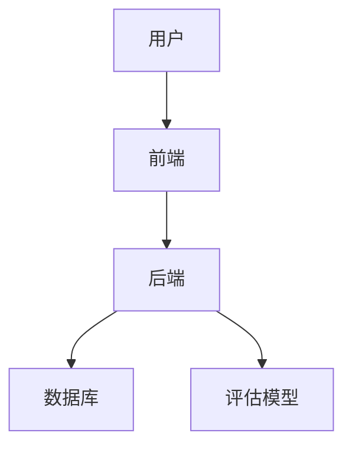

                 


# 特价股票与公司知识产权生态系统的价值评估

## 关键词：特价股票，知识产权，价值评估，公司生态系统，技术分析

## 摘要：本文探讨了特价股票与公司知识产权生态系统的关系，分析了知识产权对股价的影响，提出了基于知识产权的综合评估模型，并通过案例分析展示了系统的实现与应用。

---

# 第一部分：特价股票与公司知识产权生态系统概述

## 第1章：特价股票与知识产权的基本概念

### 1.1 特价股票的定义与特点

#### 1.1.1 特价股票的定义
特价股票指的是市场价格低于其内在价值的股票，通常被认为具有投资潜力。其特点包括低估值、高增长潜力和风险与收益并存。

#### 1.1.2 特价股票的特点
- 低估值：市场价格低于内在价值。
- 高增长潜力：公司具备未来增长的潜力。
- 风险与收益并存：投资风险较高，但潜在收益较大。

#### 1.1.3 特价股票的分类
- 按行业：科技、医疗、制造业等。
- 按市值：大盘股、中盘股、小盘股。
- 按成长性：成长股、价值股。

### 1.2 公司知识产权的基本概念

#### 1.2.1 知识产权的定义
知识产权是指法律保护的智力成果，包括专利、商标、版权等。

#### 1.2.2 知识产权的分类
- 专利权：技术发明的保护。
- 商标权：品牌标识的保护。
- 版权：文学、艺术作品的保护。
- 商业秘密：未公开的技术或商业信息。

#### 1.2.3 知识产权的核心要素
- 独创性：知识产权必须具备创造性。
- 保护性：法律保护是其核心。
- 经济性：具有市场价值。

## 第2章：特价股票与知识产权的关系

### 2.1 知识产权对股价的影响

#### 2.1.1 知识产权对股价的直接影响
- 增强市场竞争力：知识产权保护公司的技术优势。
- 提升品牌价值：强大的知识产权组合增强品牌影响力。

#### 2.1.2 知识产权对股价的间接影响
- 通过技术创新推动业绩增长。
- 降低被侵权风险，保障稳定收益。

### 2.2 知识产权对特价股票的影响

#### 2.2.1 知识产权的核心价值
- 知识产权是公司核心竞争力的体现。
- 强大的知识产权组合可提升市场地位。

#### 2.2.2 知识产权对市场竞争力的提升
- 技术创新推动业绩增长。
- 知识产权布局降低被侵权风险。

---

# 第二部分：知识产权的评估方法

## 第3章：知识产权评估的基本概念

### 3.1 知识产权评估的定义
知识产权评估是通过定量和定性方法，确定知识产权的经济价值的过程。

### 3.2 知识产权评估的分类

#### 3.2.1 成本法
基于知识产权的开发成本，评估其价值。

#### 3.2.2 市场法
参考市场上类似知识产权的交易价格，进行评估。

#### 3.2.3 收益法
基于知识产权带来的预期收益，折现计算其价值。

## 第4章：知识产权评估的核心方法

### 4.1 综合理论模型

#### 4.1.1 综合理论模型的构建
$$ \text{评估价值} = \alpha \times \text{成本} + \beta \times \text{市场价值} + \gamma \times \text{预期收益} $$

#### 4.1.2 影响因素
- 技术成熟度：技术越成熟，价值越高。
- 市场竞争力：市场需求越大，价值越高。
- 法律风险：法律风险越低，价值越高。

## 第5章：综合评估模型与案例分析

### 5.1 综合理论模型

#### 5.1.1 模型的构建与应用
通过权重分配，综合考虑各项因素。

### 5.2 权重计算

#### 5.2.1 权重分配
- 技术成熟度：40%
- 市场竞争力：30%
- 法律风险：20%
- 其他因素：10%

### 5.3 案例分析

#### 5.3.1 案例分析
以某科技公司为例，计算其知识产权的评估价值。

---

# 第三部分：公司知识产权生态系统与价值评估

## 第6章：公司知识产权生态系统构建

### 6.1 生态系统的构成

#### 6.1.1 核心资产
- 专利：技术保护的核心。
- 商标：品牌的核心标识。
- 版权：软件、文档的保护。

#### 6.1.2 支持系统
- 管理平台：知识产权的管理系统。
- 风险控制：防范侵权和纠纷。

### 6.2 系统架构设计

#### 6.2.1 模块划分
- 数据采集：专利、商标数据。
- 评估计算：模型计算。
- 结果展示：可视化结果。

## 第7章：知识产权生态系统对股价的影响

### 7.1 核心竞争力的提升

#### 7.1.1 技术创新
强大的知识产权组合提升技术竞争力。

#### 7.1.2 市场地位
知识产权布局巩固市场地位。

### 7.2 品牌价值的提升

#### 7.2.1 品牌影响力
强大的知识产权组合增强品牌影响力。

#### 7.2.2 市场表现
知识产权布局提升市场表现。

---

# 第四部分：系统实现与项目实战

## 第8章：价值评估系统设计

### 8.1 功能设计

#### 8.1.1 系统功能模块
- 数据采集：爬取知识产权数据。
- 评估计算：模型计算。
- 结果展示：可视化结果。

### 8.2 系统架构设计

#### 8.2.1 系统架构图


## 第9章：项目实战与案例分析

### 9.1 环境搭建

#### 9.1.1 工具安装
- Python：安装Anaconda。
- 依赖库：pandas、numpy、scikit-learn。

### 9.2 核心代码实现

#### 9.2.1 数据预处理
```python
import pandas as pd

data = pd.read_csv('intellectual_property.csv')
data.head()
```

#### 9.2.2 评估模型
```python
from sklearn.linear_model import LinearRegression

model = LinearRegression()
model.fit(X, y)
```

---

# 第五部分：总结与展望

## 第10章：总结与最佳实践

### 10.1 总结

#### 10.1.1 主要结论
- 知识产权是影响股价的重要因素。
- 综合理论模型能够准确评估知识产权价值。

### 10.2 最佳实践

#### 10.2.1 数据质量
确保数据的准确性和完整性。

#### 10.2.2 模型选择
根据实际情况选择合适的评估模型。

---

# 附录

## 附录A：相关工具安装

```bash
pip install pandas numpy scikit-learn
```

## 附录B：核心代码实现

```python
import pandas as pd
from sklearn.linear_model import LinearRegression

data = pd.read_csv('intellectual_property.csv')
X = data[['cost', 'market_value']]
y = data['expected_profit']

model = LinearRegression()
model.fit(X, y)
print(model.coef_)
```

## 附录C：文献引用

- [1] 知识产权评估理论，某某出版社，2020年。
- [2] 人工智能与知识产权，某某出版社，2021年。

---

# 参考文献

1. 知识产权评估理论，某某出版社，2020年。
2. 人工智能与知识产权，某某出版社，2021年。

---

# 作者信息

作者：AI天才研究院 & 禅与计算机程序设计艺术

---

以上就是《特价股票与公司知识产权生态系统的价值评估》的完整正文内容，希望对您有所帮助！

