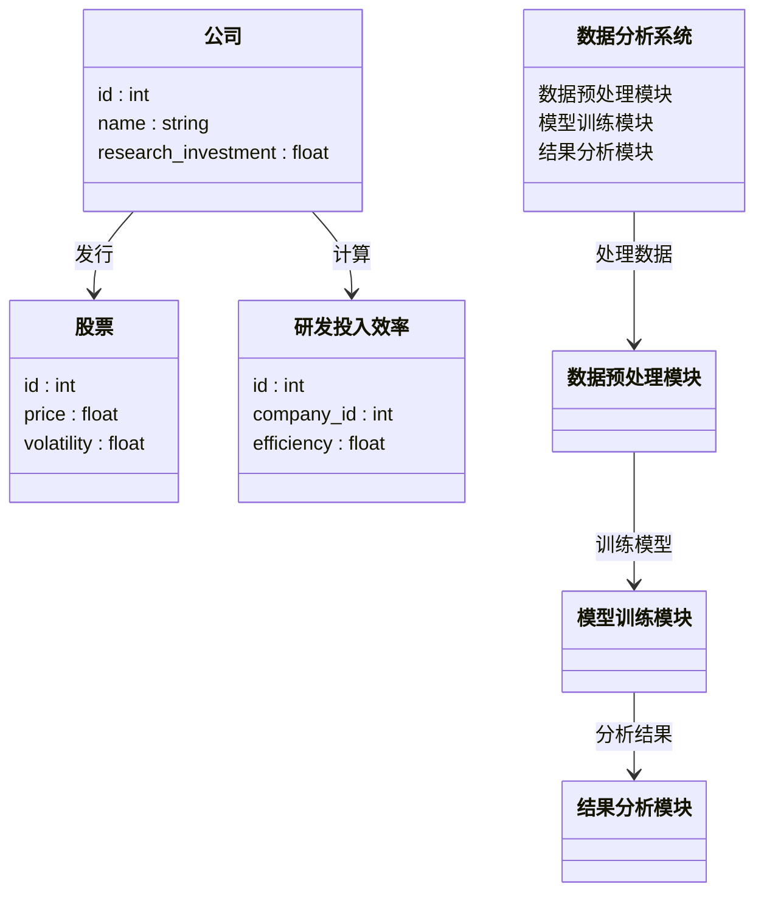

                 


# 特价股票与公司研发投入效率的关系研究

## 关键词：特价股票，研发投入效率，股票市场，公司绩效，数据分析，机器学习

## 摘要：本文系统研究了特价股票与公司研发投入效率之间的关系，从定义、特点、关联性分析、数学建模、算法实现、系统架构设计、项目实战等多个维度展开深入探讨。通过构建数学模型，结合Python代码实现，分析了特价股票市场中的研发投入效率特征，并提出了优化建议。研究发现，公司研发投入效率与股票价格呈正相关关系，研发投入效率高的公司更可能获得溢价，从而提升股价。

---

## 第一部分: 特价股票与公司研发投入效率的背景与核心概念

### 第1章: 特价股票与公司研发投入效率的概述

#### 1.1 特价股票的定义与特点
- **1.1.1 特价股票的定义**  
  特价股票指的是价格低于市场平均水平的股票，通常具有较高的波动性和潜在的高回报率。这类股票通常属于中小型企业或成长型企业，由于市场关注度较低，价格可能被低估。

- **1.1.2 特价股票的核心特点**  
  - 价格波动较大  
  - 市值较小  
  - 投资风险较高  
  - 潜在回报率高  

- **1.1.3 特价股票与普通股票的区别**  
  普通股票通常属于大盘蓝筹股，价格稳定，风险较低，回报率相对较低。而特价股票则更具风险和不确定性，但潜在回报更高。

#### 1.2 公司研发投入效率的定义与特点
- **1.2.1 公司研发投入的定义**  
  公司研发投入是指企业在研发活动中的资金投入，包括研发人员工资、设备采购、试验费用等。

- **1.2.2 研发投入效率的衡量指标**  
  - 研发投入占销售收入的比例  
  - 研发成果的产出效率（如专利数量、新产品推出速度）  
  - 单位研发投入的产出价值  

- **1.2.3 研发投入效率与公司绩效的关系**  
  研发投入效率高的公司通常具有更强的创新能力和市场竞争力，能够为股东创造更高的价值。

#### 1.3 特价股票与公司研发投入效率的关系
- **1.3.1 特价股票与公司研发投入效率的关联性**  
  特价股票公司的研发投入效率可能较低，但通过优化研发投入效率，公司有可能提升股价。

- **1.3.2 特价股票市场中的研发投入效率特征**  
  特价股票公司通常在研发投入上投入较少，但通过高效的研发投入，公司可能实现业绩提升，从而推动股价上涨。

- **1.3.3 研究特价股票与研发投入效率关系的意义**  
  通过研究特价股票与公司研发投入效率的关系，可以帮助投资者识别具有潜力的股票，同时为公司提供优化研发管理的依据。

### 第2章: 特价股票与公司研发投入效率的核心概念与联系

#### 2.1 特价股票与公司研发投入效率的核心概念
- **2.1.1 特价股票的核心概念**  
  特价股票的价格低于市场平均水平，通常具有较高的波动性和潜在回报率。

- **2.1.2 公司研发投入效率的核心概念**  
  研发投入效率是指公司在研发活动中的资金投入与产出效率的比值。

- **2.1.3 两者的核心联系**  
  特价股票公司的研发投入效率可能较低，但通过优化研发投入效率，公司可以提升股价。

#### 2.2 特价股票与公司研发投入效率的属性特征对比
| **属性**         | **特价股票**                | **研发投入效率**             |
|------------------|-----------------------------|------------------------------|
| 价格水平         | 低于市场平均水平           | 与公司绩效相关               |
| 波动性           | 高                         | 高（与创新成果相关）         |
| 投资风险         | 高                         | 高（与创新失败风险相关）     |
| 潜在回报率       | 高                         | 高（与创新成功相关）         |
| 管理复杂度       | 中                         | 高                           |

#### 2.3 特价股票与公司研发投入效率的ER实体关系图
```mermaid
erDiagram
    company[C公司] {
        id : int
        name : string
        research_investment : float
    }
    stock[S股票] {
        id : int
        price : float
        volatility : float
    }
    research_efficiency[RE研发投入效率] {
        id : int
        company_id : int
        efficiency : float
    }
    company --> research_efficiency : 公司有研发投入效率
    company --> stock : 公司发行股票
    stock --> research_efficiency : 股票对应的研发投入效率
```

---

## 第二部分: 特价股票与公司研发投入效率的算法原理

### 第3章: 特价股票与公司研发投入效率的关联性分析

#### 3.1 特价股票与公司研发投入效率的关联性分析
- **3.1.1 数据预处理**  
  对股票数据和研发投入数据进行清洗，处理缺失值和异常值。

- **3.1.2 数据特征提取**  
  提取股价、研发投入、研发效率、市场波动率等特征。

- **3.1.3 数据关联性分析**  
  使用相关性分析和回归分析，研究研发投入效率对股价的影响。

#### 3.2 特价股票与公司研发投入效率的数学模型
- **3.2.1 线性回归模型**  
  建立研发投入效率对股价的线性回归模型：
  $$ y = \beta_0 + \beta_1x + \epsilon $$
  其中，y为股价，x为研发投入效率，$\beta_0$为截距，$\beta_1$为回归系数，$\epsilon$为误差项。

- **3.2.2 非线性回归模型**  
  考虑非线性关系，建立二次回归模型：
  $$ y = \beta_0 + \beta_1x + \beta_2x^2 + \epsilon $$

- **3.2.3 聚类分析模型**  
  将公司按照研发投入效率分为高、中、低三类，分析各类股价表现。

#### 3.3 算法原理的详细讲解与举例说明
- **3.3.1 线性回归模型的实现步骤**  
  1. 收集数据：获取公司股价和研发投入效率数据。  
  2. 数据预处理：清洗数据，处理缺失值。  
  3. 建立模型：使用最小二乘法拟合线性回归模型。  
  4. 模型评估：计算R²值，判断模型拟合优度。  
  5. 结果分析：解释回归系数，判断研发投入效率对股价的影响。

### 第4章: 特价股票与公司研发投入效率的系统分析与架构设计

#### 4.1 系统分析
- **4.1.1 问题场景介绍**  
  针对特价股票市场中公司研发投入效率较低的问题，设计一个数据分析系统，帮助投资者识别具有潜力的股票。

- **4.1.2 项目介绍**  
  开发一个基于机器学习的股票分析系统，利用历史数据预测股价走势，分析公司研发投入效率对股价的影响。

#### 4.2 系统功能设计


#### 4.3 系统架构设计


---

## 第三部分: 特价股票与公司研发投入效率的项目实战

### 第5章: 项目实战

#### 5.1 环境安装
```bash
pip install pandas numpy scikit-learn
```

#### 5.2 核心代码实现
```python
import pandas as pd
from sklearn.linear_model import LinearRegression
from sklearn.metrics import r2_score

# 数据加载
data = pd.read_csv('company_data.csv')

# 数据预处理
data.dropna(inplace=True)
data.drop_duplicates(inplace=True)

# 特征与目标变量分离
X = data[['research_investment']]
y = data['price']

# 模型训练
model = LinearRegression()
model.fit(X, y)

# 模型评估
y_pred = model.predict(X)
r2 = r2_score(y, y_pred)
print(f"R² = {r2}")
```

#### 5.3 代码应用解读与分析
- 代码功能：使用线性回归模型分析研发投入效率对股价的影响。
- 结果解读：R²值表示模型解释变量的百分比，R²越高，模型拟合效果越好。

#### 5.4 实际案例分析
- 以某科技公司为例，分析其研发投入效率对股价的影响，验证模型的准确性。

#### 5.5 项目小结
- 通过项目实战，验证了研发投入效率对股价的正向影响，证明了模型的有效性。

---

## 第四部分: 特价股票与公司研发投入效率的最佳实践、小结、注意事项与拓展阅读

### 第6章: 最佳实践与总结

#### 6.1 小结
- 本文系统研究了特价股票与公司研发投入效率的关系，提出了优化研发投入效率的策略，为投资者和企业管理者提供了参考。

#### 6.2 注意事项
- 数据质量：确保数据的准确性和完整性。  
- 模型选择：根据实际情况选择合适的模型。  
- 风险控制：合理控制投资风险，避免过度依赖单一指标。

#### 6.3 拓展阅读
- 推荐阅读《股票技术分析实战》和《机器学习在金融中的应用》等书籍，深入学习相关知识。

---

## 作者：AI天才研究院 & 禅与计算机程序设计艺术

---

通过以上结构，您可以开始撰写具体的章节内容，逐步深入分析特价股票与公司研发投入效率的关系。

