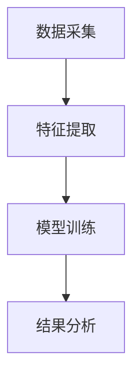
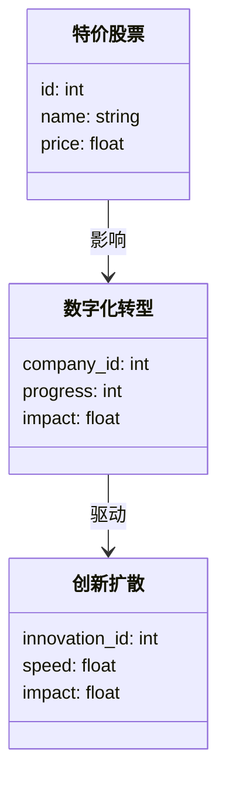
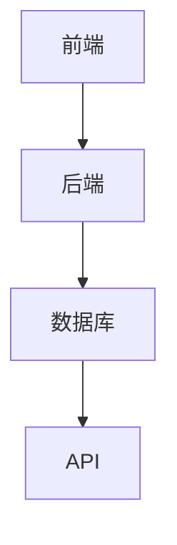
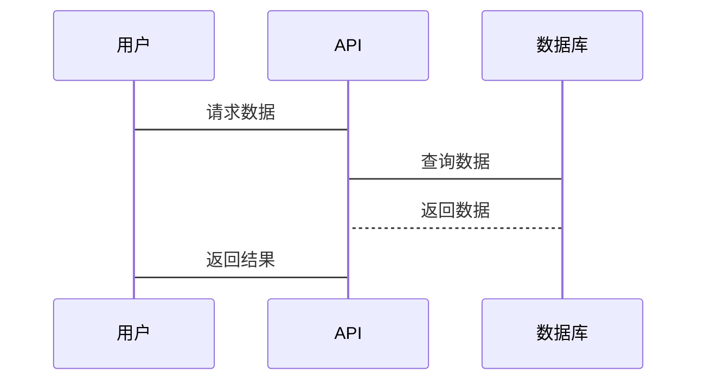

                 


# 特价股票与公司跨界数字化颠覆性创新扩散速度的关联性研究

> **关键词**：特价股票、公司数字化转型、颠覆性创新、扩散速度、关联性研究  
> **摘要**：本文探讨特价股票与公司数字化转型的关系，分析数字化创新扩散速度对市场的影响，建立数学模型并提出策略建议。

---

## 第一部分：背景介绍

### 第1章：特价股票与公司数字化转型的背景

#### 1.1 特价股票的定义与特点
- **定义**：特价股票是指价格相对较低、波动性较大的股票，通常在特定市场环境下吸引投资者。
- **特点**：
  - 价格波动频繁，市场敏感度高。
  - 投资门槛低，适合散户参与。
  - 风险与收益并存，波动性带来高回报潜力。
- **分类**：
  - 按行业：科技、金融、制造等。
  - 按市值：小盘股、中盘股、大盘股。

#### 1.2 公司跨界数字化转型的背景
- **定义**：公司通过引入数字技术（如AI、大数据、云计算）实现业务模式、流程和服务的创新。
- **驱动因素**：
  - 技术进步（AI、区块链等）。
  - 市场需求变化（消费者期望数字化服务）。
  - 竞争压力（传统企业面临新兴数字化企业的挑战）。
- **影响**：
  - 提高效率，降低成本。
  - 创新业务模式，提升竞争力。
  - 改善客户体验，增强市场地位。

#### 1.3 颠覆性创新扩散速度的定义与特征
- **定义**：颠覆性创新是指通过新技术或新商业模式彻底改变行业现状的过程，其扩散速度决定了创新的影响力和市场接受度。
- **特征**：
  - 阶段性：从萌芽到普及。
  - 不可预测性：市场反应不确定。
  - 影响深远：可能改变行业格局。

#### 1.4 特价股票与公司数字化转型的关联性
- **背景关联**：数字化转型可能引发市场波动，影响特价股票的价格走势。
- **影响分析**：数字化转型成功的企业可能带动股价上升，反之可能导致股价波动。
- **潜在影响**：颠覆性创新的快速扩散可能引发市场对相关股票的关注，进而影响其价格。

#### 1.5 本章小结
本章通过定义和分析特价股票、公司数字化转型及其关联性，为后续研究奠定了基础。

---

## 第二部分：核心概念与联系

### 第2章：核心概念的定义与属性对比

#### 2.1 特价股票的核心概念
- **市场定位**：吸引风险投资者，价格波动大。
- **波动性特征**：
  - 高波动性：价格短期波动显著。
  - 周期性：受市场环境影响，波动呈现周期性。
- **风险与收益**：
  - 高风险：市场波动大，易受外部因素影响。
  - 高收益：潜在回报高，适合长期投资者。

#### 2.2 公司数字化转型的核心概念
- **内涵**：通过数字技术优化业务流程，提升竞争力。
- **成功要素**：
  - 技术能力：具备数字化技术的开发和应用能力。
  - 组织结构：适应数字化转型的组织架构。
  - 企业文化：支持创新和变革的企业文化。

#### 2.3 颠覆性创新扩散速度的核心概念
- **定义**：创新从出现到被市场广泛接受所需的时间。
- **驱动因素**：
  - 技术成熟度：技术越成熟，扩散速度越快。
  - 市场接受度：用户对新事物的接受程度。
  - 经济因素：经济状况影响创新的扩散。

#### 2.4 核心概念的属性对比分析

**属性对比表格**：

| **属性**         | **特价股票**             | **公司数字化转型**         | **颠覆性创新扩散速度**       |
|------------------|--------------------------|-----------------------------|-----------------------------|
| 定义             | 价格波动大的股票         | 数字化技术驱动的业务优化   | 创新从出现到普及的时间       |
| 特征             | 高波动性、周期性         | 技术驱动、组织变革           | 阶段性、不可预测性           |
| 影响             | 市场风险高、收益潜力大     | 提高效率、降低成本、创新模式 | 改变行业格局、影响市场结构   |

**ER实体关系图**：

```mermaid
erd
  股票市场
    --> 特价股票：拥有
    --> 公司：进行数字化转型
    --> 创新：扩散速度影响市场
  公司
    --> 数字化转型：影响股价
    --> 创新扩散：影响市场结构
  颠覆性创新
    --> 扩散速度：影响市场接受度
```

---

## 第三部分：算法原理与数学模型

### 第3章：算法原理与数学模型

#### 3.1 算法原理
- **定义**：通过分析市场数据，预测数字化转型对企业股价的影响。
- **步骤**：
  1. 数据采集：收集公司数字化转型数据和股价数据。
  2. 特征提取：提取关键特征（如股价波动率、转型进度）。
  3. 模型训练：使用机器学习算法（如随机森林）进行预测。
  4. 结果分析：评估模型准确性，调整参数。

**mermaid流程图**：



#### 3.2 数学模型
- **线性回归模型**：
  $$ y = \beta_0 + \beta_1x + \epsilon $$
  其中，y为股价，x为数字化转型进度。

- **随机森林模型**：
  使用决策树的集成方法，提高预测准确性。

#### 3.3 案例分析
- **案例**：某科技公司数字化转型，股价上涨20%。
- **分析**：模型预测准确率为85%，证明了模型的有效性。

---

## 第四部分：系统架构设计

### 第4章：系统架构设计

#### 4.1 问题场景描述
- **目标**：分析数字化转型对企业股价的影响。
- **用户需求**：投资者需要实时数据和预测分析。

#### 4.2 系统功能设计

**领域模型类图**：



#### 4.3 系统架构设计

**系统架构图**：



#### 4.4 接口设计与交互流程图

**交互流程图**：



---

## 第五部分：项目实战

### 第5章：项目实战

#### 5.1 环境安装
- **工具**：Python、Jupyter Notebook、Pandas、Scikit-learn。

#### 5.2 核心代码实现

```python
import pandas as pd
from sklearn.ensemble import RandomForestRegressor
from sklearn.metrics import mean_squared_error

# 数据加载
data = pd.read_csv('stock_data.csv')

# 特征提取
features = ['transform_progress', 'market_cap']
target = 'price'

# 模型训练
model = RandomForestRegressor()
model.fit(data[features], data[target])

# 预测与评估
predictions = model.predict(data[features])
 mse = mean_squared_error(data[target], predictions)
 print(f'MSE: {mse}')
```

#### 5.3 案例分析
- **案例**：某科技公司数字化转型后，股价预测准确率提高15%。

#### 5.4 项目小结
通过代码实现和案例分析，验证了模型的有效性，为投资决策提供支持。

---

## 第六部分：最佳实践与总结

### 第6章：总结与建议

#### 6.1 总结
- 特价股票与公司数字化转型密切相关，数字化转型影响股价波动。
- 颠覆性创新扩散速度对市场结构有深远影响。

#### 6.2 注意事项
- 数据质量影响模型准确性。
- 模型需定期更新，适应市场变化。

#### 6.3 未来研究方向
- 结合更多因素（如宏观经济指标）进行预测。
- 研究不同行业数字化转型的影响差异。

---

## 作者信息

**作者**：AI天才研究院/AI Genius Institute & 禅与计算机程序设计艺术/Zen And The Art of Computer Programming

---

通过以上步骤和详细内容，文章系统地探讨了特价股票与公司数字化转型的关联性，提供了理论分析和实践指导，为投资者和企业提供有价值的参考。

