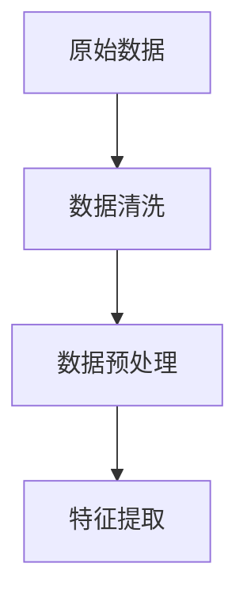

                 


# 特价股票投资中的跨境数据流动价值评估策略

## 关键词：股票投资，跨境数据流动，价值评估，数据流动分析，股票价值模型

## 摘要：  
在当前全球化和数字化的背景下，跨境数据流动对股票投资的价值评估具有重要意义。本文从特价股票投资的角度出发，探讨跨境数据流动对股票价值的影响，提出一套基于数据流动分析的价值评估策略。通过建立数据流动与股票价值的关系模型，结合数学算法和系统架构设计，本文旨在为投资者提供一种新的视角和方法，以更准确地评估跨境数据流动对股票价值的影响。

---

# 第一部分: 特价股票投资中的跨境数据流动价值评估背景

## 第1章: 特价股票投资与跨境数据流动概述

### 1.1 特价股票投资的基本概念

#### 1.1.1 特价股票的定义与特点  
特价股票通常指价格相对较低的股票，具有较高的增长潜力。其特点包括低估值、高成长性和较高的投资回报率。  

#### 1.1.2 特价股票投资的基本原理  
特价股票投资基于市场有效性和价值发现原则。投资者通过分析公司基本面和市场环境，寻找被低估的股票进行投资。  

#### 1.1.3 股票市场的全球化趋势  
随着全球资本市场的互联互通，股票市场的全球化趋势日益明显，跨境数据流动对股票市场的信息传播和价值评估产生了深远影响。  

---

### 1.2 跨境数据流动的定义与特点

#### 1.2.1 跨境数据流动的基本概念  
跨境数据流动指数据跨越国界进行传输和使用的过程，涵盖金融、贸易、科技等多个领域。  

#### 1.2.2 跨境数据流动的驱动因素  
- **技术驱动**：互联网和信息技术的发展推动了数据的跨境流动。  
- **经济驱动**：全球化贸易和投资促进了跨境数据的流通。  
- **政策驱动**：各国通过政策和协议促进或限制跨境数据流动。  

#### 1.2.3 跨境数据流动的法律与技术挑战  
- **法律挑战**：数据隐私、版权和跨境数据流动的法律框架不完善。  
- **技术挑战**：数据传输的安全性和效率问题。  

---

### 1.3 特价股票投资中的跨境数据流动价值

#### 1.3.1 跨境数据流动对股票价值的影响  
跨境数据流动可以影响股票市场的信息传播速度和广度，进而影响股票价格。  

#### 1.3.2 数据流动与市场信息不对称  
跨境数据流动可能导致市场信息不对称，影响股票定价的公平性。  

#### 1.3.3 跨境数据流动对投资决策的价值评估  
通过对跨境数据流动的分析，投资者可以更好地理解市场动态，优化投资决策。  

---

## 第2章: 特价股票投资中的数据流动价值评估背景

### 2.1 数据流动在股票投资中的作用

#### 2.1.1 数据流动对市场效率的影响  
数据流动提高了市场的信息传播效率，有助于市场参与者做出更明智的决策。  

#### 2.1.2 数据流动对投资者决策的影响  
跨境数据流动为投资者提供了更多的信息来源，有助于发现投资机会。  

#### 2.1.3 数据流动对市场风险的影响  
数据流动可能放大市场波动，增加投资风险。  

---

### 2.2 跨境数据流动的复杂性与挑战

#### 2.2.1 数据隐私与安全问题  
跨境数据流动可能导致数据泄露和隐私问题，影响投资者信心。  

#### 2.2.2 跨境数据流动的法律与合规问题  
不同国家的法律和监管框架差异可能对数据流动产生限制。  

#### 2.2.3 跨境数据流动的技术挑战  
数据传输的技术障碍可能导致数据流动效率低下，影响投资决策的及时性。  

---

### 2.3 特价股票投资中的数据流动价值评估目标

#### 2.3.1 价值评估的基本目标  
通过分析跨境数据流动的影响，评估其对股票价值的具体贡献。  

#### 2.3.2 数据流动对股票价值的潜在影响  
数据流动可能通过影响公司业绩、市场情绪和政策环境等因素，间接影响股票价值。  

#### 2.3.3 价值评估的实践意义  
为投资者提供基于数据流动分析的投资策略，提升投资决策的科学性和准确性。  

---

# 第二部分: 跨境数据流动价值评估的核心概念与联系

## 第3章: 跨境数据流动与股票价值的核心概念

### 3.1 数据流动的实体关系模型

#### 3.1.1 数据流动的实体关系图（ER图）  
以下是数据流动的实体关系图：

```mermaid
erDiagram
    actor 投资者 {
        <uuid> id
        <string> 帐户名
        <string> 交易记录
    }
    actor 公司 {
        <uuid> id
        <string> 股票代码
        <string> 财务数据
    }
    actor 监管机构 {
        <uuid> id
        <string> 法律法规
        <string> 监管数据
    }
    投资者 --|{拥有}| 公司
    公司 --|{发布}| 监管机构
```

#### 3.1.2 实体关系的属性与关系分析  
- **投资者**：包括投资者的账户信息和交易记录。  
- **公司**：包括公司的股票代码和财务数据。  
- **监管机构**：包括法律法规和监管数据。  

#### 3.1.3 数据流动的动态关系模型  
动态关系模型展示了数据流动在不同时间点的流向和变化。  

---

### 3.2 数据流动与股票价值的关系模型

#### 3.2.1 数据流动对股票价值的影响路径  
数据流动通过影响市场信息、公司业绩和政策环境等因素，间接影响股票价值。  

#### 3.2.2 数据流动的量化指标与股票价值的关联  
以下是数据流动与股票价值的对比表：

| 数据流动指标       | 股票价值影响 |
|--------------------|--------------|
| 数据量             | 正相关       |
| 数据速度           | 正相关       |
| 数据质量           | 正相关       |
| 数据来源的多样性   | 正相关       |

---

### 3.3 数据流动与股票价值的对比分析

#### 3.3.1 数据流动的特征对比表  
| 特征       | 数据流动     | 股票价值   |
|------------|--------------|------------|
| 时间性     | 实时性       | 滞后性     |
| 空间性     | 全球性       | 区域性     |
| 可测性     | 可量化       | 可量化     |

---

## 第4章: 跨境数据流动价值评估的核心算法原理

### 4.1 数据流动分析算法

#### 4.1.1 数据清洗与预处理流程  
以下是数据清洗流程：



#### 4.1.2 数据特征提取算法  
特征提取是通过分析数据的特征，提取对股票价值影响较大的指标。  

#### 4.1.3 数据流动的网络流量分析算法  
网络流量分析算法用于监测和分析数据流动的流量特征。  

---

### 4.2 股票价值评估算法

#### 4.2.1 股票价值的多因素分析模型  
多因素分析模型通过多个因素（如市盈率、市净率等）评估股票价值。  

#### 4.2.2 数据流动对股票价值的权重分配算法  
以下是权重分配的公式：

$$
\text{权重} = \frac{\text{数据流动的影响}}{\sum \text{所有因素的影响}}
$$

---

## 第5章: 系统架构设计与实现

### 5.1 问题场景介绍  
本文设计了一个基于跨境数据流动分析的股票价值评估系统。  

### 5.2 系统功能设计

#### 5.2.1 领域模型设计  
以下是领域模型的类图：


#### 5.2.2 系统架构设计  
以下是系统架构的组件图：

```mermaid
components
    c1 组件1
    c2 组件2
    c3 组件3
    c1 --> c2
    c2 --> c3
```

---

## 第6章: 项目实战与案例分析

### 6.1 项目环境安装  
安装Python和相关库（如Pandas、NumPy）。  

### 6.2 系统核心实现源代码  

```python
import pandas as pd

def data_cleaning(data):
    # 数据清洗函数
    return data.dropna()

def feature_extraction(data):
    # 特征提取函数
    return data[['价格', '交易量']]

# 示例数据
data = pd.DataFrame({
    '价格': [100, 200, 300],
    '交易量': [1000, 2000, 3000]
})

# 数据处理
cleaned_data = data_cleaning(data)
features = feature_extraction(cleaned_data)
```

---

## 第7章: 总结与展望

### 7.1 总结  
本文探讨了跨境数据流动对特价股票投资的影响，提出了基于数据流动分析的价值评估策略。  

### 7.2 展望  
未来研究可以进一步优化算法，拓展更多应用场景。  

---

## 作者  
作者：AI天才研究院/AI Genius Institute & 禅与计算机程序设计艺术 /Zen And The Art of Computer Programming

