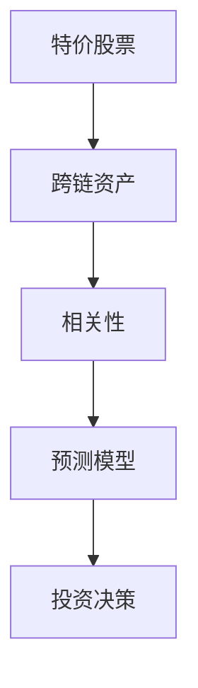
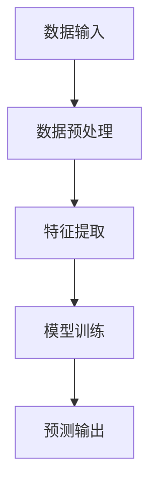
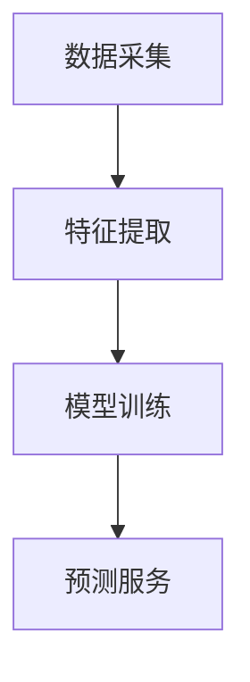

                 


# 特价股票投资中的跨链资产相关性预测分析

> **关键词**：特价股票、跨链资产、相关性预测、机器学习、时间序列分析、金融投资

> **摘要**：本文探讨了在特价股票投资中，如何利用跨链资产的相关性预测来优化投资策略。通过分析跨链资产的特性、市场波动以及相关性预测的方法，结合大数据和机器学习技术，提出了一种基于时间序列分析和机器学习算法的预测模型，为投资者提供了科学的投资决策支持。

---

## 第一部分：背景介绍

### 第1章：特价股票与跨链资产相关性预测概述

#### 1.1 特价股票的基本概念

- **1.1.1 特价股票的定义与分类**
  - 特价股票是指市场价格低于面值的股票，通常具有较高的投资潜力。
  - 分类包括普通特价股票、优先特价股票和可转换特价股票。

- **1.1.2 特价股票的市场特性与投资价值**
  - 市场特性：低估值、高波动性、潜在高回报。
  - 投资价值：适合长期投资者，尤其是价值投资者。

- **1.1.3 特价股票与普通股票的主要区别**
  - 价格差异：特价股票价格低于面值，普通股票价格接近或高于面值。
  - 投资风险：特价股票风险较高，普通股票风险相对较低。

#### 1.2 跨链资产的基本概念

- **1.2.1 跨链资产的定义与特点**
  - 跨链资产是指在不同区块链之间流动的数字资产，具有去中心化、高流动性、低交易成本的特点。
  - 分类包括原生跨链资产（如比特币、以太坊）和合成跨链资产（如稳定币）。

- **1.2.2 跨链资产的分类与应用场景**
  - 原生跨链资产：用于跨链转账、智能合约。
  - 合成跨链资产：用于价格稳定、风险对冲。
  - 应用场景：跨境支付、DeFi借贷、资产质押。

- **1.2.3 跨链资产在金融市场的地位与作用**
  - 跨链资产是区块链技术的重要组成部分，能够连接不同区块链生态。
  - 通过跨链技术，實現了资产的互联互通，提升了金融市场的效率。

#### 1.3 特价股票与跨链资产相关性预测的背景与意义

- **1.3.1 特价股票与跨链资产相关性的定义**
  - 特价股票与跨链资产的相关性指两者在价格波动、市场趋势上的关联程度。
  - 正相关：跨链资产价格上涨，特价股票价格也上涨。
  - 负相关：跨链资产价格上涨，特价股票价格下跌。

- **1.3.2 相关性预测的必要性与重要性**
  - 特价股票投资受宏观经济、市场情绪、政策法规等因素影响，跨链资产的波动也会对市场产生影响。
  - 通过相关性预测，投资者可以更好地分散风险，优化投资组合。

- **1.3.3 相关性预测的边界与外延**
  - 边界：跨链资产与特价股票的相关性仅限于价格波动和市场趋势，不包括公司基本面。
  - 外延：跨链资产的其他特性（如流动性、安全性）也可能影响相关性预测。

---

## 第二部分：核心概念与联系

### 第2章：跨链资产相关性预测的核心概念

#### 2.1 相关性预测的基本原理

- **2.1.1 相关性预测的数学定义**
  - 相关性系数：衡量两个变量之间的线性关系，范围在-1到1之间。
  - 计算公式：$$ r = \frac{\sum (x_i - \bar{x})(y_i - \bar{y})}{\sqrt{\sum (x_i - \bar{x})^2 \sum (y_i - \bar{y})^2}} $$

- **2.1.2 相关性预测的统计学基础**
  - 相关性分析：包括皮尔逊相关系数、斯皮尔曼相关系数。
  - 统计显著性检验：通过p值判断相关性是否显著。

- **2.1.3 相关性预测的算法选择**
  - 线性回归：适合线性关系。
  - 机器学习算法：适合非线性关系。

#### 2.2 跨链资产相关性预测的特征分析

- **2.2.1 跨链资产的市场波动性分析**
  - 波动性指标：标准差、波动率。
  - 影响因素：市场情绪、政策法规、技术升级。

- **2.2.2 跨链资产的交易量与价格关系**
  - 交易量与价格的关系：高交易量可能推动价格上涨。
  - 交易量与市场深度的关系：高交易量可能提高市场深度。

- **2.2.3 跨链资产的网络流量与相关性**
  - 网络流量指标：链上交易笔数、活跃地址数。
  - 网络流量与价格的相关性：高网络流量可能预示价格上涨。

#### 2.3 相关性预测的实体关系图



---

## 第三部分：算法原理讲解

### 第3章：相关性预测的算法原理

#### 3.1 数据预处理与特征提取

- **3.1.1 数据清洗与标准化**
  - 数据清洗：处理缺失值、异常值。
  - 数据标准化：使用标准化或归一化方法。

- **3.1.2 特征选择与降维**
  - 特征选择：基于统计学或机器学习方法选择重要特征。
  - 降维方法：主成分分析（PCA）。

- **3.1.3 时间序列数据的处理**
  - 时间序列分解：趋势、季节性、随机性。
  - 差分方法：消除趋势和季节性。

#### 3.2 相关性预测的机器学习算法

- **3.2.1 线性回归模型**
  - 回归方程：$$ y = \beta_0 + \beta_1x + \epsilon $$
  - 优缺点：简单易懂，但可能无法捕捉非线性关系。

- **3.2.2 支持向量回归（SVR）**
  - 算法原理：将回归问题转化为支持向量的分类问题。
  - 优缺点：适合小样本数据，但计算复杂度高。

- **3.2.3 随机森林回归**
  - 算法原理：基于决策树的集成学习方法。
  - 优缺点：适合高维数据，但可能过拟合。

#### 3.3 算法流程图



---

## 第四部分：数学模型与公式

### 第4章：相关性预测的数学模型

#### 4.1 线性回归模型

- **4.1.1 线性回归的数学公式**
  $$ y = \beta_0 + \beta_1x + \epsilon $$

- **4.1.2 线性回归的最小二乘法求解**
  $$ \hat{\beta} = (X^TX)^{-1}X^Ty $$

#### 4.2 支持向量回归模型

- **4.2.1 SVR的数学公式**
  $$ y = \text{sign}(\sum_{i=1}^n \alpha_i y_i K(x_i, x) + b) $$

#### 4.3 随机森林回归模型

- **4.3.1 随机森林的数学公式**
  $$ y = \sum_{i=1}^n \frac{1}{n} \sum_{j=1}^n y_{j} $$

---

## 第五部分：系统分析与架构设计方案

### 第5章：系统架构设计

#### 5.1 项目介绍

- **项目目标**：构建一个基于跨链资产相关性预测的特价股票投资系统。
- **项目范围**：包括数据采集、特征提取、模型训练、预测服务。
- **项目结构**：模块化设计，便于扩展和维护。

#### 5.2 系统功能设计

- **5.2.1 数据采集模块**
  - 功能：采集跨链资产价格、交易量、网络流量等数据。
  - 输入：API接口、数据源地址。
  - 输出：结构化数据。

- **5.2.2 特征提取模块**
  - 功能：提取相关性预测所需特征。
  - 输入：原始数据。
  - 输出：特征向量。

- **5.2.3 模型训练模块**
  - 功能：训练相关性预测模型。
  - 输入：特征向量、标签数据。
  - 输出：训练好的模型。

- **5.2.4 预测服务模块**
  - 功能：提供实时相关性预测服务。
  - 输入：新数据。
  - 输出：预测结果。

#### 5.3 系统架构设计



---

## 第六部分：项目实战

### 第6章：项目实战

#### 6.1 环境安装

- **安装Python环境**：建议使用Anaconda。
- **安装相关库**：包括numpy、pandas、scikit-learn、mermaid。

#### 6.2 系统核心实现源代码

```python
import numpy as np
import pandas as pd
from sklearn.linear_model import LinearRegression
from sklearn.svm import SVR
from sklearn.ensemble import RandomForestRegressor

# 数据加载
data = pd.read_csv('data.csv')

# 数据预处理
X = data[['feature1', 'feature2']]
y = data['target']

# 模型训练
model = LinearRegression()
model.fit(X, y)

# 预测
new_data = pd.DataFrame({'feature1': [x1], 'feature2': [x2]})
predicted = model.predict(new_data)
```

#### 6.3 代码应用解读与分析

- **代码功能**：加载数据、预处理、训练模型、预测结果。
- **代码优点**：简单易懂，适合快速实现。
- **代码缺点**：可能无法捕捉复杂关系，需要优化模型。

#### 6.4 实际案例分析

- **案例背景**：假设某跨链资产价格与某特价股票价格存在相关性。
- **案例分析**：使用线性回归模型进行预测，结果与实际价格对比。

#### 6.5 项目小结

- **项目总结**：通过项目实战，验证了相关性预测模型的有效性。
- **项目启示**：未来可以尝试更复杂的模型，如神经网络。

---

## 第七部分：最佳实践与拓展

### 第7章：最佳实践

#### 7.1 小结

- 相关性预测是特价股票投资的重要工具。
- 机器学习算法能够有效捕捉市场波动。

#### 7.2 注意事项

- 数据质量：确保数据准确、完整。
- 模型选择：根据数据特性选择合适模型。
- 风险控制：避免过度依赖模型预测。

#### 7.3 拓展阅读

- 推荐书籍：《机器学习实战》、《时间序列分析》。
- 推荐论文：相关领域的最新研究成果。

---

## 结语

通过本文的详细分析，我们了解了特价股票投资中跨链资产相关性预测的重要性，掌握了相关性预测的核心概念、算法原理和系统架构设计。未来，随着区块链技术的不断发展，相关性预测将在金融投资中发挥更大的作用。

---

**作者：AI天才研究院/AI Genius Institute & 禅与计算机程序设计艺术 /Zen And The Art of Computer Programming**

