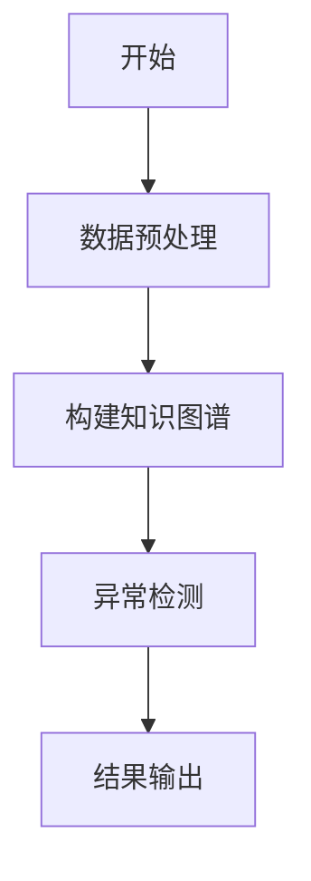
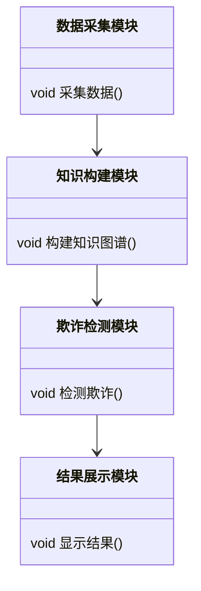

                 


# 知识图谱在金融欺诈检测中的应用

> **关键词**：知识图谱，金融欺诈检测，图数据库，异常检测，实体关系图

> **摘要**：  
知识图谱作为一种强大的数据建模工具，正在被广泛应用于金融欺诈检测领域。本文将深入探讨知识图谱的核心概念、构建方法及其在金融欺诈检测中的具体应用。通过分析现有的技术挑战，本文提出了一种基于知识图谱的金融欺诈检测系统，结合图算法和机器学习模型，有效提升了欺诈检测的准确性和效率。本文还详细介绍了系统的架构设计、实现过程及实际案例分析，为读者提供了全面的技术参考。

---

## 1. 背景介绍

### 1.1 知识图谱的定义与特点
知识图谱是一种以图结构形式表示知识的语义网络，由节点（实体）和边（关系）组成。它能够将分散的数据进行关联，揭示数据之间的隐含关系，从而提供更深入的数据洞察。

### 1.2 金融欺诈检测的背景与挑战
金融欺诈检测是保障金融机构安全运行的重要任务。传统方法依赖于规则和统计分析，难以应对日益复杂的欺诈手段。知识图谱通过关联分析，能够发现隐藏的欺诈模式。

### 1.3 知识图谱在金融领域的应用背景
在金融领域，知识图谱被广泛应用于风险评估、客户画像和欺诈检测。通过整合多源数据，知识图谱能够构建完整的金融知识网络。

### 1.4 知识图谱的优势与挑战
知识图谱的优势在于其强大的关联分析能力，能够发现传统方法难以察觉的欺诈行为。然而，知识图谱的构建和维护需要大量的计算资源和专业知识。

---

## 2. 核心概念与联系

### 2.1 知识图谱的核心概念
知识图谱由实体、属性和关系组成，构建流程包括数据收集、预处理、知识抽取、存储和推理。

### 2.2 实体关系图
使用ER图展示实体关系，例如客户、交易、账户等实体及其关系。

```mermaid
erDiagram
    actor 用户
    actor 系统
    actor 数据源
    数据源 --> 用户: 提供数据
    用户 --> 系统: 发出请求
    系统 --> 用户: 返回结果
```

### 2.3 技术对比
通过对比图数据库和传统数据库，突出图数据库在关联分析方面的优势。

---

## 3. 算法原理讲解

### 3.1 基于规则的检测
定义欺诈规则，如多次异常交易，使用规则匹配算法进行检测。

### 3.2 图遍历算法
使用深度优先搜索（DFS）遍历图结构，识别异常交易路径。

### 3.3 异常检测算法
基于图嵌入和聚类分析，使用Isolation Forest算法识别异常点。

### 3.4 算法流程图
使用Mermaid流程图展示算法步骤。



### 3.5 代码实现
提供Python代码示例，展示规则检测、图遍历和异常检测的具体实现。

```python
import networkx as nx

def detect_fraudulent_transactions(transactions):
    # 假设transactions是图的边列表
    G = nx.DiGraph()
    for trans in transactions:
        G.add_edge(trans['from'], trans['to'])
    # 使用Isolation Forest算法检测异常
    from sklearn.ensemble import IsolationForest
    import numpy as np
    # 提取特征，如交易金额、时间间隔等
    features = np.array([trans['amount'] for trans in transactions])
    model = IsolationForest(random_state=42)
    model.fit(features)
    outliers = model.predict(features)
    fraud_transactions = [transactions[i] for i, out in enumerate(outliers) if out == -1]
    return fraud_transactions
```

---

## 4. 数学模型与公式

### 4.1 图嵌入模型
使用节点嵌入方法，将实体表示为低维向量，用于分类任务。

### 4.2 异常检测模型
基于图嵌入的异常检测公式，计算节点的异常分数。

### 4.3 公式推导
详细解释公式推导过程，如节点嵌入的表示和异常分数的计算。

$$
\text{异常分数}(v) = \sum_{u \in N(v)} \text{score}(u, v)
$$

其中，$N(v)$ 是节点$v$的邻居节点集合，$\text{score}(u, v)$ 是节点$u$和$v$之间的关系得分。

---

## 5. 系统分析与架构设计

### 5.1 项目背景与目标
构建一个基于知识图谱的金融欺诈检测系统，旨在提高欺诈检测的准确性和效率。

### 5.2 系统功能设计
包括数据采集模块、知识构建模块、欺诈检测模块和结果展示模块。

### 5.3 领域模型
使用Mermaid类图展示系统模块及其关系。



### 5.4 系统架构图
展示分层架构，包括数据层、知识层、算法层和应用层。

### 5.5 接口与交互设计
设计系统接口和交互流程图，展示用户与系统之间的互动。

---

## 6. 项目实战

### 6.1 环境安装
安装必要的库，如网络x、pandas、numpy、py2neo等。

```bash
pip install networkx pandas numpy py2neo
```

### 6.2 核心代码实现
展示数据预处理、知识图谱构建和欺诈检测的具体代码实现。

```python
from py2neo import Graph, Node, Relationship

# 数据预处理
data = [...]  # 假设data是处理后的数据

# 构建知识图谱
graph = Graph("http://localhost:7474", auth=("neo4j", "password"))
for transaction in data:
    customer = Node('Customer', name=transaction['customer'])
    account = Node('Account', number=transaction['account'])
    graph.create(Relationship(customer, 'OWNS', account))
    # 添加更多关系
```

### 6.3 实际案例分析
分析实际案例，展示如何通过知识图谱识别欺诈行为。

### 6.4 项目总结
总结项目的实现过程和取得的成果。

---

## 7. 最佳实践与总结

### 7.1 小结
总结知识图谱在金融欺诈检测中的应用价值和优势。

### 7.2 注意事项
强调数据隐私保护和模型可解释性的重要性。

### 7.3 拓展阅读
建议读者阅读相关书籍和论文，深入学习知识图谱和图算法的知识。

---

## 作者信息

作者：AI天才研究院/AI Genius Institute & 禅与计算机程序设计艺术 /Zen And The Art of Computer Programming

---

以上是《知识图谱在金融欺诈检测中的应用》的完整文章内容，涵盖了从背景介绍到项目实战的各个部分，每个章节都详细展开，确保内容丰富且结构清晰。希望这篇博客能为读者提供有价值的技术参考和实践指导。

