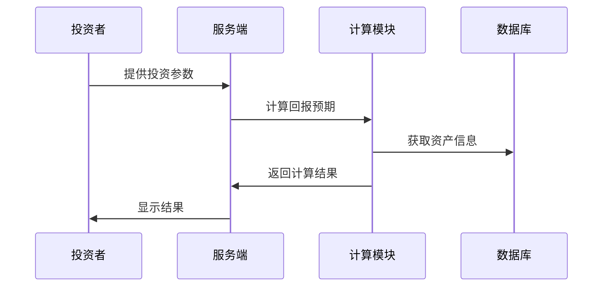

                 


# 约翰·伯格的长期投资回报预期设定

## 关键词：
- 长期投资
- 投资回报预期
- 资产配置
- 投资策略
- 约翰·伯格

## 摘要：
本文详细探讨了约翰·伯格的长期投资理念，重点分析了如何设定投资回报预期。文章从投资的基本概念出发，结合数学模型和实际案例，系统地讲解了长期投资的策略、回报预期的设定方法以及资产配置的重要性。通过详细分析投资回报的计算公式和系统架构设计，本文为读者提供了全面的理论支持和实践指导。

---

## 第一部分：长期投资回报预期设定概述

### 第1章：投资的基本概念

#### 1.1 投资的定义与重要性
- **投资的定义**：投资是指将资金投入到某一项目或资产中，以期望在未来获得超过初始投入的价值。
- **投资的重要性**：在个人和企业层面，投资是实现财富增长的重要手段。通过投资，个人可以实现资产增值，企业可以扩大生产规模或研发新产品。
- **投资与财务管理的关系**：投资是财务管理的核心部分，合理的投资决策能够帮助个人和企业实现财务目标。

#### 1.2 长期投资的定义与特点
- **长期投资的定义**：长期投资是指将资金投入到某个资产或项目中，期望在较长时间内（通常为三年以上）获得收益。
- **长期投资的核心特点**：
  - 时间跨度长
  - 风险相对较低
  - 适合稳健型投资者
- **长期投资与短期投资的区别**：
  | 特性 | 长期投资 | 短期投资 |
  |------|----------|----------|
  | 时间 | 3年以上 | 1年以内 |
  | 风险 | 较低     | 较高     |
  | 收益 | 稳定     | 波动大    |

#### 1.3 投资回报预期的概念
- **投资回报的定义**：投资回报是指投资者在一定时间内获得的收益，包括本金和利息或资本增值。
- **预期回报的概念**：预期回报是指投资者在投资前预测的未来可能获得的回报。
- **长期投资中预期回报的重要性**：合理的预期回报能够帮助投资者制定长期的财务计划，并在投资过程中保持耐心和纪律。

### 第2章：长期投资的必要性与背景

#### 2.1 经济周期与投资
- **经济周期的定义与影响**：经济周期分为衰退、复苏、增长和萧条四个阶段，每个阶段对投资的影响不同。
- **长期投资在经济周期中的作用**：长期投资能够平滑经济波动带来的影响，帮助投资者在不同经济环境下实现稳健收益。
- **不同经济环境下的投资策略**：
  - 经济衰退：增加防御性资产配置（如债券）
  - 经济复苏：增加股票等风险资产

#### 2.2 投资者心理与行为
- **投资者心理偏差的定义**：心理偏差是指投资者在决策过程中因心理因素导致的非理性行为。
- **长期投资中常见心理偏差的分析**：
  - 过度自信：投资者倾向于高估自己的判断能力。
  - 沉没成本：投资者因前期投入而继续投资的行为。
- **心理因素对投资决策的影响**：心理偏差可能导致投资者在市场波动中做出错误决策，长期投资需要克服这些心理障碍。

#### 2.3 长期投资的背景与趋势
- **全球化背景下的投资机会**：全球化使得投资者能够配置全球资产，分散风险。
- **数字化与金融科技对投资的影响**：金融科技（FinTech）的应用使得投资更加便捷和透明。
- **可持续投资与ESG因素的兴起**：环境、社会和治理（ESG）因素逐渐成为投资者的重要考量。

### 第3章：长期投资回报预期的设定方法

#### 3.1 投资目标的设定
- **投资目标的定义**：投资目标是指投资者希望通过投资实现的具体财务目标。
- **长期投资目标的分类**：
  - 财富积累目标
  - 资产保值目标
  - 资产增值目标
- **目标设定的步骤与方法**：
  1. 确定财务需求
  2. 设定具体的财务目标
  3. 制定实现目标的时间表

#### 3.2 风险与收益的平衡
- **风险的定义与分类**：
  - 系统性风险：市场整体波动带来的风险
  - 非系统性风险：特定资产或行业带来的风险
- **收益与风险的正相关关系**：高风险通常意味着高收益，但并非绝对。
- **长期投资中平衡风险与收益的方法**：
  - 通过资产配置分散风险
  - 选择具有稳定回报的资产

#### 3.3 投资回报预期的数学模型
- **投资回报的计算公式**：
  - 复利计算公式：
    $$ A = P(1 + r)^n $$
    其中，\( A \) 是终值，\( P \) 是本金，\( r \) 是年收益率，\( n \) 是投资年数。
  - 年回报率计算：
    $$ r = \left( \frac{A}{P} \right)^{1/n} - 1 $$
- **时间价值与复利计算**：
  - 复利计算实例：投资1000元，年收益率5%，10年后终值为：
    $$ A = 1000(1 + 0.05)^{10} \approx 1628.89 $$

### 第4章：长期投资中的资产配置策略

#### 4.1 资产配置的基本概念
- **资产配置的定义**：资产配置是指将资金分配到不同的资产类别中，以实现风险和收益的优化。
- **资产配置的重要性**：合理的资产配置能够分散风险，提高投资收益。
- **资产配置的类型**：
  - 按资产类别：股票、债券、现金等
  - 按地域：国内外资产配置

#### 4.2 长期投资中的资产配置方法
- **基于风险承受能力的配置**：
  - 风险承受能力强的投资者可以增加股票配置。
- **基于市场预期的配置**：
  - 预期市场上涨时增加股票配置。
- **基于资产类别特征的配置**：
  - 配置具有稳定收益的资产（如债券）以平衡风险。

#### 4.3 资产配置的动态调整
- **资产配置调整的必要性**：
  - 市场环境变化
  - 投资目标调整
- **调整的时机与方法**：
  - 定期审视投资组合
  - 根据市场变化进行调整

---

## 第二部分：长期投资回报预期的系统分析

### 第5章：系统分析与架构设计

#### 5.1 问题场景介绍
- **投资回报预期的计算**：需要考虑时间、本金、收益率等因素。
- **系统目标**：开发一个能够计算长期投资回报预期的系统，帮助投资者制定投资计划。

#### 5.2 系统功能设计
- **领域模型（Mermaid 类图）**：
  ```mermaid
  classDiagram
      class 投资者 {
          名称：String
          投资金额：Float
          投资期限：Integer
          预期回报率：Float
      }
      class 投资工具 {
          类型：String
          预期年收益率：Float
          风险等级：Integer
      }
      class 投资回报计算 {
          计算长期回报：Operation
          返回结果：Operation
      }
      投资者 --> 投资回报计算: 提供投资参数
      投资回报计算 --> 投资工具: 获取工具参数
  ```

- **系统架构设计（Mermaid 架构图）**：
  ```mermaid
  architecture
  客户端 <---> 服务端
  服务端 --> 数据库
  服务端 --> 计算模块
  ```

#### 5.3 系统接口设计
- **输入接口**：投资者提供本金、投资期限、预期回报率等参数。
- **输出接口**：系统输出投资回报预期和资产配置建议。

#### 5.4 系统交互设计（Mermaid 序列图）：


---

## 第三部分：项目实战

### 第6章：长期投资回报预期的实战应用

#### 6.1 环境安装
- **Python 环境**：安装Python 3.8及以上版本。
- **开发工具**：推荐使用PyCharm或VS Code。

#### 6.2 核心实现源代码
```python
def calculate_future_value(principal, rate, years):
    return principal * (1 + rate) ** years

def calculate_return_expectation(principal, rate, years):
    fv = calculate_future_value(principal, rate, years)
    return (fv / principal) - 1

# 示例：投资1000元，年收益率5%，投资10年
principal = 1000
rate = 0.05
years = 10
return_expectation = calculate_return_expectation(principal, rate, years)
print(f"预期年回报率为：{return_expectation:.2f}%")
```

#### 6.3 案例分析
- **案例背景**：投资者计划投资10000元，期望年回报率为7%，投资期限为30年。
- **计算过程**：
  $$ fv = 10000 \times (1 + 0.07)^{30} \approx 54274.30 $$
  $$ return\_expectation = (54274.30 / 10000) - 1 = 0.4277 $$
  $$ 即42.77%的回报率。$$

#### 6.4 项目小结
- **代码实现总结**：通过Python代码实现投资回报预期的计算，简单易用。
- **案例分析总结**：长期投资的复利效应显著，早期投资和耐心持有是关键。

---

## 第四部分：总结与建议

### 第7章：长期投资回报预期设定的关键点

#### 7.1 最佳实践 Tips
- **分散投资**：通过资产配置分散风险。
- **定期审视**：定期检查投资组合，根据市场变化进行调整。
- **耐心持有**：长期投资需要耐心，避免频繁交易。

#### 7.2 小结
- 长期投资回报预期的设定是一个系统工程，需要结合数学模型和实际市场情况。
- 合理的资产配置和耐心的持有是实现投资目标的关键。

#### 7.3 注意事项
- **市场风险**：长期投资并不能完全规避市场风险。
- **流动性需求**：需要考虑投资资金的流动性需求。

#### 7.4 拓展阅读
- 推荐阅读约翰·伯格的《投资的艺术》和《投资组合的收益》。

---

## 作者：AI天才研究院/AI Genius Institute & 禅与计算机程序设计艺术 /Zen And The Art of Computer Programming

---

通过以上结构，文章系统地讲解了约翰·伯格的长期投资理念，结合理论和实践，帮助读者全面理解如何设定长期投资回报预期。

