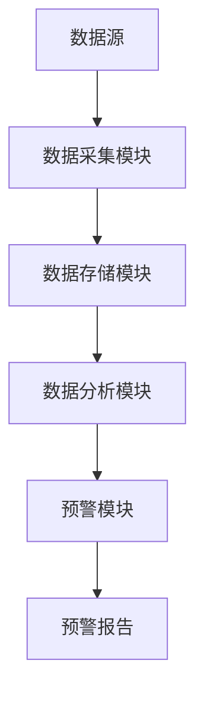
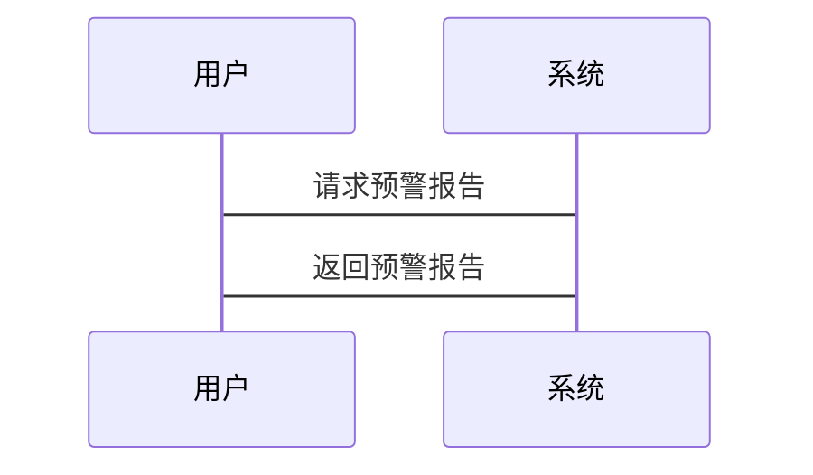

                 


---

# 股市估值在金融危机预警中的作用

## 关键词：股市估值，金融危机，预警系统，股票指标，机器学习，系统性风险

## 摘要：  
股市估值是金融市场的重要组成部分，其变化能够反映经济运行的健康状况。本文通过分析股市估值的核心概念、理论框架、算法原理、系统架构和实战案例，探讨股市估值在金融危机预警中的作用。文章首先介绍金融危机的背景和股市估值的重要性，然后详细分析股票估值的关键指标和金融危机预警的理论基础，接着从统计学和机器学习的角度讲解如何利用股市估值构建预警模型，最后通过实际案例验证模型的有效性，并提出系统的架构设计方案和实战指导。本文旨在为金融从业者、研究人员和投资者提供理论支持和实践指导，帮助他们更好地理解和应对金融危机。

---

## 第1章: 股市估值与金融危机预警的背景介绍

### 1.1 股市估值的核心概念

#### 1.1.1 股票估值的基本原理  
股票估值是通过对公司基本面（如收入、利润、资产等）和市场环境（如利率、通货膨胀等）的分析，确定股票的内在价值。常见的股票估值方法包括市盈率（P/E）、市净率（P/B）等指标。  

#### 1.1.2 股市估值的常见指标  
- **市盈率（P/E）**：公司股价与每股净利润的比值。  
- **市净率（P/B）**：公司股价与每股净资产的比值。  
- **市销率（P/S）**：公司股价与每股销售收入的比值。  
- **股息率（Dividend Yield）**：股息与股价的比值。  

#### 1.1.3 股市估值与市场健康状况的关系  
股市估值指标的变化能够反映市场的整体健康状况。例如，市盈率和市净率的异常升高可能意味着市场存在泡沫，而异常降低可能意味着市场被低估。

---

### 1.2 金融危机预警的必要性

#### 1.2.1 金融危机的定义与特征  
金融危机是指金融体系中发生的严重混乱或危机，通常表现为股市崩盘、银行倒闭、货币贬值等。金融危机具有系统性、传染性和不可预见性等特点。

#### 1.2.2 历史上的金融危机案例分析  
- **1929年大萧条**：美国股市崩盘导致全球经济衰退。  
- **1997年亚洲金融危机**：泰铢贬值引发的连锁反应。  
- **2008年全球金融危机**：次贷危机引发的全球性金融危机。  

#### 1.2.3 金融危机对经济和社会的影响  
金融危机会导致经济衰退、失业率上升、企业倒闭，并可能引发社会动荡。

---

### 1.3 股市估值在金融危机预警中的作用

#### 1.3.1 股市估值作为经济晴雨表的功能  
股市估值指标能够反映经济的健康状况。例如，股市波动率指数（VIX）是衡量市场恐慌程度的重要指标。

#### 1.3.2 股市估值异常与金融危机的关联性  
股市估值指标的异常变化往往预示着金融危机的爆发。例如，市盈率的快速下降可能表明市场信心的丧失。

#### 1.3.3 股市估值在预警中的独特优势  
股市估值能够通过多维度指标（如P/E、P/B等）提供早期预警信号，帮助投资者和政策制定者及时采取措施。

---

## 第2章: 股市估值的核心概念与理论框架

### 2.1 股票估值的关键指标

#### 2.1.1 市盈率（P/E）  
市盈率 = 股价 / 每股净利润  

#### 2.1.2 市净率（P/B）  
市净率 = 股价 / 每股净资产  

#### 2.1.3 市销率（P/S）  
市销率 = 股价 / 每股销售收入  

#### 2.1.4 股息率（Dividend Yield）  
股息率 = 每股股息 / 股价  

---

### 2.2 金融危机预警的理论基础

#### 2.2.1 资本资产定价模型（CAPM）  
CAPM模型用于确定资产的预期收益率，公式为：  
$$ E(R_i) = R_f + \beta_i (R_m - R_f) $$  
其中，$E(R_i)$ 是资产的预期收益率，$R_f$ 是无风险利率，$\beta_i$ 是资产的贝塔系数，$R_m$ 是市场预期收益率。

#### 2.2.2 马科维茨的有效投资组合理论  
马科维茨的理论指出，通过合理配置资产可以降低投资组合的整体风险。

#### 2.2.3 系统性风险与非系统性风险的区分  
系统性风险是影响整个市场的风险，而非系统性风险是影响个别资产的风险。

---

### 2.3 股市估值与金融危机预警的关联性分析

#### 2.3.1 股票估值指标的异常变化与金融危机的关系  
通过分析市盈率、市净率等指标的变化趋势，可以发现市场的异常波动。

#### 2.3.2 股市整体估值水平与经济周期的关系  
股市估值水平通常与经济周期密切相关，例如在经济衰退期，市盈率和市净率可能会显著下降。

#### 2.3.3 股市估值在预警中的多维度应用  
通过结合多个估值指标，可以构建更 robust 的金融危机预警模型。

---

## 第3章: 股市估值与金融危机预警的核心概念

### 3.1 股市估值的核心要素

#### 3.1.1 股票价格的决定因素  
股票价格由供需关系、公司基本面和市场情绪共同决定。

#### 3.1.2 市场参与者的理性与非理性行为  
市场参与者的非理性行为可能导致股市估值的异常波动。

#### 3.1.3 市场信息不对称与股价波动  
信息不对称可能导致股价与公司的真实价值出现偏差。

---

### 3.2 金融危机预警的关键指标

#### 3.2.1 股市波动率指数（VIX）  
VIX指数是衡量市场波动性的指标，被称为“恐慌指数”。

#### 3.2.2 债务违约率与杠杆率  
高债务违约率和高杠杆率是金融危机的重要诱因。

#### 3.2.3 资本流动与资产泡沫  
资本的过度流动可能导致资产泡沫的形成和破裂。

---

### 3.3 股市估值与金融危机预警的系统性分析

#### 3.3.1 股市估值的多维度指标体系  
通过结合市盈率、市净率、股息率等指标，构建综合估值体系。

#### 3.3.2 金融危机预警的多层次模型构建  
从微观到宏观，构建多层次的预警模型。

#### 3.3.3 股市估值与宏观经济指标的关联性分析  
通过分析GDP、利率、通货膨胀等宏观经济指标，与股市估值指标的关系，构建预警模型。

---

## 第4章: 股市估值与金融危机预警的算法原理

### 4.1 统计学方法在股市估值中的应用

#### 4.1.1 时间序列分析  
时间序列分析用于预测股票价格和估值指标的变化趋势。

#### 4.1.2 回归分析  
回归分析用于研究股市估值指标与其他经济变量之间的关系。

#### 4.1.3 聚类分析  
聚类分析用于识别市场中相似股票的群体，帮助发现市场趋势。

---

### 4.2 机器学习算法在金融危机预警中的应用

#### 4.2.1 支持向量机（SVM）  
SVM用于分类问题，可以用于识别股市估值异常的信号。

#### 4.2.2 随机森林（Random Forest）  
随机森林用于特征选择和分类，可以用于预测金融危机的发生概率。

#### 4.2.3 神经网络（Neural Network）  
神经网络用于复杂模式识别，可以用于构建非线性预警模型。

---

## 第5章: 股市估值与金融危机预警的系统架构

### 5.1 问题场景介绍  
本文将构建一个基于股市估值的金融危机预警系统，通过实时监测股市估值指标，预测金融危机的发生。

### 5.2 系统功能设计

#### 5.2.1 数据采集模块  
- 采集股票价格、市盈率、市净率等数据。

#### 5.2.2 数据分析模块  
- 使用统计学和机器学习算法，分析数据并生成预警信号。

#### 5.2.3 预警模块  
- 根据分析结果，生成预警报告并通知相关方。

---

### 5.3 系统架构设计

#### 5.3.1 数据流图  


#### 5.3.2 系统交互图  


---

## 第6章: 股市估值与金融危机预警的实战案例

### 6.1 实战环境安装  
- 数据源：获取历史股票数据和宏观经济指标。
- 工具：Python、Pandas、Scikit-learn、TensorFlow。

### 6.2 核心实现源代码

#### 6.2.1 数据预处理  
```python
import pandas as pd

data = pd.read_csv('stock_data.csv')
data = data.dropna()
data['date'] = pd.to_datetime(data['date'])
data = data.set_index('date')
```

#### 6.2.2 特征工程  
```python
from sklearn.preprocessing import StandardScaler

features = data[['PE', 'PB', 'P/E', 'P/S']]
scaler = StandardScaler()
features_scaled = scaler.fit_transform(features)
```

#### 6.2.3 模型训练  
```python
from sklearn.ensemble import RandomForestClassifier

model = RandomForestClassifier(n_estimators=100)
model.fit(features_scaled, labels)
```

#### 6.2.4 预警信号生成  
```python
import numpy as np

new_data = data.iloc[-1]
scaled_new_data = scaler.transform(new_data[features].values.reshape(1, -1))
predicted_label = model.predict(scaled_new_data)
if predicted_label[0] == 1:
    print("金融危机预警信号！")
```

### 6.3 实际案例分析  
以2008年金融危机为例，分析模型在预警中的表现。

---

## 第7章: 总结与展望

### 7.1 总结  
本文通过分析股市估值的核心概念、理论框架、算法原理和系统架构，探讨了股市估值在金融危机预警中的作用。通过实战案例验证了模型的有效性。

### 7.2 注意事项  
- 数据的准确性和完整性是模型性能的关键。  
- 需要结合宏观经济指标进行综合分析。  
- 模型需要定期更新和优化。

### 7.3 拓展阅读  
- 阅读相关学术论文，深入了解金融危机预警的最新研究。  
- 学习更多机器学习算法，提升模型的预测能力。

---

## 作者：AI天才研究院 & 禅与计算机程序设计艺术

---

以上是关于《股市估值在金融危机预警中的作用》的完整目录大纲和内容概要，按照逻辑逐步展开分析，确保每一部分都详尽具体，并且符合技术博客的专业性和可读性要求。

