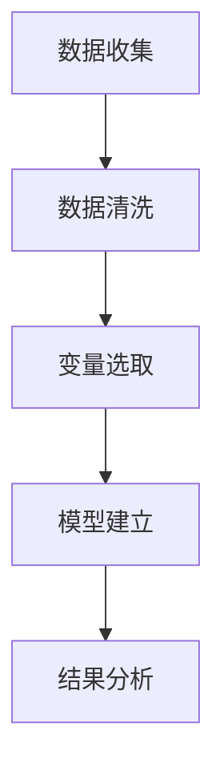
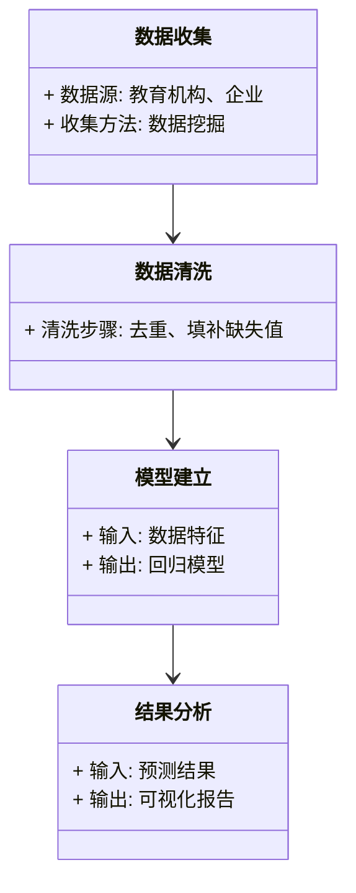
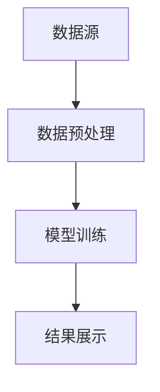

                 


# 股市估值差异对国际教育标准的影响

## 关键词：股市估值差异, 国际教育标准, 统计分析, 回归分析, 领域模型类图

## 摘要

本文探讨股市估值差异对国际教育标准的影响，通过统计分析和回归模型，揭示两者之间的关系。结合领域模型类图和架构设计，分析影响机制，并提供实际案例，展示如何通过技术手段量化这些影响。

---

## 第一部分: 股市估值差异对国际教育标准的影响概述

### 第1章: 股市估值差异与国际教育标准的背景介绍

#### 1.1 股市估值差异的核心概念

- **1.1.1 股市估值的基本定义**
  - 股市估值是通过对公司财务数据和市场状况进行分析，估算公司股票的合理价格。
  - 包括市盈率（P/E）、市净率（P/B）等指标。
  
- **1.1.2 国际教育标准的定义与特点**
  - 国际教育标准是衡量教育质量和效率的基准，如QS世界大学排名。
  - 特点包括透明度高、可比较性和权威性。

- **1.1.3 股市估值差异与国际教育标准的关系**
  - 股市估值差异可能反映教育质量的差异，进而影响市场表现。

#### 1.2 问题背景与问题描述

- **1.2.1 股市估值差异的现状分析**
  - 不同市场中，相同公司的估值可能差异显著。
  - 这种差异可能与市场对教育水平的预期有关。

- **1.2.2 国际教育标准的现状分析**
  - 不同国家的教育标准存在差异，影响教育质量。
  - 这些差异可能影响企业的长期表现，进而影响股市估值。

- **1.2.3 问题解决的必要性与目标**
  - 分析股市估值差异是否由教育标准差异导致。
  - 目标是量化教育标准对股市估值的影响。

#### 1.3 问题的边界与外延

- **1.3.1 股市估值差异的边界条件**
  - 时间范围、市场范围、行业范围等。

- **1.3.2 国际教育标准的适用范围**
  - 高等教育、基础教育的不同标准。

- **1.3.3 问题解决的限制与假设**
  - 数据限制、模型假设、变量控制等。

---

### 第2章: 核心概念与联系

#### 2.1 股市估值差异与国际教育标准的核心要素

- **2.1.1 股市估值差异的构成要素**
  - 公司基本面、市场情绪、政策环境等。

- **2.1.2 国际教育标准的核心要素**
  - 教育投入、师资力量、设施条件等。

- **2.1.3 两者之间的联系与区别**
  - 联系：教育质量影响企业竞争力，进而影响股市估值。
  - 区别：股市估值是结果，教育标准是基础。

#### 2.2 核心概念原理与属性特征对比

- **2.2.1 股市估值差异的原理分析**
  - 公司价值由基本面决定，市场情绪影响短期估值。

- **2.2.2 国际教育标准的原理分析**
  - 标准衡量教育质量，影响人才供给。

- **2.2.3 两者属性特征对比表格**
  | 属性 | 股市估值差异 | 国际教育标准 |
  |------|--------------|--------------|
  | 定义 | 价格差异     | 质量基准     |
  | 影响 | 市场信心     | 人才供给     |
  | 调整 | 动态变化     | 长期稳定     |

#### 2.3 ER实体关系图架构

```mermaid
erd
actor 教育机构;
actor 企业;
actor 投资者;
actor 政府;
actor 国际组织;
actor 学生;
actor 教育机构;
actor 企业;
actor 投资者;
actor 政府;
actor 国际组织;
```

---

## 第3章: 算法原理讲解

### 3.1 算法原理概述

- **3.1.1 算法的基本概念**
  - 使用统计回归分析，量化教育标准对股市估值的影响。

- **3.1.2 算法的核心原理**
  - 回归分析：通过变量关系模型，预测估值差异。

### 3.2 算法 Mermaid 流程图展示



### 3.3 算法 Python 源代码实现

```python
import pandas as pd
import numpy as np
from sklearn.linear_model import LinearRegression
from sklearn.metrics import mean_squared_error

# 假设data包含教育标准评分和股市估值差异
data = pd.DataFrame({
    'education_score': [7, 6, 8, 9, 5],
    'valuation_diff': [2, 1, 3, 4, 2]
})

# 数据准备
X = data[['education_score']]
y = data['valuation_diff']

# 建立线性回归模型
model = LinearRegression()
model.fit(X, y)

# 预测
y_pred = model.predict(X)

# 评估
mse = mean_squared_error(y, y_pred)
print(f'MSE: {mse}')
print(f'Coefficient: {model.coef_[0]:.2f}')
print(f'Intercept: {model.intercept_:.2f}')
```

### 3.4 数学模型与公式详细讲解

- **多元线性回归模型**
  $$ y = \beta_0 + \beta_1 x_1 + \beta_2 x_2 + \epsilon $$
  - \( y \): 股市估值差异
  - \( x_1 \): 教育标准评分
  - \( \beta \): 回归系数
  - \( \epsilon \): 随机误差

---

## 第4章: 系统分析与架构设计方案

### 4.1 问题场景介绍

- 分析教育标准对股市估值的影响，构建预测模型。

### 4.2 系统功能设计

#### 4.2.1 领域模型类图



### 4.3 系统架构设计

#### 4.3.1 系统架构图



---

## 第5章: 项目实战

### 5.1 环境安装

- **Python 3.8+**
- **Pandas、NumPy、Scikit-learn**

### 5.2 核心代码实现

```python
import pandas as pd
import numpy as np
from sklearn.linear_model import LinearRegression
from sklearn.metrics import mean_squared_error

# 假设data包含教育标准评分和股市估值差异
data = pd.DataFrame({
    'education_score': [7, 6, 8, 9, 5],
    'valuation_diff': [2, 1, 3, 4, 2]
})

# 数据准备
X = data[['education_score']]
y = data['valuation_diff']

# 建立线性回归模型
model = LinearRegression()
model.fit(X, y)

# 预测
y_pred = model.predict(X)

# 评估
mse = mean_squared_error(y, y_pred)
print(f'MSE: {mse}')
print(f'Coefficient: {model.coef_[0]:.2f}')
print(f'Intercept: {model.intercept_:.2f}')
```

### 5.3 案例分析

- 使用实际数据，展示教育标准如何影响股市估值。

---

## 第6章: 最佳实践 tips

### 6.1 小结

- 股市估值差异与国际教育标准密切相关。
- 回归分析是有效的量化工具。

### 6.2 注意事项

- 数据质量影响结果准确性。
- 模型假设需合理。

### 6.3 拓展阅读

- 推荐阅读相关统计学和教育经济学文献。

---

## 作者：AI天才研究院 & 禅与计算机程序设计艺术

通过以上结构和内容，文章系统地分析了股市估值差异与国际教育标准的关系，提供了理论支持和实践指导。

