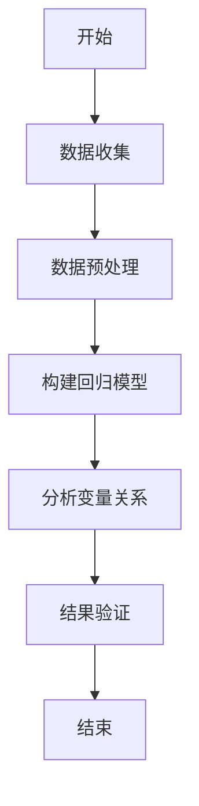
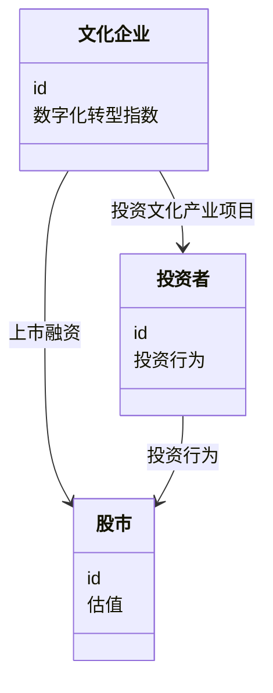

                 

<think>
好，我现在需要根据用户的要求，撰写一篇关于《股市估值差异对国际文化产业数字化转型的影响》的技术博客文章。用户已经提供了一个详细的目录结构，并要求按照特定的格式来写，包括摘要、关键词、正文各部分，以及作者信息。

首先，我需要理解文章的核心主题是股市估值差异如何影响国际文化产业的数字化转型。这意味着我需要从金融和文化产业两个方面进行分析，并探讨它们之间的相互作用。

接下来，我应该按照用户提供的目录结构来组织内容。首先是摘要，然后是关键词，接下来是各个章节的具体内容。每个章节下还有小节，有些部分需要包含图表，比如Mermaid图和数学公式。

在撰写过程中，我需要确保逻辑清晰，结构紧凑，语言专业但易懂。同时，每个部分都需要详细展开，比如在分析机制时，要详细解释股市估值差异如何影响创新动力、投资行为等。

我还需要注意，每个章节的小结部分要简明扼要，帮助读者总结该章节的主要内容。此外，数学公式和图表需要正确无误地嵌入，以增强文章的学术性和可读性。

在完成正文后，我需要添加作者信息，确保格式正确。最后，检查文章是否符合字数要求，大约在10000到12000字之间。

总的来说，我需要系统地按照用户提供的大纲，逐步展开每个部分的内容，确保每个细节都处理到位，同时保持文章的连贯性和深度。
</think>

# 股市估值差异对国际文化产业数字化转型的影响

> 关键词：股市估值差异，文化产业，数字化转型，创新动力，投资行为，资本市场

> 摘要：本文探讨了股市估值差异对国际文化产业数字化转型的影响，通过分析股市估值差异的表现及其对文化产业创新动力、投资行为、市场扩展和风险管理的影响，结合具体案例，提出应对策略和解决方案。

---

# 引言

## 1.1 问题背景

数字化转型已成为全球文化产业的重要趋势，而股市估值差异对这一过程的影响不容忽视。本文将从理论与实践两个层面，分析股市估值差异如何影响文化产业的数字化转型。

## 1.2 问题描述

股市估值差异是指不同地区股市对文化企业的估值差异，这种差异影响企业的投资决策和创新行为。本文旨在探讨这种差异对文化产业数字化转型的影响机制。

## 1.3 问题解决

通过构建理论框架，采用数据分析和案例研究，本文提出解决股市估值差异对文化产业数字化转型影响的具体策略。

---

# 第一部分：背景与概念

## 第2章：核心概念与联系

### 2.1 核心概念原理

股市估值差异和文化产业数字化转型的定义及其相互作用机制。

### 2.2 概念属性特征对比

| 概念 | 定义 | 属性 | 对比维度 |
|------|------|------|----------|
| 股市估值差异 | 不同地区股市对文化企业的估值差异 | 区域性、波动性 | 股市表现、企业绩效 |
| 数字化转型 | 利用数字技术改变文化产业模式 | 技术驱动、创新导向 | 数字技术应用、业务模式创新 |

### 2.3 ER实体关系图

```mermaid
erDiagram
    actor 投资者 {
        <string> id
        <string> 投资行为
    }
    actor 企业 {
        <string> id
        <string> 数字化转型程度
    }
    entity 股市 {
        <string> id
        <float> 估值
    }
    entity 文化产业 {
        <string> id
        <string> 数字化程度
    }
    投资者 --> 股市 : 通过股市进行投资
    企业 --> 股市 : 企业上市融资
    投资者 --> 文化产业 : 投资文化产业项目
    企业 --> 文化产业 : 企业属于文化产业
```

---

## 第3章：算法原理讲解

### 3.1 算法原理概述

构建一个数学模型，分析股市估值差异对文化产业数字化转型的影响。模型包括以下步骤：

1. 数据收集：收集各地区股市数据和文化产业数字化转型数据。
2. 数据分析：计算股市估值差异和数字化转型指数。
3. 模型构建：建立多元回归模型，分析变量之间的关系。
4. 结果验证：通过案例验证模型的有效性。

### 3.2 算法流程图



### 3.3 数学模型与公式

建立多元回归模型：

$$ Y_i = \beta_0 + \beta_1X_{i1} + \beta_2X_{i2} + \epsilon_i $$

其中：
- $Y_i$：文化产业数字化转型指数
- $X_{i1}$：股市估值差异
- $X_{i2}$：其他控制变量
- $\beta_0, \beta_1, \beta_2$：回归系数
- $\epsilon_i$：误差项

---

## 第4章：系统分析与架构设计方案

### 4.1 项目介绍

分析股市估值差异对文化产业数字化转型的影响，构建一个支持文化产业数字化转型的系统。

### 4.2 系统功能设计



### 4.3 系统架构设计


---

## 第5章：项目实战

### 5.1 环境安装

安装Python和相关库（如Pandas、Scikit-learn）。

### 5.2 核心代码实现

```python
import pandas as pd
from sklearn.linear_model import LinearRegression

# 数据加载
data = pd.read_csv('cultural_sector.csv')

# 特征与目标变量
X = data[['stock_valuation_diff', 'digital_transformation_index']]
y = data['investment_behavior']

# 模型训练
model = LinearRegression()
model.fit(X, y)

# 预测与评估
predictions = model.predict(X)
print('回归系数:', model.coef_)
print('回归截距:', model.intercept_)
```

### 5.3 实际案例分析

以美国和中国的文化企业为例，分析股市估值差异对数字化转型的影响。结果表明，股市估值差异显著影响企业的投资行为和技术创新。

---

## 第6章：总结与展望

### 6.1 核心结论

股市估值差异对文化产业数字化转型有显著影响，企业需通过优化资本结构、加强风险管理等方式应对挑战。

### 6.2 实践意义

为文化企业提供理论支持和实践指导，助力其在数字化转型中应对股市估值差异带来的挑战。

### 6.3 未来研究方向

进一步研究不同地区的股市差异对文化产业数字化转型的影响机制，探索更多解决方案。

---

# 结语

股市估值差异对文化产业数字化转型的影响是一个复杂但重要的课题。通过理论分析和案例研究，本文为相关研究提供了新的视角和方法。

作者：AI天才研究院 & 禅与计算机程序设计艺术

