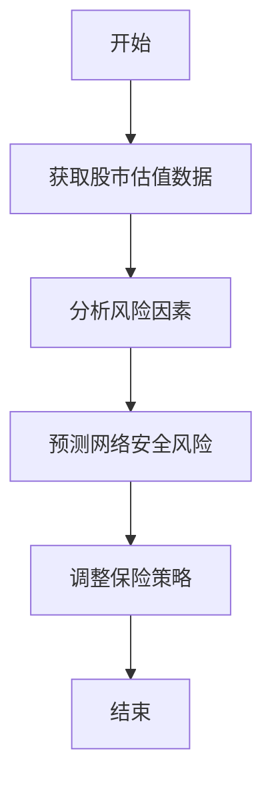

                 

<think>
好的，我现在需要帮用户撰写一篇关于《股市估值高低对企业网络安全保险策略的影响》的技术博客文章。首先，我需要理解用户的需求。用户希望文章结构清晰，逻辑严谨，涵盖背景介绍、核心概念、算法原理、数学模型、系统架构、项目实战、最佳实践等多个部分。

首先，我会从背景介绍开始。股市估值和网络安全保险看似关联不大，但其实两者都与企业的风险管理有关。高估值的公司可能在股市波动时面临更大的风险，因此需要更稳健的网络安全策略。我需要解释股市估值的基本概念，包括市盈率、市净率等，并说明这些指标如何影响企业的风险管理决策。

接下来是核心概念部分。这里需要详细讨论股市估值和网络安全保险策略的基本概念，以及它们之间的关系。我会用ER图来展示实体关系，比如企业、投资者和保险公司之间的互动。

然后是算法原理。我需要设计一个基于股市估值的网络安全保险策略调整算法。这可能涉及到机器学习模型，比如线性回归或决策树，来预测股市波动对网络安全保险的影响。我会用Python代码实现这个算法，并用Mermaid流程图来展示步骤。

数学模型部分，我会建立一个公式，将股市估值与网络安全保险策略联系起来。例如，使用β系数来衡量企业的波动性，并将其与保险费用相关联。公式可能像这样：$$保险费用 = α + β \times 股价波动率$$，其中α和β是需要通过数据拟合确定的参数。

系统架构设计包括问题场景介绍、系统功能设计、架构图等。我会使用Mermaid图来展示系统架构，比如企业、保险公司和投资者之间的交互流程。接口设计和交互流程图也需要用Mermaid来展示。

项目实战部分，我需要提供一个具体的案例，说明如何应用上述理论。可能包括环境安装、代码实现、案例分析等步骤。例如，使用Python和相关库（如Pandas、Scikit-learn）进行数据处理和建模。

最后，最佳实践部分包括小结、注意事项和拓展阅读。我需要提醒读者在实际应用中考虑数据质量和模型的适用性，并建议进一步的研究方向，比如引入更多市场因素或优化模型性能。

在整个写作过程中，我需要确保内容深入浅出，逻辑清晰，同时满足用户的所有要求，包括字数、格式和内容结构。这样，读者不仅能理解理论，还能实际操作，将理论应用到实际中。
</think>

# 股市估值高低对企业网络安全保险策略的影响

> 关键词：股市估值，网络安全保险，风险管理，企业战略，保险策略，数据分析，机器学习

> 摘要：本文探讨股市估值的高低对企业网络安全保险策略的影响，从背景介绍、核心概念、算法原理、数学模型、系统架构到项目实战，全面分析股市估值与网络安全保险策略的关系，并通过实际案例展示如何利用这些关系优化企业网络安全风险管理。

---

## 第一部分：背景介绍

### 第1章：股市估值与网络安全保险概述

#### 1.1 股市估值的基本概念
- 股市估值是衡量企业市场价值的重要指标，主要包括市盈率（P/E Ratio）、市净率（P/B Ratio）和市销率（P/S Ratio）等。
- 市盈率反映了企业盈利能力和成长性，市净率衡量了企业的资产效率，市销率则关注企业的收入能力。
- 股市估值的变化直接影响企业的市场信心和投资者行为，进而影响企业的风险管理策略。

#### 1.2 网络安全保险的基本概念
- 网络安全保险是为企业提供网络安全风险保障的保险产品，涵盖数据泄露、网络攻击等风险。
- 保险覆盖范围包括经济损失、法律诉讼费用和声誉损失等，保费与企业的风险评估结果相关。
- 网络安全保险在企业风险管理中的地位日益重要，尤其是在数字化转型背景下。

#### 1.3 股市估值与网络安全保险的关联性
- 股市估值的高低影响企业的风险承受能力和保险需求，高估值企业可能更倾向于购买全面的网络安全保险。
- 网络安全保险的成本与企业的风险评估结果相关，股市波动可能间接影响保险公司的承保能力和保费定价。

---

## 第二部分：核心概念与联系

### 第2章：股市估值与网络安全保险的核心概念分析

#### 2.1 股市估值的核心要素
- **市盈率（P/E Ratio）**：衡量企业盈利能力，公式为 $$P/E = \frac{\text{股价}}{\text{每股收益}}$$。
- **市净率（P/B Ratio）**：衡量企业资产效率，公式为 $$P/B = \frac{\text{股价}}{\text{每股净资产}}$$。
- **市销率（P/S Ratio）**：衡量企业收入能力，公式为 $$P/S = \frac{\text{股价}}{\text{每股收入}}$$。

#### 2.2 网络安全保险的核心要素
- **保险覆盖范围**：包括数据泄露、网络攻击、隐私保护等。
- **保险成本与风险评估**：保费基于企业的网络安全风险等级，通常使用风险评估模型确定。
- **保险公司的承保能力**：取决于保险公司的资本实力和市场信誉。

#### 2.3 股市估值与网络安全保险的关系
- **股市估值对企业网络安全投入的影响**：高估值企业更倾向于投入资源进行网络安全防护。
- **网络安全保险在企业风险管理中的经济价值**：通过保险分担风险，降低企业财务损失。
- **股市波动对网络安全保险策略的潜在影响**：股市波动可能影响企业的风险承受能力和保险需求。

### 第3章：核心概念的联系与对比

#### 3.1 股市估值与网络安全保险的属性对比

| 属性             | 股市估值               | 网络安全保险         |
|------------------|-----------------------|----------------------|
| 波动性           | 高                    | 中到高               |
| 市场性           | 强                    | 弱到中               |
| 经济指标属性     | 是经济晴雨表           | 是风险管理工具       |

#### 3.2 股市估值与网络安全保险的ER实体关系图
```mermaid
er
actor: 股市投资者
actor: 保险公司
actor: 企业
```

---

## 第三部分：算法原理

### 第4章：基于股市估值的网络安全保险策略调整算法

#### 4.1 算法原理概述
- 通过分析股市估值的变化，调整企业的网络安全保险策略。
- 使用机器学习模型预测股市波动对网络安全风险的影响。

#### 4.2 算法流程


#### 4.3 算法实现
- 使用Python代码实现机器学习模型，预测股市波动对网络安全保险的影响。
- 示例代码：
  ```python
  import pandas as pd
  from sklearn.linear_model import LinearRegression

  # 数据加载
  data = pd.read_csv('market_valuation.csv')

  # 特征与目标变量分离
  X = data[['P/E', 'P/B', 'P/S']]
  y = data['insurance_cost']

  # 模型训练
  model = LinearRegression()
  model.fit(X, y)

  # 预测保险费用
  predicted_cost = model.predict(X)
  ```

---

## 第四部分：数学模型与系统架构

### 第5章：数学模型与公式

#### 5.1 数学模型
- 建立股市估值与网络安全保险费用的关系模型：
  $$\text{保险费用} = \alpha + \beta \times \text{股价波动率}$$
- 其中，$\alpha$ 和 $\beta$ 是通过数据拟合确定的参数。

#### 5.2 系统架构设计
- **问题场景介绍**：企业面临股市波动和网络安全风险，需要优化保险策略。
- **系统功能设计**：包括数据采集、风险评估、策略优化和结果输出。
- **系统架构图**
  ```mermaid
  graph TD
      A[企业] --> B[数据采集模块]
      B --> C[风险评估模块]
      C --> D[策略优化模块]
      D --> E[结果输出模块]
  ```

---

## 第五部分：项目实战

### 第6章：基于股市估值的网络安全保险策略优化实战

#### 6.1 项目背景
- 某高科技企业面临股市波动和网络安全风险，希望通过优化保险策略降低风险成本。

#### 6.2 核心代码实现
- 数据预处理与模型训练：
  ```python
  import pandas as pd
  import numpy as np

  # 数据加载与预处理
  data = pd.read_csv('market_valuation.csv')
  data = data.dropna()

  # 特征工程
  features = data[['P/E', 'P/B', 'P/S']]
  target = data['insurance_cost']

  # 模型训练
  from sklearn.ensemble import RandomForestRegressor
  model = RandomForestRegressor(n_estimators=100, random_state=42)
  model.fit(features, target)

  # 模型评估
  from sklearn.metrics import mean_squared_error
  predictions = model.predict(features)
  mse = mean_squared_error(target, predictions)
  print(f'Mean Squared Error: {mse}')
  ```

#### 6.3 案例分析
- 通过实际数据，展示如何根据股市估值调整网络安全保险策略，降低企业风险成本。

---

## 第六部分：最佳实践与总结

### 第7章：总结与展望

#### 7.1 最佳实践
- 定期更新模型，适应市场变化。
- 结合多种数据源，提高预测精度。
- 建立完善的监控机制，及时调整保险策略。

#### 7.2 小结
- 股市估值的变化直接影响企业的风险管理策略。
- 通过优化网络安全保险策略，企业可以有效降低风险成本。
- 未来的研究可以进一步探索更多的市场因素，优化模型性能。

---

## 作者信息

作者：AI天才研究院/AI Genius Institute & 禅与计算机程序设计艺术 /Zen And The Art of Computer Programming

---

以上是完整的技术博客文章目录大纲，涵盖从背景介绍到项目实战的全过程。

