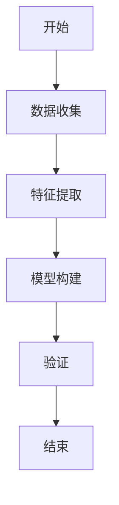
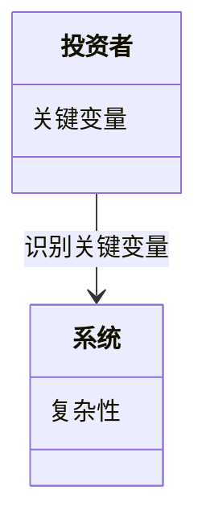
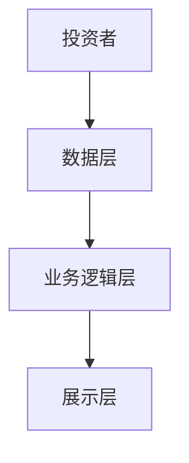
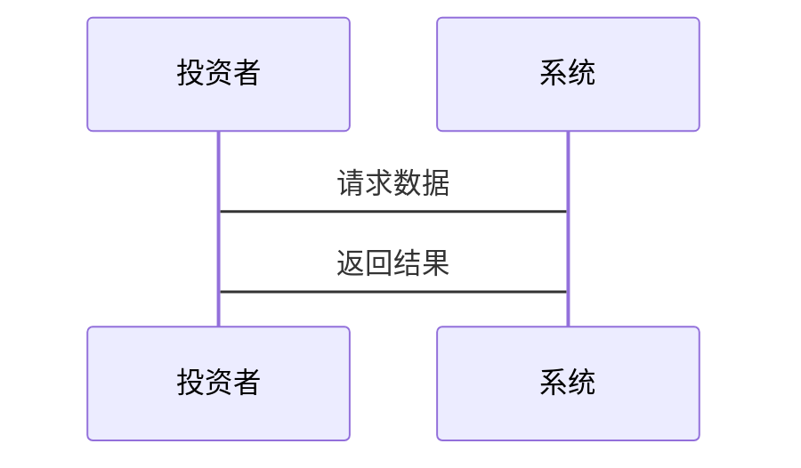

                 


```markdown
# 芒格的"关键变量"识别在复杂系统投资中的运用

> 关键词：芒格，关键变量识别，复杂系统，投资，系统架构

> 摘要：本文系统地介绍了芒格的关键变量识别在复杂系统投资中的应用。通过详细分析复杂系统的定义与特征，结合芒格的投资理念，阐述了关键变量识别的核心概念、数学模型与算法原理。文章进一步探讨了系统架构设计、项目实战与案例分析，最后总结了关键变量识别在投资中的实际应用价值与未来发展方向。

---

## 第1章: 芒格的"关键变量"识别概述

### 1.1 芒格的背景与投资理念
#### 1.1.1 芒格的生平简介
芒格（Charlie Munger）是美国著名投资者、巴菲特的合作伙伴，以“格栅理论”闻名，强调跨学科思维。

#### 1.1.2 芒格的"格栅理论"与投资哲学
芒格的投资哲学强调建立多学科思维模型，通过识别关键变量来降低投资决策的复杂性。

#### 1.1.3 芒格投资理念的核心要素
- 长期投资
- 安全边际
- 跨学科思维模型

### 1.2 "关键变量"识别的定义与重要性
#### 1.2.1 关键变量的定义
关键变量是指在复杂系统中对结果产生决定性影响的因素。

#### 1.2.2 关键变量在投资中的重要性
关键变量识别能够帮助投资者简化决策过程，提高投资效率。

#### 1.2.3 关键变量识别的边界与外延
- 边界：关键变量的范围
- 外延：相关变量的影响

### 1.3 关键变量识别的核心概念与联系
#### 1.3.1 核心概念原理
关键变量识别通过系统分析，找出影响结果的核心因素。

#### 1.3.2 关键变量属性特征对比表格
| 属性 | 特征 |
|------|------|
| 影响程度 | 高 |
| 可控性 | 可控 |

#### 1.3.3 ER实体关系图架构（Mermaid流程图）
```mermaid
erDiagram
    actor 投资者 {
        <属性> 关键变量
    }
    actor 系统 {
        <属性> 复杂性
    }
    投资者 --> 系统 : 识别关键变量
```

---

## 第2章: 复杂系统投资中的关键变量识别方法

### 2.1 复杂系统的定义与特征
#### 2.1.1 复杂系统的定义
复杂系统是指由多个相互作用的组件构成的系统，具有非线性特征。

#### 2.1.2 复杂系统的特征
- 非线性
- 适应性
- 网络化

#### 2.1.3 复杂系统在投资中的表现
- 市场波动
- 不确定性

### 2.2 关键变量识别的步骤与技巧
#### 2.2.1 识别关键变量的步骤
1. 明确目标
2. 数据收集
3. 分析与筛选
4. 验证

#### 2.2.2 关键变量的筛选技巧
- 决策树分析
- 因子分析

#### 2.2.3 关键变量的验证方法
- 回测
- 灵敏度分析

---

## 第3章: 关键变量识别的数学模型与算法原理

### 3.1 关键变量识别的数学模型
#### 3.1.1 数学模型的构建
$$y = f(x_1, x_2, ..., x_n)$$

#### 3.1.2 数学模型的公式推导
$$f(x) = \sum_{i=1}^{n} a_i x_i$$

#### 3.1.3 数学模型的实例分析
假设一个投资组合，关键变量为市场利率和企业盈利。

### 3.2 算法原理讲解
#### 3.2.1 算法原理的详细说明
关键变量识别算法基于系统分析和数据挖掘。

#### 3.2.2 算法流程图（Mermaid）


#### 3.2.3 算法的Python实现代码
```python
def key_variable_identification(data):
    # 数据预处理
    processed_data = data preprocessing
    # 特征选择
    selected_features = feature selection(processed_data)
    return selected_features
```

#### 3.2.4 代码解读与分析
- 数据预处理：清洗和标准化数据。
- 特征选择：使用机器学习算法筛选关键变量。

---

## 第4章: 系统分析与架构设计方案

### 4.1 系统分析
#### 4.1.1 问题场景介绍
投资决策系统中，如何通过关键变量识别提高投资效率。

#### 4.1.2 领域模型（Mermaid类图）


#### 4.1.3 系统功能设计
- 数据采集
- 关键变量识别
- 投资决策

### 4.2 系统架构设计
#### 4.2.1 系统架构图（Mermaid）


#### 4.2.2 系统接口设计
- 数据接口：API
- 用户界面：GUI

#### 4.2.3 系统交互设计（Mermaid序列图）


---

## 第5章: 项目实战

### 5.1 环境安装与配置
#### 5.1.1 开发环境搭建
安装Python和相关库（如Pandas、Scikit-learn）。

#### 5.1.2 工具安装与配置
安装Jupyter Notebook和数据可视化工具。

### 5.2 核心代码实现
#### 5.2.1 关键变量识别算法实现
```python
from sklearn.feature_selection import SelectKBest
import pandas as pd

data = pd.DataFrame(...)
selector = SelectKBest(k=5)
selected_features = selector.fit_transform(data)
```

#### 5.2.2 投资模型构建代码
```python
from sklearn.linear_model import LinearRegression

model = LinearRegression()
model.fit(selected_features, target)
```

#### 5.2.3 系统交互代码实现
```python
def handle_request(request):
    # 处理请求
    return response
```

### 5.3 实际案例分析
#### 5.3.1 案例背景介绍
分析某股票市场数据，识别关键变量。

#### 5.3.2 案例分析与解决
通过数据分析，识别出市场利率和企业盈利为关键变量。

---

## 第6章: 总结与未来展望

### 6.1 总结
本文详细介绍了芒格的关键变量识别在复杂系统投资中的应用，通过系统分析和案例研究，展示了其在实际投资中的价值。

### 6.2 未来展望
未来的研究方向包括更复杂的系统架构和人工智能技术的结合。

---

## 附录

### A. 工具介绍
- Python：数据分析
- Pandas：数据处理

### B. 数据来源
- 股票市场数据

### C. 扩展阅读
- 《芒格的智慧》
- 《复杂系统的投资策略》

---

## 作者：AI天才研究院 & 禅与计算机程序设计艺术

```

