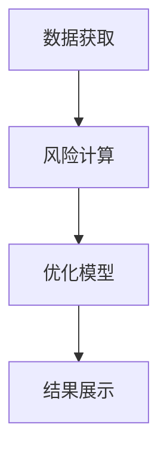
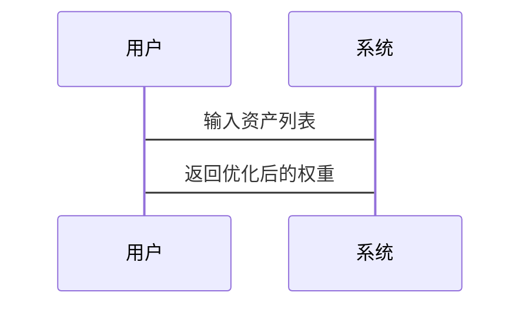

                 


# 风险平价策略：平衡不同资产类别风险的方法

## 关键词：风险平价，资产配置，投资组合管理，金融风险管理，数学优化

## 摘要：  
风险平价策略是一种通过平衡不同资产类别之间的风险来优化投资组合的方法。与传统的基于资产比例的配置方法不同，风险平价策略根据各资产类别的风险贡献来调整权重，以实现风险的均衡分配。本文将详细介绍风险平价策略的理论基础、数学模型、算法实现、系统架构以及实际应用案例，帮助读者全面理解并掌握这一高效的风险管理方法。

---

# 第1章：风险平价策略概述

## 1.1 风险平价的定义与背景

### 1.1.1 风险平价的定义  
风险平价（Risk Parity）是一种资产配置方法，旨在通过调整投资组合中各资产的风险贡献，使每类资产的风险对整体组合的潜在风险影响相等。与传统的基于资产比例的配置方法不同，风险平价策略关注的是风险的均衡分配，而非资产的简单比例分配。

### 1.1.2 风险平价的背景与演变  
在传统资产配置中，投资者通常基于历史收益率的均值和方差来进行资产分配，但这忽略了不同资产类别在不同市场环境下的风险特征。特别是在2008年全球金融危机后，投资者意识到传统方法在风险控制上的不足，风险平价策略因其在极端市场条件下的稳定性逐渐受到关注。

### 1.1.3 风险平价与其他风险分配方法的对比  
传统的资产配置方法通常基于资产的预期收益和波动率，而风险平价策略则通过优化各资产的风险贡献来实现平衡。与等权重分配相比，风险平价更注重资产之间的风险分散效果。

---

## 1.2 风险平价的核心理念

### 1.2.1 风险平价的目标  
风险平价的目标是通过调整各资产类别的权重，使得每类资产的风险贡献对投资组合的总风险相等。这意味着在投资组合中，每类资产的风险暴露是平衡的，从而降低整体组合的尾部风险。

### 1.2.2 风险平价的数学基础  
风险平价的数学模型基于资产的风险协方差矩阵，通过优化算法确定各资产的权重，使得每类资产的风险贡献相等。

### 1.2.3 风险平价在投资组合中的作用  
风险平价通过分散各资产类别的风险，降低了投资组合在极端市场环境下的波动性，同时提高了组合的稳定性。

---

## 1.3 风险平价的应用场景

### 1.3.1 机构投资者的风险管理  
风险平价策略常用于机构投资者的资产配置，帮助其在不同资产类别之间实现风险的均衡分配。

### 1.3.2 风险平价在资产配置中的优势  
相比传统资产配置方法，风险平价策略在降低组合风险的同时，提高了收益的稳定性。

### 1.3.3 风险平价的局限性与挑战  
风险平价策略依赖于对资产风险特征的准确估计，实际操作中可能面临数据不足、市场环境变化等问题。

---

# 第2章：风险平价的数学模型与原理

## 2.1 风险平价的数学模型

### 2.1.1 方差协方差矩阵的构建  
方差协方差矩阵反映了各资产之间收益率的波动性和相关性，是风险平价模型的重要输入。

$$
\text{方差协方差矩阵} = \begin{bmatrix}
\sigma_1^2 & \sigma_1\sigma_2 & \cdots & \sigma_1\sigma_n \\
\sigma_2\sigma_1 & \sigma_2^2 & \cdots & \sigma_2\sigma_n \\
\vdots & \vdots & \ddots & \vdots \\
\sigma_n\sigma_1 & \sigma_n\sigma_2 & \cdots & \sigma_n^2
\end{bmatrix}
$$

### 2.1.2 资产相关性的影响  
资产的相关性会影响风险平价模型中各资产的权重分配，相关性较高的资产可能需要较小的权重以分散风险。

### 2.1.3 风险平价的优化目标  
风险平价的优化目标是最小化投资组合的风险贡献的不均衡性，使得每类资产的风险贡献相等。

$$
\min_{w} \sum_{i=1}^{n} \left( \frac{w_i^2 \sigma_i^2}{(\sum_{j=1}^{n} w_j^2 \sigma_j^2)} \right)
$$

---

## 2.2 风险平价的算法原理

### 2.2.1 优化模型的建立  
风险平价的优化模型通常采用非线性规划方法，目标是最小化风险贡献的不均衡性。

### 2.2.2 数学推导与公式  
通过拉格朗日乘数法，可以求解风险平价的优化问题，得到各资产的权重分配。

### 2.2.3 算法实现步骤  
1. 构建资产的风险协方差矩阵。  
2. 使用优化算法求解权重，使得每类资产的风险贡献相等。  
3. 调整权重以满足投资组合的约束条件。

---

# 第3章：多资产类别下的风险平价策略

## 3.1 多资产类别风险平价的实现

### 3.1.1 股票、债券、商品等资产的风险特征  
不同资产类别具有不同的风险特征，股票风险较高，债券风险较低，商品风险受市场波动影响较大。

### 3.1.2 跨资产类别风险平价的权重分配  
通过优化模型确定各资产类别的权重，使得每类资产的风险贡献相等。

### 3.1.3 跨资产类别风险平价的优化过程  
1. 收集各资产的历史收益率数据。  
2. 计算各资产的风险协方差矩阵。  
3. 使用优化算法确定权重，实现风险平价。

---

## 3.2 多资产类别风险平价的案例分析

### 3.2.1 案例背景与目标设定  
假设我们有股票、债券和商品三种资产，目标是通过风险平价策略实现风险均衡分配。

### 3.2.2 数据收集与预处理  
收集各资产的历史收益率数据，并计算协方差矩阵。

### 3.2.3 风险平价策略的实施与结果  
通过优化算法确定各资产的权重，实现风险贡献的均衡。

---

# 第4章：风险平价策略的系统架构与实现

## 4.1 系统架构概述

### 4.1.1 系统功能模块划分  
风险平价系统通常包括数据获取、风险计算、优化模型求解和结果展示四个模块。

### 4.1.2 系统架构图  


### 4.1.3 系统接口设计  
系统提供API接口，用于数据输入和结果输出。

---

## 4.2 系统实现细节

### 4.2.1 数据获取模块  
负责收集各资产的历史收益率数据，并进行预处理。

### 4.2.2 风险计算模块  
计算各资产的风险协方差矩阵。

### 4.2.3 优化模型模块  
使用优化算法求解各资产的权重。

---

## 4.3 系统交互流程

### 4.3.1 系统交互图  


---

# 第5章：风险平价策略的项目实战

## 5.1 项目环境配置

### 5.1.1 安装所需库  
安装Python、numpy、pandas、scipy等库。

## 5.2 核心代码实现

### 5.2.1 风险平价算法的Python代码  
```python
import numpy as np
from scipy.optimize import minimize

def risk_parity(weights, cov_matrix):
    risk_contributions = weights**2 * np.dot(cov_matrix, weights)
    return np.sum(risk_contributions**2)

def optimize_risk_parity(returns, n_assets):
    cov_matrix = np.cov(returns.T)
    init_weights = np.array([1.0 / n_assets] * n_assets)
    result = minimize(risk_parity, init_weights, args=(cov_matrix,), method='SLSQP')
    return result.x

# 示例数据
returns = np.array([[0.1, 0.2, 0.15],
                    [0.05, 0.1, 0.08],
                    [0.08, 0.12, 0.1]])
weights = optimize_risk_parity(returns, 3)
print(weights)
```

---

## 5.3 案例分析与结果解读

### 5.3.1 数据处理与分析  
使用历史收益率数据计算风险协方差矩阵。

### 5.3.2 优化过程与结果展示  
通过优化算法确定各资产的权重，并分析结果的合理性。

---

## 5.4 项目小结

### 5.4.1 实战经验总结  
风险平价策略在实际应用中需要考虑数据质量和市场环境的影响。

### 5.4.2 注意事项  
确保数据的准确性和及时性，定期更新优化模型。

---

# 第6章：风险平价策略的高级应用与挑战

## 6.1 动态风险平价策略

### 6.1.1 动态调整方法  
根据市场环境的变化，动态调整各资产的权重。

### 6.1.2 动态风险平价的实现  
通过实时监控市场数据，定期更新优化模型。

## 6.2 风险平价与风险管理技术

### 6.2.1 风险平价与VaR模型的结合  
将风险平价策略应用于VaR模型中，进一步优化风险控制。

### 6.2.2 风险平价与压力测试  
通过压力测试验证风险平价策略在极端市场条件下的表现。

## 6.3 风险平价的未来拓展

### 6.3.1 风险平价与因子模型的结合  
将因子模型应用于风险平价策略，提高组合的分散化效果。

### 6.3.2 风险平价与机器学习的结合  
利用机器学习算法预测资产风险特征，优化风险平价策略。

---

# 第7章：总结与展望

## 7.1 总结

### 7.1.1 核心知识点回顾  
风险平价策略的核心是通过优化各资产的风险贡献，实现风险的均衡分配。

### 7.1.2 风险平价策略的优势与不足  
风险平价策略在降低组合风险的同时，也面临数据依赖性和模型假设的挑战。

## 7.2 展望

### 7.2.1 风险平价策略的未来发展方向  
随着金融市场的复杂化，风险平价策略将与更多新兴技术结合，优化投资组合的风险管理。

### 7.2.2 风险平价策略的研究热点  
未来的研究将更多关注动态风险平价、多因子模型与机器学习的结合。

---

# 作者：AI天才研究院/AI Genius Institute & 禅与计算机程序设计艺术 /Zen And The Art of Computer Programming

---

以上是《风险平价策略：平衡不同资产类别风险的方法》的技术博客文章的详细目录和内容框架，涵盖从基础到高级的风险平价策略，包括数学模型、系统架构和实战案例等部分。

