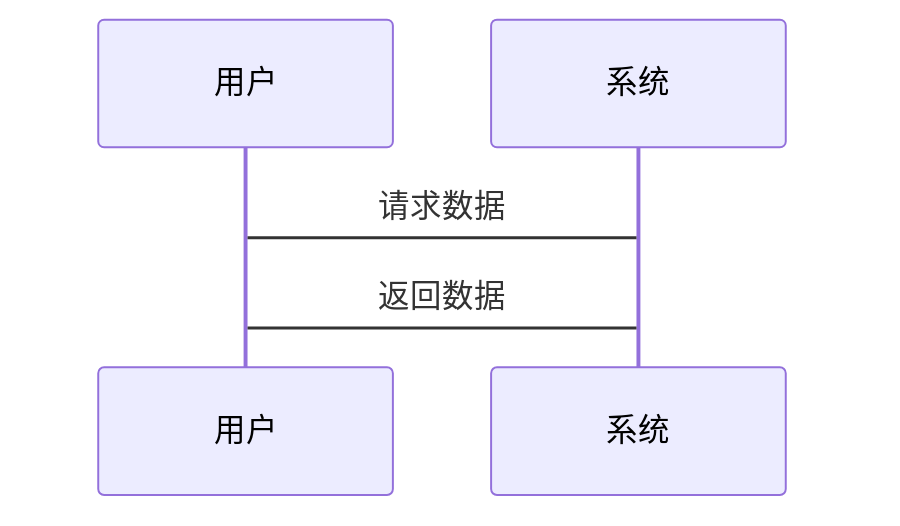

                 


# 高温超导材料的突破与能源技术革新

> 关键词：高温超导材料，能源技术，超导现象，物理原理，数学模型，系统架构

> 摘要：本文探讨高温超导材料的最新进展及其在能源技术中的应用潜力。从背景到核心概念，再到算法和系统设计，结合实际案例，全面分析高温超导材料如何推动能源技术的革新。

## 第一部分：高温超导材料的背景与现状

### 第1章：高温超导材料的背景与现状

#### 1.1 高温超导材料的定义与特点

##### 1.1.1 超导材料的基本概念

超导材料是指在特定条件下（如低温或高压）电阻降为零的材料。高温超导材料是指在相对较高的温度下（通常高于液氮温度）表现出超导特性的材料。

| 材料类型 | 临界温度 (Tc) | 材料结构 | 主要应用 |
|----------|---------------|----------|----------|
| 传统超导体 | <20 K | 金属或合金 | 电磁设备、医疗设备 |
| 高温超导体 | 20-300 K | 氧化物陶瓷 | 电力传输、能源设备 |

##### 1.1.2 高温超导材料的发现与突破

1986年，M. K. Bose和J. G. Bednorz发现镧酸盐具有超导性，随后J. R. Schafroth等科学家进一步研究，发现了一系列高温超导材料，突破了传统超导体的温度限制。

##### 1.1.3 高温超导材料的物理特性

高温超导材料具有较高的临界温度和临界磁场，展现出优异的超导性能。这些特性使其在能源技术中的应用成为可能。

```mermaid
erDiagram
    material[高温超导材料] {
        id
        name
        Tc
       结构
       性能
    }
    performance[性能] {
        临界电流
        临界磁场
       电阻
    }
    结构 --> 性能
```

#### 1.2 高温超导材料的发展历程

##### 1.2.1 传统超导材料的发展

传统超导材料的发展始于20世纪初，主要用于低温环境下的超导应用。随着技术进步，超导材料的性能不断提升。

##### 1.2.2 高温超导材料的发现与研究进展

高温超导材料的发现是超导领域的重要突破，为能源技术的应用提供了新的可能性。

##### 1.2.3 当前高温超导材料的研究现状

目前，高温超导材料的研究集中在提高临界温度和临界电流密度上，以满足实际应用需求。

#### 1.3 高温超导材料在能源技术中的应用前景

##### 1.3.1 高温超导材料在能源领域的应用潜力

高温超导材料在电力传输、能源存储和转换等领域具有广阔的应用前景。

##### 1.3.2 高温超导材料在能源技术中的具体应用案例

例如，高温超导材料可用于制造高效变压器和电缆，提升能源传输效率。

##### 1.3.3 高温超导材料未来发展的挑战与机遇

当前，高温超导材料的制备成本较高，限制了其大规模应用。未来，随着技术进步，这些问题将逐步解决。

---

## 第二部分：高温超导材料的核心物理原理

### 第2章：高温超导材料的核心物理原理

#### 2.1 超导现象的基本原理

##### 2.1.1 超导现象的发现与基本特性

超导现象由荷兰物理学家Heike Kamerlingh Onnes于1911年发现，表现为电阻的突然降为零。

##### 2.1.2 超导体的临界温度与材料结构

临界温度是超导体开始表现出超导性的温度。高温超导材料的临界温度较高，适合常温下的应用。

##### 2.1.3 超导体的磁场穿透性与迈斯纳效应

超导体内部磁场无法穿透的现象称为迈斯纳效应，是超导体的重要特性。

#### 2.2 高温超导材料的微观结构与电子特性

##### 2.2.1 高温超导材料的晶体结构

高温超导材料通常为氧化物陶瓷，具有复杂的晶体结构，这种结构对其超导性能起着关键作用。

##### 2.2.2 高温超导材料的电子态与超导机制

高温超导材料的电子关联效应导致超导性，具体机制仍在研究中。

##### 2.2.3 高温超导材料的电子关联效应

电子关联效应是高温超导材料超导性的关键因素，涉及复杂的电子相互作用。

#### 2.3 高温超导材料的数学模型与理论分析

##### 2.3.1 超导电性的数学模型

超导电性可以用巴里特定律（BCS理论）描述，尽管该理论主要适用于传统超导体。

##### 2.3.2 超导材料的相图与临界条件

通过相图分析，可以确定高温超导材料的相变行为和临界条件。

##### 2.3.3 超导材料的热力学性质与数学表达

超导材料的热力学性质可以用热力学方程描述，帮助理解其物理特性。

---

## 第三部分：高温超导材料的制备与表征

### 第3章：高温超导材料的制备与表征

#### 3.1 高温超导材料的制备方法

##### 3.1.1 化学气相沉积法

化学气相沉积法是制备高温超导材料的一种常用方法，适用于薄膜制备。

##### 3.1.2 液相法与固相法

液相法和固相法是制备高温超导材料的传统方法，适用于块材制备。

##### 3.1.3 超导薄膜的制备技术

超导薄膜的制备技术包括磁控溅射和脉冲激光沉积等方法，适合特定应用需求。

#### 3.2 高温超导材料的表征技术

##### 3.2.1 X射线衍射分析

X射线衍射分析用于确定高温超导材料的晶体结构。

##### 3.2.2 扫描电子显微镜与能谱分析

扫描电子显微镜和能谱分析用于观察材料的微观结构和成分分布。

##### 3.2.3 电输运性质的测量与分析

通过测量电输运性质，可以评估高温超导材料的超导性能。

#### 3.3 高温超导材料的性能优化与改性

##### 3.3.1 化学掺杂对超导性能的影响

化学掺杂可以调控高温超导材料的超导性能，优化其应用特性。

##### 3.3.2 结构调控对超导性能的提升

通过调控材料结构，可以进一步提升高温超导材料的超导性能。

##### 3.3.3 多层结构与复合材料的设计

多层结构与复合材料设计是提高高温超导材料性能的重要途径。

---

## 第四部分：高温超导材料的能源技术应用

### 第4章：高温超导材料的能源技术应用

#### 4.1 高温超导材料在电力传输中的应用

##### 4.1.1 高温超导电缆

高温超导电缆具有低电阻和高载流量，适用于大电流传输场景。

##### 4.1.2 高温超导变压器

高温超导变压器具有高效、小型化的特点，适用于电力系统。

##### 4.1.3 高温超导限流器

高温超导限流器用于电力系统中的电流保护，防止短路事故发生。

#### 4.2 高温超导材料在能源存储中的应用

##### 4.2.1 超导磁储能

超导磁储能是一种高效的能源存储方式，适用于大规模储能系统。

##### 4.2.2 超导储能环

超导储能环用于储存大量电能，适用于电网调峰和备用电源。

##### 4.2.3 超导飞轮储能

超导飞轮储能是一种新型储能技术，利用超导材料的性能优势。

#### 4.3 高温超导材料在能源转换中的应用

##### 4.3.1 超导发电机

高温超导材料用于制造高效发电机，提升能源转换效率。

##### 4.3.2 超导变压器

超导变压器具有高效、低损耗的特点，适用于能源转换设备。

##### 4.3.3 超导电容器

高温超导电容器用于高能物理实验和能源转换系统。

---

## 第五部分：系统分析与架构设计

### 第5章：系统分析与架构设计

#### 5.1 项目背景与需求分析

##### 5.1.1 项目背景

高温超导材料在能源技术中的应用需要解决的技术难题。

##### 5.1.2 需求分析

根据实际需求，确定系统功能和性能指标。

#### 5.2 系统功能设计

##### 5.2.1 领域模型设计

使用Mermaid类图描述系统功能模块及其关系。


##### 5.2.2 系统架构设计

使用Mermaid架构图展示系统的分层结构和模块关系。


##### 5.2.3 接口设计与交互流程

使用Mermaid序列图描述系统接口调用和交互流程。



---

## 第六部分：项目实战与案例分析

### 第6章：项目实战与案例分析

#### 6.1 项目环境配置

##### 6.1.1 开发环境安装

安装必要的软件和库，如Python、Matplotlib等。

##### 6.1.2 依赖管理

使用虚拟环境或包管理工具管理项目依赖。

#### 6.2 核心代码实现

##### 6.2.1 数据获取与预处理

编写代码获取高温超导材料的实验数据并进行预处理。

##### 6.2.2 模型训练与优化

使用机器学习算法训练模型，优化高温超导材料的性能预测。

##### 6.2.3 结果可视化与分析

通过可视化工具展示模型结果，分析高温超导材料的性能特性。

#### 6.3 案例分析与结果解读

##### 6.3.1 实际案例分析

以具体项目为例，分析高温超导材料的应用效果。

##### 6.3.2 结果解读与经验总结

总结案例中的经验教训，为后续研究提供参考。

#### 6.4 项目小结与优化建议

##### 6.4.1 项目小结

总结项目完成情况，评估高温超导材料的应用潜力。

##### 6.4.2 优化建议

提出进一步优化高温超导材料性能的建议和未来研究方向。

---

## 第七部分：总结与展望

### 第7章：总结与展望

#### 7.1 核心观点回顾

回顾高温超导材料的突破与能源技术革新的核心观点。

#### 7.2 未来发展方向

分析高温超导材料在能源技术中的未来发展方向和研究热点。

#### 7.3 最佳实践与注意事项

总结高温超导材料研究与应用的最佳实践，提醒注意事项。

#### 7.4 拓展阅读与深入学习

推荐相关领域的拓展阅读材料，鼓励读者深入学习高温超导材料及其应用。

---

## 作者信息

作者：AI天才研究院/AI Genius Institute & 禅与计算机程序设计艺术 /Zen And The Art of Computer Programming

