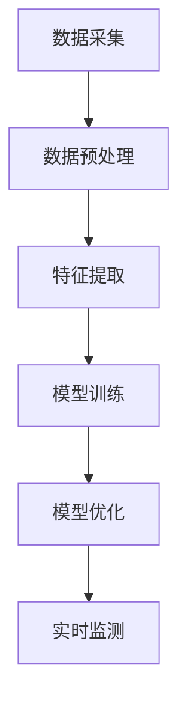
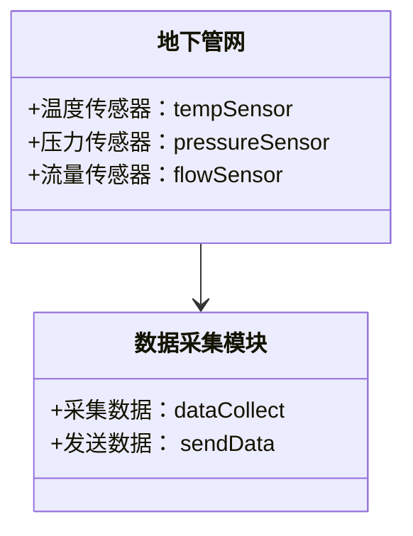
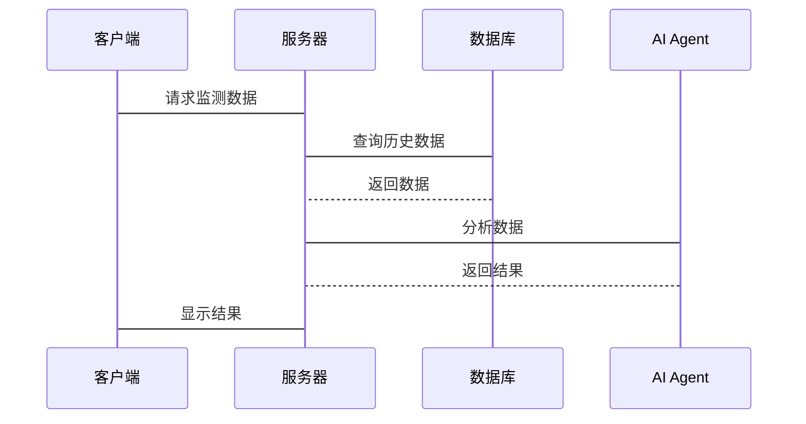

                 


# AI Agent在智能地下管网监测中的实践

## 关键词：AI Agent，智能地下管网，监测系统，算法，实时监测

## 摘要：本文详细探讨了AI Agent在智能地下管网监测中的应用，从背景、概念、算法原理到系统架构设计、项目实战及最佳实践，全面分析了AI Agent如何提升管网监测的效率和准确性。通过实际案例，展示了AI Agent在监测中的实际应用价值和未来的发展潜力。

---

# 第1章: AI Agent与智能地下管网监测概述

## 1.1 AI Agent的基本概念

### 1.1.1 AI Agent的定义与特点
AI Agent（人工智能代理）是指能够感知环境、自主决策并执行任务的智能实体。其特点包括自主性、反应性、目标导向性和学习能力。AI Agent能够通过传感器或其他数据源获取信息，利用算法进行分析，并根据结果采取行动。

### 1.1.2 AI Agent的核心功能与作用
AI Agent的核心功能包括数据采集、特征提取、模型训练、实时监测和异常处理。它能够通过分析数据，识别潜在问题并提供解决方案，从而提高系统的智能化水平。

### 1.1.3 AI Agent在智能系统中的地位
AI Agent是智能系统的核心组成部分，负责系统的感知、决策和执行。它能够通过不断学习和优化，提升系统的性能和适应性。

## 1.2 智能地下管网监测的背景与挑战

### 1.2.1 地下管网监测的重要性
地下管网是城市基础设施的重要组成部分，包括供水、供电、供气等系统。监测这些管网的运行状态，能够及时发现并解决潜在问题，避免事故的发生。

### 1.2.2 传统监测方法的局限性
传统监测方法依赖人工检查和简单的传感器数据采集，存在效率低、成本高、响应慢等问题。此外，传统方法难以应对复杂多变的环境和突发事件。

### 1.2.3 智能化监测的需求与趋势
随着城市化进程的加快，地下管网的复杂性增加，对监测系统的智能化需求日益迫切。智能化监测能够提高效率、降低成本，并实现实时监控和快速响应。

## 1.3 AI Agent在地下管网监测中的应用前景

### 1.3.1 AI Agent在管网监测中的优势
AI Agent能够通过机器学习和深度学习算法，实现对管网数据的深度分析，发现潜在问题并提供解决方案。此外，AI Agent还能够实现自主学习和优化，不断提升监测的准确性和效率。

### 1.3.2 应用场景与实际案例
AI Agent在地下管网监测中的应用场景包括实时监测、异常检测、故障诊断和优化控制等。例如，某城市通过部署AI Agent系统，成功实现了对地下管网的实时监测，并在多次事故中提前预警，避免了重大损失。

### 1.3.3 技术发展的潜力与挑战
AI Agent在地下管网监测中的潜力巨大，但同时也面临数据隐私、模型泛化能力、计算资源等挑战。未来，随着技术的进步，这些挑战将逐步得到解决。

---

# 第2章: AI Agent的核心概念与原理

## 2.1 AI Agent的核心概念

### 2.1.1 感知层：数据采集与特征提取
感知层负责通过传感器等设备采集管网运行数据，并对数据进行预处理和特征提取。特征提取是将原始数据转化为有意义的特征，以便后续分析和决策。

### 2.1.2 决策层：算法与模型选择
决策层通过机器学习或深度学习算法，对特征进行分析和建模，从而做出决策。算法的选择取决于具体应用场景和数据特点。

### 2.1.3 执行层：结果输出与反馈机制
执行层负责根据决策结果采取行动，并将结果反馈给感知层，形成闭环系统。反馈机制能够不断优化系统的性能。

## 2.2 AI Agent在管网监测中的工作流程

### 2.2.1 数据采集与预处理
数据采集是通过传感器等设备获取管网运行数据，预处理包括数据清洗、标准化和特征提取等步骤。

### 2.2.2 模型训练与优化
模型训练是通过机器学习算法对特征进行建模，优化过程包括参数调整和模型评估。

### 2.2.3 实时监测与异常处理
实时监测是通过AI Agent对当前数据进行分析，识别异常情况并采取相应措施。

## 2.3 核心概念对比与ER实体关系图

### 2.3.1 传统监测方法与AI Agent的对比分析
| 对比维度 | 传统监测 | AI Agent |
|----------|----------|-----------|
| 数据采集 | 人工或简单传感器 | 多源传感器 + 数据融合 |
| 数据处理 | 简单分析 | 深度学习 + 特征提取 |
| 决策效率 | 低效 | 实时决策 + 自主学习 |

### 2.3.2 ER实体关系图展示（Mermaid流程图）
```mermaid
erd
    左边(地下管网) --> 中间(传感器) --> 右边(AI Agent)
    中间 --> 左边
```

---

# 第3章: AI Agent的算法原理与数学模型

## 3.1 数据采集与特征提取

### 3.1.1 数据采集方法与流程
数据采集是通过多种传感器（如压力传感器、温度传感器等）获取管网运行数据，并通过数据预处理步骤（如去噪、归一化）提取有意义的特征。

### 3.1.2 特征提取的数学模型
特征提取可以通过主成分分析（PCA）等方法实现。例如：
$$
y = \sum_{i=1}^{n} \lambda_i x_i
$$
其中，$\lambda_i$是特征权重，$x_i$是原始数据。

### 3.1.3 代码实现示例（Python）
```python
import numpy as np
from sklearn.decomposition import PCA

# 假设X为原始数据矩阵
pca = PCA(n_components=3)
principal_components = pca.fit_transform(X)
print(principal_components)
```

## 3.2 模型训练与优化

### 3.2.1 机器学习算法选择
常用的机器学习算法包括支持向量机（SVM）、随机森林（Random Forest）等。

### 3.2.2 深度学习模型构建
深度学习模型可以选择LSTM（长短期记忆网络）进行时间序列预测。例如：
$$
f(x) = \text{LSTM}(x, \text{units}=128, \text{dropout}=0.2)
$$

### 3.2.3 模型优化与调参
通过交叉验证和网格搜索（Grid Search）优化模型参数，例如：
```python
from sklearn.model_selection import GridSearchCV

# 定义参数搜索空间
param_grid = {'n_estimators': [100, 200], 'max_depth': [10, 20]}
grid_search = GridSearchCV(estimator=RandomForestClassifier(), param_grid=param_grid)
grid_search.fit(X_train, y_train)
```

## 3.3 算法流程图与数学公式

### 3.3.1 算法流程图（Mermaid）


### 3.3.2 关键公式与数学模型（Latex）
$$
\text{预测值} = \text{模型}(\text{输入特征})
$$

---

# 第4章: 系统分析与架构设计

## 4.1 项目背景介绍

AI Agent地下管网监测系统旨在通过智能化手段，实现对管网的实时监测和异常预警。该系统适用于城市供水、供电、供气等领域的监测。

## 4.2 系统功能设计

### 4.2.1 领域模型（Mermaid类图）


### 4.2.2 系统架构设计（Mermaid架构图）


### 4.2.3 系统接口设计
系统接口包括数据采集接口、模型调用接口和结果展示接口。例如：
$$
\text{API调用：} /api/v1/monitor
$$

### 4.2.4 系统交互流程图（Mermaid序列图）


---

# 第5章: 项目实战

## 5.1 环境安装与配置

### 5.1.1 安装Python和相关库
```bash
pip install numpy scikit-learn tensorflow
```

## 5.2 核心代码实现

### 5.2.1 数据采集模块
```python
import serial

ser = serial.Serial('COM3', 9600)
data = ser.readline().decode().strip()
print(data)
```

### 5.2.2 数据分析与模型训练
```python
from sklearn.ensemble import RandomForestClassifier

model = RandomForestClassifier()
model.fit(X_train, y_train)
```

## 5.3 实际案例分析与解读

### 5.3.1 案例背景
某城市供水管网出现压力异常，通过AI Agent系统监测到压力波动，并及时预警。

### 5.3.2 案例分析
通过数据分析和模型预测，AI Agent识别出压力异常的原因是管道泄漏，并提供修复建议。

### 5.3.3 成果展示
系统成功预警并减少潜在损失，证明了AI Agent在管网监测中的有效性。

## 5.4 项目小结

AI Agent系统在实际应用中表现出色，能够有效监测管网运行状态，及时发现异常并提供解决方案。项目的成功实施提升了监测效率和准确性。

---

# 第6章: 最佳实践与总结

## 6.1 实用建议与注意事项

### 6.1.1 数据质量管理
确保数据的准确性和完整性，避免因数据质量问题影响模型性能。

### 6.1.2 模型维护与优化
定期更新模型，确保其适应变化的环境和数据特点。

### 6.1.3 系统安全性与隐私保护
重视数据隐私和系统安全性，防止数据泄露和系统攻击。

## 6.2 项目总结

AI Agent在智能地下管网监测中的应用取得了显著成效，通过智能化手段提升了监测效率和准确性。未来，随着技术的发展，AI Agent将在更多领域发挥重要作用。

## 6.3 拓展阅读与进一步思考

建议读者进一步研究深度学习模型在时间序列分析中的应用，以及多模态数据融合技术在管网监测中的潜力。

---

# 参考文献

1. LeCun, Y., Bengio, Y., & Hinton, G. (2015). Deep learning. Nature, 521(7555), 436-444.
2. Hastie, T., Tibshirani, R., & Friedman, J. (2009). The elements of statistical learning.
3. Goodfellow, I., Bengio, Y., & Courville, A. (2016). Deep learning.

---

作者：AI天才研究院/AI Genius Institute & 禅与计算机程序设计艺术 /Zen And The Art of Computer Programming

