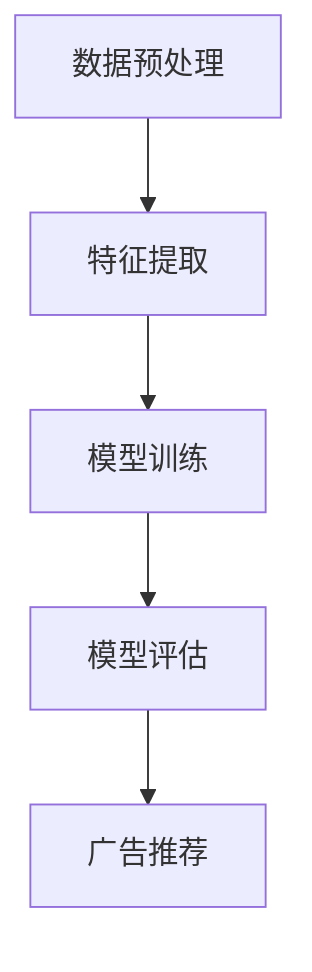
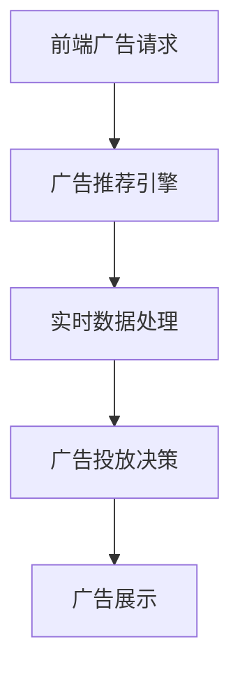

                 


# AI Agent在智能广告投放中的应用

---

## 关键词  
AI Agent, 智能广告投放, 机器学习, 广告算法, 数据分析, 实时竞价, 用户画像

---

## 摘要  
本文深入探讨了AI Agent在智能广告投放中的应用，分析了其核心概念、算法原理、系统架构，并结合实际案例进行详细解读。通过理论与实践结合的方式，揭示了AI Agent如何通过感知、决策和执行机制优化广告投放策略，提升广告投放效率和精准度。  

---

# 目录大纲：《AI Agent在智能广告投放中的应用》

---

## 第一部分：AI Agent与智能广告投放概述

### 第1章：AI Agent的基本概念与广告投放的背景

#### 1.1 AI Agent的基本概念  
- 1.1.1 人工智能代理的定义与特点  
  - 自主性、反应性、社会性、学习能力  
- 1.1.2 AI Agent在广告投放中的作用  
  - 实时优化、精准推送、数据驱动决策  
- 1.1.3 AI Agent与传统广告投放的对比  
  - 效率提升、精准度增强、实时性优化  

#### 1.2 广告投放的背景与现状  
- 1.2.1 网络广告的发展历程  
  - 传统广告 vs 数字广告：从单向传播到双向互动  
- 1.2.2 当前广告投放的主要挑战  
  - 数据爆炸、用户行为复杂、广告效果评估困难  
- 1.2.3 AI技术在广告投放中的应用趋势  
  - 数据驱动、个性化推荐、动态优化  

---

## 第二部分：AI Agent的核心概念与原理

### 第2章：AI Agent的核心概念与广告投放的关系

#### 2.1 AI Agent的核心概念  
- 2.1.1 AI Agent的感知、决策与执行机制  
  - 感知：数据采集与分析  
  - 决策：基于机器学习的策略优化  
  - 执行：广告投放与实时调整  

#### 2.2 广告投放的核心概念  
- 2.2.1 用户画像与行为分析  
  - 用户画像构建：基于用户数据的标签化管理  
- 2.2.2 广告定位与投放策略  
  - 基于用户行为的广告定位优化  
- 2.2.3 广告效果评估与反馈  
  - 点击率、转化率、收益最大化  

#### 2.3 AI Agent与广告投放的关系  
- 2.3.1 AI Agent在广告投放中的核心作用  
  - 数据驱动的实时优化  
- 2.3.2 广告投放对AI Agent的依赖性  
  - 数据量、实时性、精准度  

---

## 第三部分：AI Agent在广告投放中的算法原理

### 第3章：AI Agent的核心算法原理

#### 3.1 广告点击率预测的算法原理  
- 3.1.1 基于逻辑回归的点击率预测  
  - 逻辑回归模型：$P(y=1|x) = \frac{1}{1 + e^{-\beta x}}$  
- 3.1.2 基于神经网络的深度学习模型  
  - 卷积神经网络（CNN）与循环神经网络（RNN）的应用  

#### 3.2 广告推荐算法的实现原理  
- 3.2.1 基于协同过滤的推荐算法  
  - 用户-物品协同过滤：$sim(i,j) = \frac{\sum_{u} (r_{u,i} - \bar{r}_u)(r_{u,j} - \bar{r}_u)}{\sqrt{\sum_{u} (r_{u,i} - \bar{r}_u)^2} \cdot \sqrt{\sum_{u} (r_{u,j} - \bar{r}_u)^2}}}$  
- 3.2.2 基于深度学习的推荐算法  
  - DeepFM模型：结合特征的线性组合与非线性组合  

#### 3.3 算法流程图  


---

## 第四部分：AI Agent在广告投放中的系统架构设计

### 第4章：AI Agent广告投放系统架构

#### 4.1 系统功能模块设计  
- 4.1.1 数据采集与处理模块  
  - 数据源：用户行为日志、广告点击数据、用户画像  
- 4.1.2 广告推荐模块  
  - 基于机器学习的广告推荐引擎  
- 4.1.3 广告投放与实时优化模块  
  - 实时竞价系统（RTB）  

#### 4.2 系统架构图  


---

## 第五部分：AI Agent在广告投放中的项目实战

### 第5章：基于AI Agent的广告投放系统实现

#### 5.1 环境搭建与工具安装  
- Python、Pandas、Scikit-learn、TensorFlow安装与配置  

#### 5.2 系统核心代码实现  
- 数据预处理代码：  
  ```python
  import pandas as pd
  data = pd.read_csv('ad_data.csv')
  data['click'] = data['click'].astype(int)
  ```

- 模型训练代码：  
  ```python
  from sklearn.linear_model import LogisticRegression
  model = LogisticRegression()
  model.fit(X_train, y_train)
  ```

- 广告推荐代码：  
  ```python
  def recommend_ads(users):
      return model.predict(X_users)
  ```

#### 5.3 实际案例分析与系统优化  
- 案例分析：用户行为分析与广告点击率提升  
- 系统优化：模型调优与实时反馈机制优化  

---

## 第六部分：AI Agent在广告投放中的最佳实践

### 第6章：AI Agent广告投放的实践总结

#### 6.1 小结  
- AI Agent在广告投放中的优势与不足  
- 实际应用中的关键成功因素  

#### 6.2 注意事项  
- 数据隐私与用户隐私保护  
- 广告投放的法律法规合规性  

#### 6.3 扩展阅读  
- 推荐书目：《机器学习实战》、《深度学习》  
- 推荐课程：Coursera上的“机器学习”课程  

---

## 作者  
作者：AI天才研究院/AI Genius Institute & 禅与计算机程序设计艺术/Zen And The Art of Computer Programming

