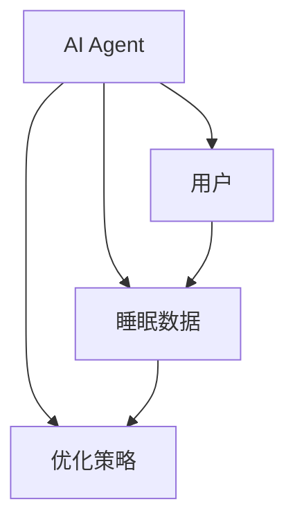
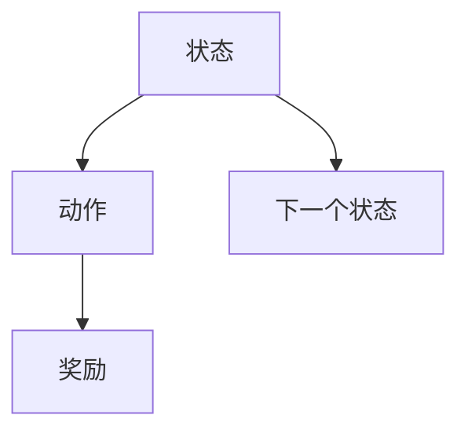
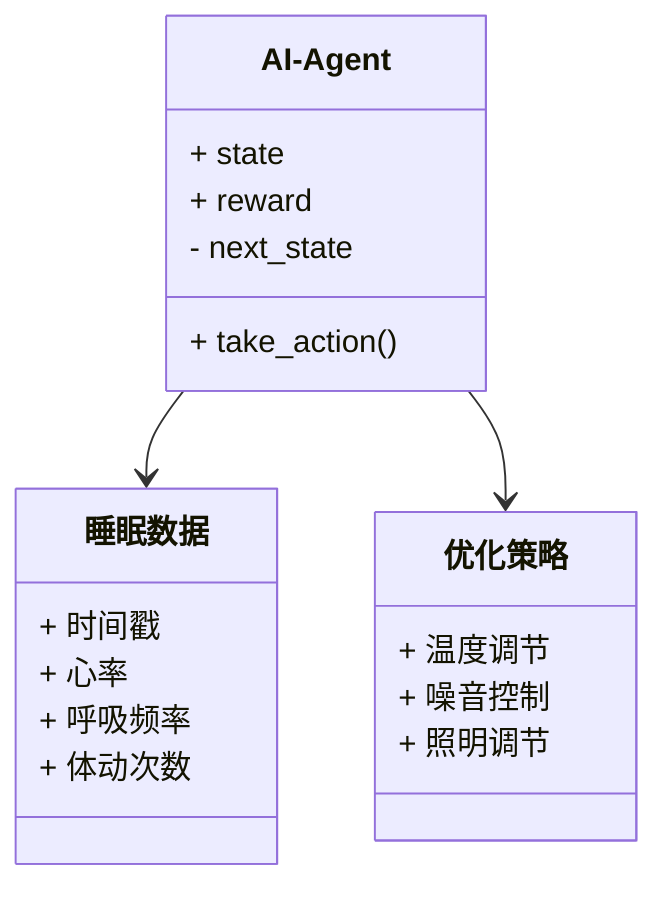
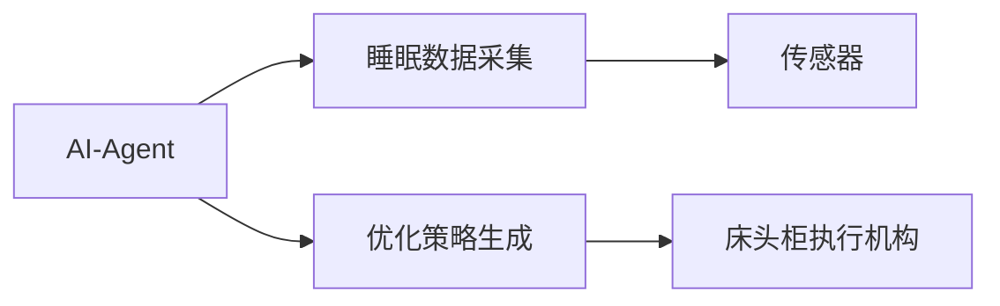
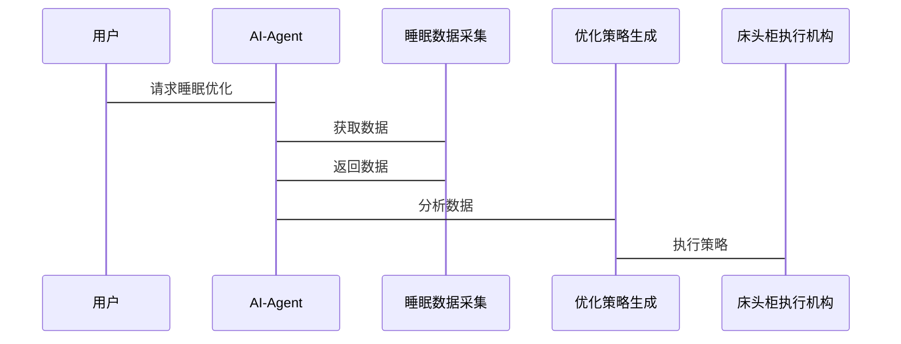

                 


# AI Agent在智能床头柜中的睡眠辅助功能

**关键词**：AI Agent, 智能床头柜, 睡眠辅助, 睡眠监测, 人工智能, 物联网

**摘要**：本文探讨AI Agent在智能床头柜中的应用，通过分析睡眠问题，介绍AI Agent的核心概念、算法原理和系统架构，展示如何通过智能床头柜改善睡眠质量，涵盖感知、分析和优化建议，涉及强化学习算法和系统设计。

---

# 第一部分：AI Agent与智能床头柜的背景介绍

## 第1章：AI Agent与智能床头柜概述

### 1.1 睡眠问题的现状与挑战

现代社会，睡眠问题日益严重，影响健康和生活质量。传统床头柜功能有限，无法有效改善睡眠。

### 1.2 智能床头柜的概念与定义

智能床头柜结合物联网和AI技术，具备智能传感器和AI Agent，可监测睡眠数据并提供优化建议。

### 1.3 AI Agent在睡眠辅助中的作用

AI Agent通过监测数据，分析用户睡眠状态，提供个性化建议，帮助改善睡眠质量。

### 1.4 边界与外延

AI Agent仅负责睡眠辅助，不涉及床头柜的其他功能，如照明或充电。

---

# 第二部分：AI Agent的核心概念与原理

## 第2章：AI Agent的核心概念与联系

### 2.1 AI Agent的核心原理

#### 2.1.1 感知层：睡眠数据的采集与处理

AI Agent通过传感器收集用户的睡眠数据，如心率、呼吸频率和体动次数。

#### 2.1.2 决策层：基于数据的睡眠优化策略

AI Agent分析数据，识别睡眠障碍，制定优化策略，如调整温度或播放白噪音。

#### 2.1.3 执行层：个性化睡眠建议的输出

AI Agent通过床头柜输出建议，如调节灯光或播放放松音乐。

### 2.2 概念属性对比

| 概念 | 属性 | 描述 |
|------|-------|------|
| AI Agent | 感知 | 采集数据 | 
|      | 决策 | 分析数据 | 
|      | 执行 | 提供建议 |

### 2.3 ER实体关系图



---

# 第三部分：AI Agent的算法原理

## 第3章：AI Agent的算法原理

### 3.1 基于强化学习的睡眠优化算法

#### 3.1.1 算法概述

AI Agent使用强化学习算法，通过与环境互动，学习最优睡眠策略。

#### 3.1.2 算法流程图



### 3.2 算法实现代码

```python
class AI-Agent:
    def __init__(self):
        self.state = None
        self.reward = 0

    def take_action(self, action):
        self.state = next_state
        self.reward += reward
```

### 3.3 数学模型与公式

强化学习的目标函数为：

$$ J = E[R] $$

其中，$R$是累积奖励，$E$表示期望。

Q-learning算法的更新公式为：

$$ Q(s, a) = (1 - \alpha) Q(s, a) + \alpha (r + \gamma Q(s', a')) $$

---

# 第四部分：系统分析与架构设计

## 第4章：系统分析与架构设计

### 4.1 问题场景介绍

AI Agent在智能床头柜中监测睡眠数据，分析并优化睡眠环境。

### 4.2 领域模型类图



### 4.3 系统架构图



### 4.4 系统交互序列图



---

# 第五部分：项目实战与展望

## 第5章：项目实战

### 5.1 环境安装

安装Python和必要的库，如TensorFlow和Keras。

### 5.2 核心代码实现

```python
import numpy as np
import tensorflow as tf

class AI-Agent:
    def __init__(self):
        self.model = self.build_model()

    def build_model(self):
        model = tf.keras.Sequential([
            tf.keras.layers.Dense(64, activation='relu'),
            tf.keras.layers.Dense(1, activation='linear')
        ])
        model.compile(optimizer='adam', loss='mse')
        return model

    def train(self, state, action, reward, next_state):
        self.model.fit(np.array([state]), np.array([reward]), epochs=1, verbose=0)
```

### 5.3 代码解读与分析

模型通过神经网络学习状态与奖励的关系，优化睡眠策略。

### 5.4 实际案例分析

案例：用户睡眠数据分析，生成优化策略，如降低室温和关闭蓝光。

### 5.5 项目总结

AI Agent通过强化学习优化睡眠，提供个性化建议，提升睡眠质量。

## 第6章：总结与展望

### 6.1 总结

AI Agent在智能床头柜中通过数据采集、分析和优化，有效改善睡眠质量。

### 6.2 展望

未来可结合更多传感器和数据源，提升AI Agent的学习能力，优化用户体验。

---

**作者：AI天才研究院/AI Genius Institute & 禅与计算机程序设计艺术 /Zen And The Art of Computer Programming**

---

这篇文章详细介绍了AI Agent在智能床头柜中的睡眠辅助功能，从背景到算法，再到系统设计和实战，帮助读者全面理解相关技术和应用。

