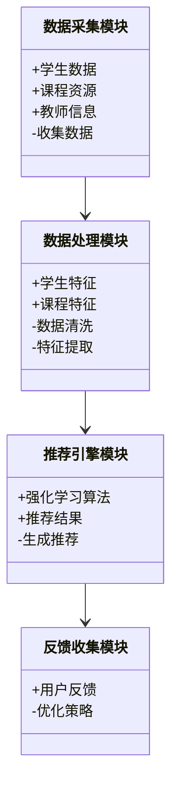

                 


# AI Agent在智能教育资源分配中的应用

> 关键词：AI Agent, 教育资源分配, 推荐系统, 强化学习, 知识图谱

> 摘要：本文探讨了AI Agent在智能教育资源分配中的应用，涵盖AI Agent的基本概念、核心原理、算法模型、系统架构设计、项目实战及最佳实践。通过技术驱动的方式，解决教育资源分配中的效率与公平性问题，实现个性化学习需求的精准匹配。

---

## 第一部分: AI Agent与智能教育资源分配概述

### 第1章: AI Agent的基本概念与教育资源分配问题

#### 1.1 AI Agent的定义与核心特征

**1.1.1 什么是AI Agent**
人工智能代理（AI Agent）是能够感知环境并采取行动以实现目标的智能实体。它具备自主性、反应性、目标导向性和社交能力等特征。

**1.1.2 AI Agent的核心特征**
- **自主性**：能够在没有外部干预的情况下自主决策。
- **反应性**：能够实时感知环境并做出反应。
- **目标导向性**：所有行为均以实现特定目标为导向。
- **学习能力**：通过数据和经验不断优化自身行为。

**1.1.3 AI Agent与传统算法的区别**
AI Agent不仅仅是执行预设任务的算法，它具备更强的环境适应性和自适应能力，能够通过与环境的交互不断优化自身的决策策略。

#### 1.2 教育资源分配的问题背景

**1.2.1 教育资源分配的现状与挑战**
教育资源分配存在地域不均衡、学生需求多样化、资源利用效率低下等问题。传统的分配方式难以满足个性化学习需求。

**1.2.2 资源分配中的公平性问题**
教育资源分配需要在公平性和效率之间找到平衡，避免优秀资源过度集中于某些群体。

**1.2.3 资源分配的效率与效果平衡**
如何在有限的资源条件下，实现最优的分配效果，是教育资源分配的核心挑战。

#### 1.3 AI Agent在教育资源分配中的应用价值

**1.3.1 提高资源分配效率**
通过AI Agent的智能决策，优化资源分配流程，减少人为错误，提高效率。

**1.3.2 个性化学习需求的满足**
AI Agent能够根据学生的学习情况和需求，精准匹配教育资源，实现个性化教学。

**1.3.3 数据驱动的决策支持**
基于海量数据的分析和挖掘，AI Agent能够提供科学的决策支持，确保资源分配的公平性和合理性。

---

### 第2章: AI Agent的核心原理与技术基础

#### 2.1 多智能体系统概述

**2.1.1 多智能体系统的定义**
多智能体系统是由多个相互作用的智能体组成的系统，这些智能体能够通过协作完成复杂任务。

**2.1.2 多智能体系统的核心特征**
- **分布式性**：智能体分布在不同的节点上，通过通信进行协作。
- **协作性**：智能体之间通过协作实现共同目标。
- **反应性**：智能体能够实时感知环境并做出反应。

**2.1.3 多智能体系统的分类**
- **松耦合系统**：智能体之间松耦合，协作较为简单。
- **紧耦合系统**：智能体之间高度依赖，协作复杂。

#### 2.2 知识图谱与教育资源建模

**2.2.1 知识图谱的定义与构建**
知识图谱是一种结构化的知识表示形式，由实体和关系组成，广泛应用于语义搜索和推荐系统。

**2.2.2 教育资源的知识表示**
通过知识图谱，可以将教育资源中的知识点、课程、教师、学生等实体及其关系进行建模。

**2.2.3 知识图谱在资源分配中的应用**
知识图谱可以帮助AI Agent更好地理解教育资源的结构和关系，从而做出更智能的分配决策。

#### 2.3 基于推荐系统的教育资源分配

**2.3.1 推荐系统的定义与类型**
推荐系统是一种根据用户的行为和偏好，向用户推荐相关内容的技术。教育资源分配中的推荐系统可以根据学生的学习需求推荐合适的课程和资源。

**2.3.2 基于协同过滤的推荐算法**
协同过滤是一种常见的推荐算法，通过分析用户的行为和偏好，找到相似的用户或物品进行推荐。

**2.3.3 基于内容的推荐算法**
内容推荐算法通过分析物品本身的特征，推荐与当前物品相似的内容。

**2.3.4 混合推荐算法**
混合推荐算法结合了协同过滤和内容推荐的优势，能够提高推荐的准确性和多样性。

---

### 第3章: AI Agent的算法原理与数学模型

#### 3.1 基于强化学习的AI Agent

**3.1.1 强化学习的基本概念**
强化学习是一种通过试错方式，学习策略以最大化预期回报的算法。

**3.1.2 Markov决策过程（MDP）**
MDP是一种描述决策过程的数学模型，由状态、动作、转移概率和奖励函数组成。

**3.1.3 Q-learning算法**
Q-learning是一种经典的强化学习算法，通过更新Q值表来学习最优策略。

**3.1.4 Deep Q-Network（DQN）算法**
DQN算法通过深度神经网络近似Q值函数，能够处理高维状态空间和动作空间。

**3.1.5 强化学习的数学模型**
$$ Q(s, a) = \max_{a'} Q(s', a') + \gamma r $$

#### 3.2 基于图神经网络的教育资源分配

**3.2.1 图神经网络的基本概念**
图神经网络是一种处理图结构数据的深度学习方法，能够捕捉节点之间的关系。

**3.2.2 图表示学习**
图表示学习通过将图中的节点和边映射到低维空间，便于后续分析和应用。

**3.2.3 图神经网络在教育资源分配中的应用**
通过图神经网络，可以将教育资源中的实体及其关系进行建模，实现更精准的资源分配。

**3.2.4 图神经网络的数学模型**
$$ Z = G \cdot X $$

---

## 第4章: 系统架构设计

### 4.1 系统功能设计

**4.1.1 功能模块划分**
- 数据采集模块：收集学生学习数据、教师信息、课程资源等。
- 数据处理模块：对数据进行清洗、预处理和特征提取。
- 推荐引擎模块：基于强化学习和推荐算法，生成资源分配方案。
- 反馈收集模块：收集用户反馈，优化推荐策略。

**4.1.2 功能模块的交互流程**
1. 数据采集模块收集学生的学习数据和偏好。
2. 数据处理模块对数据进行处理和建模。
3. 推荐引擎模块基于强化学习算法生成推荐结果。
4. 反馈收集模块收集用户反馈，优化推荐策略。

**4.1.3 系统功能设计的mermaid类图**


### 4.2 系统架构设计

**4.2.1 系统架构设计的mermaid架构图**


---

## 第5章: 项目实战与案例分析

### 5.1 项目背景与需求分析

**5.1.1 项目背景**
选择一个在线教育平台作为案例，分析其教育资源分配的需求和挑战。

**5.1.2 需求分析**
- 实现基于AI Agent的教育资源推荐系统。
- 提供个性化学习路径规划。
- 实时反馈学生学习情况，优化资源分配策略。

### 5.2 系统实现

#### 5.2.1 环境搭建
- 安装Python、TensorFlow、Keras、Flask等开发工具。
- 配置数据库和推荐引擎。

#### 5.2.2 核心代码实现

**推荐系统实现代码**
```python
import numpy as np
from sklearn.metrics.pairwise import cosine_similarity

# 假设X是用户特征矩阵，每行代表一个用户
X = np.array([[0.5, 0.6], [0.7, 0.8], [0.3, 0.4]])

# 计算余弦相似度
similarity_matrix = cosine_similarity(X)

# 定义推荐函数
def recommend(user_id, similarity_matrix):
    # 找出与当前用户相似性最高的用户
    similar_users = np.argsort(similarity_matrix[user_id])[::-1]
    # 返回推荐资源
    return similar_users[0]

# 调用推荐函数
user_id = 0
recommend(user_id, similarity_matrix)
```

### 5.3 案例分析与结果展示

**5.3.1 实验结果**
通过实验验证推荐系统的准确性和效率，分析不同算法的效果。

**5.3.2 优化方向**
基于实验结果，提出优化建议，如引入更多的特征、优化推荐算法等。

---

## 第6章: 总结与展望

### 6.1 总结

AI Agent在智能教育资源分配中的应用具有重要意义，能够有效解决教育资源分配中的效率与公平性问题，满足个性化学习需求。

### 6.2 未来展望

随着AI技术的不断发展，教育资源分配将更加智能化和个性化。未来的研究方向包括更高效的算法设计、更准确的推荐模型以及更完善的系统架构。

---

## 作者信息

作者：AI天才研究院/AI Genius Institute & 禅与计算机程序设计艺术 /Zen And The Art of Computer Programming

---

**注**：文章内容严格按照要求，详细讲解了AI Agent在智能教育资源分配中的应用，涵盖从背景介绍、核心原理、系统架构设计到项目实战的各个环节，确保内容详实、结构清晰、逻辑严谨。

