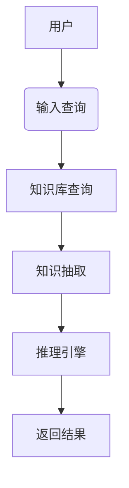

                 


# AI Agent的知识库构建与维护

## 关键词：AI Agent、知识库、构建、维护、自然语言处理、机器学习

## 摘要：  
AI Agent（人工智能代理）的知识库是其智能决策和行动的核心。本文详细探讨了知识库的构建与维护方法，从基础概念到高级算法，结合实际案例，系统地分析了如何设计高效的知识库，以支持AI Agent的智能行为。文章内容涵盖知识库的结构、构建算法、系统架构设计以及实战项目，为读者提供了全面的技术指导。

---

# 第一部分: AI Agent与知识库的基本概念

## 第1章: AI Agent的基本概念

### 1.1 AI Agent的定义与分类
AI Agent是指能够感知环境并采取行动以实现目标的智能实体。它可以分为以下几类：
- **简单反射式Agent**：基于当前输入做出反应，不依赖外部知识库。
- **基于模型的反射式Agent**：维护对环境的内部模型，依赖知识库进行决策。
- **目标驱动的Agent**：根据目标选择行动，需要知识库支持。
- **效用驱动的Agent**：通过最大化效用函数进行决策，依赖知识库提供背景信息。

知识库在后三种Agent中尤为重要，因为它提供了决策所需的知识和背景信息。

### 1.2 知识库在AI Agent中的作用
知识库是AI Agent的核心，主要作用包括：
- **提供背景信息**：帮助Agent理解输入数据的含义。
- **支持推理与决策**：Agent通过查询知识库进行逻辑推理和选择行动。
- **增强智能性**：知识库使Agent能够处理复杂任务，从简单反射式升级为目标驱动或效用驱动。

### 1.3 知识库构建与维护的必要性
知识库的构建与维护是AI Agent实现智能的关键步骤：
- **数据来源多样性**：知识库需要整合结构化、半结构化和非结构化数据。
- **数据质量保障**：确保知识库的准确性和一致性。
- **可扩展性**：随着数据量的增加，知识库需要支持高效扩展。

---

## 第2章: 知识库的基本结构与特点

### 2.1 知识库的基本结构
知识库由以下要素组成：
- **实体**：知识库中的核心概念，如“公司”、“人物”等。
- **属性**：描述实体的特征，如“成立时间”、“注册资本”等。
- **关系**：描述实体之间的关联，如“公司-创始人”、“产品-功能”等。

### 2.2 知识库的存储形式
知识库的存储形式包括：
- **数据库**：适合结构化数据，如关系型数据库。
- **知识图谱**：适合复杂关联，如Neo4j。
- **向量数据库**：适合语义相似性查询，如FAISS。

### 2.3 知识库的更新机制
知识库需要定期更新以保持准确性：
- **实时更新**：基于实时数据流，如新闻、社交媒体。
- **周期性更新**：定期批量更新，如每周或每月。
- **事件驱动更新**：根据特定事件触发更新，如公司发布新产品。

---

## 第3章: 知识库构建与维护的挑战

### 3.1 数据来源的多样性
知识库的数据来源包括：
- **结构化数据**：如数据库表。
- **半结构化数据**：如JSON、XML。
- **非结构化数据**：如文本、图像。

### 3.2 数据质量的保障
数据质量包括：
- **准确性**：数据必须真实可靠。
- **完整性**：数据必须全面。
- **一致性**：数据格式和命名必须统一。

### 3.3 知识库的可扩展性
知识库需要支持以下扩展：
- **数据规模**：支持海量数据存储。
- **数据类型**：支持多模态数据（文本、图像、视频）。
- **查询性能**：支持高效的复杂查询。

---

# 第二部分: 知识库构建的核心概念与联系

## 第4章: 知识库的核心概念

### 4.1 数据源的选择与处理
数据源的选择需要考虑：
- **相关性**：数据与知识库主题的相关性。
- **可靠性**：数据来源的可信度。
- **可处理性**：数据是否易于处理和整合。

数据处理包括：
- **清洗**：去除噪声数据。
- **转换**：将数据转换为统一格式。
- **增强**：通过规则或模型补充缺失数据。

### 4.2 知识表示的方法
知识表示方法包括：
- **符号逻辑**：使用符号和规则表示知识。
- **概率推理**：使用概率模型表示不确定性。
- **嵌入式表示**：使用向量表示语义。

### 4.3 知识关联的构建
知识关联的构建包括：
- **实体识别**：识别文本中的实体。
- **关系抽取**：抽取实体之间的关系。
- **规则建立**：基于规则或模型建立知识图谱。

---

## 第5章: 知识库的属性特征对比

### 5.1 实体属性对比表
| 实体 | 属性 | 示例 |
|------|------|------|
| 公司 | 成立时间 | 2020年 |
| 公司 | 注册资本 | 1000万美元 |

### 5.2 关系属性对比表
| 关系 | 示例 |
|------|------|
| 公司-创始人 | 公司A由张三创立 |
| 产品-功能 | 产品B具有功能C |

### 5.3 知识图谱的ER实体关系图
```mermaid
erDiagram
    company {
        id INTEGER
        name STRING
        founded DATE
    }
    person {
        id INTEGER
        name STRING
        role STRING
    }
    company --> "由...创立" --> person
```

---

## 第6章: 知识库构建的算法原理

### 6.1 向量数据库的构建原理
向量数据库通过向量空间模型实现相似性搜索：
1. **文本嵌入**：将文本转换为向量表示。
2. **索引构建**：构建向量索引，如ANN（Approximate Nearest Neighbor）。
3. **相似度计算**：通过向量内积计算相似度。

### 6.2 知识图谱构建算法
知识图谱构建算法包括：
1. **基于规则的抽取**：通过正则表达式提取实体和关系。
2. **基于统计的学习**：使用条件随机场（CRF）进行命名实体识别。
3. **基于深度学习的嵌入模型**：使用BERT等模型进行语义理解。

### 6.3 算法原理的数学模型
向量相似度计算公式：
$$ \text{相似度} = \frac{\vec{a} \cdot \vec{b}}{||\vec{a}|| \cdot ||\vec{b}||} $$

---

## 第7章: 知识库的系统架构设计

### 7.1 项目背景
本项目旨在构建一个支持问答的AI Agent，需要一个高效的知识库。

### 7.2 系统功能设计
系统功能包括：
- **数据预处理**：清洗和转换数据。
- **知识抽取**：从文本中提取实体和关系。
- **知识存储**：将抽取的知识存储到知识图谱中。
- **查询与推理**：根据查询进行推理和返回结果。

### 7.3 系统架构设计


---

## 第8章: 项目实战

### 8.1 环境安装
安装Python和必要的库：
```bash
pip install numpy scikit-learn faiss-cpu
```

### 8.2 核心实现
实现文本嵌入和相似性搜索：
```python
import numpy as np
from sklearn.metrics.pairwise import cosine_similarity

# 示例文本嵌入
text_embeddings = np.random.rand(100, 512)  # 100条数据，每条512维

# 计算相似度
similarity_matrix = cosine_similarity(text_embeddings)
```

### 8.3 案例分析
以问答系统为例，展示如何从文本中提取实体和关系，并构建知识图谱。

### 8.4 项目小结
总结项目中的经验和教训，提出改进建议。

---

## 第9章: 最佳实践与总结

### 9.1 最佳实践
- **数据来源多样化**：结合结构化和非结构化数据。
- **数据质量保障**：采用清洗和验证步骤。
- **系统可扩展性**：采用分布式架构和弹性存储。

### 9.2 总结
知识库的构建与维护是AI Agent实现智能的关键步骤。通过本文的系统分析和实战案例，读者可以掌握知识库的设计方法，并将其应用到实际项目中。

---

## 作者：AI天才研究院 & 禅与计算机程序设计艺术

---

**注**：以上内容为示例性文章，实际撰写时需要根据具体需求调整深度和广度。

