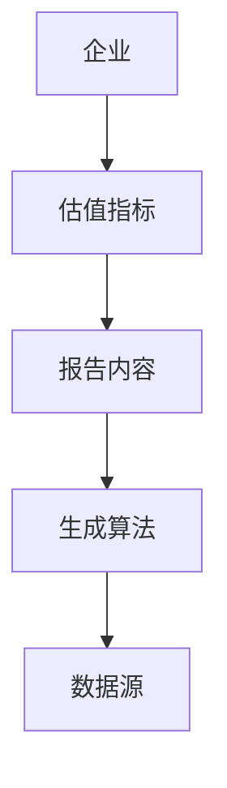
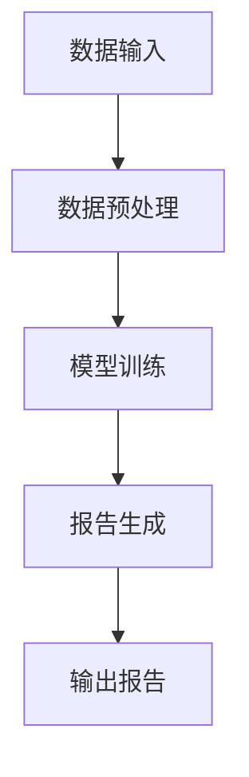

                 

# 目录大纲：《AI辅助的企业估值报告自动生成》

---

# 第一部分: AI辅助的企业估值背景与核心概念

## 第1章: AI辅助企业估值的背景与问题背景

### 1.1 企业估值的传统方法与挑战
- **传统企业估值方法的局限性**
  - 简要介绍传统企业估值方法，如DCF模型、市盈率法等。
  - 分析这些方法在实际应用中的局限性，例如数据收集困难、计算复杂、主观性高等。
  
- **AI如何改变企业估值领域**
  - 解释AI技术如何通过自动化数据处理、模式识别和预测模型提升企业估值的效率和准确性。
  - 举例说明AI在企业估值中的具体应用，如利用机器学习模型预测企业未来现金流。

- **当前AI辅助企业估值的应用现状**
  - 描述市场上已有的AI辅助企业估值工具和平台。
  - 分析这些工具的优缺点及市场接受度。

### 1.2 AI辅助的核心概念与定义
- **AI辅助的定义**
  - 明确AI辅助的含义，强调其作为辅助工具的角色，而非完全替代人类。
  
- **企业估值的关键要素**
  - 详细列出企业估值的核心要素，如财务数据、市场环境、行业趋势等。
  
- **AI辅助企业估值的目标**
  - 提供更高效、更准确的企业估值方法。
  - 实现企业估值报告的自动生成，减少人工干预。

### 1.3 问题背景与目标
- **问题背景**
  - 解释为什么需要AI辅助企业估值，如数据量的爆炸式增长、企业复杂性增加等。
  
- **问题解决的目标**
  - 明确希望通过AI技术实现的具体目标，如提高估值效率、降低人为错误等。
  
- **问题的边界与外延**
  - 说明AI辅助企业估值的适用范围和限制，避免超出现实可行性的范围。

## 第2章: 核心概念与概念模型

### 2.1 核心概念解析
- **企业估值的基本概念**
  - 解释企业估值的基本定义和目的。
  
- **AI辅助的定义与特征**
  - 描述AI辅助的特征，如自动化、智能化、可扩展性等。
  
- ** 自动生成报告的实现机制**
  - 解释如何利用AI技术自动生成企业估值报告，包括数据输入、模型训练、报告生成等步骤。

### 2.2 核心概念的ER实体关系图

### 2.3 核心概念的属性特征对比表
| 概念       | 属性特征               |
|------------|------------------------|
| 企业估值   | 数据驱动、多维度分析   |
| AI辅助     | 自动化、智能化、可扩展性 |
| 自动生成    | 实时性、准确性、可定制性 |

## 第3章: 企业估值与AI辅助的核心原理

### 3.1 企业估值的基本原理
- **企业估值的数学模型**
  - 介绍常见的企业估值模型，如DCF模型（折现现金流模型）。
  - 解释这些模型的数学公式和计算步骤。
  
- **估值指标的计算方法**
  - 详细说明如何计算市盈率、市净率、EV/EBITDA等关键指标。
  - 提供计算公式的数学表达式。
  
- **企业财务数据的分析方法**
  - 讨论如何从财务报表中提取关键数据，如收入、利润、现金流等。
  - 解释如何利用这些数据进行综合分析。

### 3.2 AI辅助的核心原理
- **自然语言处理在报告生成中的应用**
  - 介绍NLP技术在自动解析财务报告中的应用。
  - 解释如何利用NLP生成结构化的报告内容。
  
- **机器学习在估值预测中的应用**
  - 介绍机器学习算法，如回归分析、随机森林等。
  - 解释如何利用这些算法预测企业未来的表现。
  
- **深度学习在报告自动生成中的应用**
  - 介绍深度学习模型，如GPT-3、BERT等。
  - 解释如何利用这些模型生成自然流畅的报告内容。

### 3.3 核心原理的系统架构

---

# 第二部分: AI辅助企业估值的算法原理

## 第4章: 算法原理与实现

### 4.1 算法原理概述
- **算法选择与优化**
  - 选择适合企业估值的算法，如随机森林、支持向量机等。
  - 讨论如何优化算法以提高准确性和效率。
  
- **数据预处理方法**
  - 介绍数据清洗、特征选择、数据增强等技术。
  - 提供Python代码示例，展示如何处理财务数据。

### 4.2 深度学习模型的应用
- **GPT-3模型的结构与特点**
  - 详细描述GPT-3的架构，包括层数、参数数量等。
  - 讨论其在自然语言生成中的优势。
  
- **模型训练与调优**
  - 解释如何训练自定义的企业估值模型。
  - 提供Python代码示例，展示如何使用TensorFlow或PyTorch进行模型训练。

### 4.3 生成报告的机制
- **生成报告的流程**
  - 描述从数据输入到最终报告生成的完整流程。
  - 使用Mermaid图展示流程图。
  
- **生成报告的优化技巧**
  - 讨论如何优化生成的报告，使其更符合人类阅读习惯。
  - 提供案例分析，展示优化前后的对比。

---

# 第三部分: 系统架构与实现

## 第5章: 系统架构设计

### 5.1 系统功能设计
- **功能模块划分**
  - 介绍系统的各个功能模块，如数据采集模块、模型训练模块、报告生成模块等。
  - 使用Mermaid图展示类图和架构图。
  
- **系统交互设计**
  - 描述用户与系统之间的交互流程。
  - 使用Mermaid图展示序列图，说明各模块之间的协作。

### 5.2 系统接口设计
- **API接口设计**
  - 介绍系统的API接口，如数据接口、模型调用接口等。
  - 提供Python代码示例，展示如何调用API进行企业估值。

- **数据接口设计**
  - 描述如何与外部数据源（如财务数据库、市场数据源）进行对接。
  - 提供接口文档，说明数据格式和调用方式。

---

# 第四部分: 项目实战与应用

## 第6章: 项目实战

### 6.1 项目环境安装
- **安装Python环境**
  - 指导读者如何安装Python和必要的库，如pandas、numpy、scikit-learn等。
  
- **安装AI框架**
  - 指导读者安装TensorFlow或PyTorch框架。

### 6.2 核心代码实现
- **数据预处理代码**
  - 提供Python代码示例，展示如何清洗和处理财务数据。
  
- **模型训练代码**
  - 提供Python代码示例，展示如何训练机器学习模型。
  
- **报告生成代码**
  - 提供Python代码示例，展示如何利用模型生成企业估值报告。

### 6.3 实际案例分析
- **案例选择**
  - 选择一个具体的企业，如一家科技公司，进行案例分析。
  
- **案例分析与解读**
  - 详细解读如何利用AI技术生成该公司的估值报告。
  - 比较传统方法和AI辅助方法的优劣。

## 第7章: 项目小结与优化

### 7.1 项目小结
- **项目实现的成果**
  - 总结通过项目实现的成果，如成功生成企业估值报告等。
  
- **项目实现的挑战**
  - 分析项目过程中遇到的挑战，如数据质量问题、模型调优难度等。

### 7.2 项目优化建议
- **优化方向**
  - 提供优化建议，如改进模型结构、优化数据预处理流程等。
  
- **未来展望**
  - 展望AI技术在企业估值中的未来应用，如多模态模型的应用、实时估值等。

---

# 第五部分: 最佳实践与注意事项

## 第8章: 最佳实践与注意事项

### 8.1 最佳实践
- **数据质量管理**
  - 强调数据质量的重要性，提供数据清洗的建议。
  
- **模型调优技巧**
  - 提供模型调优的技巧，如交叉验证、超参数优化等。
  
- **报告生成的优化**
  - 提供如何优化生成报告的建议，如结构化报告内容、增加可视化元素等。

### 8.2 注意事项
- **数据隐私与安全**
  - 提醒读者注意数据隐私和安全问题，特别是在处理企业财务数据时。
  
- **模型的可解释性**
  - 强调模型可解释性的重要性，特别是在企业决策中。

## 第9章: 小结与展望

### 9.1 小结
- **总结全文**
  - 总结全文的主要内容和观点，强调AI技术在企业估值中的巨大潜力。
  
- **实现的关键点**
  - 回顾实现过程中关键的技术点，如数据预处理、模型选择、报告生成等。

### 9.2 展望
- **AI技术的发展**
  - 展望AI技术在企业估值中的未来发展趋势，如更复杂的模型、更广泛的应用场景等。
  
- **个人的未来工作方向**
  - 提供未来工作的方向，如研究更先进的模型、探索新的应用场景等。

---

# 作者信息

**作者：AI天才研究院/AI Genius Institute & 禅与计算机程序设计艺术 /Zen And The Art of Computer Programming**

---

**备注：**

以上是一个详细的目录大纲，涵盖从理论到实践的各个方面，确保内容详实、逻辑清晰。每一章都包含必要的小节和详细的内容说明，帮助读者逐步理解和掌握AI辅助企业估值报告自动生成的核心技术和实际应用。

