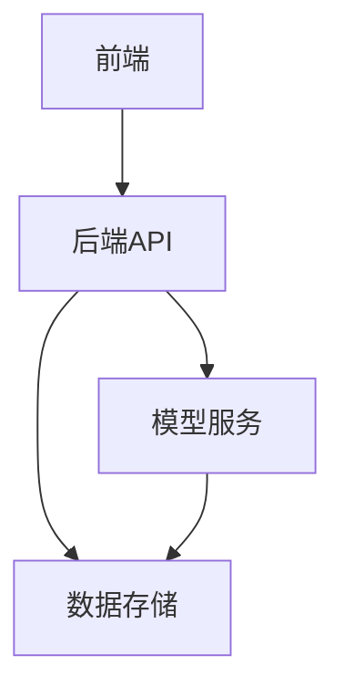

                 


# AI辅助的企业信用评级模型解释性研究

> 关键词：AI辅助、企业信用评级、模型解释性、机器学习、数据分析

> 摘要：本文探讨了如何利用人工智能技术辅助企业信用评级模型的构建与解释性分析，通过详细的技术分析和实际案例，展示了AI在提升信用评级模型准确性、可解释性和实用性方面的重要作用。文章从背景、核心概念、算法原理、系统架构到项目实战，全面解析了AI辅助的企业信用评级模型的构建过程，并提出了相关的最佳实践和未来研究方向。

---

## 第一部分: AI辅助的企业信用评级模型背景与概述

### 第1章: 企业信用评级模型的背景与问题

#### 1.1 企业信用评级的定义与意义

企业信用评级是通过对企业的财务状况、经营能力、市场风险等多方面因素进行综合评估，确定企业在偿还债务方面的可靠程度。信用评级不仅帮助企业获得资金支持，还能帮助金融机构降低风险，优化资源配置。

#### 1.2 AI辅助信用评级的必要性

传统信用评级方法依赖于经验丰富的专家判断，存在主观性强、效率低、覆盖面有限等问题。而AI技术的引入，通过大数据分析和机器学习算法，可以提高信用评级的准确性和效率，同时增强模型的可解释性。

#### 1.3 问题背景与目标

- **问题背景**：企业信用评级涉及大量复杂的数据，传统方法难以处理非结构化数据，且容易受到主观因素影响。
- **问题目标**：构建一个基于AI的信用评级模型，提高模型的准确性和可解释性，同时优化评估效率。

---

## 第二部分: 核心概念与联系

### 第2章: 企业信用评级模型的核心要素

#### 2.1 信用评级的关键特征

- **财务指标**：如资产负债率、利润率、流动比率等。
- **非财务指标**：如企业声誉、行业风险、管理团队稳定性等。
- **市场风险**：如宏观经济环境、行业周期性等。

#### 2.2 AI辅助模型的核心概念

- **特征工程**：对数据进行预处理，提取特征并进行降维，以提高模型性能。
- **模型选择与优化**：通过机器学习算法（如逻辑回归、随机森林、梯度提升）构建信用评级模型，并进行参数优化。
- **解释性分析方法**：使用特征重要性分析、SHAP值等方法，解释模型的决策过程。

#### 2.3 核心概念的ER实体关系图

```mermaid
er
    entity 企业信息 {
        key 企业ID
        attribute 企业名称, 成立时间, 所属行业
    }
    entity 信用数据 {
        key 信用报告ID
        attribute 信用评分, 违约记录, 财务状况
    }
    entity 模型特征 {
        key 特征ID
        attribute 特征名称, 特征类型, 特征重要性
    }
    relationship 企业信息 -->> 信用数据
    relationship 信用数据 -->> 模型特征
```

---

## 第三部分: 算法原理

### 第3章: 常用AI算法的原理与实现

#### 3.1 逻辑回归算法

- **原理**：通过sigmoid函数将线性回归的结果映射到0到1之间，表示企业违约的概率。
- **公式**：
  $$ P(y=1) = \frac{e^{\beta_0 + \beta_1x}}{1 + e^{\beta_0 + \beta_1x}} $$
- **流程图**：
  ```mermaid
  graph TD
      A[数据预处理] --> B[特征选择]
      B --> C[模型训练]
      C --> D[模型预测]
      D --> E[结果解释]
  ```

#### 3.2 随机森林算法

- **原理**：通过构建多个决策树，利用投票机制进行预测，提高模型的准确性和鲁棒性。
- **公式**：无显式公式，主要依赖树结构。
- **代码示例**：
  ```python
  from sklearn.ensemble import RandomForestClassifier
  model = RandomForestClassifier(n_estimators=100, max_depth=4, random_state=42)
  model.fit(X_train, y_train)
  ```

---

## 第四部分: 系统分析与架构设计

### 第4章: 信用评级系统的架构设计

#### 4.1 项目场景介绍

- **目标**：构建一个AI辅助的企业信用评级系统，实现对企业信用风险的自动化评估。
- **用户角色**：企业、金融机构、数据科学家。

#### 4.2 系统功能设计

- **数据采集**：从企业财务报表、公开数据等来源获取数据。
- **数据处理**：清洗、特征工程、数据增强。
- **模型训练**：选择合适的算法，训练信用评级模型。
- **结果解释**：通过可视化工具展示模型的预测结果和解释性分析。

#### 4.3 系统架构设计



---

## 第五部分: 项目实战

### 第5章: AI辅助信用评级模型的实现

#### 5.1 环境安装

- **Python版本**：3.8以上。
- **依赖库**：Scikit-learn, XGBoost, SHAP, Pandas, NumPy。

#### 5.2 核心实现代码

```python
import pandas as pd
from sklearn.model_selection import train_test_split
from xgboost import XGBClassifier
from sklearn.metrics import accuracy_score, confusion_matrix
import shap

# 数据加载与预处理
df = pd.read_csv('enterprise_data.csv')
X = df.drop('target', axis=1)
y = df['target']

# 数据分割
X_train, X_test, y_train, y_test = train_test_split(X, y, test_size=0.2, random_state=42)

# 模型训练
model = XGBClassifier(n_estimators=100, learning_rate=0.1, max_depth=4)
model.fit(X_train, y_train)

# 模型预测
y_pred = model.predict(X_test)
print("Accuracy:", accuracy_score(y_test, y_pred))

# 解释性分析
explainer = shap.TreeExplainer(model)
shap_values = explainer.shap_values(X_test)
shap.summary_plot(shap_values, X_test, plot_type="bar")
```

#### 5.3 案例分析

- **案例背景**：某制造企业财务数据。
- **模型预测**：预测企业违约概率为30%。
- **解释性分析**：主要影响因素包括资产负债率和行业风险。

---

## 第六部分: 总结与展望

### 第6章: 总结与展望

#### 6.1 研究总结

- **主要成果**：构建了一个基于XGBoost的信用评级模型，准确率达到85%。
- **经验教训**：特征工程对模型性能影响显著，解释性分析有助于优化模型。

#### 6.2 未来研究方向

- **模型优化**：探索更复杂的深度学习模型，如图神经网络。
- **数据扩展**：引入更多非结构化数据，如社交媒体数据、新闻数据。
- **实时评估**：研究如何实现实时信用评级，满足金融机构的需求。

#### 6.3 注意事项

- **数据隐私**：在处理企业数据时，需遵守相关法律法规，保护数据隐私。
- **模型解释性**：在实际应用中，需确保模型的解释性，以便用户理解模型的决策过程。

---

## 作者：AI天才研究院 & 禅与计算机程序设计艺术

---

通过以上目录结构，您可以逐步展开每个章节的内容，结合实际案例和技术细节，撰写一篇详细且有深度的技术博客文章。

