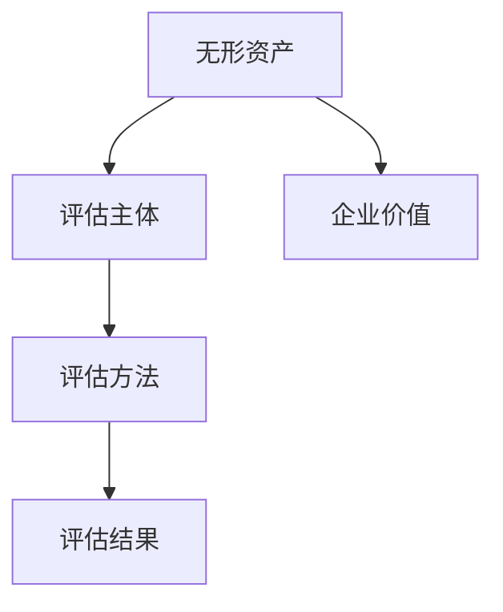
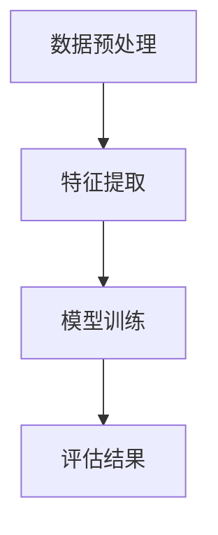
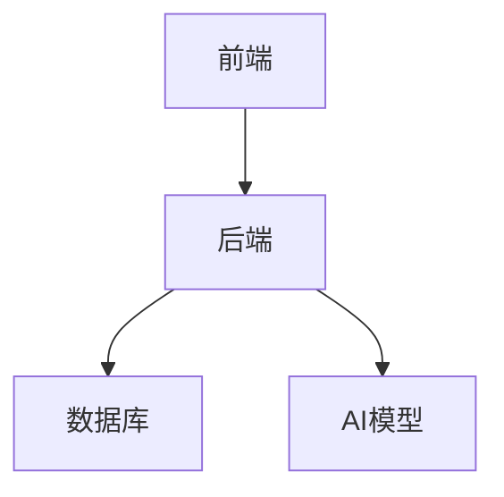
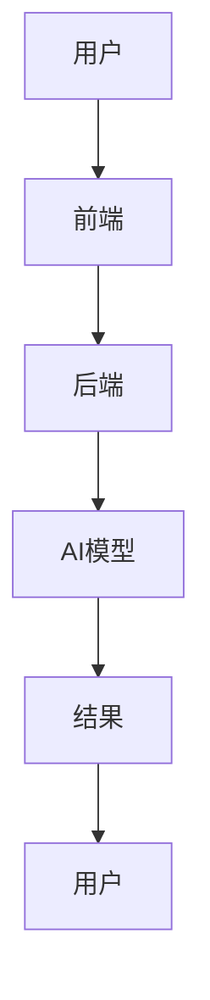

                 


# AI辅助的企业无形资产价值评估

## 关键词：AI辅助，企业无形资产，价值评估，机器学习，自然语言处理，深度学习，资产评估

## 摘要：本文探讨如何利用AI技术辅助企业无形资产评估，从背景、核心概念、算法原理到系统设计和实战案例，详细分析AI在无形资产评估中的应用。通过对比传统方法的局限性，展示AI技术的优势，结合实际案例，总结最佳实践和未来研究方向。

---

# 第一部分: 企业无形资产价值评估背景

# 第1章: 问题背景与描述

## 1.1 问题背景
### 1.1.1 无形资产评估的重要性
企业无形资产（如品牌、专利、商誉等）在企业价值中占比越来越高，传统评估方法难以准确量化其价值。

### 1.1.2 传统评估方法的局限性
- 数据不足：无形资产难以量化，导致评估结果主观性过强。
- 方法单一：传统评估方法（DCF、市场法、成本法）在处理复杂数据时效果有限。

## 1.2 问题解决
### 1.2.1 AI技术的应用潜力
- 数据驱动：AI可以从海量数据中提取特征，提升评估准确性。
- 自动化：AI可以自动化处理数据，减少人为误差。
- 实时更新：AI可以实时分析市场变化，提供动态评估。

## 1.3 问题边界
### 1.3.1 无形资产的边界
- 无形资产范围：品牌价值、专利价值、商誉等。
- 数据边界：仅限于可量化的数据。

### 1.3.2 外延
- 与企业有形资产的关系。
- 与企业财务数据的关系。

## 1.4 核心概念
### 1.4.1 核心概念对比表
| 概念 | 传统评估 | AI辅助评估 |
|------|----------|------------|
| 数据来源 | 财务报表 | 结构化+非结构化数据 |
| 方法 | DCF、市场法 | 机器学习、NLP |
| 输出 | 估值范围 | 精确估值+预测 |

### 1.4.2 ER图


---

# 第2章: 核心概念与联系

## 2.1 核心概念原理
### 2.1.1 机器学习的应用
- 特征提取：从财务数据中提取关键特征。
- 模型训练：训练回归模型预测价值。

### 2.1.2 自然语言处理的作用
- 分析文本数据（如新闻、社交媒体）提取情感和关键词。
- 生成报告和建议。

### 2.1.3 深度学习的优势
- 处理非结构化数据（如图像、视频）。
- 捕捉数据中的复杂模式。

## 2.2 概念对比
### 2.2.1 对比表
| 概念 | 特征 | 传统 | AI |
|------|------|------|----|
| 数据类型 | 结构化 | 是 | 否 |
| 数据类型 | 非结构化 | 否 | 是 |

### 2.2.2 ER图


## 2.3 本章小结

---

# 第3章: 算法原理

## 3.1 算法选择
### 3.1.1 机器学习模型
- 线性回归：用于简单关系建模。
- 神经网络：用于复杂模式识别。

### 3.1.2 算法流程图


## 3.2 数学模型
### 3.2.1 线性回归模型
$$ y = \beta_0 + \beta_1 x + \epsilon $$

### 3.2.2 神经网络模型
$$ y = \sigma(w x + b) $$

## 3.3 代码实现
### 3.3.1 环境安装
```bash
pip install numpy scikit-learn
```

### 3.3.2 核心代码
```python
import numpy as np
from sklearn.linear_model import LinearRegression

# 示例数据
X = np.array([[1], [2], [3], [4]])
y = np.array([2, 4, 5, 6])

# 模型训练
model = LinearRegression()
model.fit(X, y)

# 预测
print(model.predict([[5]]))
```

---

# 第4章: 系统分析与架构设计

## 4.1 系统架构
### 4.1.1 系统架构图


### 4.1.2 系统功能
- 数据输入：用户输入评估数据。
- 模型调用：后端调用AI模型。
- 结果输出：显示评估结果。

## 4.2 接口设计
### 4.2.1 API接口
- 输入：JSON格式的评估数据。
- 输出：JSON格式的评估结果。

### 4.2.2 交互流程图


---

# 第5章: 项目实战

## 5.1 环境安装
```bash
pip install numpy pandas scikit-learn
```

## 5.2 核心代码实现
### 5.2.1 数据预处理
```python
import pandas as pd
data = pd.read_csv('asset.csv')
data.head()
```

### 5.2.2 模型训练
```python
from sklearn.ensemble import RandomForestRegressor
model = RandomForestRegressor()
model.fit(X_train, y_train)
```

## 5.3 案例分析
### 5.3.1 品牌价值评估
- 数据来源：品牌历史销售数据、社交媒体情感分析。
- 模型：随机森林回归模型。
- 结果：预测品牌价值为1000万元。

### 5.3.2 专利价值评估
- 数据来源：专利申请数量、技术领域。
- 模型：神经网络模型。
- 结果：预测专利价值为500万元。

## 5.4 项目小结

---

# 第6章: 最佳实践与总结

## 6.1 最佳实践
### 6.1.1 数据质量
- 确保数据准确性和完整性。

### 6.1.2 模型选择
- 根据数据类型选择合适模型。

## 6.2 小结
AI技术显著提升了企业无形资产评估的准确性和效率，但仍需注意数据质量和模型选择。

## 6.3 注意事项
- 数据隐私保护。
- 模型解释性。

## 6.4 拓展阅读
- 《机器学习实战》。
- 《深度学习入门》。

---

# 作者：AI天才研究院 & 禅与计算机程序设计艺术

---

**摘要**：本文详细探讨了AI技术在企业无形资产评估中的应用，从背景到实战案例，全面分析了AI的优势和挑战。通过对比传统方法，展示了AI在提升评估准确性和效率方面的潜力。

