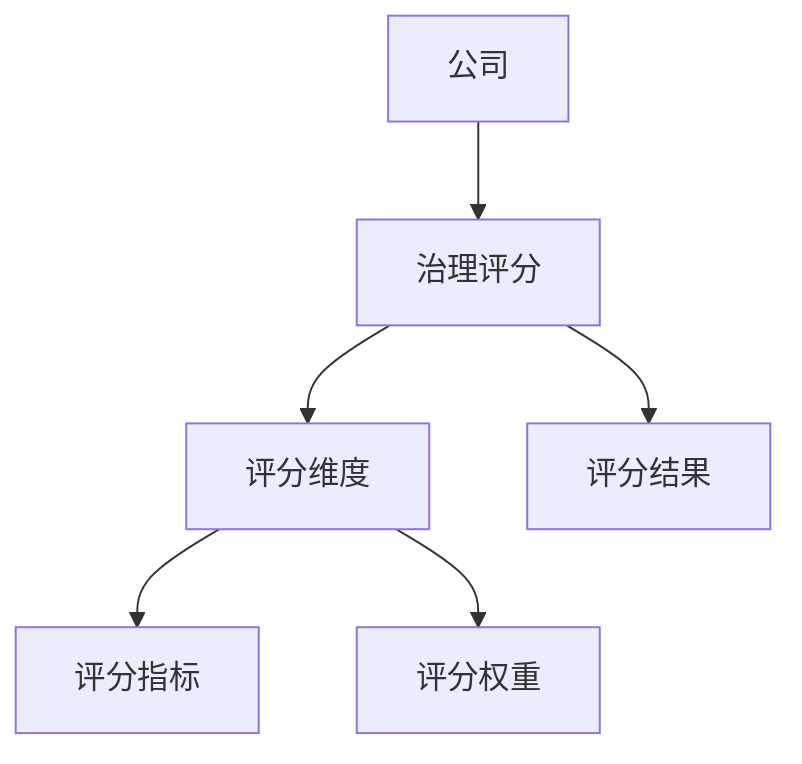
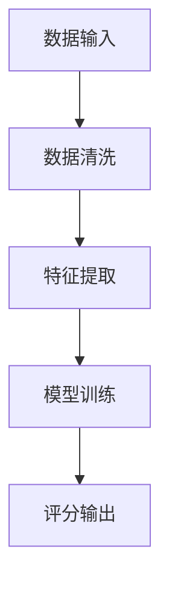
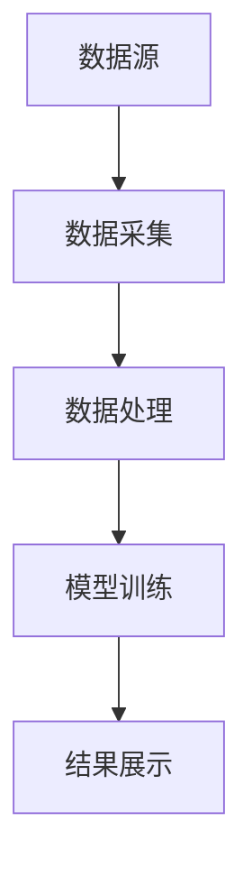

                 


# AI辅助的公司治理评分系统

## 关键词：公司治理，AI辅助，评分系统，机器学习，企业风险管理

## 摘要：  
随着人工智能技术的飞速发展，公司治理的评分系统也在不断进化。传统的公司治理评分方法往往依赖于人工分析和经验判断，存在效率低、主观性强、覆盖范围有限等问题。本文将深入探讨如何利用AI技术构建一个高效、客观、智能化的公司治理评分系统，通过多维度数据的整合与分析，帮助企业更好地识别风险、优化管理、提升绩效。本文将从背景与概念、核心算法、系统架构、项目实战等多个维度展开分析，全面展示AI在公司治理评分中的巨大潜力与实际应用价值。

---

## 第1章: 公司治理与AI辅助评分系统概述

### 1.1 公司治理的基本概念
#### 1.1.1 公司治理的定义与核心要素
公司治理是企业管理和监督的体系，主要关注董事会、高管团队、股东、利益相关者之间的权利、责任和义务的分配与协调。其核心要素包括：
- 股东权利
- 董事会结构与职责
- 高管团队的监督与激励机制
- 透明度与信息披露
- 风险管理与内部控制

#### 1.1.2 公司治理的现状与问题
当前公司治理面临的主要问题包括：
- 信息不对称：股东与管理层之间的信息不对称导致监督困难。
- 监管滞后：传统的监管手段往往依赖于事后检查，难以及时发现和解决问题。
- 数据孤岛：企业内部数据分散在不同部门，难以整合和分析。
- 主观性过强：传统评分方法依赖人工判断，主观性强，缺乏客观依据。

#### 1.1.3 AI在公司治理中的应用潜力
AI技术可以通过以下方式提升公司治理的效率和准确性：
- 自动化数据收集与分析：AI可以实时整合企业内外部数据，生成全面的治理评分。
- 智能预测：通过机器学习模型预测潜在风险，提前采取应对措施。
- 个性化建议：AI可以根据企业的具体情况提供定制化的治理优化建议。

---

### 1.2 AI辅助评分系统的背景与意义
#### 1.2.1 传统公司治理评分的局限性
传统公司治理评分方法通常依赖于人工调查和主观判断，存在以下问题：
- 时间成本高：需要大量人工收集和分析数据。
- 主观性较强：评分结果容易受到评估者主观因素的影响。
- 覆盖范围有限：难以全面考虑企业的多维度数据。

#### 1.2.2 AI技术在评分系统中的优势
AI技术的应用为公司治理评分系统带来了以下优势：
- 高效性：AI可以快速处理海量数据，生成实时评分。
- 客观性：通过算法模型进行评分，减少人为主观因素的影响。
- 全面性：AI可以整合企业内外部的多维度数据，提供更全面的评估结果。

#### 1.2.3 AI辅助评分系统的应用场景
AI辅助公司治理评分系统可以应用于以下几个场景：
- 企业风险管理：通过分析企业财务数据、市场表现等，识别潜在风险。
- 股东价值提升：帮助股东更好地评估企业的治理状况，做出投资决策。
- 内部优化：为企业管理层提供改进建议，优化公司治理结构。

---

## 第2章: AI辅助公司治理评分系统的核心概念与联系

### 2.1 核心概念原理
#### 2.1.1 数据驱动的公司治理评分
AI辅助的公司治理评分系统依赖于多源数据的整合与分析，包括：
- 财务数据：收入、利润、资产负债表等。
- 市场数据：股价、市值、行业排名等。
- 企业行为数据：董事会决策、高管变动、并购活动等。
- 企业社会责任数据：环保表现、员工满意度、社会声誉等。

#### 2.1.2 AI算法在评分中的作用
AI算法通过以下方式提升评分的准确性和效率：
- 数据清洗与特征提取：去除噪声数据，提取关键特征。
- 模型训练：使用机器学习算法（如随机森林、神经网络）训练评分模型。
- 模型优化：通过交叉验证等方法优化模型参数。

#### 2.1.3 多维度评分模型构建
评分模型通常包含多个维度，每个维度对应不同的权重。例如：
- 财务健康度（权重30%）
- 风险管理能力（权重25%）
- 内部控制效率（权重20%）
- 企业社会责任（权重15%）
- 创新能力（权重10%）

---

### 2.2 核心概念属性对比表
| 概念       | 特性1         | 特性2         | 特性3         |
|------------|--------------|--------------|--------------|
| 数据驱动   | 实时性       | 准确性       | 可扩展性      |
| AI算法     | 自适应性      | 可解释性      | 高效性        |
| 多维度模型 | 综合性       | 灵活性       | 可定制性      |

---

### 2.3 ER实体关系图


---

## 第3章: AI辅助公司治理评分系统的算法原理

### 3.1 算法原理
#### 3.1.1 数据预处理与特征提取
数据预处理是AI评分系统的关键步骤，包括：
- 数据清洗：去除重复数据、填充缺失值、处理异常值。
- 特征提取：从原始数据中提取对评分有影响力的特征，例如财务指标、市场表现等。

#### 3.1.2 基于机器学习的评分模型
常用的机器学习算法包括：
- 线性回归：用于预测连续型评分。
- 支持向量机（SVM）：用于分类问题。
- 随机森林：用于特征重要性分析和分类/回归问题。

#### 3.1.3 深度学习模型的应用
深度学习模型（如LSTM、BERT）可以用于处理非结构化数据，例如新闻文本、社交媒体评论等，提取隐含信息。

---

### 3.2 算法流程图


---

## 第4章: AI辅助公司治理评分系统的数学模型

### 4.1 简单线性回归模型
评分函数可以表示为：
$$
y = \beta_0 + \beta_1 x_1 + \beta_2 x_2 + \ldots + \beta_n x_n + \epsilon
$$
其中，$y$ 是评分结果，$x_i$ 是各个特征变量，$\beta_i$ 是系数，$\epsilon$ 是误差项。

### 4.2 多元回归模型
多元回归模型可以表示为：
$$
y = \beta_0 + \beta_1 x_1 + \beta_2 x_2 + \ldots + \beta_n x_n + \epsilon
$$

---

## 第5章: 系统架构设计

### 5.1 系统功能设计
系统功能模块包括：
- 数据采集模块：负责收集企业内外部数据。
- 数据处理模块：进行数据清洗和特征提取。
- 模型训练模块：训练评分模型。
- 结果展示模块：输出评分结果和优化建议。

### 5.2 系统架构图


---

## 第6章: 项目实战

### 6.1 环境安装
需要安装以下工具：
- Python 3.8+
- scikit-learn、pandas、numpy
- Mermaid工具

### 6.2 核心代码实现
```python
import pandas as pd
from sklearn.model_selection import train_test_split
from sklearn.ensemble import RandomForestRegressor
from sklearn.metrics import mean_absolute_error

# 数据加载
data = pd.read_csv('governance_data.csv')

# 特征与标签分离
X = data.drop('score', axis=1)
y = data['score']

# 数据分割
X_train, X_test, y_train, y_test = train_test_split(X, y, test_size=0.2, random_state=42)

# 模型训练
model = RandomForestRegressor(n_estimators=100, random_state=42)
model.fit(X_train, y_train)

# 模型预测
y_pred = model.predict(X_test)

# 模型评估
mae = mean_absolute_error(y_test, y_pred)
print(f"平均绝对误差: {mae}")
```

---

## 第7章: 最佳实践与总结

### 7.1 最佳实践
- 数据质量是评分系统的核心，确保数据的准确性和完整性。
- 定期更新模型，适应市场变化和企业动态。
- 结合领域知识，优化模型的可解释性。

### 7.2 小结
AI辅助的公司治理评分系统通过整合多源数据、应用先进算法，能够为企业提供高效、客观的治理评分。这种系统不仅可以帮助企业识别风险、优化管理，还能为投资者提供可靠的投资决策依据。

---

## 作者：AI天才研究院 & 禅与计算机程序设计艺术

---

通过以上内容，您可以逐步构建一个完整的AI辅助公司治理评分系统，并将其应用于实际的企业管理中。

