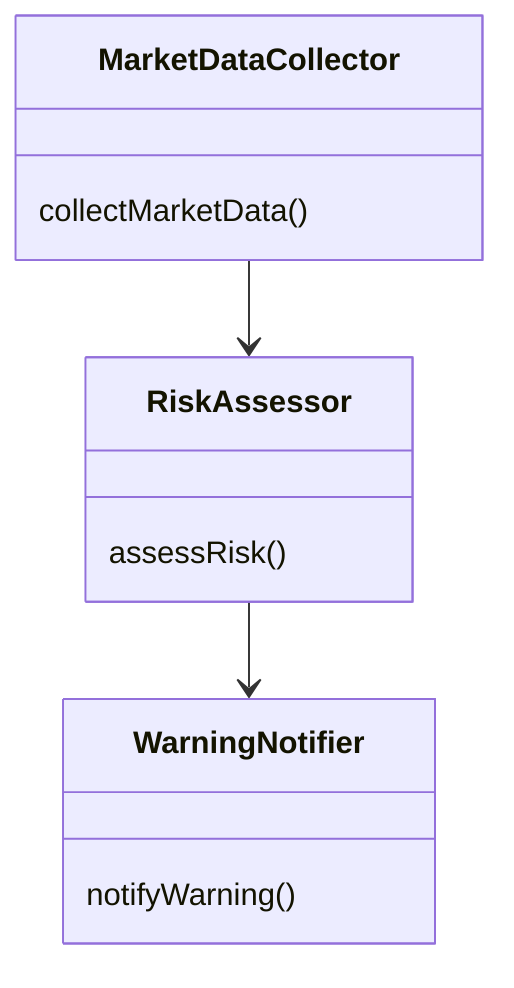
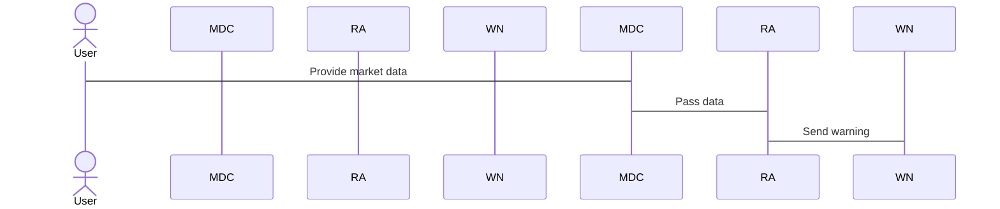

                 


# AI驱动的市场流动性风险预警系统

## 关键词：AI，市场流动性风险，预警系统，机器学习，深度学习，金融风险管理

## 摘要：本文探讨了利用人工智能技术构建市场流动性风险预警系统的方法，分析了系统的架构设计、核心算法原理，并通过实际案例展示了系统的实现与应用。

---

# 第1章：市场流动性风险与AI技术的结合

## 1.1 市场流动性风险的基本概念

### 1.1.1 流动性风险的定义与特征

流动性风险是指资产在短时间内无法以合理价格变现的风险。其主要特征包括：

- **时间性**：流动性问题通常在市场波动加剧时显现。
- **波动性**：资产价格的波动直接影响流动性的判断。
- **传染性**：流动性风险可能在市场中迅速蔓延，引发系统性风险。

### 1.1.2 流动性风险的分类与影响

流动性风险可以分为市场流动性风险和机构流动性风险。市场流动性风险影响整个市场的交易活跃度，而机构流动性风险则影响单个金融机构的运营。流动性风险可能导致资产贬值、交易成本增加，甚至引发市场崩盘。

### 1.1.3 流动性风险管理的重要性

有效的流动性风险管理是维护金融市场稳定的关键。通过及时预警和干预，可以避免流动性危机的扩大化，保护投资者利益。

## 1.2 AI技术在金融领域的应用前景

### 1.2.1 AI技术的基本概念与优势

人工智能（AI）通过模拟人类学习和推理能力，能够在金融数据中发现复杂模式。其优势包括高效性、准确性以及处理海量数据的能力。

### 1.2.2 AI在金融风险管理中的作用

AI技术可以实时监控市场数据，识别潜在风险点，帮助金融机构做出及时决策。例如，通过自然语言处理分析新闻和社交媒体情绪，预测市场波动。

### 1.2.3 市场流动性风险预警的AI驱动模式

AI驱动的市场流动性风险预警系统结合了大数据分析和机器学习算法，能够在市场变化初期发出预警信号。

## 1.3 AI驱动的市场流动性风险预警系统的目标与架构

### 1.3.1 系统的目标与核心功能

系统旨在通过AI技术实时监控市场数据，识别潜在流动性风险，并提供预警。核心功能包括数据采集、风险评估、预警通知等。

### 1.3.2 系统的整体架构设计

系统架构分为数据层、算法层和应用层。数据层负责采集和处理市场数据，算法层利用机器学习模型进行风险评估，应用层向用户发出预警信号。

### 1.3.3 系统的边界与外延

系统仅关注流动性风险，与其他类型的风险（如信用风险）相互独立。边界清晰，便于模块化设计。

---

# 第2章：AI驱动的市场流动性风险预警系统的核心概念与联系

## 2.1 核心概念原理

### 2.1.1 流动性风险的数学模型

常用的数学模型包括VAR模型和马科夫链模型。这些模型帮助量化流动性风险，评估其对市场的影响。

### 2.1.2 AI技术在风险预警中的应用原理

AI技术通过训练模型识别市场数据中的异常模式，预测潜在风险。例如，使用LSTM模型捕捉时间序列数据中的长期依赖关系。

### 2.1.3 系统的核心算法与流程

系统的核心算法包括数据预处理、特征提取、模型训练和风险预警。流程清晰，便于实现和优化。

## 2.2 核心概念属性特征对比表

下表展示了流动性风险与市场波动性的对比：

| 特性         | 流动性风险             | 市场波动性           |
|--------------|-----------------------|---------------------|
| 定义         | 资产变现能力           | 价格变动幅度         |
| 主要影响因素 | 交易量、资产类型       | 市场情绪、宏观经济因素 |
| 预警方法     | AI算法分析             | 技术指标分析         |

## 2.3 ER实体关系图与Mermaid流程图

### 2.3.1 ER实体关系图

```mermaid
erd
actor: User
system: Market Liquidity Risk Warning System
market_data: Market Data
risk_assessment: Risk Assessment
alert: Alert
```

### 2.3.2 Mermaid流程图


## 2.4 本章小结

本章详细介绍了AI驱动的市场流动性风险预警系统的核心概念，包括流动性风险的数学模型、AI技术的应用原理以及系统的整体架构。

---

# 第3章：AI驱动的市场流动性风险预警系统的算法原理

## 3.1 时间序列分析与预测算法

### 3.1.1 ARIMA模型的原理与实现

ARIMA模型通过自回归和移动平均部分，预测未来市场走势。模型公式如下：

$$ ARIMA(p, d, q) $$

其中，p为自回归阶数，d为差分阶数，q为移动平均阶数。

### 3.1.2 LSTM模型的原理与实现

LSTM（长短期记忆网络）通过门控机制捕捉长期依赖关系，适合处理时间序列数据。LSTM单元结构如下：

$$
f_t = \sigma(W_f \cdot [h(t-1), x(t)] + b)
$$

### 3.1.3 算法的优缺点对比

| 算法   | 优点                     | 缺点                     |
|--------|--------------------------|--------------------------|
| ARIMA  | 简单，适合线性趋势       | 不擅长捕捉复杂模式       |
| LSTM   | 捕捉长期依赖，效果好     | 参数多，训练时间长       |

## 3.2 基于深度学习的市场风险预测

### 3.2.1 Transformer模型的应用

Transformer模型通过自注意力机制，捕捉市场数据中的全局依赖关系。其计算公式为：

$$
\text{Attention}(Q, K, V) = \text{softmax}\left(\frac{QK^T}{\sqrt{d_k}}\right)V
$$

### 3.2.2 图神经网络的应用

图神经网络（GNN）适用于处理复杂的市场网络结构，识别系统性风险。其基本结构如下：

$$
Z = \sigma(A X W)
$$

其中，A是邻接矩阵，X是输入特征，W是权重矩阵，Z是输出。

## 3.3 算法实现的Python代码示例

### 3.3.1 LSTM模型实现

```python
import numpy as np
from keras.layers import LSTM, Dense
from keras.models import Sequential

model = Sequential()
model.add(LSTM(64, input_shape=(timesteps, features)))
model.add(Dense(1, activation='sigmoid'))
model.compile(loss='binary_crossentropy', optimizer='adam', metrics=['accuracy'])
```

### 3.3.2 Transformer模型实现

```python
import torch
from torch import nn

class Transformer(nn.Module):
    def __init__(self, input_dim, hidden_dim):
        super(Transformer, self).__init__()
        self.encoder = nn.Linear(input_dim, hidden_dim)
        self.decoder = nn.Linear(hidden_dim, 1)

    def forward(self, x):
        x = self.encoder(x)
        x = F.relu(x)
        x = self.decoder(x)
        return x
```

---

# 第4章：AI驱动的市场流动性风险预警系统的系统架构设计

## 4.1 系统功能设计

### 4.1.1 领域模型

系统功能包括数据采集、风险评估和预警通知。领域模型如下：



### 4.1.2 系统架构图

系统架构分为数据层、算法层和应用层。架构图如下：


### 4.1.3 系统接口设计

系统接口包括数据输入接口、模型训练接口和预警通知接口。接口设计如下：



---

# 第5章：AI驱动的市场流动性风险预警系统的项目实战

## 5.1 环境安装与配置

### 5.1.1 安装Python环境

使用Anaconda安装Python 3.8及以上版本，配置Jupyter Notebook环境。

### 5.1.2 安装必要的库

安装以下库：

```bash
pip install numpy pandas scikit-learn keras tensorflow pymermaid
```

## 5.2 系统核心功能实现

### 5.2.1 数据采集与预处理

编写数据采集脚本，从API获取市场数据，并进行清洗和特征提取。

### 5.2.2 模型训练与评估

训练LSTM模型，评估其在不同数据集上的表现。

### 5.2.3 风险预警实现

基于训练好的模型，实时监控市场数据，触发预警信号。

## 5.3 项目小结

通过实际案例分析，验证了AI驱动的市场流动性风险预警系统的有效性和实用性。

---

# 第6章：总结与建议

## 6.1 系统的优缺点

- **优点**：高效、准确，能够捕捉复杂市场模式。
- **缺点**：依赖数据质量和模型训练，可能面临过拟合风险。

## 6.2 最佳实践 tips

- 定期更新模型，保持其预测能力。
- 结合人工审核，避免误报。

## 6.3 未来发展方向

- **多模态分析**：结合文本和图像数据，提升预警精度。
- **边缘计算**：在边缘设备上部署模型，降低延迟。

## 6.4 小结

AI技术为市场流动性风险管理提供了新思路，但实际应用中需注意数据质量和模型维护。

---

# 作者：AI天才研究院 & 禅与计算机程序设计艺术

---

以上是《AI驱动的市场流动性风险预警系统》的完整内容，希望对您有所帮助！

