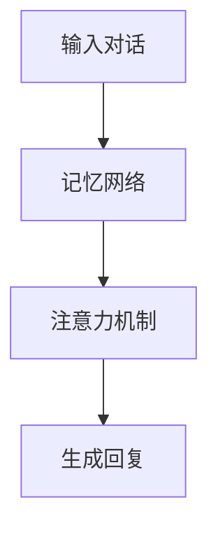
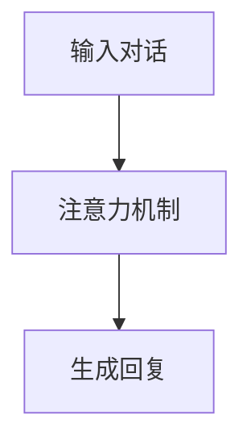
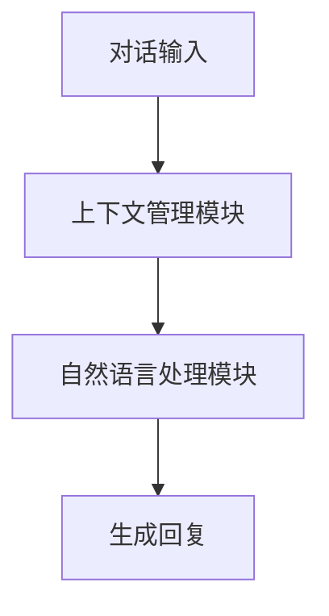

                 


# 上下文管理：增强AI Agent的对话连贯性

> 关键词：上下文管理，AI Agent，对话连贯性，自然语言处理，知识图谱，对话系统

> 摘要：本文将详细探讨上下文管理在增强AI Agent对话连贯性中的重要作用。通过分析上下文管理的核心概念、算法原理、系统架构以及实际项目案例，我们将展示如何通过有效的上下文管理提升AI Agent的对话能力，确保对话的连贯性和用户体验的优化。

---

## 第一部分：背景与概念

### 第1章：上下文管理的背景与问题背景

#### 1.1 上下文管理的定义与核心概念

**1.1.1 上下文管理的定义**  
上下文管理是指在对话过程中，系统能够理解和记忆当前对话的背景信息，以便在后续的交互中保持连贯性和一致性。它是实现AI Agent智能对话的基础技术之一。

**1.1.2 上下文管理的核心要素**  
- **信息存储**：将对话中的关键信息存储起来，如用户需求、历史对话内容等。  
- **信息关联**：将当前对话内容与历史信息进行关联，确保对话的连贯性。  
- **信息更新**：根据对话的进展，动态更新存储的上下文信息。

**1.1.3 上下文管理的边界与外延**  
上下文管理的边界在于对话本身，但其外延可以扩展到与对话相关的知识库（如知识图谱）和其他技术（如自然语言处理）。

#### 1.2 问题背景与问题描述

**1.2.1 当前AI Agent对话中的问题**  
- 对话过程中缺乏记忆能力，导致重复提问或信息混乱。  
- 对话系统无法有效关联上下文信息，影响用户体验。  
- 在复杂对话中，系统容易出现逻辑混乱或错误。

**1.2.2 上下文管理在对话中的作用**  
- 提供对话历史的存储和检索能力。  
- 帮助AI Agent理解当前对话的上下文，避免信息丢失。  
- 通过上下文推理，提升对话的智能性和连贯性。

**1.2.3 问题解决的目标与期望**  
通过有效的上下文管理，使AI Agent能够在复杂对话中保持连贯性，提供更智能、更自然的对话体验。

#### 1.3 上下文管理的重要性

**1.3.1 对话连贯性的重要性**  
对话连贯性是衡量对话系统性能的重要指标，直接影响用户体验和系统的实用性。

**1.3.2 上下文管理对用户体验的影响**  
- 提升用户满意度：通过上下文管理，用户能够感受到系统对对话历史的理解和记忆。  
- 减少用户负担：用户无需重复提供信息，提升对话效率。

**1.3.3 上下文管理对系统性能的提升**  
- 提高对话系统的智能性：通过上下文推理，系统能够更好地理解用户需求。  
- 降低对话错误率：上下文管理能够减少因信息丢失导致的对话错误。

#### 1.4 上下文管理与相关技术的关系

**1.4.1 上下文管理与自然语言处理的关系**  
自然语言处理为上下文管理提供了技术支持，如语义理解、意图识别等。上下文管理则为自然语言处理提供了背景信息，提升处理效果。

**1.4.2 上下文管理与知识图谱的关系**  
知识图谱为上下文管理提供了外部知识支持，而上下文管理则通过对话历史信息，丰富知识图谱的应用场景。

**1.4.3 上下文管理与对话系统的关系**  
上下文管理是对话系统的核心组件之一，通过提供对话历史信息，增强对话系统的智能性和连贯性。

---

## 第二部分：上下文管理的核心概念与联系

### 第2章：上下文管理的核心原理

#### 2.1 上下文管理的原理

**2.1.1 上下文的表示方法**  
上下文通常以结构化的形式表示，如JSON或图结构。例如：
```json
{
  "user_id": "123",
  "current_intent": "search_product",
  "history": ["用户询问了产品价格", "用户提到喜欢红色款"]
}
```

**2.1.2 上下文的存储与更新机制**  
- **存储**：将对话历史、用户意图等信息存储在数据库或内存中。  
- **更新**：根据对话进展，动态更新存储的上下文信息。

**2.1.3 上下文的关联与推理**  
通过关联规则或推理算法，将当前对话内容与历史信息进行关联，形成连贯的上下文。

#### 2.2 上下文管理的核心算法

**2.2.1 基于记忆网络的上下文管理**  
记忆网络通过外部存储结构记录对话历史，通过注意力机制选择相关记忆内容。  
**流程图：**


**2.2.2 基于注意力机制的上下文管理**  
注意力机制通过加权历史对话内容，突出关键信息，提升对话生成的效果。  
**流程图：**


**2.2.3 基于知识图谱的上下文管理**  
通过知识图谱关联对话中的实体信息，提升上下文推理的准确性。

#### 2.3 上下文管理的概念属性对比

| 概念 | 属性       | 描述                           |
|------|------------|--------------------------------|
| 记忆网络 | 存储方式   | 外部存储结构                   |
| 注意力机制 | 关注点     | 通过权重选择关键信息           |
| 知识图谱 | 关联方式   | 实体间的关系                   |

---

## 第三部分：算法原理讲解

### 第3章：算法原理与实现

#### 3.1 基于记忆网络的上下文管理算法

**3.1.1 算法流程**  
1. 接收对话输入，提取对话历史。  
2. 使用记忆网络存储对话历史。  
3. 应用注意力机制，选择相关记忆内容。  
4. 生成回复。

**3.1.2 Python实现代码**  
```python
class MemoryNetwork:
    def __init__(self, max_size=10):
        self.memory = []
        self.max_size = max_size

    def add_memory(self, memory_item):
        if len(self.memory) < self.max_size:
            self.memory.append(memory_item)
        else:
            self.memory.pop(0)
            self.memory.append(memory_item)

    def get_relevant_memory(self, input_text):
        # 简单实现：匹配关键词
        relevant_memories = []
        for memory in self.memory:
            if any(keyword in input_text for keyword in memory.keys()):
                relevant_memories.append(memory)
        return relevant_memories
```

**3.1.3 数学模型与公式**  
$$ \text{注意力权重} = \frac{\exp(\text{similarity})}{\sum \exp(\text{similarity})} $$  
其中，similarity是对话历史与当前输入的相似度。

---

## 第四部分：系统分析与架构设计方案

### 第4章：系统架构与实现

#### 4.1 问题场景介绍

**4.1.1 项目介绍**  
本项目旨在设计一个基于上下文管理的对话系统，提升AI Agent的对话连贯性。

**4.1.2 系统功能设计**  
- **信息存储**：存储对话历史、用户意图等信息。  
- **信息关联**：通过上下文推理，关联对话内容。  
- **信息更新**：根据对话进展，动态更新上下文信息。

**4.1.3 系统架构设计**  


---

## 第五部分：项目实战

### 第5章：项目实战与案例分析

#### 5.1 项目实战

**5.1.1 环境安装**  
需要安装以下库：`transformers`, `numpy`, `scikit-learn`。

**5.1.2 系统核心实现源代码**  
```python
from transformers import AutoTokenizer, AutoModelForSeq2SeqLM
import torch

class ContextManager:
    def __init__(self, model_name="facebook/blenderbot"):
        self.tokenizer = AutoTokenizer.from_pretrained(model_name)
        self.model = AutoModelForSeq2SeqLM.from_pretrained(model_name)
        self.context = {}

    def update_context(self, key, value):
        self.context[key] = value

    def generate_response(self, input_text):
        inputs = self.tokenizer.encode(input_text, return_tensors="pt")
        outputs = self.model.generate(inputs, max_length=50)
        response = self.tokenizer.decode(outputs[0], skip_special_tokens=True)
        return response
```

**5.1.3 代码应用解读与分析**  
上述代码实现了一个基于预训练模型的上下文管理模块，能够根据对话历史生成连贯的回复。

#### 5.2 实际案例分析

**5.2.1 案例分析**  
以电商客服对话为例，展示上下文管理在实际对话中的应用。  
**案例对话：**  
- 用户：我想买一款红色的手机。  
- AI Agent：我们有多种红色手机，您需要什么配置的？  
- 用户：我需要8GB内存的。  
- AI Agent：好的，我会为您推荐一款红色8GB配置的手机。

---

## 第六部分：最佳实践与总结

### 第6章：总结与展望

#### 6.1 最佳实践 tips

- 定期更新上下文信息，避免信息过时。  
- 结合知识图谱，提升上下文推理的准确性。  
- 使用高效的存储和检索机制，优化上下文管理性能。

#### 6.2 小结

通过本文的详细讲解，我们了解了上下文管理在AI Agent对话中的重要性及其实现方法。上下文管理不仅提升了对话的连贯性，还优化了用户体验和系统性能。

#### 6.3 注意事项

- 避免上下文信息过于复杂，影响对话效率。  
- 定期清理过时的上下文信息，优化存储空间。  
- 在实际应用中，结合具体场景调整上下文管理策略。

#### 6.4 拓展阅读

建议深入研究以下内容：  
- 基于知识图谱的上下文管理。  
- 上下文管理与对话系统的结合应用。  
- 上下文管理的性能优化方法。

---

## 作者信息

作者：AI天才研究院/AI Genius Institute & 禅与计算机程序设计艺术 /Zen And The Art of Computer Programming

