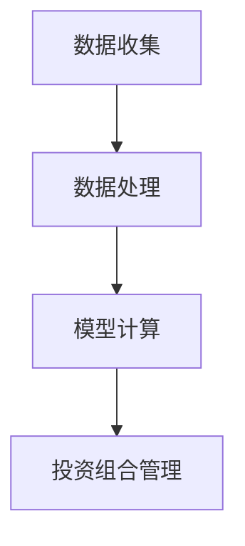

                 


# 乔尔·格林布拉特的价值投资量化方法

## 关键词：价值投资、量化方法、投资策略、风险管理、数据驱动、投资组合优化、机器学习

## 摘要：  
乔尔·格林布拉特是价值投资领域的著名投资者，他将量化方法与价值投资理论相结合，提出了独特的投资策略。本文详细解析了格林布拉特的价值投资量化方法，从模型构建到算法实现，从风险管理到数据处理，全面探讨其投资理念与实践。通过系统化的分析和代码实现，帮助读者理解如何将量化方法应用于价值投资中。

---

## 目录大纲结构：

1. **背景介绍**
   - 1.1 价值投资的核心概念
   - 1.2 量化方法的基本原理
   - 1.3 价值投资与量化方法的结合

2. **价值投资与量化方法的核心概念**
   - 2.1 价值投资的定义与原则
   - 2.2 量化方法的定义与特点
   - 2.3 格林布拉特的价值投资量化策略

3. **格林布拉特的量化模型与算法**
   - 3.1 模型构建与核心指标
   - 3.2 算法实现与数学推导
   - 3.3 模型的优缺点分析

4. **投资组合管理与风险管理**
   - 4.1 投资组合管理的基本原理
   - 4.2 风险管理的核心策略
   - 4.3 格林布拉特模型中的风险管理方法

5. **数据收集与处理**
   - 5.1 数据来源与清洗方法
   - 5.2 数据分析与可视化技术
   - 5.3 数据驱动的投资决策

6. **系统架构与代码实现**
   - 6.1 系统架构设计与流程图
   - 6.2 核心算法的Python代码实现
   - 6.3 系统实现与优化建议

7. **最佳实践与小结**
   - 7.1 投资策略的实施要点
   - 7.2 数据驱动的量化投资方法
   - 7.3 价值投资与量化方法的未来发展

---

## 正文内容：

### 第1章 背景介绍

#### 1.1 价值投资的核心概念
- **定义**：价值投资是一种投资策略，旨在以低于其内在价值的价格购买优质资产。
- **核心原则**：寻找市场低估的公司，长期持有，等待其价值回归。
- **历史发展**：起源于20世纪，由本杰明·格雷厄姆和戴维·多德提出，后来被乔尔·格林布拉特进一步发展。

#### 1.2 量化方法的基本原理
- **定义**：通过数学模型和算法，利用数据进行投资决策的方法。
- **特点**：基于大量数据，使用统计学和机器学习技术进行预测和优化。
- **应用场景**：从股票筛选到投资组合优化，量化方法在投资中广泛应用。

#### 1.3 价值投资与量化方法的结合
- **背景**：传统价值投资依赖于主观判断，而量化方法通过数据驱动的分析，提供更客观的投资决策。
- **优势**：结合了基本面分析和量化模型，提高了投资决策的效率和准确性。
- **挑战**：如何将定性因素（如公司治理）转化为可量化的指标。

---

### 第2章 价值投资与量化方法的核心概念

#### 2.1 价值投资的定义与原则
- **定义**：寻找市场价格低于其内在价值的股票。
- **原则**：
  1. 确定公司的内在价值。
  2. 以合理的价格购买优质资产。
  3. 长期持有，分散投资。

#### 2.2 量化方法的定义与特点
- **定义**：使用数学模型和算法，基于数据进行投资决策。
- **特点**：
  1. 数据驱动：依赖大量数据进行分析。
  2. 系统性：建立系统化的投资流程。
  3. 量化模型：利用统计学和机器学习构建预测模型。

#### 2.3 格林布拉特的价值投资量化策略
- **策略概述**：
  1. 筛选低估值的公司。
  2. 量化模型辅助决策。
  3. 风险管理与投资组合优化。

---

### 第3章 格林布拉特的量化模型与算法

#### 3.1 模型构建与核心指标
- **模型目标**：筛选出具有价值投资潜力的股票。
- **核心指标**：
  1. 市净率（P/B）：衡量股价与账面价值的关系。
  2. 市盈率（P/E）：衡量股价与盈利能力的关系。
  3. 股息率：衡量分红回报率。

#### 3.2 算法实现与数学推导
- **模型公式**：
  $$ \text{价值分数} = \frac{\text{内在价值}}{\text{市场价格}} $$
- **算法步骤**：
  1. 收集股票数据。
  2. 计算核心指标。
  3. 筛选符合价值投资条件的股票。
  4. 生成投资组合。

#### 3.3 模型的优缺点分析
- **优点**：
  1. 客观性：基于数据的分析减少人为干扰。
  2. 可重复性：模型可以重复应用到不同市场环境。
- **缺点**：
  1. 市场波动：模型可能无法完全预测市场短期波动。
  2. 数据依赖：依赖高质量的数据，数据不足可能导致模型失效。

---

### 第4章 投资组合管理与风险管理

#### 4.1 投资组合管理的基本原理
- **目标**：最大化收益，最小化风险。
- **方法**：
  1. 资产配置：根据风险偏好分配资产。
  2. 仓位管理：根据市场变化调整持仓比例。

#### 4.2 风险管理的核心策略
- **风险来源**：
  1. 市场风险：市场波动对投资组合的影响。
  2. 信用风险：债券发行人违约的风险。
- **管理方法**：
  1. 多元化：分散投资以降低风险。
  2. 止损策略：设定止损点以限制亏损。

#### 4.3 格林布拉特模型中的风险管理方法
- **风险评估**：通过历史数据分析和统计模型评估潜在风险。
- **风险控制**：设定最大持仓比例和止损点。

---

### 第5章 数据收集与处理

#### 5.1 数据来源与清洗方法
- **数据来源**：
  1. 财务报表：收入、利润、资产等数据。
  2. 市场数据：股价、成交量、指数等数据。
- **数据清洗**：
  1. 去除缺失值。
  2. 处理异常值。

#### 5.2 数据分析与可视化技术
- **数据分析**：
  1. 描述性分析：总结数据特征。
  2. 探索性分析：发现数据中的规律。
- **数据可视化**：
  1. 折线图：显示股价走势。
  2. 条形图：比较公司间的指标。

#### 5.3 数据驱动的投资决策
- **数据驱动策略**：
  1. 基于数据筛选股票。
  2. 根据数据调整投资组合。

---

### 第6章 系统架构与代码实现

#### 6.1 系统架构设计与流程图
- **系统架构**：
  1. 数据收集模块：获取股票数据。
  2. 数据处理模块：清洗和转换数据。
  3. 模型计算模块：计算价值分数。
  4. 投资组合管理模块：生成投资组合。



#### 6.2 核心算法的Python代码实现
- **代码示例**：

```python
import pandas as pd
import numpy as np

# 数据收集与处理
data = pd.read_csv('stock_data.csv')
data = data.dropna()

# 模型计算
def calculate_value_score(data):
    value_score = data['内在价值'] / data['市场价格']
    return value_score

scores = calculate_value_score(data)
selected_stocks = scores[scores > 1].index

# 投资组合管理
selected_stocks_list = list(selected_stocks)
print("入选股票:", selected_stocks_list)
```

#### 6.3 系统实现与优化建议
- **优化建议**：
  1. 使用机器学习模型改进价值评估。
  2. 引入实时数据进行动态调整。

---

### 第7章 最佳实践与小结

#### 7.1 投资策略的实施要点
- **要点总结**：
  1. 确定价值投资目标。
  2. 构建量化模型。
  3. 实施风险管理策略。

#### 7.2 数据驱动的量化投资方法
- **方法总结**：
  1. 依赖数据驱动的决策。
  2. 结合基本面分析与量化模型。

#### 7.3 价值投资与量化方法的未来发展
- **未来展望**：
  1. 结合人工智能技术。
  2. 实现更加智能化的投资决策。

---

## 作者：AI天才研究院/AI Genius Institute & 禅与计算机程序设计艺术 /Zen And The Art of Computer Programming  
日期：2023年10月

