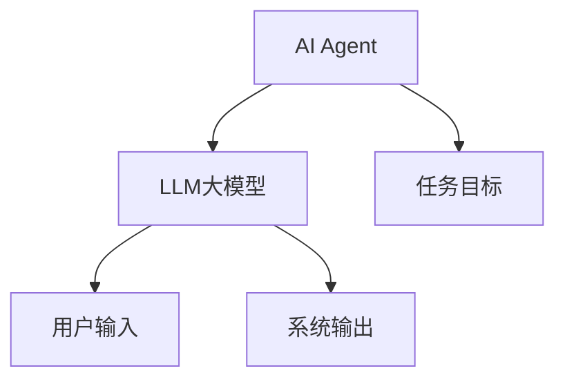

                 


# 从零构建AI Agent：LLM大模型应用开发实践概述

**关键词：** AI Agent, LLM大模型, 人工智能, 系统架构, 应用开发

**摘要：**  
随着人工智能技术的快速发展，AI Agent（智能代理）作为一种能够自主感知环境、执行任务并做出决策的智能系统，正逐渐成为各类应用场景的核心技术。本文将从零开始，系统性地介绍AI Agent的构建过程，涵盖核心概念、算法原理、系统架构设计、项目实战以及最佳实践等关键内容。通过本文，读者将能够全面理解AI Agent的实现细节，并掌握基于LLM大模型的应用开发方法。

---

## 第一部分: 从零构建AI Agent的背景与概述

### 第1章: AI Agent与LLM大模型概述

#### 1.1 AI Agent的基本概念
- **1.1.1 AI Agent的定义与特点**  
  AI Agent（智能代理）是一种能够感知环境、自主决策并执行任务的智能系统。它具备自主性、反应性、目标导向性和社会性等核心特点。  
  - 自主性：AI Agent能够独立运作，无需人工干预。  
  - 反应性：AI Agent能够实时感知环境并做出响应。  
  - 目标导向性：AI Agent的行为以实现特定目标为导向。  
  - 社会性：AI Agent能够与其他系统或用户进行交互协作。

- **1.1.2 LLM大模型在AI Agent中的作用**  
  LLM（Large Language Model，大语言模型）通过其强大的自然语言处理能力，为AI Agent提供了核心的文本理解和生成能力。LLM能够帮助AI Agent实现以下功能：  
  - 理解用户的输入指令或问题。  
  - 生成符合上下文的自然语言回复。  
  - 进行多轮对话，保持语境一致性。  

- **1.1.3 AI Agent的分类与应用场景**  
  AI Agent可以根据功能、应用场景和技术实现方式分为多种类型：  
  - **任务型AI Agent**：专注于完成特定任务，如问答系统、聊天机器人。  
  - **决策型AI Agent**：具备自主决策能力，如自动驾驶中的路径规划系统。  
  - **学习型AI Agent**：能够通过经验不断优化自身行为，如游戏AI。  
  - **社交型AI Agent**：能够与人类进行自然交互，如虚拟助手。

#### 1.2 AI Agent与传统AI的区别
- **1.2.1 传统AI的局限性**  
  传统AI（如基于规则的系统）依赖于预定义的规则和逻辑，缺乏灵活性和适应性。当面对复杂或未预见的场景时，传统AI系统往往表现受限。  

- **1.2.2 AI Agent的核心优势**  
  AI Agent结合了感知、决策和执行的能力，能够在动态环境中自主运作，适应变化并优化自身行为。  

- **1.2.3 LLM大模型如何赋能AI Agent**  
  LLM大模型通过其强大的文本理解和生成能力，为AI Agent提供了自然语言处理的核心模块。同时，LLM的深度学习特性使其能够捕捉上下文信息，从而实现更智能的交互和决策。

#### 1.3 LLM大模型的定义与特点
- **1.3.1 大语言模型的基本原理**  
  LLM通过大量的训练数据学习语言模式，并利用深度神经网络进行文本生成。其核心思想是通过概率模型预测下一个词，从而生成连贯的文本。  

- **1.3.2 LLM的核心技术与优势**  
  - **大规模训练数据**：通过 billions of parameters 的模型参数，LLM能够捕捉语言的复杂模式。  
  - **自注意力机制**：通过自注意力机制，模型能够理解文本中的长距离依赖关系。  
  - **生成能力**：LLM能够生成高质量的文本，包括回答问题、翻译、摘要等任务。  

- **1.3.3 LLM的局限性与挑战**  
  - **计算资源需求高**：训练和推理需要大量计算资源。  
  - **生成结果的不可控性**：LLM可能会生成不符合预期的内容，需要额外的过滤和调优。  
  - **伦理与安全问题**：LLM可能被用于不当用途，如生成虚假信息或攻击性内容。

#### 1.4 本章小结
通过本章的介绍，我们了解了AI Agent的基本概念、分类以及其与传统AI的区别，同时深入探讨了LLM大模型在AI Agent中的核心作用。接下来，我们将从技术原理的角度，详细分析AI Agent的实现机制。

---

## 第二部分: AI Agent的核心概念与原理

### 第2章: AI Agent的核心概念与联系

#### 2.1 核心概念原理
- **2.1.1 AI Agent的构成要素**  
  AI Agent的实现通常包括以下几个核心要素：  
  - **感知模块**：负责接收输入信号并解析用户的意图。  
  - **决策模块**：基于感知的信息，生成相应的响应或操作指令。  
  - **执行模块**：将决策模块生成的指令转化为实际操作。  
  - **学习模块**：通过经验优化自身的决策和执行能力。  

- **2.1.2 LLM大模型的输入输出机制**  
  LLM大模型的输入通常是一个文本序列，输出是一个生成的文本序列。例如：  
  - **输入**：用户的问题或指令。  
  - **输出**：模型生成的回答或操作指令。  

- **2.1.3 AI Agent的决策与执行流程**  
  AI Agent的决策流程可以分为以下几个步骤：  
  1. 接收输入信号（用户指令或环境反馈）。  
  2. 解析输入，生成可能的响应或操作。  
  3. 根据预设的目标或策略选择最优响应。  
  4. 输出响应并执行相应的操作。  

#### 2.2 核心概念属性对比表格
以下是AI Agent与LLM大模型的核心概念对比：

| 概念       | 属性             | 描述                                                                 |
|------------|------------------|----------------------------------------------------------------------|
| AI Agent   | 输入             | 用户指令或任务描述                                                 |
|            | 输出             | 系统响应或操作指令                                                 |
| LLM大模型  | 输入             | 文本数据或上下文                                                   |
|            | 输出             | 文本生成或预测结果                                                 |

#### 2.3 ER实体关系图
以下是AI Agent与LLM大模型的实体关系图：



#### 2.4 本章小结
通过本章的分析，我们明确了AI Agent的核心概念及其与LLM大模型的联系。接下来，我们将从算法原理的角度，深入探讨AI Agent的实现细节。

---

## 第三部分: AI Agent的算法原理与数学模型

### 第3章: AI Agent的算法原理

#### 3.1 算法原理

- **3.1.1 基于LLM的生成式AI Agent**  
  生成式AI Agent的核心是利用LLM生成自然语言文本。其算法流程如下：  
  1. 接收用户输入（如问题或指令）。  
  2. 通过LLM生成相应的回答或操作指令。  
  3. 输出生成的内容并执行相应的操作。  

- **3.1.2 基于规则的AI Agent**  
  基于规则的AI Agent通过预定义的规则集进行决策。虽然灵活性较低，但实现简单，适用于特定场景。  

- **3.1.3 基于强化学习的AI Agent**  
  强化学习AI Agent通过与环境的交互，不断优化自身的决策策略。其核心算法包括Q-Learning和Deep Q-Network（DQN）等。

---

**数学公式：强化学习算法的核心公式**

在强化学习中，AI Agent通过与环境交互，获得奖励信号，并根据奖励信号优化其决策策略。以下是强化学习中经典的Q-Learning算法公式：

$$ Q(s, a) = Q(s, a) + \alpha \left( r + \gamma \max Q(s', a') - Q(s, a) \right) $$

其中：  
- \( Q(s, a) \) 表示在状态 \( s \) 下执行动作 \( a \) 的价值。  
- \( \alpha \) 表示学习率。  
- \( r \) 表示获得的奖励。  
- \( \gamma \) 表示折扣因子。  
- \( s' \) 表示执行动作 \( a \) 后的新状态。  
- \( \max Q(s', a') \) 表示新状态下动作 \( a' \) 的最大价值。  

---

**代码示例：简单的基于LLM的AI Agent实现**

以下是一个简单的基于LLM的AI Agent实现代码示例：

```python
from transformers import AutoTokenizer, AutoModelForCausalLM

# 初始化模型和分词器
model_name = "gpt2"
tokenizer = AutoTokenizer.from_pretrained(model_name)
model = AutoModelForCausalLM.from_pretrained(model_name)

def generate_response(prompt):
    inputs = tokenizer.encode(prompt, return_tensors="pt")
    outputs = model.generate(inputs, max_length=50, do_sample=True)
    response = tokenizer.decode(outputs[0], skip_special_tokens=True)
    return response

# 示例使用
prompt = "请解释量子计算的基本原理。"
response = generate_response(prompt)
print(response)
```

---

**总结：**  
通过以上内容，我们从零开始构建了一个基于LLM的AI Agent，并详细介绍了其实现原理和代码实现。后续章节将深入探讨系统架构设计、项目实战以及最佳实践等内容，帮助读者全面掌握AI Agent的开发方法。

