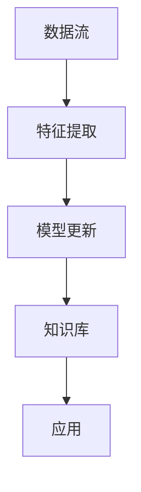
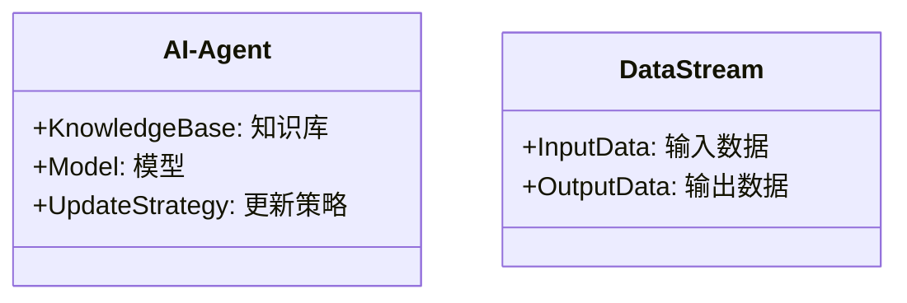
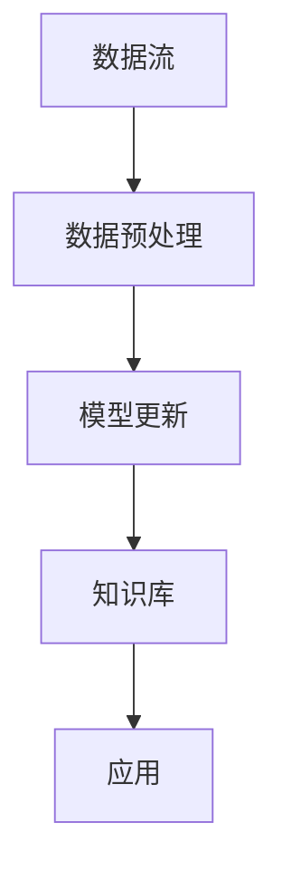

                 


# 增量学习：持续更新AI Agent的知识库

---

## 关键词  
增量学习, AI Agent, 知识库更新, 在线学习, 模型更新, 实时动态学习

---

## 摘要  
在人工智能领域，增量学习是一种动态更新AI Agent知识库的核心技术，旨在通过实时数据流不断优化模型性能。本文深入探讨增量学习的基本概念、算法原理、系统架构设计以及实际应用案例，帮助读者理解如何通过增量学习实现AI Agent的持续进化。文章从理论到实践，结合数学公式、算法代码和系统架构图，全面解析增量学习的实现细节和优化策略。

---

# 第一部分: 增量学习与AI Agent知识库的背景介绍

## 第1章: 增量学习的基本概念

### 1.1 问题背景与问题描述
#### 1.1.1 AI Agent知识库更新的挑战  
AI Agent需要在动态环境中实时更新知识库，以适应不断变化的环境和任务需求。传统批量学习方法在数据量大、实时性要求高的场景下表现不足，难以满足实时更新的需求。  

#### 1.1.2 增量学习的定义与特点  
增量学习（Incremental Learning）是指在已有模型的基础上，逐步接收新的数据样本并进行模型更新的学习方式。其特点包括：  
- 数据流式输入：模型在数据流中逐步处理新样本，无需一次性加载所有数据。  
- 实时性：适用于需要快速响应的实时场景。  
- 动态适应性：能够根据新数据调整模型，适应环境变化。  

#### 1.1.3 增量学习的核心目标与应用场景  
增量学习的核心目标是通过少量新增数据优化模型性能，减少计算资源消耗，适用于以下场景：  
- 实时数据分析：如金融市场的实时股票价格预测。  
- 动态环境适应：如自动驾驶汽车对路况的实时更新。  
- 资源受限场景：如移动设备上的本地模型优化。  

---

## 第2章: 增量学习的核心概念与联系

### 2.1 增量学习的原理与数学模型
#### 2.1.1 在线增量学习的数学表达  
增量学习的基本数学模型可以表示为：  
$$\theta_{t+1} = \theta_t + \eta \cdot (y_t - h_\theta(x_t)) \cdot x_t$$  
其中，$\theta_t$ 表示第 $t$ 轮的模型参数，$\eta$ 是学习率，$y_t$ 是真实标签，$h_\theta(x_t)$ 是模型对输入 $x_t$ 的预测值。  

#### 2.1.2 模型更新的公式推导  
假设损失函数为均方误差：  
$$L = \frac{1}{2}(y - h_\theta(x))^2$$  
对 $\theta$ 求导并更新参数：  
$$\frac{\partial L}{\partial \theta} = -(y - h_\theta(x)) \cdot x$$  
更新公式为：  
$$\theta_{t+1} = \theta_t - \eta \cdot (y - h_\theta(x)) \cdot x$$  

#### 2.1.3 增量学习的收敛性分析  
增量学习的收敛性依赖于数据分布和学习率的选择。通过不断更新模型参数，增量学习能够在在线环境下逼近最优解。  

---

### 2.2 核心概念对比分析
#### 2.2.1 增量学习与批量学习的对比  
| 对比维度         | 增量学习                     | 批量学习                     |
|------------------|-----------------------------|-----------------------------|
| 数据处理方式     | 流式数据输入，逐样本更新     | 批次数据输入，一次性更新     |
| 计算资源消耗     | 计算资源较低，适合实时场景   | 计算资源较高，适合离线场景   |
| 适应性           | 高，适用于动态环境           | 低，适用于静态环境           |

---

### 2.3 实体关系图与流程图
#### 2.3.1 增量学习的ER实体关系图  
```mermaid
erd
actor 增量学习系统
  has 属性: 模型参数、新数据样本
  has 关系: 更新操作
```

#### 2.3.2 增量学习的流程图  


---

# 第三部分: 增量学习的算法原理

## 第3章: 增量学习的核心算法

### 3.1 增量学习的核心算法
#### 3.1.1 在线梯度下降算法
在线梯度下降算法是最常见的增量学习算法之一，其核心思想是通过单个样本更新模型参数：  
$$w_{t+1} = w_t - \eta \cdot \nabla J(w_t, x_t, y_t)$$  

#### 3.1.2 随机梯度下降算法
随机梯度下降（SGD）是一种高效的增量学习算法，适用于大规模数据集：  
$$w_{t+1} = w_t - \eta \cdot \nabla J(w_t, x_t, y_t)$$  

#### 3.1.3 增量支持向量机算法
增量支持向量机（ISV）是一种基于增量更新的支持向量机算法，适用于分类任务的动态更新。

---

### 3.2 算法实现的数学模型
#### 3.2.1 梯度下降的数学公式
$$w_{t+1} = w_t - \eta \cdot \nabla J(w_t)$$  

#### 3.2.2 随机梯度下降的数学公式
$$w_{t+1} = w_t - \eta \cdot \nabla J(w_t, x_t, y_t)$$  

---

### 3.3 算法实现的代码示例
#### 3.3.1 Python代码实现
```python
import numpy as np

def incremental_learning(X, y, eta=0.1, iterations=100):
    # 初始化模型参数
    w = np.zeros(X.shape[1])
    for i in range(iterations):
        # 随机选取一个样本
        idx = np.random.randint(len(X))
        x = X[idx]
        y_true = y[idx]
        # 预测值
        y_pred = np.dot(x, w)
        # 更新权重
        gradient = 2 * (y_pred - y_true) * x
        w -= eta * gradient
    return w

# 示例数据
X = np.array([[1, 2], [3, 4], [5, 6]])
y = np.array([3, 7, 11])

# 执行增量学习
w_final = incremental_learning(X, y)
print("最终权重:", w_final)
```

---

## 第4章: 增量学习的系统架构设计

### 4.1 问题场景介绍
增量学习在实时数据分析、动态环境适应等场景中广泛应用，需要设计高效的系统架构以支持实时更新。

### 4.2 系统功能设计
#### 4.2.1 领域模型设计


#### 4.2.2 系统架构设计


---

## 第5章: 增量学习的项目实战

### 5.1 环境安装与配置
- 安装Python和相关库（如NumPy、Scikit-learn）
- 配置开发环境（如Jupyter Notebook）

### 5.2 核心系统实现
#### 5.2.1 数据预处理代码
```python
import numpy as np

def preprocess_data(data):
    # 数据归一化
    mean = np.mean(data, axis=0)
    std = np.std(data, axis=0)
    normalized_data = (data - mean) / std
    return normalized_data
```

#### 5.2.2 模型更新代码
```python
def update_model(model, X, y, eta=0.1):
    # 更新模型参数
    gradient = 2 * np.dot(X.T, (np.dot(X, model) - y))
    model -= eta * gradient
    return model
```

### 5.3 实际案例分析
- **案例分析：实时股票价格预测**
  - 数据流：实时股票价格数据
  - 模型更新：每分钟更新一次模型参数
  - 预测结果：实时预测股票价格趋势

---

## 第6章: 最佳实践与小结

### 6.1 实施增量学习的关键点
- 数据质量：确保输入数据的准确性
- 学习率：选择合适的$\eta$值以平衡收敛速度和稳定性
- 模型选择：根据任务需求选择合适的增量学习算法

### 6.2 常见问题与注意事项
- 数据稀疏性：处理稀疏数据时需要适当调整模型参数
- 过拟合：采用正则化方法防止过拟合
- 计算效率：优化代码以提高计算效率

### 6.3 未来研究方向
- 更高效的模型更新算法
- 多模态数据的增量学习
- 增量学习在边缘计算中的应用

---

## 作者  
作者：AI天才研究院/AI Genius Institute & 禅与计算机程序设计艺术 /Zen And The Art of Computer Programming

