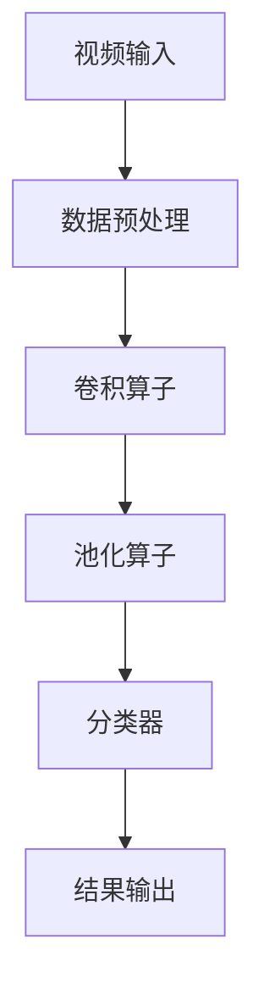
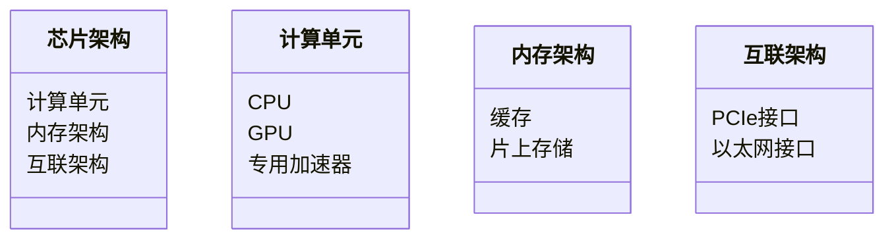
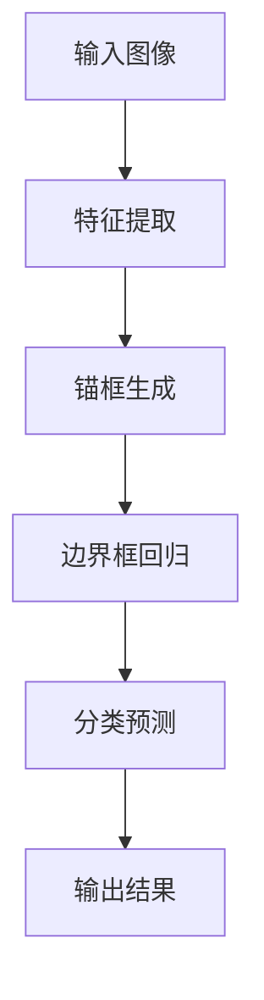
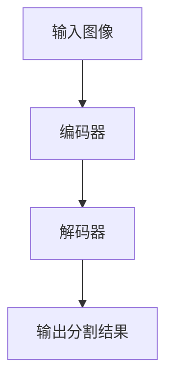
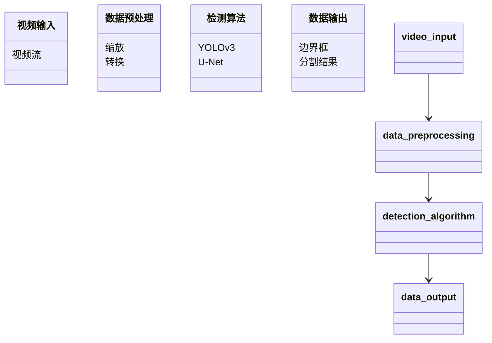
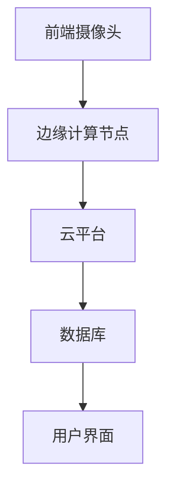

                 


# 如何识别企业的边缘AI视频分析芯片优势

## 关键词：边缘AI，视频分析，芯片，性能指标，企业应用，技术优势

## 摘要：  
随着人工智能和边缘计算的快速发展，边缘AI视频分析芯片在企业中的应用越来越广泛。本文旨在帮助企业识别和选择适合自身需求的边缘AI视频分析芯片，通过分析芯片的核心技术、性能指标和应用场景，揭示其优势和潜在价值。

---

## 第一部分：背景介绍

### 第1章：边缘AI视频分析芯片的背景与现状

#### 1.1 边缘AI视频分析芯片的定义与概念  
边缘AI视频分析芯片是一种专门用于在边缘计算环境下进行视频分析的硬件。其核心功能包括目标检测、图像识别、行为分析等，旨在通过高效的硬件加速提升视频处理的实时性和准确性。  

#### 1.2 边缘AI视频分析芯片的技术背景  
AI视频分析技术依赖于深度学习模型，而边缘计算的优势在于将数据处理从云端迁移到靠近数据源的边缘设备。边缘AI视频分析芯片通过硬件加速技术，大幅提升了视频分析的效率和响应速度。  

#### 1.3 当前市场现状与竞争格局  
目前，市场上主流的边缘AI视频分析芯片厂商包括 NVIDIA、Intel、Google 和一些新兴的AI芯片公司。这些芯片在性能、功耗和成本上各有优劣，企业需要根据自身需求选择合适的方案。  

#### 1.4 企业应用中的价值与优势  
在企业中，边缘AI视频分析芯片广泛应用于智能安防、工业检测、智能交通等领域。其优势在于低延迟、高实时性和本地化数据处理能力，能够满足企业对数据隐私和快速响应的需求。  

---

## 第二部分：核心概念与联系

### 第2章：边缘AI视频分析芯片的核心概念与原理

#### 2.1 边缘AI视频分析芯片的工作原理  
边缘AI视频分析芯片通过硬件加速技术，快速执行深度学习模型中的关键算子（如卷积、池化等），实现视频流的实时处理。  

**算子加速流程图：**



#### 2.2 芯片架构与AI加速引擎  
芯片架构主要包括计算单元、内存架构和互联架构。计算单元负责执行算子加速，内存架构优化数据存储和访问效率，互联架构则确保芯片内部和外部设备的数据通信。  

**芯片架构示意图：**



#### 2.3 芯片性能指标与对比分析  
以下是主流边缘AI视频分析芯片的性能对比表：  

| 芯片型号       | 计算能力（TOPS） | 功耗（W） | 延迟（ms） | 支持模型             |
|----------------|------------------|-----------|------------|----------------------|
| NVIDIA Jetson   | 1.5              | 5-10      | 100-200    | YOLOv3, SSD          |
| Intel Movidius | 1.2              | 1.5-2.5    | 150-300    | OpenVINO            |
| Google Coral   | 0.5              | 1-2        | 200-400    | TensorFlow Lite      |

#### 2.4 芯片间的对比与选型指南  
企业在选型时需要考虑以下因素：  
1. **性能需求**：高帧率要求选择高性能芯片。  
2. **功耗限制**：低功耗场景优先考虑轻量级芯片。  
3. **部署环境**：边缘设备的物理空间和散热条件。  

---

## 第三部分：算法原理讲解

### 第3章：边缘AI视频分析的核心算法

#### 3.1 目标检测算法原理  
目标检测是视频分析的核心任务之一。以YOLO（You Only Look Once）算法为例，其流程如下：  

**YOLOv3算法流程图：**



YOLOv3的损失函数公式为：  
$$ \text{Loss} = \lambda_{\text{cls}} \times \text{Class Loss} + \lambda_{\text{box}} \times \text{Box Loss} + \lambda_{\text{obj}} \times \text{Object Loss} $$  

#### 3.2 图像分割算法原理  
图像分割任务通常使用U-Net架构。其关键步骤包括编码器（特征提取）和解码器（上采样）。  

**U-Net架构示意图：**



U-Net的损失函数为交叉熵损失：  
$$ L = -\sum_{i=1}^{N} y_i \log(p_i) + (1-y_i)\log(1-p_i) $$  

---

## 第四部分：系统分析与架构设计方案

### 第4章：系统分析与架构设计方案

#### 4.1 问题场景介绍  
企业常见的边缘AI视频分析场景包括智能安防监控和工业视觉检测。  

#### 4.2 系统功能设计  
**领域模型类图：**



#### 4.3 系统架构设计  
**系统架构图：**



#### 4.4 系统接口设计  
主要接口包括：  
- 摄像头视频流输入接口  
- 检测结果输出接口  
- 系统配置接口  

---

## 第五部分：项目实战

### 第5章：项目实战

#### 5.1 环境搭建  
- 操作系统：Ubuntu 18.04  
- 开发工具：PyTorch、OpenCV  
- 芯片选择：NVIDIA Jetson Nano  

#### 5.2 系统核心实现  
以下是YOLOv3目标检测的Python代码示例：  

```python
import torch
from torchvision import transforms

# 加载预训练模型
model = torch.hub.load('ultralytics/yolov3', 'yolov3')
model.eval()

# 数据预处理
transform = transforms.Compose([
    transforms.Resize((416, 416)),
    transforms.ToTensor()
])

# 检测函数
def detect_objects(image):
    img = transform(image).unsqueeze(0)
    outputs = model(img)
    return outputs.xyxy[0]

# 应用案例
image = cv.imread('test.jpg')
results = detect_objects(image)
print(results)
```

#### 5.3 案例分析与详细讲解  
以智能安防为例，通过YOLOv3实现人员检测和行为分析，提升监控系统的智能化水平。  

---

## 第六部分：最佳实践

### 第6章：最佳实践与小结

#### 6.1 选型建议  
- 根据企业需求选择性能与成本匹配的芯片。  
- 考虑芯片的可扩展性和未来升级空间。  

#### 6.2 优化策略  
- 优化模型压缩和量化技术，降低计算资源消耗。  
- 通过多芯片协同工作，提升整体处理能力。  

#### 6.3 未来趋势  
边缘AI视频分析芯片将向更低功耗、更高性能方向发展，同时支持更多种类的AI模型。  

---

## 结语  
识别企业的边缘AI视频分析芯片优势，需要从技术原理、性能指标和实际应用三方面综合考虑。通过本文的分析，企业能够更好地选择和部署适合的芯片方案，提升视频分析的效率和智能化水平。

## 作者：AI天才研究院/AI Genius Institute & 禅与计算机程序设计艺术 /Zen And The Art of Computer Programming

