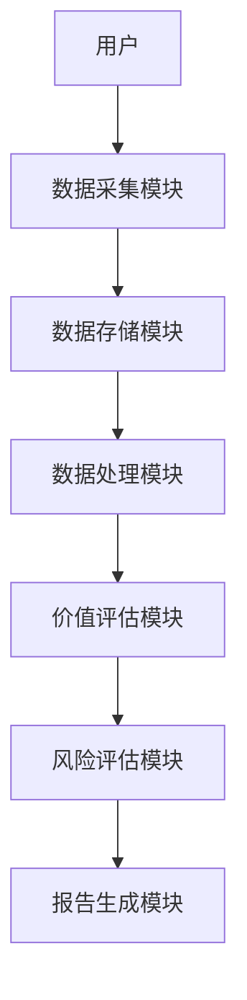
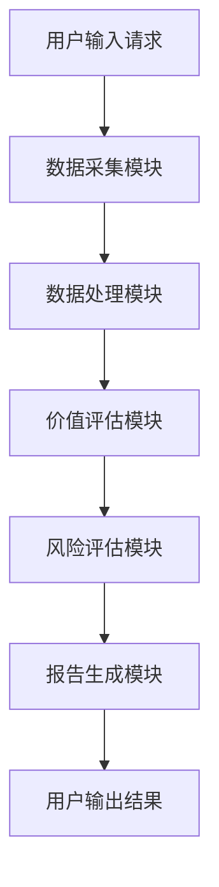

                 


# 巴菲特如何看待房地产投资

> 关键词：巴菲特, 房地产投资, 价值投资, 长期投资, 安全边际

> 摘要：本文将深入分析巴菲特在房地产投资中的策略和哲学，探讨他如何看待房地产市场的投资机会和风险。通过结合数学模型和系统架构，详细阐述他的投资理念，包括长期持有、价值评估、安全边际等核心要素，并通过实际案例展示如何应用这些策略进行房地产投资分析。

---

## 第一部分: 房地产投资的背景与核心概念

### 第1章: 房地产投资的背景介绍

#### 1.1 房地产投资的基本概念

房地产投资是指通过购买、持有、管理和处置房地产资产，以获得收益或资本增值的一种投资行为。房地产资产包括住宅、商业用房、土地等多种形式，投资者通过租金收入、资本增值或两者结合来实现收益。

#### 1.2 房地产投资的分类与特点

房地产投资可以分为以下几类：
- **住宅投资**：主要以居住为目的，通常用于出租或长期持有。
- **商业房地产投资**：包括写字楼、商场、酒店等，收益主要来自租金或商业运营。
- **工业房地产投资**：包括仓库、工厂等，主要用于企业生产或存储。
- **土地投资**：未开发或部分开发的土地，投资价值通常依赖于未来的开发潜力。

房地产投资的特点包括高门槛、高回报、高风险、周期性明显等。由于房地产资产的价值通常较高，投资者需要较大的初始资本投入。同时，房地产市场的波动性较大，受到宏观经济、政策调控等因素的影响。

#### 1.3 巴菲特与房地产投资的关联

巴菲特（Warren Buffett）是全球著名的价值投资者，他的投资哲学以“买入并持有”为核心，注重长期价值而非短期波动。尽管巴菲特的公开投资主要集中在股票市场，但他在房地产领域的见解同样体现了他的价值投资理念。他认为，房地产作为一种实物资产，具有一定的防御性，能够在通货膨胀中保值甚至增值。

---

### 第2章: 房地产投资的核心概念

#### 2.1 房地产投资的基本要素

- **地理位置**：地理位置是影响房地产价值的核心因素。交通便利、配套设施完善的区域通常具有较高的投资价值。
- **租金收益率**：租金收益率是衡量房地产投资回报的重要指标，通常表示为年租金收入与房产价值的比率。
- **资本增值**：资本增值是指房产价值的上涨，通常与经济发展、通货膨胀等因素相关。
- **风险因素**：包括市场风险、流动性风险、利率风险等，需在投资决策中加以考虑。

#### 2.2 房地产市场的基本结构

房地产市场由供给和需求两部分组成。供给方包括开发商、房东等，需求方包括购房者、租客等。市场供需关系直接影响房地产价格。政府政策、经济环境、社会文化等因素都会对房地产市场产生深远影响。

#### 2.3 巴菲特的房地产投资哲学

巴菲特的房地产投资哲学可以总结为以下几点：
1. **长期持有**：巴菲特倾向于长期持有资产，追求稳定的现金流和资本增值。
2. **价值投资**：他注重分析房地产的内在价值，寻找被市场低估的投资机会。
3. **安全边际**：在投资决策中，巴菲特强调留有安全边际，即实际价值高于市场价格的幅度，以降低投资风险。

---

## 第二部分: 巴菲特的房地产投资策略

### 第3章: 巴菲特的长期投资理念

#### 3.1 长期投资的核心思想

巴菲特认为，投资的本质是寻找具有持续竞争优势的企业或资产，并长期持有。房地产作为一种实物资产，具有稳定的收益和增值潜力，符合他的长期投资理念。

#### 3.2 价值投资原则

价值投资的核心在于寻找市场价格低于内在价值的资产。巴菲特在房地产投资中，同样注重分析资产的真实价值，寻找那些因市场波动或经济周期而被低估的投资机会。

#### 3.3 房地产投资中的长期视角

房地产市场的波动性较强，但长期来看，房产作为实物资产，其价值通常能够抵御通货膨胀。因此，巴菲特倾向于长期持有优质房地产资产，以获得稳定的现金流和资本增值。

---

### 第4章: 巴菲特的房地产投资策略

#### 4.1 买入并持有策略

买入并持有策略是巴菲特投资的核心策略之一。他认为，通过长期持有优质资产，可以避免短期市场波动带来的风险，同时享受资产增值的收益。

#### 4.2 选择优质资产的原则

优质房地产资产通常具有以下特征：
- 位置优越，交通便利，配套设施完善。
- 需求稳定，如核心城市的住宅或商业用房。
- 管理规范，租金收入稳定。

#### 4.3 风险控制与安全边际

巴菲特强调安全边际的重要性。在房地产投资中，他通常会选择市场价格低于内在价值的资产，以降低投资风险。

---

## 第三部分: 房地产投资的数学模型与分析方法

### 第5章: 房地产价值评估的数学模型

#### 5.1 现金流折现法

现金流折现法（DCF）是评估房地产价值的重要方法之一。通过将未来现金流折现为现值，可以估算资产的内在价值。公式如下：

$$ V = \sum_{t=1}^{n} \frac{CF_t}{(1 + r)^t} $$

其中，\( V \) 表示资产的内在价值，\( CF_t \) 表示第 \( t \) 年的现金流，\( r \) 表示折现率，\( n \) 表示现金流的期限。

#### 5.2 投资回报率的计算公式

投资回报率（ROI）是衡量房地产投资回报的重要指标，公式为：

$$ ROI = \frac{\text{净收益}}{\text{初始投资}} \times 100\% $$

其中，净收益为租金收入减去运营成本和税费。

#### 5.3 房地产价格波动的数学分析

房地产价格的波动可以用时间序列分析模型进行建模，常用ARIMA模型进行预测。通过分析历史价格数据，可以预测未来的价格走势。

---

### 第6章: 巴菲特投资决策的数学分析

#### 6.1 安全边际的数学定义

安全边际是指市场价格低于内在价值的部分，公式为：

$$ \text{安全边际} = \text{内在价值} - \text{市场价格} $$

巴菲特认为，安全边际越高，投资风险越小。

#### 6.2 投资组合的风险评估

通过风险分散和资产配置，可以降低投资组合的整体风险。房地产与其他资产如股票、债券等的组合，可以有效降低投资风险。

#### 6.3 数理模型在房地产投资中的应用

数理模型可以帮助投资者量化风险和收益，做出更科学的投资决策。例如，使用蒙特卡洛模拟方法，可以评估不同市场情景下的投资回报。

---

## 第四部分: 房地产投资的系统分析与架构设计

### 第7章: 房地产投资分析系统的功能设计

#### 7.1 系统功能模块划分

房地产投资分析系统通常包括以下几个功能模块：
- 数据采集与处理
- 价值评估与预测
- 风险评估与优化
- 报告生成与输出

#### 7.2 数据采集与处理流程

1. 数据源选择：包括公开市场数据、政府统计信息、第三方数据等。
2. 数据清洗：去除异常值和缺失数据。
3. 数据预处理：标准化、归一化等。

#### 7.3 系统输出与结果展示

系统输出包括：
- 房地产价值评估报告
- 投资回报预测
- 风险评估结果
- 投资建议

---

### 第8章: 房地产投资系统的架构设计

#### 8.1 系统架构图



#### 8.2 数据流与交互设计



---

## 第五部分: 房地产投资的项目实战

### 第9章: 项目环境与数据准备

#### 9.1 数据源的选择与获取

可以从政府房地产交易中心、房地产中介平台等渠道获取房地产数据。

#### 9.2 数据清洗与预处理

使用Python的Pandas库进行数据清洗和预处理：

```python
import pandas as pd

# 读取数据
data = pd.read_csv('real Estate.csv')

# 删除缺失值
data.dropna(inplace=True)

# 标准化处理
data['price'] = (data['price'] - data['price'].mean()) / data['price'].std()
```

#### 9.3 数据存储与管理

使用数据库（如MySQL）进行数据存储和管理。

---

### 第10章: 项目核心实现

#### 10.1 投资价值评估模型的实现

使用Python的Scikit-learn库进行价值评估模型的训练和预测：

```python
from sklearn.linear_model import LinearRegression

# 训练模型
model = LinearRegression()
model.fit(X_train, y_train)

# 预测价值
y_pred = model.predict(X_test)
```

#### 10.2 投资组合优化算法的实现

使用动态规划算法进行投资组合优化：

```python
import numpy as np

# 定义状态转移方程
def state_transition(state, action):
    return new_state

# 定义价值函数
def value_function(state):
    return np.dot(state, weight)
```

---

## 第六部分: 总结与展望

### 第11章: 巴菲特投资哲学的总结与展望

#### 11.1 巴菲特房地产投资的总结

巴菲特的房地产投资策略以长期持有、价值投资为核心，强调安全边际和风险控制。这些理念对投资者具有重要的借鉴意义。

#### 11.2 房地产投资的未来展望

随着科技的发展，房地产投资的分析方法和工具将更加智能化和数据化。投资者需要不断学习和适应市场变化，以抓住未来的投资机会。

---

## 作者

作者：AI天才研究院/AI Genius Institute & 禅与计算机程序设计艺术 /Zen And The Art of Computer Programming

---

通过以上结构和内容，我们可以全面了解巴菲特如何看待房地产投资，并将其应用于实际的投资决策中。

