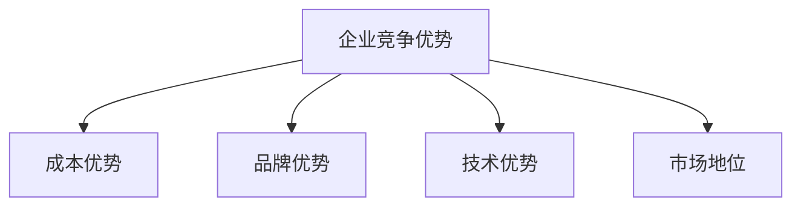
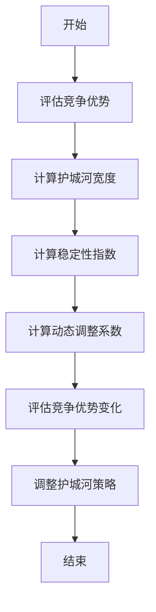
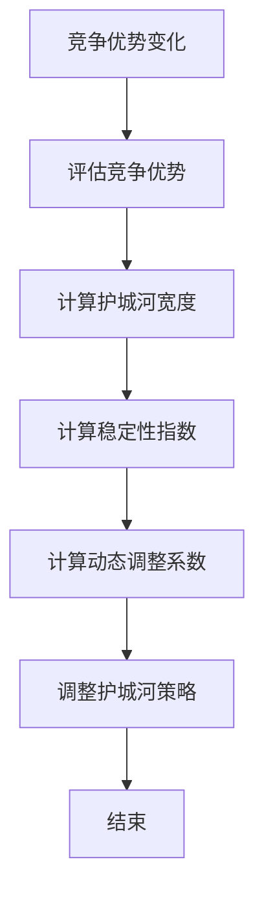
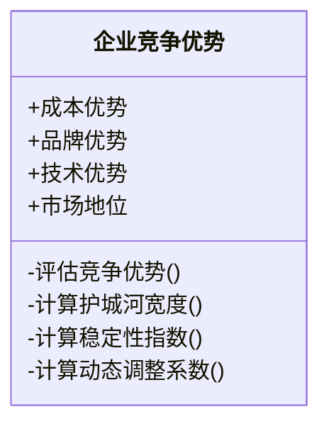
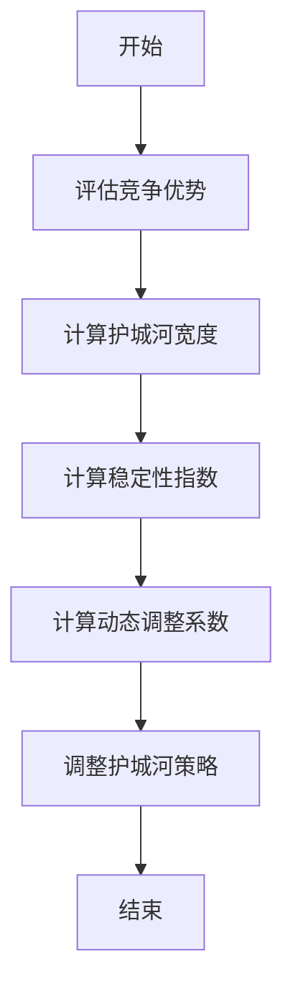

                 

# 巴菲特的护城河理论：寻找持久竞争优势

**关键词**：巴菲特，护城河理论，竞争优势，企业战略，投资分析

**摘要**：本文深入探讨了巴菲特护城河理论的核心概念，分析了不同类型竞争优势的特点，构建了护城河的数学模型，并通过实际案例展示了如何在企业战略中应用这一理论。文章还提供了系统架构图、算法流程图和系统交互图等技术工具，帮助读者更好地理解和应用护城河理论，从而在投资和企业管理中建立持久的竞争优势。

---

## 第一部分：护城河理论的背景与核心概念

### 第1章：护城河理论的背景与核心概念

#### 1.1 投资与竞争优势的重要性

##### 1.1.1 投资的基本原理
投资的本质是通过分析企业的内在价值，寻找具有持续竞争优势的企业进行长期投资。巴菲特的护城河理论是这一分析过程中的核心工具之一。

##### 1.1.2 企业竞争优势的定义
竞争优势是指企业在市场上相对于竞争对手的显著优势，这种优势可以是成本优势、品牌优势、技术优势或市场地位等。

##### 1.1.3 护城河理论的提出背景
巴菲特在《竞争优势》一书中提出，企业的竞争优势是其长期盈利能力的关键因素。护城河理论帮助企业识别和评估这些竞争优势，从而确定企业的长期价值。

#### 1.2 护城河理论的核心要素

##### 1.2.1 成本优势
成本优势是护城河的重要组成部分，企业通过规模化生产、技术创新或优化供应链降低成本，从而在价格竞争中占据优势。

##### 1.2.2 品牌优势
强大的品牌可以吸引忠诚的客户，形成市场壁垒。例如，可口可乐通过长期的品牌建设和营销，建立了强大的品牌忠诚度。

##### 1.2.3 技术优势
技术优势是护城河的重要来源，企业通过持续创新和技术积累，保持技术领先地位，从而在竞争中占据优势。

##### 1.2.4 市场地位
市场地位是指企业在市场中的影响力和占有率。强大的市场地位可以帮助企业获取更多的资源和客户，进一步巩固竞争优势。

#### 1.3 护城河的类型与特征

##### 1.3.1 可扩展性护城河
可扩展性护城河是指企业可以通过规模经济快速扩大市场份额，例如互联网企业通过网络效应实现快速扩张。

##### 1.3.2 网络效应护城河
网络效应是指用户数量的增加会增强产品的价值，例如社交平台或电商平台，用户越多，平台的价值越高。

##### 1.3.3 规模经济护城河
规模经济是指企业通过规模化生产降低成本，从而在价格竞争中占据优势。

##### 1.3.4 品牌忠诚度护城河
品牌忠诚度是指客户对企业品牌的偏好程度，强大的品牌忠诚度可以减少客户流失，增强市场地位。

#### 1.4 护城河的动态变化与挑战

##### 1.4.1 护城河的动态性
护城河并非一成不变，随着市场环境和技术的变化，竞争优势可能逐渐减弱，企业需要不断调整和优化。

##### 1.4.2 竞争对手的挑战
竞争对手的模仿和创新可能削弱企业的竞争优势，企业需要持续创新和优化护城河。

##### 1.4.3 技术变革的影响
技术变革可能导致原有竞争优势的失效，企业需要及时调整战略，抓住新技术带来的机会。

#### 1.5 本章小结
本章介绍了巴菲特护城河理论的背景和核心概念，分析了不同类型竞争优势的特点和影响因素，为后续的深入分析奠定了基础。

---

## 第二部分：护城河理论的数学模型与分析方法

### 第2章：护城河理论的数学模型与分析方法

#### 2.1 护城河的量化分析

##### 2.1.1 企业竞争优势的数学模型
企业竞争优势可以通过以下几个因素量化：成本优势（C）、品牌优势（B）、技术优势（T）和市场地位（M）。

##### 2.1.2 护城河宽度的计算公式
护城河宽度（W）的计算公式如下：
$$ W = \frac{C + B + T + M}{4} $$
其中，C、B、T、M分别代表成本优势、品牌优势、技术优势和市场地位的评分，范围在1到10之间。

##### 2.1.3 护城河深度的计算公式
护城河深度（D）的计算公式如下：
$$ D = \sum_{i=1}^{n} w_i \cdot x_i $$
其中，w_i是第i个竞争优势的权重，x_i是该竞争优势的评分。

#### 2.2 护城河的稳定性分析

##### 2.2.1 稳定性分析的数学模型
企业竞争优势的稳定性指数（S）计算公式如下：
$$ S = \sum_{i=1}^{n} \frac{w_i \cdot x_i}{\sigma_i} $$
其中，σ_i是第i个竞争优势的波动性指标。

#### 2.3 护城河的动态调整模型

##### 2.3.1 动态调整的数学公式
动态调整系数（D）的计算公式如下：
$$ D = \frac{S}{T} $$
其中，S是稳定性指数，T是时间跨度。

#### 2.4 护城河分析的工具与方法

##### 2.4.1 护城河分析框架
以下是护城河分析框架的系统架构图：

##### 2.4.2 护城河指数评分系统
护城河指数（HI）计算公式如下：
$$ HI = \frac{W \cdot D}{S} $$
其中，W是护城河宽度，D是动态调整系数，S是稳定性指数。

##### 2.4.3 护城河动态调整模型
以下是护城河动态调整模型的流程图：

#### 2.5 本章小结
本章通过数学模型和分析方法，量化了护城河的宽度、深度和稳定性，提供了护城河分析的工具和方法，帮助读者更好地理解和应用护城河理论。

---

## 第三部分：护城河理论的系统分析与架构设计

### 第3章：护城河理论的系统分析与架构设计

#### 3.1 企业竞争优势的系统分析

##### 3.1.1 企业竞争优势的系统架构
以下是企业竞争优势的系统架构图：

##### 3.1.2 竞争优势的动态变化分析
以下是竞争优势动态变化的流程图：

#### 3.2 企业竞争优势的系统架构设计

##### 3.2.1 系统功能设计
以下是企业竞争优势的系统功能设计类图：

##### 3.2.2 系统架构设计
以下是企业竞争优势的系统架构设计图：

#### 3.3 企业竞争优势的系统交互设计

##### 3.3.1 系统交互设计
以下是企业竞争优势的系统交互设计序列图：

#### 3.4 本章小结
本章通过系统分析和架构设计，展示了如何将护城河理论应用于企业竞争优势的分析中，提供了系统的工具和方法，帮助读者更好地理解和应用护城河理论。

---

## 第四部分：护城河理论的实践应用与案例分析

### 第4章：护城河理论的实践应用与案例分析

#### 4.1 护城河理论的实践应用

##### 4.1.1 护城河战略的制定
护城河战略的制定需要考虑企业的核心竞争优势，如成本优势、品牌优势、技术优势和市场地位，并根据市场环境制定相应的战略。

##### 4.1.2 护城河的动态调整
护城河的动态调整需要根据市场环境的变化，及时调整企业的竞争优势，保持护城河的稳定性和有效性。

##### 4.1.3 不同行业中的应用
护城河理论在不同行业中的应用有所不同，例如互联网行业需要考虑网络效应，消费品行业需要考虑品牌忠诚度。

#### 4.2 护城河理论的实际案例分析

##### 4.2.1 微软的护城河
微软通过技术创新和生态系统建设，建立了强大的技术优势和网络效应护城河。

##### 4.2.2 可口可乐的护城河
可口可乐通过品牌建设和全球分销网络，建立了强大的品牌优势和成本优势。

##### 4.2.3 亚马逊的护城河
亚马逊通过规模经济和网络效应，建立了强大的成本优势和技术优势。

#### 4.3 本章小结
本章通过实际案例分析，展示了护城河理论在不同行业中的应用，帮助读者更好地理解和应用护城河理论。

---

## 第五部分：总结与展望

### 第5章：总结与展望

#### 5.1 本书总结
本书系统地介绍了巴菲特护城河理论的核心概念、数学模型和分析方法，通过实际案例展示了护城河理论的应用，提供了系统的工具和方法，帮助读者更好地理解和应用护城河理论。

#### 5.2 未来展望
随着市场环境和技术的变化，护城河理论将不断 evolve，企业需要持续创新和优化护城河，保持竞争优势。

#### 5.3 本章小结
本章总结了全书内容，展望了未来的发展趋势，鼓励读者持续关注和应用护城河理论，从而在投资和企业管理中建立持久的竞争优势。

---

**作者：AI天才研究院/AI Genius Institute & 禅与计算机程序设计艺术 /Zen And The Art of Computer Programming**

---

### 附录：护城河理论的相关工具与资源

- **护城河宽度计算公式**：
  $$ W = \frac{C + B + T + M}{4} $$
  
- **护城河深度计算公式**：
  $$ D = \sum_{i=1}^{n} w_i \cdot x_i $$

- **护城河稳定性指数计算公式**：
  $$ S = \sum_{i=1}^{n} \frac{w_i \cdot x_i}{\sigma_i} $$

- **护城河动态调整系数计算公式**：
  $$ D = \frac{S}{T} $$

---

通过以上目录结构和内容，我们可以看到，护城河理论在企业竞争优势分析中的重要性，以及如何通过数学模型和系统架构图等技术工具，帮助企业识别和评估竞争优势，从而在投资和企业管理中建立持久的竞争优势。

