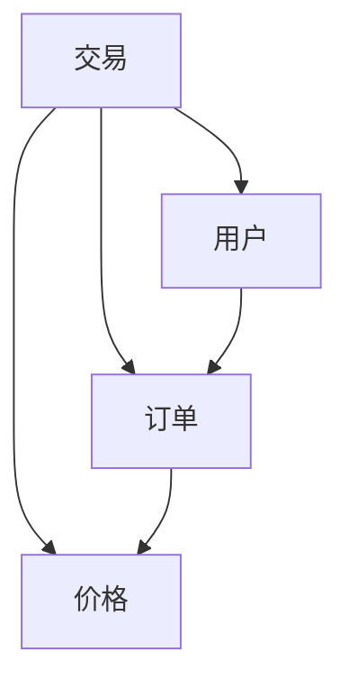
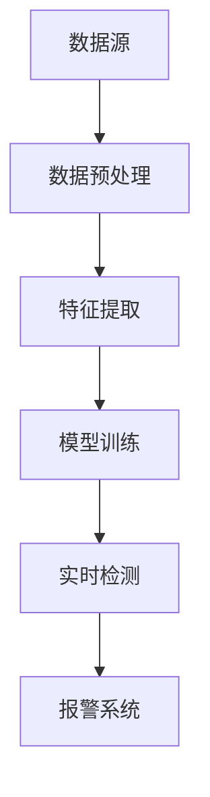
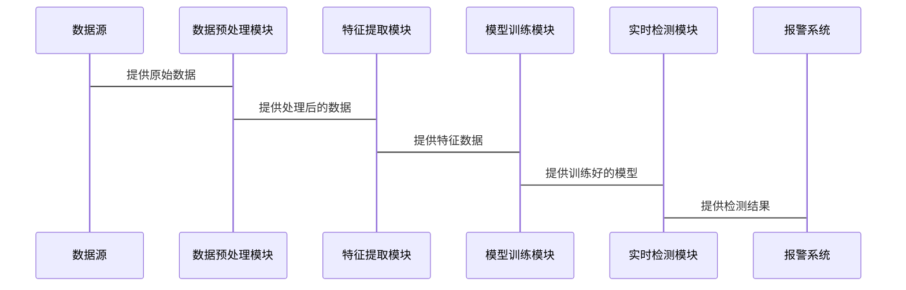

                 


# 开发智能化的金融市场异常交易检测模型

**关键词**：金融市场，异常交易，机器学习，深度学习，人工智能，检测模型

**摘要**：本文详细探讨了如何开发智能化的金融市场异常交易检测模型。通过分析异常交易的背景、核心概念、算法原理、系统架构、项目实战以及最佳实践，本文为读者提供了从理论到实践的全面指导。文章结合数学模型、mermaid图表和代码示例，深入剖析了异常交易检测的关键技术，并通过具体案例展示了如何实现高效的检测系统。

---

## 第1章: 异常交易检测的背景与意义

### 1.1 异常交易检测的背景与意义

#### 1.1.1 金融市场中的异常交易现象
金融市场中的异常交易是指偏离正常市场行为的交易活动，通常表现为价格剧烈波动、交易量异常、交易行为异常等。这些异常交易可能对市场稳定性造成重大影响，例如操纵市场、内幕交易、高频交易等。

#### 1.1.2 异常交易检测的重要性
异常交易检测是维护金融市场公平性和稳定性的关键环节。通过及时发现和处理异常交易，可以有效减少市场风险，保护投资者利益，并提高交易系统的透明度和可信度。

#### 1.1.3 智能化检测的必要性
随着金融市场交易量的急剧增加和交易行为的复杂化，传统的基于规则的检测方法已难以应对复杂的异常交易模式。智能化检测方法，如机器学习和深度学习，能够通过数据分析自动发现异常交易行为，显著提高了检测的准确性和效率。

---

## 第2章: 异常交易检测的核心概念与联系

### 2.1 异常交易检测的原理

#### 2.1.1 数据驱动的异常检测
数据驱动的异常检测方法依赖于历史交易数据，通过统计分析或机器学习算法识别异常模式。例如，使用均值-方差模型分析交易行为的偏离程度。

#### 2.1.2 基于模型的异常检测
基于模型的异常检测方法通过构建交易行为模型，识别与模型预测结果不符的交易行为。例如，使用时间序列模型预测正常交易价格，并识别偏离预测值的交易。

#### 2.1.3 统计方法与机器学习的结合
结合统计方法和机器学习算法可以提高异常检测的准确性和鲁棒性。例如，使用统计方法提取特征，再通过机器学习模型进行分类或聚类。

### 2.2 异常交易检测的核心属性特征对比

#### 2.2.1 数据特征对比表
| 特征属性 | 正常交易 | 异常交易 |
|----------|----------|----------|
| 交易量   | 稳定     | 剧增或剧减 |
| 价格     | 随市波动 | 突然大幅波动 |
| 时间间隔 | 均匀分布 | 集中或间隔异常 |

#### 2.2.2 模型性能对比表
| 模型类型       | 准确率 | 召回率 | 处理速度 |
|----------------|--------|--------|----------|
| 基于规则的检测 | 70%    | 80%    | 快        |
| 机器学习模型   | 85%    | 85%    | 中        |
| 深度学习模型   | 90%    | 90%    | 较慢      |

#### 2.2.3 方法优缺点对比表
| 方法类型       | 优点               | 缺点               |
|----------------|--------------------|--------------------|
| 基于规则的检测 | 实现简单，易于解释   | 需手动设定规则，漏检率高 |
| 机器学习模型   | 自动学习，准确率高   | 需大量数据，计算复杂 |
| 深度学习模型   | 高精度，复杂模式识别 | 训练时间长，资源消耗大 |

### 2.3 ER实体关系图架构


---

## 第3章: 异常交易检测算法原理

### 3.1 监督学习算法

#### 3.1.1 基于分类的异常检测
监督学习算法通过分类模型将交易行为分为正常和异常类别。例如，使用逻辑回归或随机森林进行分类。

#### 3.1.2 标签数据的获取与处理
异常交易的标签数据可以通过监管机构提供的历史数据或人工标注获得。数据预处理包括特征提取、归一化和缺失值处理。

#### 3.1.3 常见监督学习算法（如XGBoost）
XGBoost是一种高效的集成学习算法，适用于分类和回归任务。其核心思想是通过多棵决策树的组合，逐步优化预测结果。

### 3.2 无监督学习算法

#### 3.2.1 基于聚类的异常检测
无监督学习算法通过聚类分析将交易行为分为不同的簇，识别与主簇显著偏离的异常簇。

#### 3.2.2 基于密度的异常检测
基于密度的异常检测方法（如DBSCAN）通过计算数据点的局部密度，识别密度较低的区域中的异常点。

#### 3.2.3 常见无监督算法（如Isolation Forest）
Isolation Forest是一种基于树的异常检测算法，通过构建隔离树将数据点隔离，快速识别异常点。

---

## 第4章: 异常交易检测系统的架构设计

### 4.1 问题场景介绍
异常交易检测系统需要处理高频交易、大额交易和非正常交易时间的交易行为。系统需要实时处理大量数据，并快速生成报警信号。

### 4.2 系统功能设计

#### 4.2.1 数据预处理模块
数据预处理模块负责清洗和转换原始交易数据，提取特征并归一化处理。

#### 4.2.2 特征提取模块
特征提取模块从交易数据中提取关键特征，例如交易量、价格波动、时间间隔等。

#### 4.2.3 模型训练模块
模型训练模块使用训练数据训练异常检测模型，并保存模型参数。

#### 4.2.4 实时检测模块
实时检测模块接收实时交易数据，通过模型进行异常检测，并生成报警信号。

### 4.3 系统架构设计

#### 4.3.1 系统架构图


#### 4.3.2 系统交互图


---

## 第5章: 项目实战与案例分析

### 5.1 环境安装与配置
安装必要的开发环境，包括Python、TensorFlow、Scikit-learn等。

### 5.2 核心代码实现

#### 5.2.1 数据预处理代码
```python
import pandas as pd
import numpy as np

# 加载数据
data = pd.read_csv('transaction.csv')

# 数据清洗
data.dropna(inplace=True)
data['时间'] = pd.to_datetime(data['时间'])
data['时间差'] = data['时间'].diff().dt.total_seconds()

# 特征提取
features = data[['交易量', '价格', '时间差']]
features = (features - features.mean()) / features.std()
```

#### 5.2.2 模型训练代码
```python
from sklearn.ensemble import IsolationForest

# 初始化模型
model = IsolationForest(n_estimators=100, contamination=0.05)

# 训练模型
model.fit(features)

# 预测异常点
data['异常标签'] = model.predict(features)
```

### 5.3 案例分析与解读
通过实际案例分析，展示异常交易检测模型在实际中的应用效果。例如，检测某次市场操纵事件中的异常交易行为。

---

## 第6章: 最佳实践与小结

### 6.1 最佳实践
- 数据预处理是关键，确保数据质量和特征提取的准确性。
- 结合多种算法进行模型集成，提高检测的准确性和鲁棒性。
- 定期更新模型，适应市场变化和新的异常交易模式。

### 6.2 小结
本文详细探讨了智能化的金融市场异常交易检测模型的开发过程，从理论分析到实际应用，为读者提供了全面的指导。通过结合机器学习和深度学习技术，可以有效提高异常交易检测的准确性和效率，为金融市场的稳定运行提供有力支持。

---

## 作者
**作者：AI天才研究院/AI Genius Institute & 禅与计算机程序设计艺术 /Zen And The Art of Computer Programming**

---

**备注**：由于篇幅限制，本文未展示全部内容，具体内容可根据实际需求进行扩展和补充。

