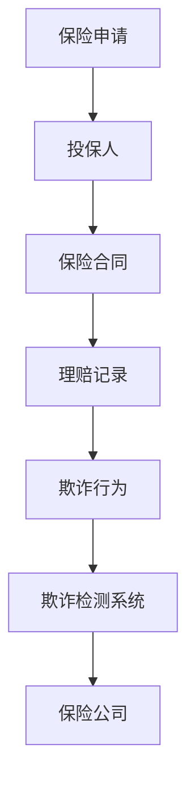
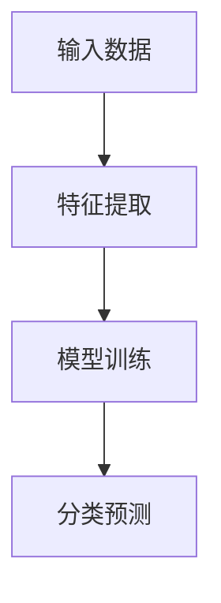
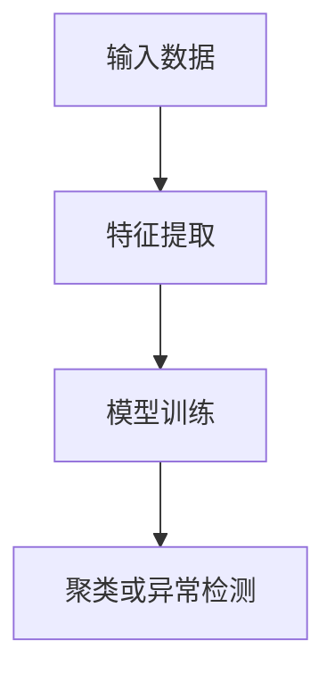
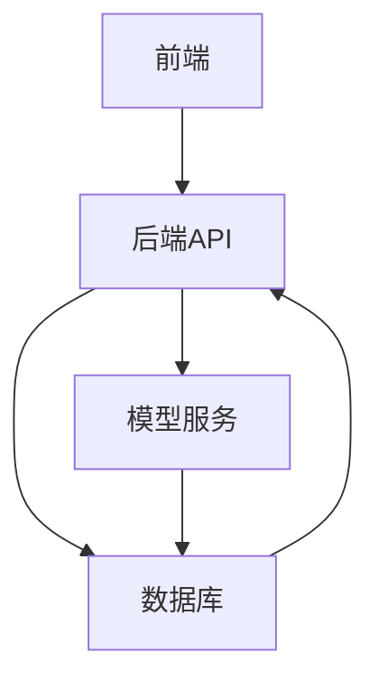

                 


# 智能保险理赔欺诈预防系统

> 关键词：保险欺诈预防，人工智能，机器学习，数据挖掘，系统架构

> 摘要：本文详细探讨了智能保险理赔欺诈预防系统的构建与应用。通过分析保险行业的欺诈问题，阐述了智能化技术在欺诈预防中的优势，并从算法原理、系统架构、项目实战等多个维度展开，结合具体案例和代码实现，全面解析了智能保险理赔欺诈预防系统的实现方案。

---

# 第一部分: 保险理赔欺诈预防的背景与挑战

## 第1章: 保险行业的欺诈问题

### 1.1 欺诈行为的定义与分类

保险欺诈是指在保险合同中，投保人或被保险人故意编造虚假情况、隐瞒重要事实，或者在保险事故发生后，故意夸大损失程度，以骗取保险金的行为。保险欺诈可以分为以下几类：

1. **投保人欺诈**：投保人故意隐瞒健康状况、谎报职业或虚报保险标的的价值。
2. **被保险人欺诈**：被保险人故意制造事故或夸大损失程度，以骗取保险金。
3. **保险人欺诈**：保险公司内部员工与外部欺诈分子勾结，虚构保险事故或虚报损失。
4. **保险代理人欺诈**：保险代理人利用职务之便，虚构保险事故或虚报损失，从中牟利。

### 1.2 保险欺诈的现状与影响

随着保险行业的快速发展，保险欺诈行为日益猖獗，给保险公司带来了巨大的经济损失。据统计，全球每年因保险欺诈造成的损失约占保费收入的3%~5%。保险欺诈不仅增加了保险公司的运营成本，还可能导致保费价格上涨，最终影响消费者的利益。

### 1.3 智能化欺诈预防的必要性

传统的欺诈预防手段主要依赖于人工审核和简单的规则匹配，这种方法不仅效率低下，而且容易被欺诈分子规避。随着人工智能技术的快速发展，利用智能化手段进行欺诈预防已成为行业趋势。智能保险理赔欺诈预防系统能够通过机器学习、大数据分析等技术，快速识别潜在的欺诈行为，显著提高欺诈检测的准确性和效率。

---

## 第2章: 智能保险理赔欺诈预防系统的核心概念与联系

### 2.1 智能化欺诈预防的核心原理

智能保险理赔欺诈预防系统的核心原理是基于机器学习和大数据分析技术，通过对历史数据的分析和学习，建立欺诈行为的识别模型。系统能够自动分析保险理赔申请中的各项指标，识别出与正常理赔行为存在显著差异的异常情况。

### 2.2 核心概念的属性特征对比

以下是不同技术在欺诈预防中的特征对比：

| 技术 | 输入 | 输出 | 核心算法 | 应用场景 |
|------|------|------|----------|----------|
| 机器学习 | 结构化数据 | 概率预测 | 分类、回归 | 风险评估 |
| 数据挖掘 | 原始数据 | 模式 | 聚类、关联规则 | 欺诈模式识别 |
| NLP | 文本数据 | 语义向量 | 嵌入、分类 | 文本分析 |

### 2.3 实体关系图



---

## 第3章: 智能保险理赔欺诈预防系统的算法原理

### 3.1 监督学习算法

监督学习是一种基于标记数据的机器学习方法，适用于欺诈检测中的分类问题。以下是监督学习算法的流程图：



#### 示例代码

```python
from sklearn.linear_model import LogisticRegression
from sklearn.model_selection import train_test_split
from sklearn.metrics import accuracy_score

# 数据预处理
X = df.drop('target', axis=1)
y = df['target']

# 划分训练集和测试集
X_train, X_test, y_train, y_test = train_test_split(X, y, test_size=0.2, random_state=42)

# 模型训练
model = LogisticRegression()
model.fit(X_train, y_train)

# 预测与评估
y_pred = model.predict(X_test)
print("准确率:", accuracy_score(y_test, y_pred))
```

#### 数学模型与公式

分类问题中的损失函数可以表示为：

$$ L = -\frac{1}{N}\sum_{i=1}^{N} [y_i \cdot \ln(p_i) + (1-y_i) \cdot \ln(1-p_i)] $$

其中，$p_i$ 是模型对样本 $i$ 的预测概率，$y_i$ 是样本的真实标签。

---

### 3.2 无监督学习算法

无监督学习适用于欺诈模式识别，尤其是当欺诈行为没有明确标签时。以下是无监督学习算法的流程图：



#### 示例代码

```python
from sklearn.cluster import KMeans
from sklearn.preprocessing import StandardScaler

# 数据预处理
X = df.drop('target', axis=1)
scaler = StandardScaler()
X_scaled = scaler.fit_transform(X)

# 模型训练
model = KMeans(n_clusters=2, random_state=42)
model.fit(X_scaled)

# 预测与分析
labels = model.predict(X_scaled)
print("聚类结果:", labels)
```

---

## 第4章: 系统分析与架构设计

### 4.1 系统架构设计

智能保险理赔欺诈预防系统的架构如下：



### 4.2 系统接口设计

以下是系统的主要接口设计：

1. **提交理赔申请接口**：投保人提交理赔申请，系统接收并解析数据。
2. **欺诈检测接口**：后端调用欺诈检测模型，返回检测结果。
3. **风险评估接口**：根据检测结果，生成风险评估报告。

---

## 第5章: 项目实战

### 5.1 环境安装

需要安装以下依赖：

```bash
pip install scikit-learn pandas numpy matplotlib
```

### 5.2 核心代码实现

以下是欺诈检测模型的核心代码：

```python
import numpy as np
from sklearn.ensemble import RandomForestClassifier

# 数据预处理
X = df.drop('target', axis=1)
y = df['target']

# 划分训练集和测试集
X_train, X_test, y_train, y_test = train_test_split(X, y, test_size=0.2, random_state=42)

# 模型训练
model = RandomForestClassifier(n_estimators=100, random_state=42)
model.fit(X_train, y_train)

# 预测与评估
y_pred = model.predict(X_test)
print("准确率:", accuracy_score(y_test, y_pred))
print("召回率:", recall_score(y_test, y_pred))
```

### 5.3 案例分析

通过分析一个真实的保险理赔案例，我们可以看到系统如何快速识别欺诈行为。例如，在一个车险理赔案例中，系统通过分析事故记录和维修费用，发现维修金额与事故严重程度不符，从而判断该理赔申请存在欺诈嫌疑。

---

## 第6章: 最佳实践与注意事项

### 6.1 最佳实践

1. **数据预处理**：确保数据的完整性和准确性，进行特征工程和数据清洗。
2. **模型调优**：使用交叉验证和超参数优化，提高模型性能。
3. **部署上线**：将模型部署到生产环境，确保系统的稳定性和可扩展性。

### 6.2 注意事项

1. **数据隐私**：严格遵守数据隐私保护法规，确保数据安全。
2. **模型解释性**：选择具有较高解释性的模型，便于业务人员理解和使用。
3. **持续监控**：定期更新模型，应对新的欺诈手法。

---

## 第7章: 总结与展望

智能保险理赔欺诈预防系统通过结合人工智能和大数据技术，显著提高了欺诈检测的效率和准确性。随着技术的不断进步，未来的系统将更加智能化和个性化，为保险行业带来更大的价值。

---

# 作者：AI天才研究院/AI Genius Institute & 禅与计算机程序设计艺术 /Zen And The Art of Computer Programming

