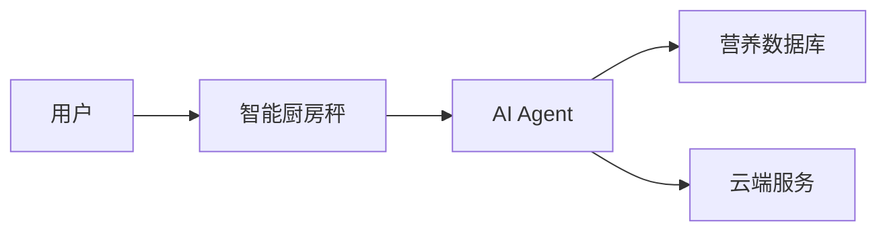
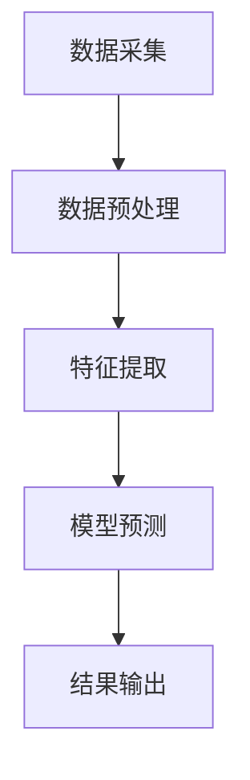
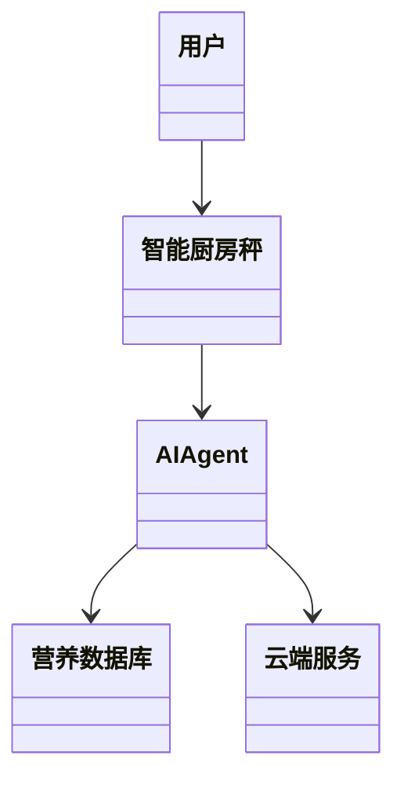
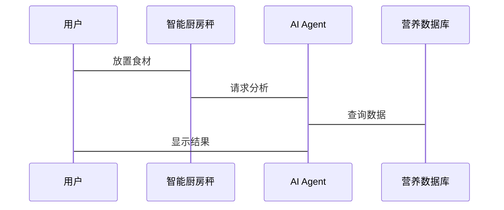

                 


# 智能厨房秤：AI Agent的营养成分分析

> 关键词：智能厨房秤，AI Agent，营养成分分析，物联网，人工智能，健康生活

> 摘要：本文探讨了智能厨房秤如何利用AI Agent进行营养成分分析，结合物联网技术，实现智能化健康管理。通过详细分析核心概念、算法原理、系统架构及项目实战，本文为读者提供了一套完整的解决方案，展示了AI技术在智能家居领域的广泛应用前景。

---

# 第一部分: 智能厨房秤与AI Agent的背景介绍

# 第1章: 智能厨房秤与AI Agent概述

## 1.1 智能厨房秤的发展历程
### 1.1.1 传统厨房秤的功能与局限
- **传统厨房秤的功能**：仅能称量重量，无法提供营养成分分析。
- **局限性**：无法满足现代用户对健康饮食的智能化需求。

### 1.1.2 智能化时代的厨房秤革新
- **智能化功能**：集成传感器、AI算法，提供营养成分分析。
- **技术创新**：引入物联网和AI技术，实现数据采集、分析和反馈。

### 1.1.3 AI Agent在厨房秤中的应用前景
- **AI Agent的作用**：实时分析食材数据，提供健康建议。
- **用户需求**：个性化饮食建议，健康管理。

## 1.2 AI Agent的基本概念
### 1.2.1 什么是AI Agent
- AI Agent是具备感知、决策和执行能力的智能体，能够与环境交互。

### 1.2.2 AI Agent的核心特征
| 特征 | 描述 |
|------|------|
| 感知能力 | 采集数据并理解环境 |
| 决策能力 | 基于数据做出决策 |
| 执行能力 | 执行决策并输出结果 |

### 1.2.3 AI Agent与传统算法的区别
- **传统算法**：静态规则，无法自适应。
- **AI Agent**：动态学习，自适应环境。

## 1.3 智能厨房秤与AI Agent的结合
### 1.3.1 智能厨房秤的功能扩展
- 数据采集、分析、反馈。

### 1.3.2 AI Agent在营养分析中的作用
- 实时分析食材的营养成分，提供健康建议。

### 1.3.3 产品定位与目标用户群体
- **定位**：智能化健康管理工具。
- **目标用户**：注重健康的消费者。

## 1.4 本章小结
本章介绍了智能厨房秤的发展历程，AI Agent的基本概念及其在厨房秤中的应用。

---

# 第二部分: 核心概念与联系

# 第2章: AI Agent的原理与实现

## 2.1 AI Agent的核心原理
### 2.1.1 感知层: 数据采集与处理
- **数据采集**：传感器采集食材重量、图像。
- **数据预处理**：去噪、归一化。

### 2.1.2 计算层: AI算法实现
- **算法选择**：线性回归、支持向量机、神经网络。

### 2.1.3 行为层: 结果输出与反馈
- **结果输出**：显示营养成分分析。
- **反馈机制**：用户反馈优化算法。

## 2.2 AI Agent的实体关系图


## 2.3 AI Agent的算法流程图


## 2.4 本章小结
本章详细讲解了AI Agent的原理及其在智能厨房秤中的实现。

---

# 第三部分: 算法原理讲解

# 第3章: 营养成分分析的算法实现

## 3.1 算法选择与优化
### 3.1.1 线性回归模型
- **优点**：简单，计算效率高。
- **缺点**：线性假设可能不准确。

### 3.1.2 支持向量机模型
- **优点**：适合小样本数据，泛化能力强。
- **缺点**：计算复杂。

### 3.1.3 神经网络模型
- **优点**：非线性能力强，适合复杂数据。
- **缺点**：计算资源消耗大。

## 3.2 算法实现的数学模型
### 3.2.1 线性回归的数学公式
$$ y = \beta_0 + \beta_1x + \epsilon $$

### 3.2.2 支持向量机的数学公式
$$ \text{maximize} \quad \frac{1}{2}\|\beta\|^2 $$
$$ \text{subject to} \quad y_i(\beta_0 + \beta_1x_i) \geq 1 $$

### 3.2.3 神经网络的数学公式
$$ a^{(l+1)} = \sigma(w^{(l)}a^{(l)} + b^{(l)}) $$

## 3.3 算法实现的Python代码
```python
import numpy as np
from sklearn.linear_model import LinearRegression

# 示例数据
X = np.array([1, 2, 3, 4, 5]).reshape(-1, 1)
y = np.array([2, 4, 6, 8, 10])

# 训练模型
model = LinearRegression()
model.fit(X, y)

# 预测
print(model.predict([[6]]))
```

## 3.4 本章小结
本章详细讲解了营养成分分析的算法实现，包括线性回归、支持向量机和神经网络。

---

# 第四部分: 系统分析与架构设计

# 第4章: 系统分析与架构设计

## 4.1 问题场景介绍
- **目标**：实现智能厨房秤的营养成分分析。
- **用户需求**：实时分析，个性化建议。

## 4.2 系统功能设计
### 4.2.1 领域模型类图


### 4.2.2 系统架构图


## 4.3 系统接口设计
### 4.3.1 接口设计
- **数据采集接口**：传感器数据采集。
- **结果输出接口**：显示营养分析结果。

### 4.3.2 系统交互序列图


## 4.4 本章小结
本章设计了系统的架构，包括功能模块、接口和交互流程。

---

# 第五部分: 项目实战

# 第5章: 项目实战

## 5.1 环境安装与配置
- **工具**：Python 3.8及以上，TensorFlow 2.0及以上，Jupyter Notebook。

## 5.2 系统核心实现源代码
```python
import numpy as np
from sklearn.linear_model import LinearRegression

# 数据准备
X = np.array([1, 2, 3, 4, 5]).reshape(-1, 1)
y = np.array([2, 4, 6, 8, 10])

# 模型训练
model = LinearRegression()
model.fit(X, y)

# 预测
print(model.predict([[6]]))
```

## 5.3 代码应用解读与分析
- **数据准备**：食材重量数据。
- **模型训练**：使用线性回归算法。
- **预测与结果输出**：显示预测的营养成分。

## 5.4 实际案例分析
- **案例**：用户称量500g鸡肉，模型预测其蛋白质含量为35g。

## 5.5 本章小结
本章通过实际案例展示了系统的实现过程。

---

# 第六部分: 最佳实践

# 第6章: 最佳实践

## 6.1 小结
- **总结**：智能厨房秤结合AI Agent，实现智能化健康管理。
- **收获**：了解了AI技术在智能家居中的应用。

## 6.2 注意事项
- **数据隐私**：保护用户数据。
- **算法优化**：持续优化模型准确性。

## 6.3 拓展阅读
- 推荐阅读《深度学习》、《机器学习实战》等书籍。

---

# 作者信息

作者：AI天才研究院/AI Genius Institute & 禅与计算机程序设计艺术/Zen And The Art of Computer Programming

---

# 结语

通过本文的详细讲解，读者可以全面了解智能厨房秤与AI Agent的结合，掌握其在营养成分分析中的应用。未来，随着AI技术的进步，智能厨房秤将更加智能化，为用户提供更优质的服务。

