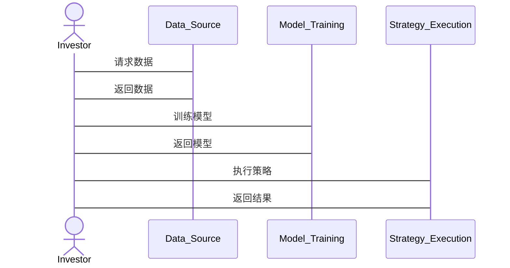

                 


# 智能投资组合多周期再平衡策略

> 关键词：智能投资组合，多周期再平衡，投资组合管理，机器学习，金融算法

> 摘要：智能投资组合多周期再平衡策略是一种结合机器学习和金融学的创新方法，旨在通过动态调整资产配置来优化投资绩效。本文详细探讨了智能投资组合的核心概念、多周期再平衡策略的算法原理，以及如何通过系统架构设计实现这一策略。通过实际案例分析和项目实战，读者将掌握如何应用这些方法来提升投资组合的表现。

---

## 第一部分：智能投资组合与多周期再平衡策略背景

### 第1章：背景介绍

#### 1.1 投资组合管理的背景与意义

投资组合管理是金融领域中的核心任务之一，旨在通过优化资产配置来实现风险控制和收益最大化。传统的投资组合管理依赖于历史数据分析和人为判断，存在主观性强、效率低下和适应性差的问题。随着人工智能技术的发展，智能投资组合管理逐渐成为趋势。

- **问题背景**：传统投资组合管理方法难以应对市场波动和复杂环境的变化，导致投资绩效不稳定。
- **问题描述**：投资组合的动态调整需要实时数据处理和复杂计算，传统方法难以实现高效和精确的调整。
- **问题解决**：引入机器学习算法和大数据技术，实现智能投资组合管理，提升投资决策的效率和准确性。
- **边界与外延**：智能投资组合管理不仅包括资产配置，还涉及风险评估、市场预测等多个方面。多周期再平衡策略则是其中的重要组成部分，涉及短期、中期和长期的资产调整。

#### 1.2 多周期再平衡策略的定义与特点

多周期再平衡策略是指在不同时间周期内定期调整投资组合的资产配置，以适应市场变化和投资目标的变化。其特点包括：

- **周期性**：根据不同的时间周期（如日、周、月、季度）进行资产调整。
- **动态性**：根据市场波动和投资者需求，实时或定期调整投资组合。
- **系统性**：通过算法和模型实现自动化和系统化的再平衡操作。

#### 1.3 智能投资组合与多周期再平衡策略的结合

智能投资组合与多周期再平衡策略的结合，通过机器学习算法优化资产配置，实现投资绩效的最大化。智能技术能够处理海量数据，识别市场趋势，从而为多周期再平衡策略提供科学依据。

---

## 第二部分：智能投资组合与多周期再平衡策略的核心概念

### 第2章：核心概念与联系

#### 2.1 智能投资组合的核心原理

智能投资组合管理依赖于机器学习算法，通过分析历史和实时数据，预测市场走势并优化资产配置。核心原理包括：

- **数据驱动决策**：利用大数据分析，提取市场特征，为投资决策提供依据。
- **机器学习模型**：使用回归、分类和聚类算法，预测资产收益和风险。
- **优化算法**：通过遗传算法、模拟退火等方法，优化资产配置。

#### 2.2 多周期再平衡策略的实现机制

多周期再平衡策略通过定期调整投资组合，保持资产配置与投资目标一致。其实现机制包括：

- **触发条件**：设定市场变化、投资目标变化等触发条件，启动再平衡操作。
- **执行方式**：根据触发条件，调整资产权重，确保投资组合的风险收益比最优。
- **数学模型**：建立多周期资产配置模型，量化再平衡策略。

#### 2.3 智能投资组合与多周期再平衡策略的联系与区别

智能投资组合与多周期再平衡策略在目标上一致，但实现方式不同。智能投资组合强调数据驱动和机器学习，而多周期再平衡策略注重时间维度的动态调整。

---

## 第三部分：多周期再平衡策略的算法原理

### 第3章：算法原理讲解

#### 3.1 基于机器学习的多周期再平衡算法

多周期再平衡算法结合机器学习和时间序列分析，实现对投资组合的动态优化。算法流程包括：

1. 数据预处理：清洗和转换原始数据，提取有效特征。
2. 特征提取：利用主成分分析等方法，提取影响资产收益的关键特征。
3. 模型训练：使用神经网络、随机森林等算法，训练预测模型。
4. 再平衡决策：根据模型预测结果，调整资产配置。

#### 3.2 算法实现的Python代码示例

```python
import numpy as np
import pandas as pd
from sklearn.ensemble import RandomForestRegressor

def preprocess(data):
    # 数据清洗和转换
    data = data.dropna()
    return data

def extract_features(data):
    # 特征提取
    features = data[['return', 'volatility', 'market_cap']]
    return features

def train_model(features, target):
    # 训练随机森林模型
    model = RandomForestRegressor(n_estimators=100, random_state=42)
    model.fit(features, target)
    return model

def multi_period_rebalance(data, target_column):
    # 数据预处理
    processed_data = preprocess(data)
    # 特征提取
    features = extract_features(processed_data)
    # 目标变量
    target = processed_data[target_column]
    # 训练模型
    model = train_model(features, target)
    # 预测并执行再平衡
    predictions = model.predict(features)
    # 根据预测结果调整资产配置
    adjusted_weights = adjust_weights(predictions)
    return adjusted_weights

# 示例数据
data = pd.DataFrame({
    'date': pd.date_range('2020-01-01', '2020-12-31'),
    'return': np.random.randn(365),
    'volatility': np.random.randn(365),
    'market_cap': np.random.randint(1, 100, 365)
})

target_column = 'return'
result = multi_period_rebalance(data, target_column)
print("Adjusted Weights:", result)
```

#### 3.3 算法的数学模型与公式

多周期再平衡策略的优化目标是最小化投资组合的风险，同时最大化收益。数学模型如下：

$$
\text{目标函数: } \min_{w} \sum_{i=1}^{n} w_i^2 \cdot \sigma_i^2
$$

约束条件包括：

$$
\sum_{i=1}^{n} w_i = 1
$$

其中，\( w_i \) 是资产 \( i \) 的权重，\( \sigma_i^2 \) 是资产 \( i \) 的波动率。

---

## 第四部分：系统分析与架构设计方案

### 第4章：系统架构设计

#### 4.1 问题场景介绍

系统需要实现智能投资组合的多周期再平衡策略，支持实时数据处理和自动化调整。

#### 4.2 系统功能设计

- **数据采集**：从多个数据源获取实时和历史数据。
- **特征提取**：提取影响投资组合的关键特征。
- **模型训练**：训练预测模型，生成再平衡信号。
- **策略执行**：根据信号调整资产配置。

#### 4.3 系统架构设计


#### 4.4 系统接口设计

- 数据接口：与数据源对接，获取实时数据。
- 模型接口：与机器学习模型对接，获取预测结果。
- 执行接口：与交易系统对接，执行再平衡操作。

#### 4.5 系统交互设计



---

## 第五部分：项目实战

### 第5章：项目实战

#### 5.1 环境安装

安装必要的Python库，如Pandas、Scikit-learn、TensorFlow等。

#### 5.2 核心代码实现

```python
def adjust_weights(predictions):
    # 根据预测结果调整权重
    weights = predictions / np.sum(predictions)
    return weights
```

#### 5.3 案例分析

通过具体案例，展示如何应用上述代码实现多周期再平衡策略，并分析其效果。

---

## 第六部分：总结与展望

### 第6章：总结与展望

#### 6.1 最佳实践 tips

- 定期监控模型性能，及时更新数据和模型。
- 结合市场变化，灵活调整策略参数。

#### 6.2 小结

智能投资组合多周期再平衡策略通过机器学习和系统架构设计，显著提升了投资组合的管理效率和绩效。

#### 6.3 注意事项

- 数据质量对模型性能影响重大，需确保数据准确性和完整性。
- 算法选择需根据具体场景和数据特点进行调整。

#### 6.4 拓展阅读

建议读者深入学习机器学习在金融中的应用，探索更复杂的投资策略。

---

## 作者：AI天才研究院/AI Genius Institute & 禅与计算机程序设计艺术 /Zen And The Art of Computer Programming

感谢您的阅读，希望本文能为您提供关于智能投资组合多周期再平衡策略的深入理解。如需进一步探讨或获取代码示例，请随时联系作者。

