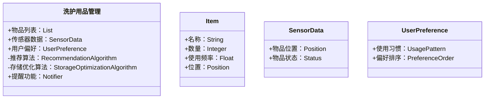
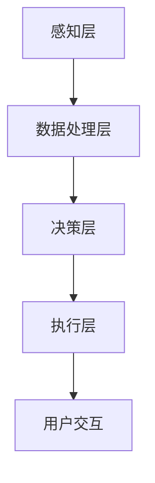
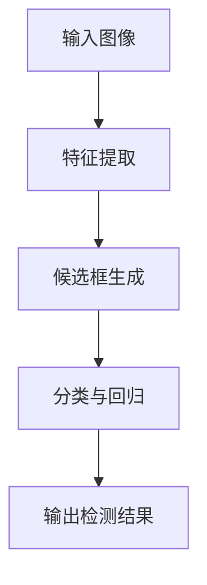

                 


# 智能浴室置物架：AI Agent的洗护用品管理

> 关键词：智能浴室置物架，AI Agent，洗护用品管理，目标检测，推荐算法，系统架构

> 摘要：本文详细介绍了智能浴室置物架的设计与实现，结合AI Agent技术，探讨了洗护用品管理的智能化解决方案。通过分析系统架构、算法原理和项目实战，为读者提供了一套完整的智能浴室置物架开发方案。

---

# 第一部分: 智能浴室置物架概述

## 第1章: 智能浴室置物架的背景与应用

### 1.1 智能浴室置物架的背景
#### 1.1.1 问题背景与问题描述
浴室置物架的使用场景复杂，传统置物架存在以下痛点：
- 空间利用率低：洗护用品随意摆放，容易掉落或占用过多空间。
- 管理不便：用户难以快速找到所需物品，尤其在潮湿环境中。
- 智能化不足：无法与智能家居系统联动，缺乏实时监控和提醒功能。

#### 1.1.2 智能化管理的需求
- 实时监测洗护用品的状态（如剩余量、使用情况）。
- 自动推荐使用计划，优化存储空间。
- 与智能家居系统联动，提供便捷的交互体验。

#### 1.1.3 AI Agent在浴室管理中的应用前景
AI Agent（智能体）通过感知、推理和执行功能，能够实现对洗护用品的智能化管理。其优势包括：
- 自动化管理：AI Agent可以实时感知物品状态，自动调整存储位置。
- 智能推荐：基于用户习惯和物品使用情况，推荐最优使用计划。
- 多设备联动：与智能家居设备（如智能音箱、智能门锁）联动，提供更便捷的使用体验。

---

## 第2章: AI Agent的核心概念与原理

### 2.1 AI Agent的基本概念
#### 2.1.1 什么是AI Agent
AI Agent是一种能够感知环境、执行任务并做出决策的智能实体。它通过传感器获取信息，利用算法进行推理，并通过执行器完成任务。

#### 2.1.2 AI Agent的分类与特点
AI Agent可以分为以下几类：
- **反应式Agent**：基于当前感知做出实时反应，适用于简单的环境。
- **认知式Agent**：具有复杂推理能力，适用于需要决策的环境。
- **学习式Agent**：能够通过经验优化自身行为。

#### 2.1.3 AI Agent在智能浴室置物架中的角色
在智能浴室置物架中，AI Agent主要负责以下功能：
- 感知洗护用品的状态（如位置、数量）。
- 推理用户的使用习惯。
- 执行优化存储和推荐的操作。

---

## 第3章: 智能浴室置物架的系统架构与设计

### 3.1 系统架构概述
智能浴室置物架的系统架构分为以下几个层次：
- **感知层**：负责采集环境数据（如物品位置、数量）。
- **数据处理层**：对感知数据进行分析和处理。
- **决策层**：基于处理后的数据，生成优化存储和推荐的决策。
- **执行层**：根据决策执行相应的操作（如调整物品位置、提醒用户补充物品）。

### 3.2 系统功能设计
#### 3.2.1 用户需求分析
- 用户希望快速找到所需物品。
- 用户希望系统能够自动管理物品存储。
- 用户希望系统能够与智能家居设备联动。

#### 3.2.2 功能需求分解
- 物品感知功能：通过传感器和摄像头实时监测物品状态。
- 数据分析功能：基于历史数据优化存储空间。
- 用户交互功能：提供语音和手机App的交互方式。

#### 3.2.3 领域模型设计（Mermaid类图）



---

### 3.3 系统架构设计
#### 3.3.1 分层架构设计


#### 3.3.2 模块间交互关系（Mermaid架构图）



---

# 第二部分: 智能浴室置物架的核心算法与实现

## 第4章: 目标检测算法实现

### 4.1 目标检测算法概述
目标检测是AI Agent感知物品位置的重要手段。常用的算法包括YOLO、Faster R-CNN等。

#### 4.1.1 YOLO算法简介
YOLO（You Only Look Once）是一种基于深度学习的目标检测算法，具有速度快、精度高的特点。

#### 4.1.2 YOLO算法实现步骤


#### 4.1.3 洗护用品检测的优化
为了提高检测精度，可以对YOLO算法进行优化：
- 数据增强：增加数据多样性。
- 模型微调：针对洗护用品进行数据集微调。

---

## 第5章: 洗护用品推荐算法实现

### 5.1 推荐算法概述
推荐算法是AI Agent优化存储和推荐的核心算法。常用的推荐算法包括协同过滤、基于内容的推荐等。

#### 5.1.1 协同过滤算法实现
协同过滤算法基于用户行为数据，推荐相似用户的使用习惯。

#### 5.1.2 协同过滤算法公式
$$
similarity(u, v) = \frac{\sum_{i=1}^{n} (r_{u,i} - \bar{r}_u)(r_{v,i} - \bar{r}_v)}{\sqrt{\sum_{i=1}^{n} (r_{u,i} - \bar{r}_u)^2} \cdot \sqrt{\sum_{i=1}^{n} (r_{v,i} - \bar{r}_v)^2}}
$$

---

# 第三部分: 智能浴室置物架的系统实现与优化

## 第6章: 系统实现

### 6.1 环境搭建
#### 6.1.1 安装Python环境
- 安装Python 3.8及以上版本。
- 安装深度学习框架（如TensorFlow、PyTorch）。

#### 6.1.2 安装依赖库
- 使用pip安装以下依赖：
  ```
  pip install numpy
  pip install matplotlib
  pip install scikit-learn
  ```

### 6.2 核心代码实现

#### 6.2.1 目标检测代码
```python
import numpy as np
from tensorflow.keras.models import load_model

# 加载预训练模型
model = load_model('yolov4.h5')

def detect_items(image):
    # 图像预处理
    image_input = preprocess_image(image)
    # 检测物品
    predictions = model.predict(image_input)
    return predictions
```

#### 6.2.2 推荐算法代码
```python
def collaborative_filtering(user_matrix):
    # 计算用户相似度
    similarities = np.zeros_like(user_matrix)
    for i in range(user_matrix.shape[0]):
        for j in range(user_matrix.shape[0]):
            if i != j:
                similarities[i, j] = np.corrcoef(user_matrix[i, :], user_matrix[j, :])[0, 1]
    # 生成推荐列表
    recommendations = np.zeros_like(user_matrix)
    for i in range(user_matrix.shape[0]):
        for j in range(user_matrix.shape[1]):
            if np.isnan(user_matrix[i, j]):
                recommendations[i, j] = np.sum(similarities[i, :] * user_matrix[:, j]) / np.sum(similarities[i, :])
    return recommendations
```

---

## 第7章: 系统优化与测试

### 7.1 系统优化
#### 7.1.1 模型优化
- 使用数据增强技术提高模型鲁棒性。
- 优化模型结构，降低计算复杂度。

#### 7.1.2 系统性能测试
- 测试系统响应时间。
- 测试系统在不同负载下的稳定性。

---

## 第8章: 最佳实践与注意事项

### 8.1 小结
通过本文的介绍，读者可以了解到智能浴室置物架的设计与实现过程，包括系统架构、算法原理和项目实战等内容。AI Agent在智能浴室置物架中的应用，为洗护用品的智能化管理提供了新的思路。

### 8.2 注意事项
- 数据隐私：确保用户数据的安全性。
- 系统稳定性：确保系统在潮湿环境下的稳定性。
- 用户体验：优化交互设计，提升用户体验。

---

作者：AI天才研究院/AI Genius Institute & 禅与计算机程序设计艺术 /Zen And The Art of Computer Programming

