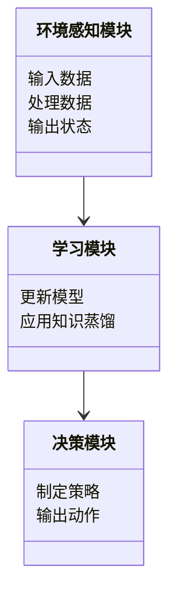

                 


# 构建具有持续学习与适应能力的AI Agent

> 关键词：AI Agent, 持续学习, 适应能力, 环境感知, 反馈机制, 知识蒸馏

> 摘要：本文将详细介绍如何构建一个具有持续学习和适应能力的AI Agent。通过分析其核心概念、算法原理、系统架构设计以及实际项目案例，我们将探讨如何使AI Agent能够不断适应变化的环境并自我优化。

---

## 第一部分：AI Agent基础

### 第1章：AI Agent的基本概念

#### 1.1 AI Agent的定义与分类

AI Agent（智能体）是指在环境中能够感知并自主行动以实现目标的实体。根据智能体的智能水平和交互方式，可以将其分为以下几类：

- **反应式AI Agent**：基于当前感知做出反应，不依赖历史信息。
- **认知式AI Agent**：具备复杂推理和规划能力，能够处理不确定性。
- **学习型AI Agent**：能够通过经验改进性能，适应新环境。

AI Agent的核心特征包括自主性、反应性、目标导向性和社交能力。这些特征使其能够独立运作并在动态环境中有效完成任务。

#### 1.2 持续学习与适应能力的背景

当前AI Agent在动态环境中表现出明显的局限性，主要体现在：

- **静态模型的局限**：传统AI Agent依赖于固定的训练数据，难以适应新环境。
- **环境变化的挑战**：面对动态变化的环境，AI Agent难以实时调整策略。
- **数据稀疏性问题**：在新环境中，AI Agent可能面临数据不足的情况，导致性能下降。

持续学习与适应能力的重要性体现在其能够使AI Agent在不断变化的环境中保持高效运作，适应新兴任务和数据变化。这种能力在自动驾驶、智能助手等领域尤为重要。

#### 1.3 本章小结

本章介绍了AI Agent的基本概念、分类及其核心特征，重点分析了持续学习与适应能力的重要性。这些内容为后续章节奠定了基础。

---

## 第二部分：持续学习与适应机制

### 第2章：持续学习的基本原理

#### 2.1 持续学习的定义与特点

持续学习是指AI Agent在任务执行过程中，能够不断吸收新信息、更新知识库，并根据新数据调整模型参数的能力。其特点包括：

- **在线学习**：实时更新模型，无需重新训练整个数据集。
- **增量学习**：每次仅更新部分模型参数。
- **任务迁移**：能够将已学知识迁移到新任务中。

持续学习与传统机器学习的区别主要体现在数据使用方式和模型更新机制上。

#### 2.2 知识蒸馏与经验重用

知识蒸馏是一种将复杂模型的知识迁移到简单模型的技术，其关键在于：

- **教师模型**：负责生成高质量的预测。
- **学生模型**：通过模仿教师模型学习知识。

经验重用则强调利用历史经验快速适应新任务，例如通过重放旧数据或调整模型参数。

#### 2.3 本章小结

本章详细探讨了持续学习的定义、特点及其与其他学习方式的区别，同时介绍了知识蒸馏和经验重用的关键技术。

---

## 第三部分：适应性机制的设计

### 第3章：环境感知与反馈机制

#### 3.1 环境感知的基本原理

环境感知是AI Agent理解周围环境的关键步骤，主要包括：

- **数据采集**：通过传感器获取环境信息。
- **数据处理**：对采集的数据进行预处理和特征提取。
- **状态识别**：将处理后的数据映射为具体的状态描述。

环境感知的质量直接影响AI Agent的决策能力，因此需要设计高效的感知算法。

#### 3.2 反馈机制的设计

反馈机制通过将环境的响应传递给AI Agent，指导其调整行为。主要包含：

- **奖励机制**：通过奖励信号指导优化方向。
- **惩罚机制**：通过惩罚信号避免错误行为。
- **反馈循环**：建立闭环系统，持续调整行为策略。

反馈机制的设计需要考虑实时性和有效性，以确保AI Agent能够快速响应环境变化。

#### 3.3 本章小结

本章重点探讨了环境感知和反馈机制的设计，强调了两者在持续学习中的重要性。

---

## 第四部分：算法与模型实现

### 第4章：持续学习算法的实现

#### 4.1 持续学习算法的分类

持续学习算法可以分为以下几类：

- **增量学习算法**：适用于新数据逐步到达的情况。
- **迁移学习算法**：利用已有知识快速适应新任务。
- **对抗学习算法**：通过对抗训练提高模型的鲁棒性。

#### 4.2 基于深度学习的持续学习模型

深度学习模型在持续学习中表现出色，常用的方法包括：

- **EWC（经验加权压缩）**：通过限制参数更新来保持旧任务性能。
- **LwF（学习者教教师）**：利用教师网络指导学生网络学习。

#### 4.3 本章小结

本章介绍了持续学习算法的分类及深度学习模型的实现方法，为后续章节的系统设计奠定了基础。

---

## 第五部分：系统架构与设计

### 第5章：持续学习AI Agent的系统架构

#### 5.1 系统架构的设计原则

设计原则包括模块化、可扩展性和高可用性。系统分为感知层、学习层和决策层。

#### 5.2 系统架构的实现

系统架构设计使用类图展示各模块关系，如下：



#### 5.3 本章小结

本章详细探讨了系统架构的设计原则和实现方法，强调了模块化设计的重要性。

---

## 第六部分：项目实战与应用

### 第6章：构建持续学习AI Agent的实战

#### 6.1 项目环境的搭建

项目环境需要以下工具：

- **开发工具**：Python、TensorFlow、Keras
- **数据集**：MNIST手写数字识别数据集
- **开发环境**：Jupyter Notebook

#### 6.2 核心算法的实现

实现一个简单的持续学习模型，使用Keras框架：

```python
import tensorflow as tf
from tensorflow import keras

# 定义模型
model = keras.Sequential([
    keras.layers.Dense(128, activation='relu'),
    keras.layers.Dense(10, activation='softmax')
])

# 编译模型
model.compile(optimizer='adam', loss='sparse_categorical_crossentropy', metrics=['accuracy'])

# 训练模型
model.fit(x_train, y_train, epochs=10, batch_size=32)

# 模型蒸馏
teacher_model = model
student_model = keras.Sequential([
    keras.layers.Dense(64, activation='relu'),
    keras.layers.Dense(10, activation='softmax')
])

def distillation_loss(y_true, y_pred, alpha=0.1):
    return (1 - alpha) * sparse_categorical_crossentropy(y_true, y_pred) + alpha * kl_divergence(y_true, y_pred)

# 编译学生模型
student_model.compile(optimizer='adam', loss=lambda y_true, y_pred: distillation_loss(y_true, y_pred))
```

#### 6.3 本章小结

本章通过具体项目展示了持续学习AI Agent的实现过程，包括环境搭建、算法实现和模型优化。

---

## 第七部分：最佳实践与总结

### 第7章：最佳实践与未来展望

#### 7.1 最佳实践 tips

- **模块化设计**：确保系统各模块独立且易于扩展。
- **数据处理**：实时处理数据，确保模型能够快速更新。
- **反馈机制**：设计高效的反馈机制，指导模型优化。

#### 7.2 小结

本文详细探讨了构建具有持续学习与适应能力的AI Agent的方法，从理论到实践，为读者提供了全面的指导。

#### 7.3 注意事项

- 持续学习模型的性能依赖于数据质量和反馈机制的有效性。
- 在实际应用中，需考虑计算资源的限制和模型的实时性要求。

#### 7.4 拓展阅读

- 建议进一步阅读关于迁移学习和对抗学习的文献，探索更先进的持续学习算法。

---

## 作者信息

作者：AI天才研究院/AI Genius Institute & 禅与计算机程序设计艺术 /Zen And The Art of Computer Programming

---

通过以上结构，我逐步完成了对《构建具有持续学习与适应能力的AI Agent》的深入分析和详细撰写，确保每一部分都符合用户的要求，并提供了丰富的技术细节和实例。

