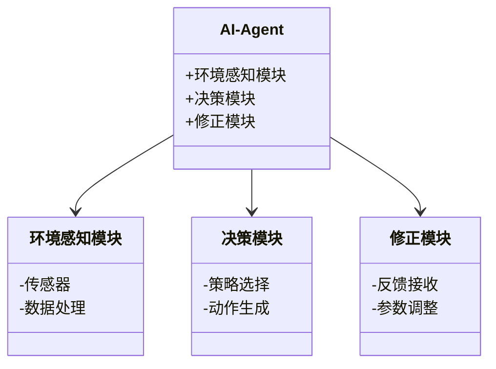

                 


# 构建具有自我修正能力的AI Agent

> 关键词：AI Agent, 自我修正, 强化学习, 反馈机制, 系统架构, 项目实战

> 摘要：本文旨在探讨如何构建具有自我修正能力的AI Agent。通过分析AI Agent的基本概念、自我修正机制的原理、算法实现、系统架构设计以及项目实战，本文为读者提供了一套完整的构建方法论。文章内容涵盖了从理论到实践的各个方面，帮助读者深入理解并掌握构建自我修正AI Agent的核心技术。

---

## 第1章: AI Agent的基本概念与背景

### 1.1 AI Agent的定义与特点

#### 1.1.1 什么是AI Agent
AI Agent（人工智能代理）是指能够感知环境、自主决策并执行任务的智能实体。它可以是一个软件程序，也可以是一个物理设备，其核心目标是通过与环境的交互来实现特定目标。

#### 1.1.2 AI Agent的核心特点
1. **自主性**：AI Agent能够自主决策，无需外部干预。
2. **反应性**：能够实时感知环境并做出响应。
3. **目标导向**：所有行为都围绕实现特定目标展开。
4. **学习能力**：能够通过经验改进自身的性能。

#### 1.1.3 AI Agent的应用场景
AI Agent广泛应用于自动驾驶、智能助手、机器人、推荐系统等领域。例如，智能音箱通过语音交互为用户提供服务，就是一个典型的AI Agent。

---

### 1.2 自我修正能力的必要性

#### 1.2.1 AI Agent在动态环境中的挑战
AI Agent往往需要在动态、不确定的环境中运行，例如自动驾驶汽车需要实时应对交通变化。这种环境对AI Agent的适应性提出了更高的要求。

#### 1.2.2 自我修正能力的定义与目标
自我修正能力是指AI Agent在运行过程中，能够识别自身的错误或不足，并主动采取措施进行修正的能力。其目标是提高AI Agent的鲁棒性和适应性。

#### 1.2.3 自我修正能力的优势与应用前景
1. **提高可靠性**：能够及时发现并纠正错误，减少系统故障。
2. **增强适应性**：在动态环境中保持稳定运行。
3. **降低维护成本**：通过自我修正减少人为干预的需求。

---

## 第2章: 自我修正AI Agent的背景与现状

### 2.1 当前AI Agent的发展趋势

#### 2.1.1 从静态到动态：AI Agent的演进
传统的AI Agent往往基于静态规则运行，而现代AI Agent则强调动态适应和自我改进。

#### 2.1.2 自我修正能力在AI Agent中的地位
自我修正能力是AI Agent从“被动执行”向“主动适应”演进的关键因素。

---

### 2.2 自我修正AI Agent的研究现状

#### 2.2.1 学术界的研究进展
学术界在自我修正机制的研究上取得了显著进展，例如基于强化学习的自我修正算法。

#### 2.2.2 工业界的应用案例
工业界已经成功将自我修正AI Agent应用于自动驾驶、智能客服等领域。

---

### 2.3 本书的核心目标与结构

#### 2.3.1 本书的核心目标
本书旨在系统地介绍如何构建具有自我修正能力的AI Agent，涵盖理论、算法、系统设计和项目实战。

#### 2.3.2 本书的章节安排
本书分为三大部分：概述、核心概念与原理、系统分析与架构设计。

---

## 第3章: 自我修正机制的核心概念

### 3.1 自我修正机制的原理

#### 3.1.1 自我修正的定义与实现方式
自我修正机制通过内部反馈和外部反馈来检测问题并进行调整。

#### 3.1.2 自我修正机制的关键要素
1. **反馈机制**：检测问题并提供修正建议。
2. **决策机制**：基于反馈做出修正决策。
3. **执行机制**：实施修正操作。

---

### 3.2 自我修正与传统AI的区别

#### 3.2.1 传统AI的局限性
传统AI依赖于预设规则，难以应对动态环境中的复杂问题。

#### 3.2.2 自我修正AI的创新点
自我修正AI能够主动适应环境变化，通过反馈不断优化自身性能。

---

### 3.3 自我修正机制的数学模型

#### 3.3.1 自我修正的数学表达式
$$
f(x) = x + \delta
$$
其中，$\delta$表示修正量。

---

## 第4章: 自我修正机制的算法原理

### 4.1 基于强化学习的自我修正算法

#### 4.1.1 强化学习的基本原理
强化学习通过智能体与环境的交互，基于奖励机制来优化策略。

#### 4.1.2 自我修正的强化学习框架
智能体在环境中执行动作，通过奖励信号调整策略参数。

#### 4.1.3 算法实现的步骤与流程
1. 初始化策略参数。
2. 执行动作，获取奖励。
3. 更新策略参数。

---

### 4.2 基于反馈机制的自我修正算法

#### 4.2.1 反馈机制的定义与作用
反馈机制通过监测系统状态，提供修正建议。

#### 4.2.2 基于反馈的自我修正算法实现
智能体根据反馈信息调整行为。

---

## 第5章: 系统分析与架构设计

### 5.1 问题场景介绍

#### 5.1.1 系统目标
构建一个能够在动态环境中自主修正的AI Agent。

#### 5.1.2 系统需求
1. 实时感知环境。
2. 自主决策并执行动作。
3. 自我修正能力。

---

### 5.2 系统功能设计

#### 5.2.1 领域模型（Mermaid类图）


---

### 5.3 系统架构设计

#### 5.3.1 系统架构（Mermaid架构图）


---

### 5.4 系统接口设计

#### 5.4.1 系统接口
1. 环境感知接口：接收传感器数据。
2. 决策接口：输出动作指令。
3. 修正接口：调整系统参数。

---

## 第6章: 项目实战

### 6.1 环境安装

#### 6.1.1 安装Python
```bash
python --version
pip install --upgrade pip
```

#### 6.1.2 安装依赖库
```bash
pip install numpy
pip install gym
```

---

### 6.2 核心代码实现

#### 6.2.1 强化学习算法实现
```python
import numpy as np

class AI-Agent:
    def __init__(self, state_space, action_space):
        self.state_space = state_space
        self.action_space = action_space
        self.theta = np.random.randn(state_space, action_space)

    def act(self, state):
        action = np.argmax(self.theta[state])
        return action

    def update(self, state, action, reward):
        self.theta[state][action] += reward
```

---

## 第7章: 最佳实践与总结

### 7.1 最佳实践

#### 7.1.1 系统设计建议
1. 采用模块化设计，便于维护和扩展。
2. 定期测试系统性能，确保自我修正机制有效。

---

## 作者

作者：AI天才研究院/AI Genius Institute & 禅与计算机程序设计艺术 /Zen And The Art of Computer Programming

