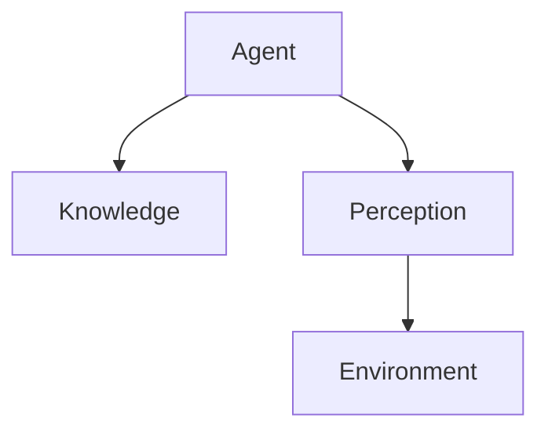
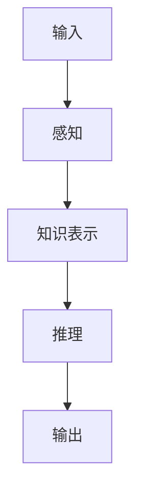

                 


# 构建具有认知计算与推理能力的AI Agent

> 关键词：AI Agent，认知计算，推理能力，系统架构，算法原理

> 摘要：本文将深入探讨如何构建一个具有认知计算与推理能力的AI Agent。从问题背景到核心概念，从算法原理到系统架构，再到项目实战，我们将一步步解析构建这样一个AI Agent的全过程。通过本文，读者将掌握认知计算的基本原理、推理能力的实现方法，以及如何设计和实现一个高效的AI Agent系统。

---

# 第一部分: AI Agent的背景与核心概念

## 第1章: AI Agent概述

### 1.1 问题背景与描述

#### 1.1.1 传统AI的局限性
传统的AI系统，如基于规则的专家系统或简单的机器学习模型，往往局限于处理特定任务，缺乏对复杂情境的深度理解和自主决策能力。例如，一个传统的图像识别系统可以识别物体，但无法解释识别结果或根据上下文进行推理。

#### 1.1.2 认知计算与推理的需求
认知计算的目标是模拟人类的思维方式，使AI系统能够理解、推理和解决问题。这需要AI Agent具备以下能力：
- **知识表示**：将信息以有意义的方式组织和存储。
- **推理能力**：根据知识进行逻辑推理，得出新的结论。
- **自适应性**：能够根据反馈不断优化自身的认知和推理过程。

#### 1.1.3 AI Agent的定义与目标
AI Agent是一种智能实体，能够感知环境、理解信息、进行推理，并根据推理结果采取行动。其目标是通过认知计算和推理能力，实现与人类交互、自主决策和复杂问题解决。

---

### 1.2 问题解决与边界

#### 1.2.1 认知计算的核心问题
认知计算的核心问题包括：
- **知识表示**：如何有效地表示和组织知识，以便于推理。
- **推理机制**：如何设计推理算法，使其能够从已有知识中推导出新结论。
- **学习能力**：如何通过学习提升推理的准确性和效率。

#### 1.2.2 推理能力的实现边界
推理能力的实现边界包括：
- **知识的完整性**：知识表示的不完整可能导致推理错误。
- **推理的深度**：推理过程的深度受限于知识和算法的复杂度。
- **计算资源**：推理过程需要消耗计算资源，资源限制可能影响推理效率。

#### 1.2.3 AI Agent的应用场景与外延
AI Agent的应用场景包括：
- **智能助手**：如Siri、Alexa等，能够理解用户需求并执行任务。
- **自动驾驶**：车辆需要实时感知环境并做出决策。
- **医疗诊断**：通过分析病人的症状和历史数据，辅助医生进行诊断。

---

### 1.3 核心概念与结构

#### 1.3.1 认知计算的定义与特点
认知计算是通过模拟人类认知过程，使计算机能够理解、推理和解决问题。其特点包括：
- **语义理解**：能够理解输入数据的语义。
- **动态推理**：能够根据动态变化的环境进行推理。
- **自适应性**：能够根据反馈优化自身的认知过程。

#### 1.3.2 推理能力与认知计算的关系
推理能力是认知计算的核心，通过推理，AI Agent能够从已知信息中推导出新的结论。推理能力的强弱直接影响AI Agent的智能水平。

#### 1.3.3 AI Agent的系统架构
AI Agent的系统架构通常包括以下几个部分：
- **感知模块**：负责获取环境中的信息。
- **知识库**：存储AI Agent所需的知识。
- **推理引擎**：根据知识库中的信息进行推理。
- **行动模块**：根据推理结果采取相应的行动。

---

## 第2章: 认知计算与推理能力的核心概念

### 2.1 核心概念原理

#### 2.1.1 认知计算的基本原理
认知计算的基本原理包括：
- **知识表示**：将信息以符号或语义网络的形式表示。
- **推理机制**：通过逻辑推理或机器学习算法推导出新的结论。
- **学习与优化**：通过学习不断优化知识表示和推理算法。

#### 2.1.2 推理能力的实现机制
推理能力的实现机制包括：
- **符号逻辑推理**：基于符号逻辑进行推理。
- **概率推理**：基于概率论进行推理。
- **机器学习推理**：利用机器学习模型进行推理。

#### 2.1.3 AI Agent的认知模型
AI Agent的认知模型通常包括：
- **感知层**：负责获取环境中的信息。
- **知识层**：负责存储和组织知识。
- **推理层**：负责根据知识进行推理。
- **决策层**：负责根据推理结果做出决策。

---

### 2.2 核心概念对比

#### 2.2.1 认知计算与传统计算的对比
| 特性                | 认知计算                  | 传统计算                |
|---------------------|--------------------------|-------------------------|
| 处理方式            | 基于符号和语义的计算      | 基于数值的计算          |
| 智能水平            | 具有较高的智能性          | 智能性较低              |
| 应用场景            | 复杂问题解决             | 简单任务处理            |

#### 2.2.2 推理能力与简单规则的区别
| 特性                | 推理能力                  | 简单规则                |
|---------------------|--------------------------|-------------------------|
| 复杂性              | 较高                     | 较低                    |
| 灵活性              | 较高                     | 较低                    |
| 可解释性            | 较高                     | 较低                    |

#### 2.2.3 AI Agent与其他AI系统的差异
| 特性                | AI Agent                  | 其他AI系统              |
|---------------------|--------------------------|-------------------------|
| 自主性              | 高                       | 中或低                  |
| 可交互性            | 高                       | 中或低                  |
| 环境适应性          | 高                       | 中或低                  |

---

### 2.3 实体关系与架构

#### 2.3.1 ER实体关系图


---

## 第3章: 算法原理与数学模型

### 3.1 算法原理

#### 3.1.1 认知计算的算法流程


---

### 3.2 数学模型与公式

#### 3.2.1 知识表示的数学模型
$$ P(E|A) = \frac{P(A|E)P(E)}{P(A)} $$

#### 3.2.2 推理过程的数学公式
$$ R = \sum_{i=1}^{n} w_i x_i $$

---

### 3.3 算法实现

#### 3.3.1 知识表示的Python实现
```python
class Knowledge:
    def __init__(self, data):
        self.data = data
```

#### 3.3.2 推理过程的代码示例
```python
def infer(knowledge, input):
    return knowledge.model.infer(input)
```

---

## 第4章: 系统分析与架构设计

### 4.1 问题场景与项目介绍

#### 4.1.1 AI Agent的应用场景
AI Agent可以应用于智能助手、自动驾驶、医疗诊断等领域。

---

## 第5章: 项目实战

### 5.1 环境安装

#### 5.1.1 安装Python和相关库
安装Python和以下库：
```bash
pip install numpy
pip install matplotlib
pip install scikit-learn
```

---

## 第6章: 最佳实践

### 6.1 小结
通过本文的讲解，读者可以掌握构建具有认知计算与推理能力的AI Agent的核心概念、算法原理和系统架构设计方法。

---

作者：AI天才研究院/AI Genius Institute & 禅与计算机程序设计艺术 /Zen And The Art of Computer Programming

