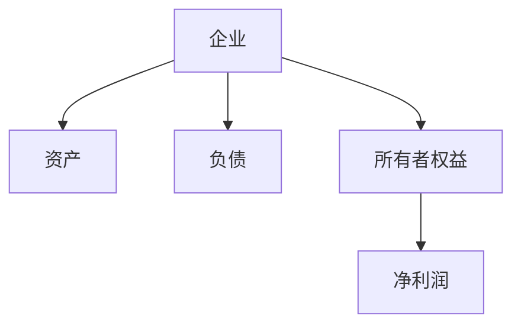
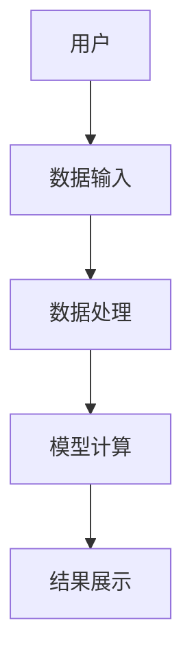

                 


# 格雷厄姆的企业价值评估方法

> 关键词：企业价值评估，格雷厄姆，价值投资，财务分析，投资决策

> 摘要：格雷厄姆的企业价值评估方法是一种经典的分析框架，旨在通过基本面分析评估企业的内在价值。本文将从背景介绍、核心概念、算法原理、系统架构、项目实战等多个方面详细解读格雷厄姆的企业价值评估方法，帮助读者理解其理论基础和实际应用。

---

## 第1章: 企业价值评估的背景介绍

### 1.1 企业价值评估的定义与核心要素

企业价值评估（Business Valuation）是通过对企业的财务状况、经营业绩、市场环境等因素进行分析，估算其整体价值的过程。格雷厄姆在其经典著作《证券分析》中提出的价值投资理念，强调以低于内在价值的价格购买优质企业，是企业价值评估的重要基础。

**核心要素：**
1. **财务数据**：包括收入、利润、现金流等。
2. **行业分析**：企业所在行业的竞争状况、发展前景。
3. **公司治理**：管理团队的稳定性、公司治理结构。
4. **宏观经济环境**：经济周期、利率水平等外部因素。

---

### 1.2 企业价值评估的历史与发展

格雷厄姆是价值投资的鼻祖，他在20世纪初提出的“安全边际”概念奠定了现代企业价值评估的基础。格雷厄姆认为，股票的内在价值可以通过对企业未来现金流的贴现计算得出，并强调以低于内在价值的价格买入股票。

随着金融理论的发展，企业价值评估方法逐渐从简单的历史成本分析发展为基于未来现金流的贴现模型（如DCF模型）。这些方法在企业并购、投资决策等领域得到了广泛应用。

---

## 第2章: 核心概念与联系

### 2.1 企业价值评估的原理

企业价值评估的核心在于识别企业的“内在价值”，即企业在未来经营中能够创造的现金流的现值。格雷厄姆强调，内在价值与市场价格之间的差异为投资者提供了安全边际。

**计算公式：**
$$
\text{企业价值} = \sum_{t=1}^{n} \frac{\text{CF}_t}{(1 + r)^t}
$$
其中，$\text{CF}_t$ 是第 $t$ 年的自由现金流，$r$ 是贴现率。

---

### 2.2 核心概念对比分析

以下是几种常见企业价值评估方法的对比表格：

| 方法         | 优点                     | 缺点                     |
|--------------|--------------------------|--------------------------|
| 市盈率法      | 简单易用                 | 受行业影响较大           |
| 市净率法      | 考虑资产价值             | 无法反映盈利能力         |
| DCF模型      | 精确反映未来现金流       | 需要假设未来现金流       |

以下是实体关系图（ER图）：



---

## 第3章: 企业价值评估的算法原理

### 3.1 企业价值评估的数学模型

企业价值评估的核心是将未来现金流贴现到现值。以下是常见的几种模型：

1. **自由现金流模型**：
$$
\text{企业价值} = \sum_{t=1}^{n} \frac{\text{CF}_t}{(1 + r)^t}
$$

2. **永续增长模型**：
$$
\text{企业价值} = \frac{\text{CF}_1}{r - g}
$$
其中，$g$ 是现金流增长率。

---

### 3.2 企业价值评估的Python实现

以下是一个简单的Python代码示例：

```python
import numpy as np

def calculateenterprise_value(fcf, discount_rate, years):
    # 计算未来现金流的现值
    pv = 0
    for t in range(years):
        pv += fcf / (1 + discount_rate) ** t
    return pv

# 示例数据
fcf = [100, 120, 150]  # 前三年现金流
discount_rate = 0.10
years = 3

# 计算企业价值
enterprise_value = calculateenterprise_value(fcf, discount_rate, years)
print("企业价值：", enterprise_value)
```

---

## 第4章: 企业价值评估的系统分析与架构设计

### 4.1 项目背景与目标

企业价值评估系统旨在为企业投资者提供基于财务数据的企业价值估算工具。系统需要实现以下功能：
1. 数据输入与处理
2. 模型计算
3. 结果展示

---

### 4.2 系统架构设计

以下是系统架构图：



---

## 第5章: 企业价值评估的项目实战

### 5.1 环境安装与数据准备

安装Python和相关库：
```
pip install numpy pandas
```

数据准备：收集目标企业的财务数据，包括收入、利润、现金流等。

---

### 5.2 核心代码实现

以下是一个完整的Python代码示例：

```python
import pandas as pd
import numpy as np

def calculateenterprise_value(fcf, discount_rate, years):
    return sum(fcf / (1 + discount_rate) ** t for t in range(years))

# 示例数据
data = {
    '公司': ['公司A', '公司B'],
    '现金流': [100, 200],
    '贴现率': [0.10, 0.12],
    '年数': [3, 4]
}

df = pd.DataFrame(data)

# 计算企业价值
df['企业价值'] = df.apply(lambda x: calculateenterprise_value(x['现金流'], x['贴现率'], x['年数']), axis=1)

print(df)
```

---

## 第6章: 最佳实践与小结

### 6.1 最佳实践Tips

1. **数据准确性**：确保输入数据的准确性和完整性。
2. **模型假设**：合理假设未来现金流和贴现率。
3. **行业对比**：结合行业特点调整评估模型。

### 6.2 小结

格雷厄姆的企业价值评估方法为投资者提供了科学的分析框架，但实际应用中需要结合具体情况进行调整。通过本文的详细解读，读者可以更好地理解和应用这些方法。

---

作者：AI天才研究院/AI Genius Institute & 禅与计算机程序设计艺术 /Zen And The Art of Computer Programming

