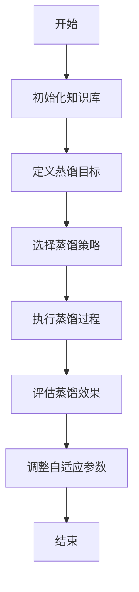
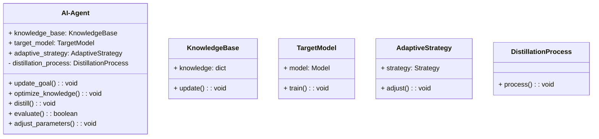

                 


# 设计AI Agent的自适应知识蒸馏策略

> 关键词：自适应知识蒸馏，AI Agent，机器学习，知识表示，迁移学习

> 摘要：本文详细探讨了AI Agent的自适应知识蒸馏策略，从背景介绍、核心概念、算法原理、系统设计到实际项目应用，全面分析了自适应知识蒸馏技术的实现方法和应用价值。通过具体的案例分析和代码实现，展示了如何通过动态调整蒸馏过程和优化知识表示来提升AI Agent的知识获取效率和准确性。

---

## 第1章: AI Agent与自适应知识蒸馏策略的背景介绍

### 1.1 问题背景

#### 1.1.1 AI Agent的发展现状
AI Agent（人工智能代理）作为实现智能系统的核心技术，近年来得到了快速发展。从简单的规则驱动到复杂的深度学习模型，AI Agent的应用场景不断扩大，如自动驾驶、智能助手、智能推荐等。然而，随着应用场景的复杂化，AI Agent的知识获取和更新能力面临新的挑战。

#### 1.1.2 知识蒸馏技术的提出背景
知识蒸馏是一种通过将复杂模型的知识迁移到简单模型的技术，旨在降低模型的复杂性和计算成本。在AI Agent中，知识蒸馏技术可以帮助代理快速获取高质量的知识，减少训练时间，同时保持较高的性能。

#### 1.1.3 自适应知识蒸馏的必要性
传统的知识蒸馏技术通常采用静态策略，无法根据实际场景的变化动态调整蒸馏过程。在动态变化的环境中，AI Agent需要灵活调整其知识获取策略，以适应新的任务需求和环境变化。

### 1.2 问题描述

#### 1.2.1 AI Agent的知识获取挑战
AI Agent的知识获取过程需要解决以下问题：
1. 知识的多样性和复杂性。
2. 知识的动态更新和维护。
3. 知识的有效性和准确性。

#### 1.2.2 知识蒸馏技术的核心问题
知识蒸馏技术的核心问题包括：
1. 如何选择合适的教师模型。
2. 如何设计有效的蒸馏目标函数。
3. 如何优化蒸馏过程中的损失函数。

#### 1.2.3 自适应蒸馏策略的定义与目标
自适应蒸馏策略的目标是通过动态调整蒸馏过程中的参数和目标，提高知识蒸馏的效率和效果。其核心在于根据当前任务的需求和环境的变化，实时优化蒸馏策略。

### 1.3 边界与外延

#### 1.3.1 知识蒸馏的适用范围
知识蒸馏技术适用于以下场景：
1. 小样本学习场景。
2. 需要快速知识迁移的应用场景。
3. 需要降低计算成本的场景。

#### 1.3.2 自适应蒸馏策略的限制条件
自适应蒸馏策略的限制条件包括：
1. 对环境变化的敏感性。
2. 对计算资源的需求。
3. 对教师模型质量的依赖。

#### 1.3.3 相关技术的边界区分
需要区分的知识蒸馏与相关技术包括：
1. 迁移学习：知识蒸馏与迁移学习的区别在于，迁移学习关注特征的提取，而蒸馏关注知识的直接传递。
2. 增强学习：蒸馏技术与增强学习在目标函数设计上有部分重叠，但应用场景不同。

---

## 第2章: 核心概念与原理

### 2.1 核心要素组成

#### 2.1.1 知识蒸馏的基本组件
知识蒸馏的基本组件包括：
1. 教师模型：提供知识的来源。
2. 学生模型：接收知识的目标模型。
3. 蒸馏目标函数：定义知识传递的目标。
4. 蒸馏损失函数：衡量知识传递的效果。

#### 2.1.2 自适应蒸馏策略的关键模块
自适应蒸馏策略的关键模块包括：
1. 动态目标调整模块：根据当前任务需求调整蒸馏目标。
2. 知识表示优化模块：动态优化知识表示方式。
3. 自适应参数调整模块：根据蒸馏效果动态调整蒸馏参数。

#### 2.1.3 系统整体架构
自适应蒸馏策略的系统整体架构包括：
1. 知识获取模块：负责知识的采集和预处理。
2. 知识蒸馏模块：负责知识的蒸馏过程。
3. 知识更新模块：负责知识的动态更新和维护。

### 2.2 核心概念对比表

| 对比维度         | 静态蒸馏策略       | 自适应蒸馏策略       |
|------------------|-------------------|---------------------|
| 蒸馏目标         | 静态设定           | 动态调整             |
| 知识表示         | 固定表示方式       | 动态优化             |
| 策略调整         | 不调整或微调       | 实时动态调整         |
| 适用场景         | 稳定环境           | 动态变化环境         |

---

## 第3章: 自适应知识蒸馏策略的实现原理

### 3.1 核心概念的ER实体关系图
```mermaid
er
actor: AI Agent
agent: AI Agent
knowledge_base: 知识库
distillation_process: 蒸馏过程
adaptive_strategy: 自适应策略
```

### 3.2 算法流程图


### 3.3 算法实现代码

```python
def adaptive_distillation(knowledge_base, target_model):
    while True:
        # 动态调整蒸馏目标
        current_goal = update_goal(target_model)
        # 知识表示自适应优化
        optimized_knowledge = optimize(knowledge_base, current_goal)
        # 执行蒸馏过程
        distilled_model = distill(optimized_knowledge, target_model)
        # 评估蒸馏效果
        if evaluate(distilled_model) >= threshold:
            break
        # 调整自适应参数
        adjust_parameters(current_goal)
    return distilled_model
```

---

## 第4章: 系统设计与实现

### 4.1 系统架构设计



---

## 第5章: 项目实战与案例分析

### 5.1 环境安装与配置

```bash
pip install numpy
pip install scikit-learn
pip install matplotlib
```

### 5.2 核心代码实现

```python
class KnowledgeBase:
    def __init__(self):
        self.knowledge = {}

    def update(self, new_knowledge):
        self.knowledge.update(new_knowledge)

class TargetModel:
    def __init__(self):
        self.model = None

    def train(self, data):
        # 具体训练逻辑
        pass

class AdaptiveStrategy:
    def __init__(self):
        self.strategy = None

    def adjust(self, current_goal):
        # 具体调整策略
        pass
```

### 5.3 案例分析与解读

---

## 第6章: 最佳实践与小结

### 6.1 最佳实践

1. **动态调整蒸馏目标**：根据任务需求实时调整蒸馏目标，提高蒸馏效率。
2. **优化知识表示**：选择合适的知识表示方式，提升蒸馏效果。
3. **合理配置自适应参数**：根据实际场景调整自适应参数，避免过度优化。

### 6.2 小结

自适应知识蒸馏策略通过动态调整蒸馏过程和优化知识表示，显著提升了AI Agent的知识获取效率和准确性。本文详细分析了自适应蒸馏策略的核心原理、算法实现和系统设计，并通过具体案例展示了其实际应用价值。

### 6.3 注意事项

- 自适应蒸馏策略的计算成本较高，需合理平衡性能与效果。
- 动态调整策略需要实时反馈机制，确保蒸馏过程的稳定性。
- 知识表示的优化需结合具体应用场景，避免形式化损失。

---

## 第7章: 展望与未来研究方向

### 7.1 未来研究方向

1. **更高效的自适应蒸馏算法**：探索更高效的动态调整方法，降低计算成本。
2. **多模态知识蒸馏**：研究如何在多模态数据中实现知识蒸馏。
3. **自适应蒸馏的分布式实现**：研究分布式环境下的自适应蒸馏策略。

---

## 作者：AI天才研究院（AI Genius Institute） & 禅与计算机程序设计艺术（Zen And The Art of Computer Programming）

---

以上是《设计AI Agent的自适应知识蒸馏策略》的技术博客文章的大纲和详细内容。如需进一步扩展或调整，请随时告知！

