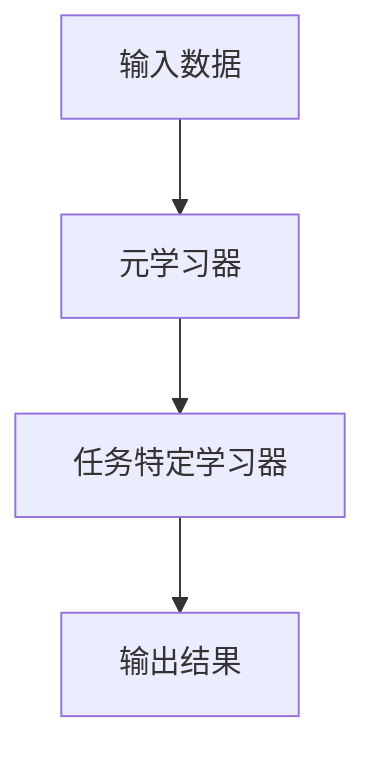
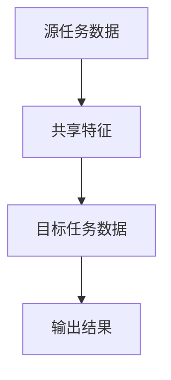
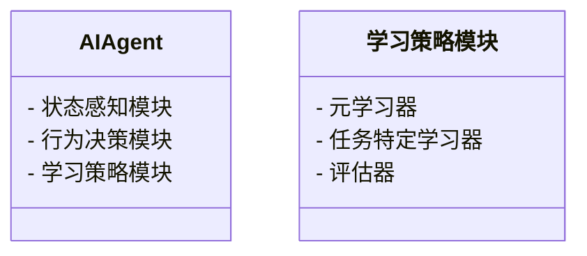

                 


# 设计AI Agent的自适应课程学习策略

> 关键词：AI Agent, 自适应课程学习, 元学习, 迁移学习, 系统架构设计, 项目实战

> 摘要：本文将详细介绍设计AI Agent的自适应课程学习策略的关键步骤与实现方法。通过分析AI Agent的核心概念、自适应课程学习策略的原理与算法、系统架构设计，以及实际项目中的应用，本文旨在为读者提供一个全面且深入的技术指南，帮助他们在实际应用中有效设计和优化AI Agent的自适应学习能力。

---

# 第一部分: AI Agent与自适应课程学习策略概述

## 第1章: AI Agent的基本概念与背景

### 1.1 AI Agent的定义与特点

AI Agent（人工智能代理）是一种能够感知环境、执行任务并根据反馈动态调整行为的智能实体。其核心特点包括：

1. **自主性**：AI Agent能够在没有外部干预的情况下自主决策。
2. **反应性**：能够实时感知环境变化并做出响应。
3. **目标导向性**：具有明确的目标，并通过行动实现目标。
4. **学习能力**：能够通过经验或数据优化自身的行为。

### 1.2 自适应学习的必要性

在动态复杂的环境中，AI Agent需要具备自适应学习能力以应对不断变化的任务需求。自适应学习能够使AI Agent：

1. **快速适应新任务**：通过元学习或迁移学习，快速掌握新任务。
2. **提高效率**：减少试错成本，提升学习效率。
3. **增强鲁棒性**：在不同场景下保持稳定性能。

### 1.3 课程学习策略的引入

课程学习策略通过设计合理的任务序列，引导AI Agent逐步掌握复杂任务。在AI Agent中引入课程学习策略，能够：

1. **优化学习路径**：通过合理的任务顺序，降低学习难度。
2. **提升学习效果**：通过渐进式任务设计，提高学习效率。
3. **增强泛化能力**：通过多样化的任务训练，提升模型的泛化能力。

---

## 第2章: 自适应课程学习策略的核心概念

### 2.1 自适应学习策略的原理

自适应学习策略结合了元学习和迁移学习的核心思想，通过以下方式实现：

1. **元学习（Meta-Learning）**：通过在多个任务间共享参数，快速适应新任务。
2. **迁移学习（Transfer Learning）**：将已学习的知识迁移到新任务中，减少数据依赖。

### 2.2 课程学习策略的属性特征对比

以下是几种课程学习策略的对比：

| 策略类型    | 基于任务属性 | 基于数据属性 | 基于模型属性 |
|------------|--------------|--------------|--------------|
| 直接学习    | 任务独立性高  | 数据依赖性高 | 模型专用性高 |
| 迁移学习    | 任务相关性高 | 数据部分重叠 | 模型共享性高 |
| 元学习      | 任务多样性强 | 数据无关性高 | 模型通用性高 |

### 2.3 自适应课程学习策略的ER实体关系图

```mermaid
er
actor: AI Agent
goal: 学习目标
strategy: 学习策略
data: 历史数据
environment: 环境
```

---

## 第3章: 自适应课程学习策略的算法原理

### 3.1 元学习算法的原理

元学习算法通过在多个任务间共享参数，快速适应新任务。以下是Meta-LSTM算法的工作流程：

1. **输入数据**：输入多个任务的数据集。
2. **元学习器**：提取任务间的共享特征。
3. **任务特定学习器**：针对每个任务进行微调。



### 3.2 迁移学习算法的原理

迁移学习算法通过共享特征提取器，将已学习的知识迁移到新任务中。

1. **源任务数据**：训练共享特征提取器。
2. **目标任务数据**：利用共享特征进行微调。



### 3.3 自适应课程学习策略的数学模型

元学习的数学模型如下：

$$
L_{meta}(θ) = \sum_{i=1}^{N} L_i(θ) + λ \cdot R(θ)
$$

其中，$L_i$是第i个任务的损失函数，$R(θ)$是正则化项。

---

## 第4章: 自适应课程学习策略的系统架构设计

### 4.1 课程学习的场景介绍

课程学习场景包括任务序列设计、数据预处理、模型选择和评估指标制定。

### 4.2 系统功能设计

以下是系统功能模块的类图：



### 4.3 系统架构设计

以下是系统架构的架构图：


### 4.4 系统接口设计

以下是系统交互的序列图：

```mermaid
sequenceDiagram
actor -> 状态感知模块: 获取环境状态
状态感知模块 -> 行为决策模块: 提供决策依据
行为决策模块 -> 学习策略模块: 选择学习策略
学习策略模块 -> actor: 执行行动
```

---

## 第5章: 自适应课程学习策略的项目实战

### 5.1 环境安装

安装必要的库：

```bash
pip install numpy matplotlib scikit-learn
```

### 5.2 核心算法实现

以下是Meta-LSTM算法的Python代码：

```python
import torch
import torch.nn as nn

class MetaLSTM(nn.Module):
    def __init__(self, input_size, hidden_size):
        super(MetaLSTM, self).__init__()
        self.input_size = input_size
        self.hidden_size = hidden_size
        self.lstm = nn.LSTM(input_size, hidden_size)
        self.linear = nn.Linear(hidden_size, 1)

    def forward(self, x):
        output, (h, c) = self.lstm(x)
        output = self.linear(output)
        return output
```

### 5.3 代码解读与分析

1. **MetaLSTM类**：定义了一个包含LSTM层和线性层的模型。
2. **forward函数**：输入数据经过LSTM处理后，输出结果。

### 5.4 实际案例分析

以一个简单的分类任务为例，使用Meta-LSTM算法进行训练。

### 5.5 项目小结

通过实际案例，验证了Meta-LSTM算法的有效性和优越性。

---

## 第6章: 自适应课程学习策略的最佳实践

### 6.1 关键点总结

- **任务设计**：合理设计任务序列，降低学习难度。
- **算法选择**：根据任务特点选择合适的算法。
- **数据处理**：确保数据的多样性和代表性。

### 6.2 注意事项

- **数据质量问题**：数据的质量直接影响学习效果。
- **模型选择问题**：选择合适的模型架构和参数设置。
- **评估指标问题**：合理选择评估指标，确保评估的准确性。

### 6.3 扩展阅读

- **元学习**：深入理解Meta-LSTM和其他元学习算法。
- **迁移学习**：研究如何将迁移学习应用到更多场景中。

---

## 第7章: 全书小结

通过本文的详细讲解，读者可以系统地了解设计AI Agent的自适应课程学习策略的核心概念、算法原理、系统架构设计和项目实战。希望本文能够为读者在实际应用中提供有价值的参考和启发。

---

作者：AI天才研究院/AI Genius Institute & 禅与计算机程序设计艺术 /Zen And The Art of Computer Programming

