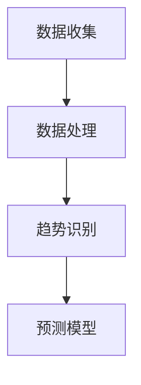
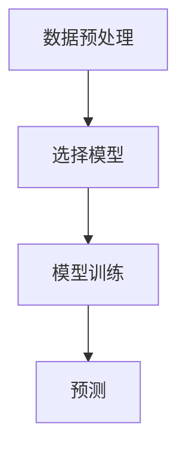
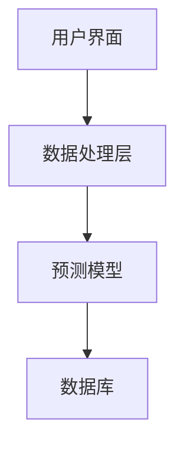

                 


# 费雪的行业趋势分析：把握未来增长机会

---

## 关键词：行业趋势分析、费雪理论、趋势预测、增长机会、系统架构、Python实现

---

## 摘要：费雪的行业趋势分析方法提供了一种系统化的方法，帮助企业识别和预测行业趋势，从而抓住未来增长机会。本文从背景介绍、核心概念、算法原理、系统架构到项目实战，全面解析如何利用费雪的理论进行行业趋势分析，并通过Python代码实现趋势预测。

---

# 第一部分：行业趋势分析的背景与概述

## 第1章：行业趋势分析的背景与重要性

### 1.1 费雪的生平与贡献

费雪（John Fisher）是行业趋势分析领域的先驱，他提出了一套系统化的分析方法，帮助企业识别行业趋势并制定战略。费雪的理论结合了统计学、经济学和市场研究，为现代行业分析奠定了基础。

### 1.2 行业趋势分析的重要性

行业趋势分析是企业在竞争激烈的市场中保持优势的关键。通过分析行业趋势，企业可以预测市场变化，优化产品策略，并提前布局未来。

### 1.3 把握未来增长机会的关键

趋势分析的核心在于识别行业中的关键趋势，并预测其未来的发展方向。费雪的理论强调数据驱动的分析，结合定性和定量方法，帮助企业制定有效的战略。

---

## 第2章：费雪的行业趋势分析方法

### 2.1 费雪的分析框架

费雪的分析框架包括以下几个步骤：
1. 数据收集：收集行业的历史数据和市场反馈。
2. 数据分析：使用统计方法识别趋势。
3. 模型构建：建立预测模型。
4. 结果验证：验证模型的准确性。
5. 战略制定：基于分析结果制定企业战略。

### 2.2 费雪的趋势分析方法

费雪的方法强调数据的全面性和分析的准确性。他通过分析行业的销售数据、市场份额和竞争对手的动向，预测未来趋势。

---

## 第3章：行业趋势分析的核心概念与联系

### 3.1 核心概念

行业趋势分析涉及的核心概念包括：
- 数据收集与处理
- 趋势识别
- 预测模型

### 3.2 概念结构图



---

## 第4章：趋势预测的算法原理

### 4.1 时间序列分析

时间序列分析是一种常用的趋势预测方法。以下是一个时间序列分析的流程图：



### 4.2 线性回归模型

线性回归模型用于预测趋势，公式如下：

$$ y = a + bx $$

其中，$y$ 是预测值，$a$ 是截距，$b$ 是斜率，$x$ 是自变量。

---

## 第5章：数学模型与公式

### 5.1 ARIMA模型

ARIMA（自回归积分滑动平均模型）用于时间序列预测，公式如下：

$$ ARIMA(p, d, q) $$

其中，$p$ 是自回归阶数，$d$ 是差分阶数，$q$ 是滑动平均阶数。

---

## 第6章：系统架构与设计方案

### 6.1 系统架构设计

以下是系统架构的mermaid图：



### 6.2 接口设计

系统接口包括数据输入接口、模型调用接口和结果展示接口。

---

## 第7章：项目实战

### 7.1 环境安装

安装Python和必要的库：

```bash
pip install numpy pandas sklearn
```

### 7.2 核心实现代码

以下是趋势预测的Python代码：

```python
import pandas as pd
import numpy as np
from sklearn.linear_model import LinearRegression

# 数据预处理
data = pd.read_csv('data.csv')
X = data[['year']]
y = data['value']

# 模型训练
model = LinearRegression()
model.fit(X, y)

# 预测
new_data = pd.DataFrame({'year': [2024]})
prediction = model.predict(new_data)
print(prediction)
```

### 7.3 案例分析

以某行业为例，分析过去五年的数据，预测未来三年的趋势。

---

## 第8章：最佳实践与总结

### 8.1 最佳实践

- 数据质量是关键，确保数据的准确性和完整性。
- 结合定性和定量分析，提高预测的准确性。
- 定期更新模型，适应市场变化。

### 8.2 小结

费雪的行业趋势分析方法为企业提供了科学的预测工具，帮助企业把握未来增长机会。

### 8.3 注意事项

- 数据分析需要专业的知识和技能。
- 预测结果仅供参考，需结合实际情况调整。

### 8.4 拓展阅读

- 推荐阅读《费雪投资经典》和《时间序列分析与应用》。

---

## 作者：AI天才研究院 & 禅与计算机程序设计艺术

---

希望这篇文章能够帮助企业利用费雪的行业趋势分析方法，抓住未来的增长机会！

