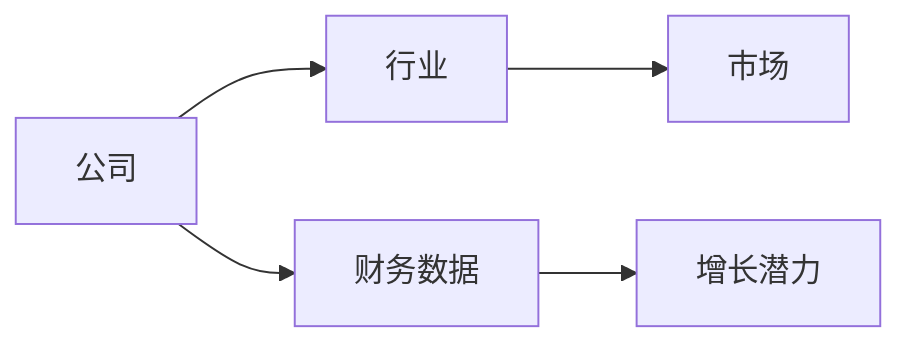
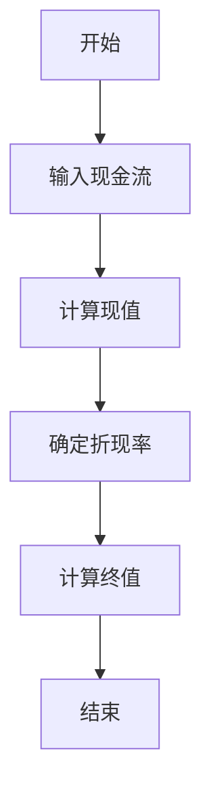
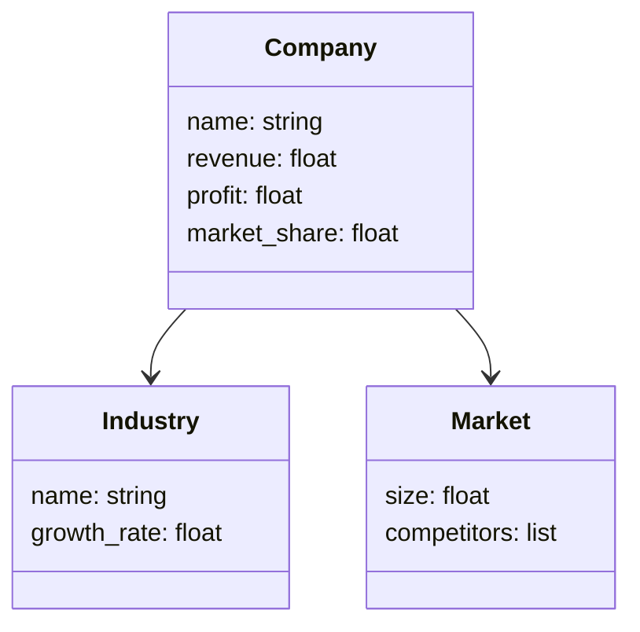

                 


# 费雪的长期增长潜力评估

> 关键词：费雪投资理念、长期增长潜力、财务分析、投资策略、现金流折现模型

> 摘要：本文深入探讨了费雪的长期增长潜力评估方法，分析了其核心概念、算法原理及系统架构，通过实际案例展示了如何应用这些方法进行投资决策，并提供了最佳实践建议。

---

# 第1章: 费雪投资理念与长期增长潜力概述

## 1.1 费雪的投资理念
### 1.1.1 费雪的生平与投资思想
本杰明·格雷厄姆的学生菲利普·费雪（Philip Fisher）是价值投资的重要倡导者之一。他提出，投资应关注公司的长期增长潜力，而非仅仅关注短期市场波动。费雪强调，成功的投资需要深入研究公司基本面，尤其是其盈利能力和成长性。

### 1.1.2 长期增长投资的核心概念
费雪认为，长期投资回报主要取决于公司未来几年的盈利能力。他提出，投资者应选择那些具有持续增长潜力的公司，而非仅仅关注短期股价波动。

### 1.1.3 费雪投资理念的现代应用
在当今复杂的市场环境中，费雪的理念依然适用。投资者应关注公司的竞争优势、管理团队和未来增长空间，以确保投资的长期回报。

## 1.2 长期增长潜力评估的背景与意义
### 1.2.1 投资者为何关注长期增长潜力
长期增长潜力评估是投资者制定投资策略的关键依据。通过评估公司的未来增长潜力，投资者可以更好地判断其投资价值，制定长期投资计划。

### 1.2.2 长期增长潜力评估的必要性
在经济不确定性增加的背景下，评估公司的长期增长潜力可以帮助投资者规避风险，抓住优质投资机会。

### 1.2.3 费雪理念与现代投资策略的结合
现代投资策略越来越依赖于量化分析和大数据技术。将费雪的理念与这些新兴技术相结合，可以更准确地评估公司的长期增长潜力。

## 1.3 本章小结
本章介绍了费雪的投资理念及其长期增长潜力评估的重要性，为后续章节的分析奠定了基础。

---

# 第2章: 长期增长潜力的核心概念与联系

## 2.1 核心概念解析
### 2.1.1 长期增长潜力的定义
长期增长潜力是指公司在未来一段时间内持续增长的潜力，主要体现在收入、利润和市场份额的增长上。

### 2.1.2 费雪模型的关键要素
- **收入增长率**：衡量公司收入的扩张速度。
- **利润率**：反映公司的盈利能力。
- **市场份额**：衡量公司在市场中的地位。

### 2.1.3 核心概念的属性特征对比
通过对比不同公司的财务指标，可以更清晰地评估其长期增长潜力。例如，一家公司如果收入增长率高且利润率稳定，通常具有较大的增长潜力。

## 2.2 实体关系图（ER图）

上述图表展示了公司与其所在行业和市场的关系，以及财务数据对评估增长潜力的影响。

## 2.3 概念结构与核心要素
### 2.3.1 费雪模型的结构
费雪模型通过分析公司的财务数据和市场环境，评估其长期增长潜力。

### 2.3.2 核心要素的组成与关系
- **公司基本面**：包括收入、利润和市场份额。
- **市场环境**：包括行业竞争状况和宏观经济因素。

## 2.4 本章小结
本章详细解析了长期增长潜力的核心概念及其与公司基本面和市场环境的关系。

---

# 第3章: 长期增长潜力评估的算法原理

## 3.1 费雪模型的数学模型
### 3.1.1 费雪模型的基本公式
$$ \text{内在价值} = \sum_{t=1}^{n} \frac{\text{现金流}_t}{(1 + r)^t} $$
其中，$\text{现金流}_t$是第t年的现金流，$r$是折现率，$n$是评估期限。

### 3.1.2 现金流的计算方法
现金流计算包括经营活动、投资活动和筹资活动的现金流。通常，经营活动的现金流是公司盈利能力的关键指标。

### 3.1.3 折现率的确定
折现率通常基于无风险利率和市场风险溢价。例如，使用国债收益率作为无风险利率，再加上市场风险溢价。

## 3.2 算法流程图


## 3.3 算法实现
### 3.3.1 Python代码示例
```python
def fisher_model(cash_flows, discount_rate):
    present_value = 0
    for t, cf in enumerate(cash_flows):
        present_value += cf / (1 + discount_rate)**t
    return present_value
```

### 3.3.2 算法原理的数学公式
$$ \text{现值} = \sum_{t=1}^{n} \frac{\text{现金流}_t}{(1 + r)^t} $$

## 3.4 本章小结
本章详细讲解了费雪模型的数学原理及其实现方法，为后续章节的系统设计奠定了基础。

---

# 第4章: 系统分析与架构设计方案

## 4.1 问题场景介绍
评估公司的长期增长潜力需要考虑多个因素，包括财务数据、市场环境和管理团队等。

## 4.2 系统功能设计
### 4.2.1 领域模型类图


### 4.2.2 系统架构图


## 4.3 系统接口设计
- **输入接口**：接收公司财务数据和市场信息。
- **输出接口**：提供长期增长潜力评估结果。

## 4.4 系统交互流程图


## 4.5 本章小结
本章通过系统设计的方法，详细描述了如何实现长期增长潜力的评估系统。

---

# 第5章: 项目实战

## 5.1 环境安装
- **工具安装**：安装Python和必要的库（如pandas、numpy）。
- **数据获取**：获取目标公司的财务数据和市场信息。

## 5.2 系统核心实现
### 5.2.1 核心代码实现
```python
import pandas as pd
import numpy as np

def calculate_growth_potential(finance_data, discount_rate):
    cash_flows = finance_data['现金流'].tolist()
    growth_potential = 0
    for t, cf in enumerate(cash_flows):
        growth_potential += cf / (1 + discount_rate)**t
    return growth_potential

# 示例数据
finance_data = pd.DataFrame({
    '现金流': [100, 150, 200, 250]
})
discount_rate = 0.08

result = calculate_growth_potential(finance_data, discount_rate)
print("长期增长潜力:", result)
```

### 5.2.2 代码应用解读
上述代码实现了费雪模型的现金流折现计算，评估公司的长期增长潜力。

## 5.3 实际案例分析
以某公司为例，通过具体数据计算其长期增长潜力，并分析结果。

## 5.4 本章小结
本章通过实际案例展示了如何应用费雪模型进行长期增长潜力评估。

---

# 第6章: 最佳实践与总结

## 6.1 小结
总结全文，重申费雪长期增长潜力评估的核心观点。

## 6.2 注意事项
- **数据准确性**：确保输入数据的准确性。
- **模型适用性**：根据实际情况调整模型参数。

## 6.3 拓展阅读
推荐相关书籍和文章，供读者深入学习。

## 6.4 本章小结
本章提供了实用的建议，帮助读者更好地应用费雪模型进行投资决策。

---

# 作者：AI天才研究院/AI Genius Institute & 禅与计算机程序设计艺术 /Zen And The Art of Computer Programming

