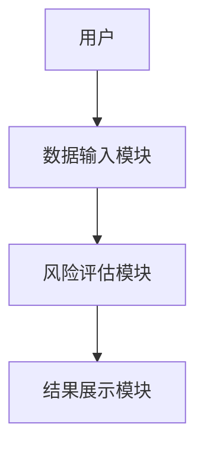

                 


# 《金融产品创新风险评估矩阵》

---

## 关键词：
- 金融产品创新
- 风险评估
- 矩阵分析
- 系统架构
- 项目实战

---

## 摘要：
本文系统地探讨了金融产品创新中的风险评估问题，提出了一种基于矩阵分析的风险评估方法。通过构建风险评估矩阵，本文详细分析了金融创新中的主要风险维度，包括风险发生概率、风险影响程度和风险时间范围。文章进一步结合实际案例，展示了如何利用矩阵方法进行风险量化和评估，帮助金融机构在创新过程中有效控制和规避风险。同时，本文还设计了一个支持风险评估矩阵的系统架构，提供了完整的系统实现方案和代码示例，为金融创新提供了理论和实践指导。

---

## 目录大纲

### 第一部分：金融产品创新与风险评估背景

#### 第1章：金融产品创新概述

##### 1.1 金融创新的定义与特点
- 1.1.1 金融创新的定义
- 1.1.2 金融创新的核心特点
- 1.1.3 金融创新与传统金融的区别

##### 1.2 金融产品创新的背景与意义
- 1.2.1 当前金融创新的背景
- 1.2.2 金融产品创新的意义
- 1.2.3 金融创新对金融市场的影响

##### 1.3 金融产品创新的风险概述
- 1.3.1 金融创新中的主要风险类型
- 1.3.2 风险与收益的平衡
- 1.3.3 创新风险评估的重要性

---

### 第二部分：风险评估矩阵的核心概念与联系

#### 第2章：风险评估矩阵的原理与结构

##### 2.1 风险评估矩阵的定义
- 2.1.1 风险评估矩阵的定义
- 2.1.2 矩阵的基本组成要素

##### 2.2 风险评估矩阵的维度分析
- 2.2.1 风险发生概率
- 2.2.2 风险影响程度
- 2.2.3 风险时间范围

##### 2.3 矩阵的构建与应用
- 2.3.1 矩阵构建的基本步骤
- 2.3.2 矩阵在风险评估中的应用

#### 第3章：核心概念与联系

##### 3.1 风险评估矩阵的原理
- 3.1.1 矩阵评估的基本原理
- 3.1.2 矩阵与金融创新的关系

##### 3.2 矩阵维度的特征对比
- 3.2.1 风险发生概率的特征分析
- 3.2.2 风险影响程度的特征分析
- 3.2.3 风险时间范围的特征分析

##### 3.3 风险评估矩阵的ER实体关系图
- 3.3.1 实体关系图的构建
- 3.3.2 实体关系图与矩阵维度的对应关系

---

### 第三部分：算法原理讲解

#### 第4章：风险评估矩阵的算法实现

##### 4.1 矩阵评估算法的流程图
- 4.1.1 算法流程图的绘制
- 4.1.2 算法步骤的详细说明

##### 4.2 矩阵评估的数学模型
- 4.2.1 风险评分公式
  $$ \text{风险评分} = \sum_{i=1}^{n} w_i \cdot r_i $$
  其中，$w_i$ 为第 $i$ 个维度的权重，$r_i$ 为第 $i$ 个维度的风险值。
- 4.2.2 综合风险评估公式
  $$ \text{综合风险} = \frac{\sum_{i=1}^{n} (w_i \cdot r_i)}{\sum_{i=1}^{n} w_i} $$

##### 4.3 算法实现的Python代码
```python
def risk_assessment_matrix(risk_prob, risk_impact, risk_time):
    # 计算风险评分
    risk_score = [w * r for w, r in zip([0.4, 0.3, 0.3], [p, i, t])]
    total_score = sum(risk_score)
    return total_score

# 示例数据
risk_prob = 0.6
risk_impact = 0.7
risk_time = 0.5

# 调用函数
total_score = risk_assessment_matrix(risk_prob, risk_impact, risk_time)
print("综合风险评分:", total_score)
```

---

### 第四部分：系统分析与架构设计方案

#### 第5章：风险评估矩阵的系统架构

##### 5.1 系统功能设计
- 5.1.1 用户需求分析
- 5.1.2 系统功能模块划分
  - 数据输入模块
  - 风险评估模块
  - 结果展示模块

##### 5.2 系统架构设计
- 5.2.1 系统架构图（使用mermaid）


##### 5.3 系统接口设计
- 5.3.1 数据输入接口
- 5.3.2 评估结果接口
- 5.3.3 用户界面接口

##### 5.4 系统交互流程
- 5.4.1 用户输入数据
- 5.4.2 系统进行风险评估
- 5.4.3 展示评估结果

---

### 第五部分：项目实战

#### 第6章：风险评估矩阵的项目实现

##### 6.1 项目环境安装
- 安装Python和相关库（如numpy、pandas、matplotlib）

##### 6.2 系统核心实现
- 数据处理模块
- 风险评估模块
- 结果可视化模块

##### 6.3 项目案例分析
- 案例背景
- 数据收集与处理
- 风险评估过程
- 结果分析

##### 6.4 项目小结
- 项目实现的关键点
- 可能遇到的问题及解决方案
- 改进建议

---

### 第六部分：最佳实践与总结

#### 第7章：最佳实践与小结

##### 7.1 最佳实践
- 数据质量的重要性
- 模型的可解释性
- 系统的可扩展性

##### 7.2 小结
- 本文的核心内容总结
- 对未来研究的展望

#### 第8章：注意事项与拓展阅读

##### 8.1 注意事项
- 数据隐私保护
- 模型的实时性
- 风险评估的动态调整

##### 8.2 拓展阅读
- 金融风险管理的其他方法
- 人工智能在金融创新中的应用
- 相关学术论文和书籍推荐

---

## 作者：
AI天才研究院/AI Genius Institute  
禅与计算机程序设计艺术/Zen And The Art of Computer Programming

