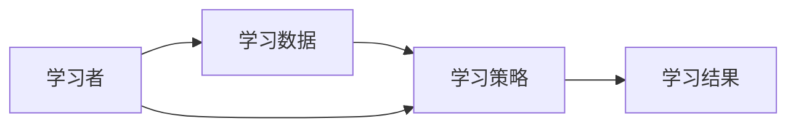
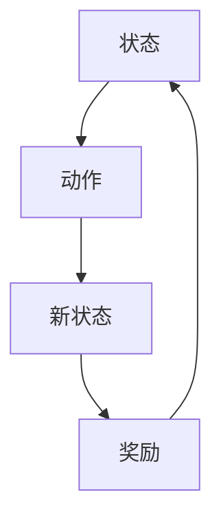
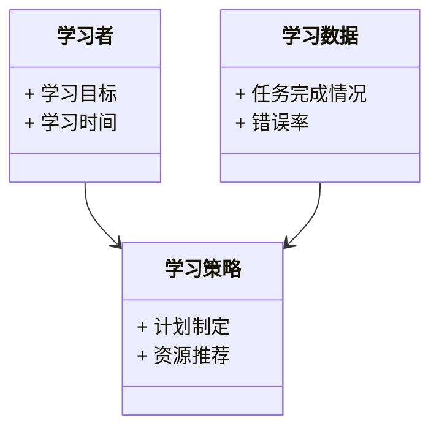
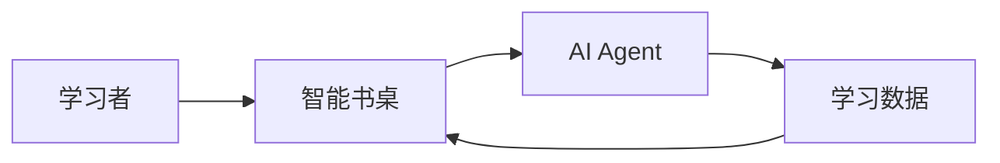
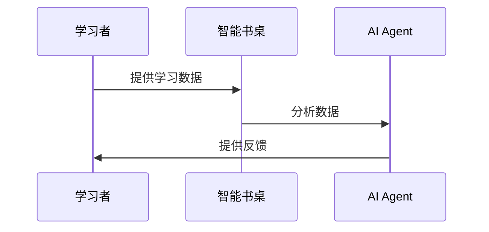

                 


# AI Agent在智能书桌中的学习效率分析

> 关键词：AI Agent, 学习效率, 智能书桌, 强化学习, 监督学习, 机器学习, 系统架构

> 摘要：本文分析AI Agent在智能书桌中的应用，探讨其对学习效率的提升，涵盖背景、核心概念、算法原理、系统架构、项目实战和总结，旨在帮助读者理解如何利用AI Agent优化学习过程。

---

## 第1章 AI Agent与学习效率分析的背景介绍

### 1.1 问题背景

#### 1.1.1 学习效率问题的提出
学习效率是教育领域的核心问题，直接影响学习成果。传统学习方式存在时间管理不善、资源利用不足等问题，导致效率低下。

#### 1.1.2 AI Agent在学习中的潜在作用
AI Agent能够实时分析学习数据，提供个性化建议，优化学习计划，帮助用户高效学习。

#### 1.1.3 智能书桌的概念与特点
智能书桌是一种结合AI技术的硬件设备，整合学习工具、资源管理等功能，通过AI Agent提升学习效率。

### 1.2 问题描述

#### 1.2.1 学习效率的定义与衡量标准
学习效率指单位时间内完成的学习任务量，衡量标准包括完成时间、理解深度等。

#### 1.2.2 AI Agent在学习中的角色
AI Agent作为辅助工具，帮助制定计划、监控进度、提供反馈，提升学习效率。

#### 1.2.3 智能书桌与传统工具的对比
智能书桌集成了AI技术，相比传统工具更具智能化和个性化。

### 1.3 问题解决

#### 1.3.1 AI Agent如何提升效率
通过实时反馈和个性化建议，AI Agent优化学习策略，减少无效时间。

#### 1.3.2 智能书桌的功能设计
包括学习计划制定、资源推荐、进度跟踪等功能，帮助用户高效学习。

#### 1.3.3 学习效率分析的重要性
通过分析数据，找出瓶颈，持续优化学习策略。

### 1.4 边界与外延

#### 1.4.1 应用边界
AI Agent主要应用于学习辅助，不处理非学习相关任务。

#### 1.4.2 功能边界
智能书桌专注于学习效率提升，不涉及娱乐或其他用途。

#### 1.4.3 分析范围
学习效率分析仅限于数据收集和策略优化，不涉及隐私以外的数据。

### 1.5 概念结构

#### 1.5.1 核心要素
AI Agent、学习数据、学习策略、学习者。

#### 1.5.2 概念结构图


---

## 第2章 AI Agent与学习效率分析的核心概念

### 2.1 AI Agent的原理与特性

#### 2.1.1 基本原理
AI Agent通过感知环境，执行动作，优化目标函数，实现最优策略。

#### 2.1.2 核心特性
智能性、主动性、适应性。

#### 2.1.3 与传统算法对比
AI Agent具有自主决策能力，传统算法依赖预设规则。

### 2.2 学习效率分析的方法

#### 2.2.1 数据收集
收集学习时间、完成任务量、错误率等数据。

#### 2.2.2 数据分析
使用统计方法，找出影响效率的关键因素。

#### 2.2.3 反馈机制
根据分析结果，调整学习策略，提供实时反馈。

---

## 第3章 AI Agent的算法原理

### 3.1 强化学习算法

#### 3.1.1 Q-learning算法


公式：
$$ Q(s, a) = Q(s, a) + \alpha (r + \max Q(s', a') - Q(s, a)) $$

#### 3.1.2 算法流程
初始化Q表，执行动作，更新Q值，直到收敛。

### 3.2 监督学习算法

#### 3.2.1 线性回归
公式：
$$ y = \theta x + \beta $$
用于预测学习时间。

#### 3.2.2 分类算法
用于分类学习任务的难度。

---

## 第4章 系统分析与架构设计

### 4.1 问题场景介绍

#### 4.1.1 学习计划制定
AI Agent根据用户习惯，制定个性化计划。

#### 4.1.2 资源推荐
基于学习数据，推荐最优学习材料。

### 4.2 功能设计

#### 4.2.1 领域模型


### 4.3 系统架构

#### 4.3.1 架构图


### 4.4 接口设计与交互流程

#### 4.4.1 接口设计
API接口用于数据传输和策略反馈。

#### 4.4.2 交互流程


---

## 第5章 项目实战

### 5.1 环境安装

#### 5.1.1 工具安装
安装Python、TensorFlow、Pandas等库。

### 5.2 核心代码实现

#### 5.2.1 Q-learning实现
```python
import numpy as np

class QAgent:
    def __init__(self, state_size, action_size):
        self.q_table = np.zeros((state_size, action_size))
    
    def act(self, state, epsilon=0.1):
        if np.random.random() < epsilon:
            return np.random.randint(action_size)
        return np.argmax(self.q_table[state])
    
    def learn(self, state, action, reward, next_state):
        self.q_table[state, action] = self.q_table[state, action] + 0.1*(reward + np.max(self.q_table[next_state]) - self.q_table[state, action])
```

### 5.3 案例分析

#### 5.3.1 学习时间分析
通过Q-learning优化学习时间安排，提升效率。

#### 5.3.2 错误率分析
根据错误率调整学习策略，重点复习难点。

---

## 第6章 总结与展望

### 6.1 小结

AI Agent显著提升了学习效率，通过实时反馈和个性化建议优化学习过程。

### 6.2 注意事项

数据隐私、算法选择、用户体验需重点关注。

### 6.3 未来展望

AI Agent将更加智能化，学习效率分析将更加精准。

---

# 作者：AI天才研究院 & 禅与计算机程序设计艺术

