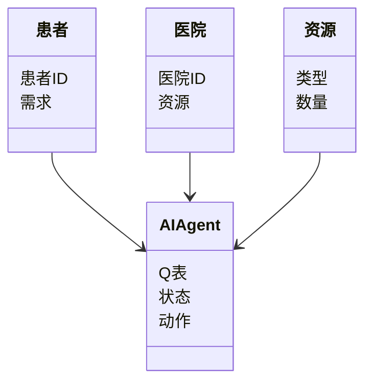
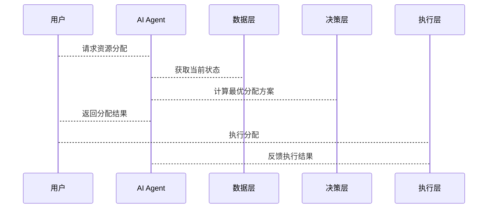

                 


# AI Agent在智能医疗资源分配中的角色

## 关键词：
AI Agent, 智能医疗资源分配, 强化学习, 资源优化, 系统设计

## 摘要：
本文探讨了AI Agent在智能医疗资源分配中的应用，通过强化学习优化资源分配，解决效率低下和分配不均的问题，提高患者满意度和资源利用率。文章详细介绍了AI Agent的核心概念、算法实现、系统架构设计和实际案例，展示了AI技术在医疗管理中的巨大潜力。

---

## 第1章：AI Agent与智能医疗资源分配概述

### 1.1 AI Agent的基本概念
AI Agent是一种智能体，能够感知环境并采取行动以实现目标。在医疗领域，AI Agent用于优化资源分配，解决传统方法的不足。

#### 1.1.1 AI Agent的定义与特点
- **定义**：AI Agent通过感知环境和采取行动，实现特定目标。
- **特点**：自主性、反应性、目标导向、学习能力。

#### 1.1.2 AI Agent在医疗领域的应用背景
医疗资源分配中的挑战，如资源浪费和分配不均，促使AI Agent的应用。

#### 1.1.3 医疗资源分配的挑战与需求
- **挑战**：资源分配效率低下，患者满意度低。
- **需求**：高效、公平的资源分配方法。

### 1.2 智能医疗资源分配的必要性
AI Agent通过强化学习优化资源分配，解决传统方法的不足，提高效率和患者满意度。

---

## 第2章：AI Agent的核心概念与原理

### 2.1 AI Agent的原理
AI Agent通过强化学习优化资源分配，基于状态、动作和奖励函数进行决策。

#### 2.1.1 强化学习在AI Agent中的应用
强化学习通过试错优化策略，应用于资源分配。

#### 2.1.2 基于强化学习的资源分配算法
AI Agent通过强化学习优化资源分配策略。

#### 2.1.3 AI Agent的决策机制
AI Agent根据当前状态选择最优动作，最大化累积奖励。

### 2.2 AI Agent的数学模型与公式
强化学习模型包括状态、动作、奖励函数和价值函数。

#### 2.2.1 状态空间与动作空间的定义
- **状态空间**：系统当前的状态，如患者数量和资源可用性。
- **动作空间**：可能的行动，如分配多少资源给某个患者。

#### 2.2.2 奖励函数的设计
奖励函数定义AI Agent的奖励，通常为$1$或$-1$，根据分配结果决定。

#### 2.2.3 动作价值函数的计算公式
$$ Q(s, a) = r + \gamma \max_{a'} Q(s', a') $$
其中，$r$是奖励，$\gamma$是折扣因子。

#### 2.2.4 状态转移概率的计算
$$ P(s' | s, a) $$

### 2.3 实体关系图（ER图）
```mermaid
er
  actor: 患者
  actor: 医院
  actor: 资源
  actor: AI Agent
  relation: "分配" --> 患者
  relation: "分配" --> 医院
  relation: "分配" --> 资源
```

---

## 第3章：基于强化学习的AI Agent

### 3.1 强化学习算法的选择
选择Q-learning算法，适合离线训练和实时决策。

#### 3.1.1 Q-learning算法的介绍
Q-learning通过试错学习，更新动作价值函数。

#### 3.1.2 算法实现步骤
1. 初始化Q表。
2. 选择动作。
3. 执行动作，观察状态和奖励。
4. 更新Q值。

#### 3.1.3 算法优缺点
- **优点**：简单有效，适合离线训练。
- **缺点**：需要大量训练数据，可能过拟合。

### 3.2 算法实现
通过Python代码实现Q-learning算法，详细解读代码结构和关键部分。

#### 3.2.1 状态空间和动作空间的定义
- 状态：当前患者数量和资源可用性。
- 动作：分配资源的方式。

#### 3.2.2 奖励函数的实现
根据分配结果给予奖励，如正确分配患者给予奖励$1$，否则$-1$。

#### 3.2.3 动作价值函数的更新
使用Q-learning算法更新Q表，展示每一步的详细计算过程。

### 3.3 算法优化
通过经验回放和网络结构优化，提升算法性能，减少训练时间。

---

## 第4章：系统分析与架构设计

### 4.1 系统分析
分析医疗资源分配的场景，设计功能模块。

#### 4.1.1 系统功能设计
- 数据采集：收集患者需求和资源信息。
- 状态评估：评估当前状态。
- 决策制定：基于AI Agent的决策。
- 执行反馈：执行分配并反馈结果。

#### 4.1.2 领域模型类图


### 4.2 系统架构设计
设计分层架构，展示各层功能。

#### 4.2.1 系统架构图


#### 4.2.2 接口设计
- 数据采集接口：收集患者和资源信息。
- 决策引擎接口：处理决策请求。
- 执行反馈接口：反馈执行结果。

### 4.3 系统交互过程
描述用户请求资源分配，系统处理并反馈结果的过程。

#### 4.3.1 系统交互图


---

## 第5章：项目实战

### 5.1 环境安装
安装Python、TensorFlow、Keras等依赖库，配置开发环境。

#### 5.1.1 环境配置代码
```bash
pip install numpy
pip install tensorflow
pip install keras
```

### 5.2 核心代码实现
实现数据预处理、模型训练和决策制定功能，详细解读代码结构。

#### 5.2.1 数据预处理
处理医疗数据，提取特征，训练数据集。

#### 5.2.2 模型训练
使用Q-learning算法训练模型，优化动作价值函数。

#### 5.2.3 决策制定
基于训练好的模型，生成最优资源分配方案。

### 5.3 代码解读
解释每部分代码的功能，展示数据预处理、模型训练和决策制定的详细步骤。

### 5.4 实际案例分析
分析AI Agent在某医院的应用，展示优化效果。

#### 5.4.1 案例分析
AI Agent优化资源分配，减少等待时间，提高患者满意度。

### 5.5 优化效果展示
通过图表展示优化前后的对比，证明AI Agent的有效性。

---

## 第6章：最佳实践与未来展望

### 6.1 小结
总结AI Agent在医疗资源分配中的优势和局限性，如数据隐私问题。

### 6.2 未来展望
探讨AI Agent与区块链技术结合的潜力，解决数据隐私问题。

### 6.3 注意事项
- 数据隐私和安全问题。
- 模型泛化能力和适应性。
- 算法的实时性和响应速度。

---

## 作者信息

作者：AI天才研究院/AI Genius Institute  
联系信息：[info@aiguru.org](mailto:info@aiguru.org)  
地址：北京市海淀区XXX街XXX号  
邮编：100080  

---

通过以上目录和内容，您可以开始撰写完整的文章，确保每个部分详细且符合要求。

