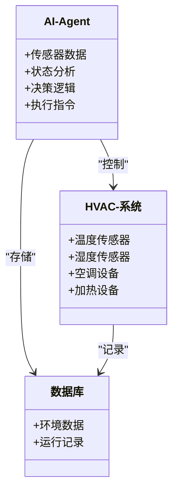
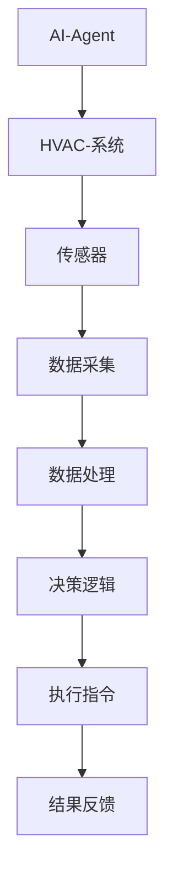

                 


# AI Agent在智能建筑管理中的应用

> 关键词：AI Agent, 智能建筑, 物联网, 机器学习, 自动化管理, 能源优化

> 摘要：本文探讨了AI Agent在智能建筑管理中的应用，分析了AI Agent的基本概念、算法原理及其在智能建筑管理中的实际应用案例。文章从理论到实践，详细介绍了AI Agent如何帮助智能建筑实现高效管理，包括能源优化、设备维护和环境控制等方面。

---

# 第一部分: AI Agent在智能建筑管理中的应用概述

## 第1章: AI Agent与智能建筑管理的背景介绍

### 1.1 AI Agent的基本概念

#### 1.1.1 什么是AI Agent
AI Agent（人工智能代理）是一种能够感知环境、做出决策并采取行动的智能实体。它通过传感器获取数据，利用算法进行分析，并根据结果执行相应的操作。AI Agent可以在多种场景中应用，如自动驾驶、智能助手和智能建筑管理。

#### 1.1.2 AI Agent的核心特征
AI Agent具有以下核心特征：
- **自主性**：能够自主决策和行动，无需人工干预。
- **反应性**：能够实时感知环境变化并做出响应。
- **目标导向性**：基于预设目标进行决策和行动。
- **学习能力**：能够通过数据和经验不断优化自身行为。

#### 1.1.3 AI Agent与传统自动化系统的区别
AI Agent与传统自动化系统的区别主要体现在以下几个方面：
- **智能化**：AI Agent具备学习和适应能力，能够处理复杂问题。
- **自主性**：AI Agent能够自主决策，而传统自动化系统通常需要预设规则。
- **灵活性**：AI Agent能够根据环境变化调整策略，而传统系统通常固定不变。

### 1.2 智能建筑管理的背景与挑战

#### 1.2.1 智能建筑的定义与发展趋势
智能建筑是指通过物联网（IoT）、大数据和人工智能等技术，实现建筑内设备、系统和资源的智能化管理。随着能源危机和环保压力的增加，智能建筑管理变得越来越重要。

#### 1.2.2 智能建筑管理中的主要问题
智能建筑管理面临以下主要问题：
- **能源浪费**：建筑内的设备常常无法根据实际需求进行调整，导致能源浪费。
- **维护成本高**：传统建筑管理需要大量人工参与，维护成本较高。
- **实时性要求高**：建筑内的设备需要实时监控和调整，以确保安全和舒适性。

#### 1.2.3 AI Agent在智能建筑管理中的应用前景
AI Agent在智能建筑管理中的应用前景广阔。通过AI Agent，建筑可以实现设备的自主管理、能源的优化利用以及环境的智能调节，从而提高管理效率、降低运营成本并提升用户体验。

---

## 第2章: AI Agent的核心概念与联系

### 2.1 AI Agent的原理与工作流程

#### 2.1.1 感知层: 数据采集与处理
AI Agent通过传感器和物联网设备采集建筑内的环境数据，如温度、湿度、光照强度等。这些数据经过预处理后，用于后续的分析和决策。

#### 2.1.2 决策层: 状态分析与决策制定
在决策层，AI Agent基于感知层提供的数据，利用机器学习算法进行状态分析，并制定相应的决策。例如，当检测到室内温度过高时，AI Agent会决定开启空调系统进行降温。

#### 2.1.3 执行层: 行动策略与反馈机制
在执行层，AI Agent根据决策层的指令，通过执行机构（如空调、照明设备等）采取相应行动。同时，AI Agent还会收集执行结果的反馈信息，用于优化后续的决策过程。

### 2.2 AI Agent的属性特征对比

#### 2.2.1 不同类型AI Agent的对比分析
AI Agent可以根据应用场景和功能特点分为多种类型，常见的类型包括基于规则的AI Agent、基于机器学习的AI Agent和基于强化学习的AI Agent。

#### 2.2.2 基于表格的核心概念属性特征对比
以下表格展示了不同类型AI Agent的核心概念属性特征对比：

| 属性                | 基于规则的AI Agent | 基于机器学习的AI Agent | 基于强化学习的AI Agent |
|---------------------|---------------------|-------------------------|-------------------------|
| 决策方式            | 预设规则           | 数据驱动               | 奖励驱动               |
| 学习能力            | 无                 | 弱                     | 强                     |
| 灵活性              | 低                 | 中                     | 高                     |
| 适用场景            | 简单任务           | 复杂任务               | 极度复杂任务           |

#### 2.2.3 ER实体关系图架构的 Mermaid 流程图
以下是AI Agent在智能建筑管理中的实体关系图：

```mermaid
erDiagram
    building---设备 : "包含"
    building---传感器 : "包含"
    传感器-->数据 : "采集"
    数据-->AI-Agent : "处理"
    AI-Agent -->决策 : "制定"
    决策 -->执行 : "指令"
    执行 -->反馈 : "结果"
```

---

## 第3章: AI Agent的算法原理与数学模型

### 3.1 基于强化学习的AI Agent算法

#### 3.1.1 强化学习的基本原理
强化学习是一种通过试错机制来优化决策的算法。AI Agent通过与环境交互，不断尝试不同的行动，并根据获得的奖励来调整策略，最终找到最优解决方案。

#### 3.1.2 AI Agent的数学模型与公式
强化学习的核心是Q-learning算法，其数学模型如下：

$$ Q(s, a) = r + \gamma \max_{a'} Q(s', a') $$

其中：
- \( Q(s, a) \) 表示在状态 \( s \) 下采取行动 \( a \) 的价值。
- \( r \) 表示获得的奖励。
- \( \gamma \) 表示折扣因子。
- \( s' \) 表示下一个状态。
- \( a' \) 表示下一个行动。

#### 3.1.3 通俗易懂的强化学习举例说明
以智能 HVAC 系统为例，AI Agent可以通过强化学习算法学习如何根据室内温度、湿度等因素调整空调和加热设备的运行状态，以实现能源的最优利用。

### 3.2 基于决策树的AI Agent算法

#### 3.2.1 决策树的基本原理
决策树是一种基于树状结构的分类方法，通过不断划分数据，最终找到最优的决策路径。

#### 3.2.2 决策树的数学模型与公式
决策树的核心是信息熵公式：

$$ H(S) = -\sum_{i=1}^{n} p_i \log_2 p_i $$

其中：
- \( H(S) \) 表示数据集 \( S \) 的熵。
- \( p_i \) 表示第 \( i \) 个类别的概率。

#### 3.2.3 通俗易懂的决策树举例说明
以智能照明系统为例，AI Agent可以通过决策树算法根据光照强度、时间等因素决定是否开启或关闭照明设备。

---

## 第4章: AI Agent的系统分析与架构设计

### 4.1 问题场景介绍

#### 4.1.1 智能建筑管理中的问题场景
以智能 HVAC 系统为例，建筑内的温度、湿度和空气质量需要实时监控和调整。传统的 HVAC 系统通常基于固定的规则运行，无法根据实际情况进行优化。

#### 4.1.2 问题场景的分析与解决方案
通过引入AI Agent，可以实时采集建筑内的环境数据，利用强化学习算法优化 HVAC 系统的运行策略，从而实现能源的最优利用。

### 4.2 系统功能设计

#### 4.2.1 领域模型 Mermaid 类图
以下是智能 HVAC 系统的领域模型类图：



### 4.3 系统架构设计

#### 4.3.1 系统架构设计 Mermaid 架构图
以下是AI Agent在智能 HVAC 系统中的架构设计：



---

## 第5章: 项目实战

### 5.1 智能 HVAC 系统的实现

#### 5.1.1 环境安装
首先需要安装Python和相关库（如TensorFlow、Keras等），然后配置传感器和执行设备。

#### 5.1.2 系统核心实现源代码

以下是AI Agent的核心代码示例：

```python
import numpy as np
import tensorflow as tf

class AI-Agent:
    def __init__(self):
        self.model = self.build_model()
    
    def build_model(self):
        model = tf.keras.Sequential([
            tf.keras.layers.Dense(64, activation='relu'),
            tf.keras.layers.Dense(1, activation='linear')
        ])
        model.compile(optimizer='adam', loss='mse')
        return model
    
    def train(self, data, labels):
        self.model.fit(data, labels, epochs=100, batch_size=32)
    
    def predict(self, data):
        return self.model.predict(data)
```

#### 5.1.3 代码应用解读与分析
上述代码定义了一个简单的神经网络模型，用于AI Agent的决策过程。通过训练数据，模型可以学习如何根据传感器数据做出最优决策。

#### 5.1.4 实际案例分析和详细讲解剖析
以某办公楼的智能 HVAC 系统为例，AI Agent可以根据室内温度、湿度和外部天气情况，优化空调和加热设备的运行策略，从而实现能源的最优利用。

#### 5.1.5 项目小结
通过本项目，我们可以看到AI Agent在智能建筑管理中的巨大潜力。通过实时数据采集、智能决策和优化控制，AI Agent能够显著提高建筑管理的效率和效果。

---

## 第6章: 总结与展望

### 6.1 本章小结
本文详细探讨了AI Agent在智能建筑管理中的应用，分析了AI Agent的基本概念、算法原理及其在智能建筑管理中的实际应用案例。通过理论与实践相结合的方式，展示了AI Agent在智能建筑管理中的巨大潜力。

### 6.2 未来展望
随着人工智能技术的不断发展，AI Agent在智能建筑管理中的应用将更加广泛和深入。未来的研究方向包括优化AI Agent的算法性能、探索新的应用场景以及提升系统的安全性与可靠性。

---

# 作者：AI天才研究院/AI Genius Institute & 禅与计算机程序设计艺术 /Zen And The Art of Computer Programming

