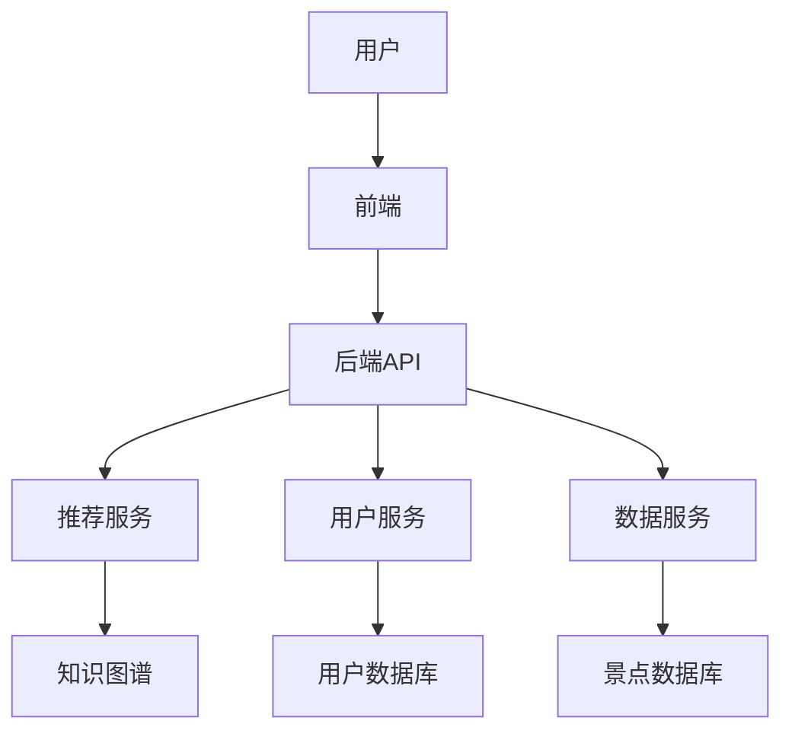

                 


# AI Agent在智能旅游规划中的应用

> 关键词：AI Agent, 智能旅游规划, 多模态数据处理, 自然语言处理, 旅游推荐系统

> 摘要：本文将探讨AI Agent在智能旅游规划中的应用，从AI Agent的基本概念到其在旅游规划中的具体应用场景，详细分析其技术实现和系统架构设计。通过实际案例分析和项目实战，展示AI Agent如何提升旅游规划的智能化水平。

---

# 第一部分: AI Agent与智能旅游规划概述

## 第1章: AI Agent的基本概念与应用背景

### 1.1 AI Agent的定义与核心特征

#### 1.1.1 AI Agent的定义
AI Agent（人工智能代理）是一种能够感知环境、自主决策并执行任务的智能实体。它可以基于输入的信息（如用户需求、环境数据）做出反应，执行预设或自适应的行为。

#### 1.1.2 AI Agent的核心特征
- **自主性**：能够在没有外部干预的情况下运行。
- **反应性**：能够实时感知环境并做出反应。
- **目标导向性**：通过目标驱动决策和行动。
- **学习能力**：能够通过数据和经验不断优化性能。

#### 1.1.3 AI Agent与传统软件的区别
| 特性        | 传统软件              | AI Agent             |
|-------------|-----------------------|----------------------|
| 决策方式     | 预设规则              | 自主学习与推理       |
| 交互方式     | 单向输入输出          | 多模态交互（文本、语音、图像） |
| 环境适应性   | 固定功能              | 高度适应动态环境     |

### 1.2 智能旅游规划的背景与挑战

#### 1.2.1 旅游规划的定义与现状
旅游规划是指为用户制定个性化的行程安排，包括目的地选择、路线规划、景点推荐等。随着旅游业的快速发展，用户需求日益多样化，传统的手动规划方式已难以满足高效性和个性化需求。

#### 1.2.2 智能化旅游规划的需求
- **个性化需求**：用户希望根据自己的兴趣和偏好获得推荐。
- **高效性需求**：快速获取最优行程安排。
- **实时性需求**：应对突发情况和实时数据变化。

#### 1.2.3 当前旅游规划中的主要问题
- **信息过载**：用户难以从海量数据中筛选出最优方案。
- **静态规划**：传统规划缺乏动态调整能力。
- **用户体验不足**：缺乏互动性和个性化服务。

### 1.3 AI Agent在旅游规划中的作用

#### 1.3.1 AI Agent的核心优势
- **智能推荐**：通过学习用户偏好，提供个性化行程建议。
- **实时响应**：根据实时数据动态调整规划。
- **多模态交互**：支持多种交互方式，提升用户体验。

#### 1.3.2 AI Agent在旅游规划中的应用场景
- **行程推荐**：根据用户历史行为和偏好推荐景点。
- **路线优化**：基于实时交通数据优化行程安排。
- **动态调整**：根据天气、用户反馈等信息实时调整规划。

#### 1.3.3 AI Agent与旅游规划的结合方式
- **数据驱动**：通过大数据分析用户行为和偏好。
- **知识图谱**：构建旅游相关知识图谱辅助决策。
- **人机协作**：结合人工干预和自动化推荐。

### 1.4 本章小结
本章介绍了AI Agent的基本概念及其在旅游规划中的重要性，分析了传统旅游规划的局限性，并探讨了AI Agent如何通过智能化手段提升旅游规划的效率和用户体验。

---

# 第二部分: AI Agent的核心原理与技术实现

## 第2章: AI Agent的核心原理

### 2.1 AI Agent的决策机制

#### 2.1.1 基于规则的决策
基于预设的规则进行决策，适用于规则明确的场景。例如，根据天气情况推荐穿什么衣服。

#### 2.1.2 基于模型的推理
通过构建逻辑推理模型，根据输入的信息推导出决策。例如，根据用户的历史行为推断其兴趣偏好。

#### 2.1.3 基于学习的决策
通过机器学习模型（如深度学习）从数据中学习决策策略。例如，利用神经网络进行用户行为预测。

### 2.2 AI Agent的感知与交互

#### 2.2.1 多模态感知技术
AI Agent需要整合多种感知方式，如文本、语音、图像等，以全面理解用户需求。例如，通过图像识别技术识别用户上传的景点照片。

#### 2.2.2 自然语言处理技术
通过NLP技术实现与用户的自然对话，理解用户的意图并生成相应的回复。例如，利用BERT模型进行对话生成。

#### 2.2.3 用户行为分析
通过分析用户的点击、浏览等行为数据，推断用户的偏好和需求。例如，通过用户点击记录推荐相似景点。

### 2.3 AI Agent的规划与执行

#### 2.3.1 状态空间建模
将问题转化为状态空间，通过状态转移和动作选择优化规划。例如，将旅游行程划分为多个状态，如“出发地”、“目的地”、“交通方式”等。

#### 2.3.2 动作选择与优化
根据当前状态和目标，选择最优动作以达到目标。例如，在交通选择中，综合考虑时间、费用、舒适度等因素选择最佳交通方式。

#### 2.3.3 执行监控与反馈
实时监控规划的执行情况，并根据反馈进行调整。例如，根据交通延误信息实时调整行程安排。

### 2.4 本章小结
本章详细介绍了AI Agent的核心原理，包括决策机制、感知与交互、规划与执行等方面的内容，为后续的技术实现奠定了基础。

---

## 第3章: AI Agent的核心技术实现

### 3.1 知识表示与推理

#### 3.1.1 知识图谱的构建
构建旅游相关的知识图谱，整合景点、交通、酒店等信息。例如，构建包含景点名称、地理位置、门票价格等信息的知识图谱。

#### 3.1.2 基于知识图谱的推理
通过知识图谱推理用户的需求，例如，根据用户提到的“喜欢自然风光”推荐适合的景点。

#### 3.1.3 知识表示的优化
通过优化知识表示方式（如使用向量表示）提升推理效率。例如，使用Word2Vec模型对景点进行向量化表示。

### 3.2 自然语言处理技术

#### 3.2.1 旅游场景下的NLP任务
包括对话生成、文本分类、实体识别等任务。例如，通过文本分类判断用户的情感倾向。

#### 3.2.2 基于大模型的对话生成
利用预训练大模型（如GPT-3）生成自然流畅的对话回复，提升用户体验。

#### 3.2.3 文本理解与生成的优化
通过优化NLP模型的训练数据和参数，提升文本理解和生成的准确性和自然度。

### 3.3 多模态数据处理

#### 3.3.1 图像识别技术
通过图像识别技术识别用户上传的景点照片，提取景点名称、标签等信息。例如，利用ResNet模型进行图像分类。

#### 3.3.2 音视频处理技术
处理用户的语音输入或视频输入，提取有用信息。例如，通过语音识别技术将用户的声音转化为文本。

#### 3.3.3 多模态数据融合
整合多种数据源的信息，提升决策的准确性和全面性。例如，结合用户的历史行为数据和实时天气数据进行行程推荐。

### 3.4 本章小结
本章详细探讨了AI Agent的核心技术实现，包括知识表示与推理、自然语言处理技术以及多模态数据处理，为后续的系统设计和项目实战提供了技术支持。

---

# 第三部分: AI Agent在旅游规划中的系统架构与实现

## 第4章: 智能旅游规划系统的需求分析与设计

### 4.1 系统需求分析

#### 4.1.1 用户需求分析
通过用户调研和数据分析，明确用户的核心需求和痛点。例如，用户希望获得个性化行程推荐、实时动态调整等。

#### 4.1.2 功能需求分析
列出系统需要实现的核心功能，如用户注册与登录、行程推荐、路线优化、动态调整等。

#### 4.1.3 性能需求分析
分析系统在性能上的要求，如响应时间、处理能力等。例如，系统需要在几秒内生成行程推荐。

### 4.2 系统功能设计

#### 4.2.1 用户界面设计
设计直观友好的用户界面，方便用户输入需求和查看推荐结果。例如，设计一个类似携程的界面，用户可以输入出发地、目的地、旅行天数等信息。

#### 4.2.2 后台系统设计
设计高效的后台系统，处理数据存储、算法运行、结果生成等任务。例如，使用Django框架搭建后台管理系统。

#### 4.2.3 数据存储设计
设计合理的数据库结构，存储用户信息、景点信息、推荐结果等数据。例如，使用MySQL数据库存储结构化数据，使用MongoDB存储非结构化数据。

### 4.3 系统架构设计

#### 4.3.1 分层架构设计
将系统划分为数据层、业务逻辑层和表现层，实现模块化开发。例如，数据层负责数据的存储和检索，业务逻辑层负责处理用户的请求，表现层负责展示结果。

#### 4.3.2 微服务架构设计
采用微服务架构，将系统划分为多个独立的服务模块，如用户服务、推荐服务、数据服务等。例如，使用Spring Boot框架实现微服务架构。

#### 4.3.3 系统架构图


### 4.4 本章小结
本章通过对智能旅游规划系统的全面分析，明确了系统的需求、功能和架构设计，为后续的系统实现奠定了基础。

---

## 第5章: AI Agent在智能旅游规划中的项目实战

### 5.1 项目背景与目标

#### 5.1.1 项目背景
介绍项目的背景和意义，说明为什么需要开发智能旅游规划系统。例如，随着旅游业的快速发展，用户对个性化旅游服务的需求日益增长。

#### 5.1.2 项目目标
明确项目的开发目标，如实现个性化行程推荐、动态行程调整等功能。

### 5.2 系统实现

#### 5.2.1 算法实现
- **算法选择**：选择合适的算法，如基于协同过滤的推荐算法、基于强化学习的路线优化算法等。
- **代码实现**：用Python实现推荐算法，例如：
  ```python
  def recommend_destinations(user_preferences):
      # 简单的协同过滤算法
      similar_users = find_similar_users(user_preferences)
      destinations = get_top_destinations(similar_users)
      return destinations
  ```

#### 5.2.2 系统架构实现
- **前后端分离**：前端负责展示和交互，后端负责处理业务逻辑和数据存储。
- **接口设计**：设计RESTful API接口，如`/api/recommendatedRoute`用于获取行程推荐。

#### 5.2.3 数据处理
- **数据清洗**：对收集到的用户数据进行清洗和预处理，确保数据质量。
- **数据建模**：构建用户画像和景点画像，用于推荐系统。

### 5.3 实验与结果分析

#### 5.3.1 实验设计
设计实验来验证系统的性能和效果，如对比传统推荐算法和AI Agent推荐算法的效果。

#### 5.3.2 实验结果
展示实验结果，分析系统的优缺点，并提出改进建议。例如，AI Agent推荐算法在准确性和实时性上表现优于传统算法。

### 5.4 本章小结
本章通过具体的项目实战，展示了AI Agent在智能旅游规划中的应用，验证了技术方案的有效性和可行性。

---

## 第6章: 总结与展望

### 6.1 本章小结
总结全文，回顾AI Agent在智能旅游规划中的应用，强调其在提升旅游体验和效率方面的重要作用。

### 6.2 未来展望
展望AI Agent在旅游规划中的未来发展方向，如更智能化的推荐算法、更高效的多模态交互方式等。

---

# 第四部分: 注意事项与最佳实践

## 第7章: 注意事项与最佳实践

### 7.1 注意事项
- **数据隐私**：确保用户数据的安全和隐私。
- **算法优化**：不断优化算法，提升推荐的准确性和实时性。
- **用户体验**：注重用户体验，确保系统交互流畅自然。

### 7.2 最佳实践
- **模块化开发**：采用模块化开发方式，便于维护和扩展。
- **持续集成**：使用持续集成工具，确保代码质量和系统稳定性。
- **多团队协作**：加强团队协作，确保系统开发的顺利进行。

---

# 作者

作者：AI天才研究院/AI Genius Institute & 禅与计算机程序设计艺术 /Zen And The Art of Computer Programming

---

以上是《AI Agent在智能旅游规划中的应用》的完整目录大纲，涵盖从理论到实践的各个方面，结构清晰，内容详实，能够为读者提供全面的指导和启发。

