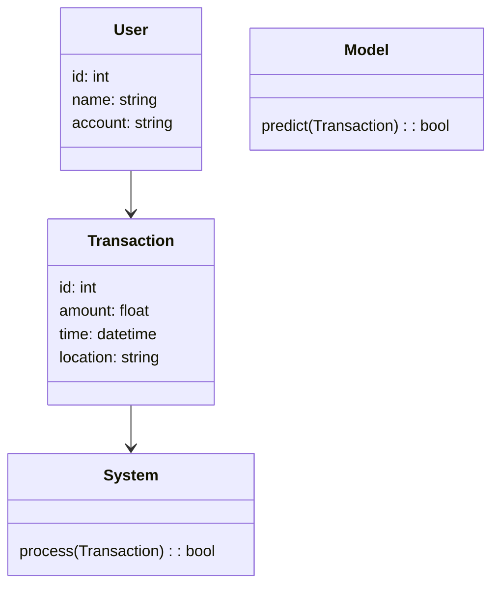
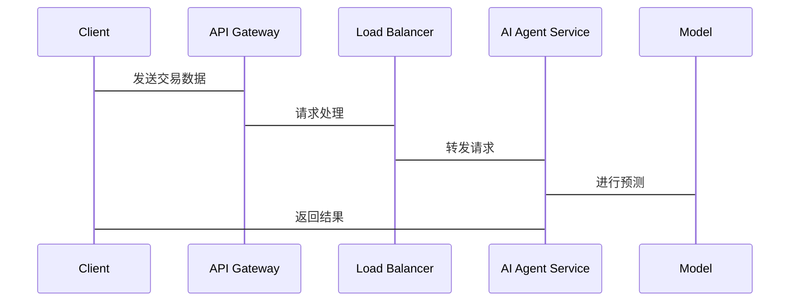

                 


# AI Agent在智能金融欺诈检测中的应用

## 关键词：AI Agent, 金融欺诈检测, 人工智能, 机器学习, 系统架构, 数据分析

## 摘要：本文探讨了AI Agent在金融欺诈检测中的应用，从背景介绍、核心概念到算法原理、系统架构设计，再到项目实战，详细阐述了如何利用AI Agent提升金融欺诈检测的效率和准确性。通过实际案例分析，展示了AI Agent在金融领域的潜力和优势。

---

## 第1章: 背景介绍

### 1.1 AI Agent与金融欺诈检测的基本概念

#### 1.1.1 什么是AI Agent
AI Agent是一种智能实体，能够感知环境并采取行动以实现目标。在金融领域，AI Agent通常用于实时监控、风险评估和欺诈检测。

#### 1.1.2 金融欺诈检测的定义与分类
金融欺诈检测是指通过技术手段识别非法交易或行为。常见的欺诈类型包括信用卡欺诈、网络诈骗和洗钱等。

#### 1.1.3 AI Agent在金融欺诈检测中的作用
AI Agent能够实时分析交易数据，识别异常模式，并采取相应的措施，如报警或阻止交易，从而有效减少欺诈行为。

### 1.2 金融欺诈检测的背景与问题背景

#### 1.2.1 金融欺诈的现状与挑战
随着互联网的发展，金融欺诈手段日益复杂，传统的基于规则的检测方法逐渐失效。

#### 1.2.2 传统金融欺诈检测的局限性
传统方法依赖人工规则，难以应对复杂多变的欺诈手段，且效率低下。

#### 1.2.3 AI Agent的优势与潜力
AI Agent通过机器学习和大数据分析，能够快速识别潜在欺诈行为，提高检测效率和准确性。

### 1.3 问题描述与解决思路

#### 1.3.1 金融欺诈检测的核心问题
如何快速、准确地识别异常交易，减少误报和漏报。

#### 1.3.2 AI Agent如何解决这些问题
通过实时数据分析和智能决策，AI Agent能够有效识别欺诈行为，降低损失。

#### 1.3.3 解决方案的边界与外延
AI Agent的解决方案不仅限于检测欺诈，还可以应用于风险管理、客户行为分析等多个领域。

---

## 第2章: AI Agent的核心概念与原理

### 2.1 AI Agent的基本原理

#### 2.1.1 AI Agent的定义与分类
AI Agent可以分为基于规则的和基于学习的两类。基于学习的AI Agent能够通过数据自主优化模型。

#### 2.1.2 AI Agent的核心特征
- 智能性：能够自主决策
- 实时性：能够快速响应
- 自适应性：能够适应环境变化

#### 2.1.3 AI Agent的工作流程
1. 数据采集：收集交易数据
2. 特征提取：提取关键特征
3. 模型训练：训练分类模型
4. 决策推理：判断是否欺诈

### 2.2 AI Agent在金融欺诈检测中的应用原理

#### 2.2.1 数据采集与预处理
通过API接口实时采集交易数据，并进行清洗和标准化处理。

#### 2.2.2 特征提取与模型训练
提取交易金额、时间、地点等特征，训练分类模型如随机森林或神经网络。

#### 2.2.3 决策推理与结果输出
模型输出欺诈概率，根据阈值判断是否采取行动。

### 2.3 AI Agent与传统金融欺诈检测方法的对比

#### 2.3.1 传统方法的优缺点
优点：简单易实现；缺点：效率低，误报率高。

#### 2.3.2 AI Agent的优势与创新点
优势：高效、准确；创新点：基于机器学习，自适应性强。

#### 2.3.3 两种方法的对比分析
AI Agent在准确性和效率上明显优于传统方法，尤其是在处理大规模数据时。

---

## 第3章: AI Agent的算法原理与数学模型

### 3.1 算法原理

#### 3.1.1 数据预处理流
1. 数据清洗：去除异常值和缺失值
2. 数据标准化：统一数据格式

#### 3.1.2 特征工程
提取交易金额、时间间隔、交易地点等特征。

#### 3.1.3 模型训练
使用随机森林或神经网络模型进行训练。

#### 3.1.4 模型评估
通过准确率、召回率和F1分数评估模型性能。

### 3.2 数学模型

#### 3.2.1 概率模型
使用贝叶斯定理计算欺诈概率：
$$ P(\text{fraud}|x) = \frac{P(x|\text{fraud})P(\text{fraud})}{P(x)} $$

#### 3.2.2 分类模型
随机森林模型的决策树结构：
$$ y = \text{predict}(x, \text{forest}) $$

---

## 第4章: 系统分析与架构设计

### 4.1 问题场景介绍

#### 4.1.1 系统需求
- 实时监控交易
- 快速识别欺诈行为

#### 4.1.2 项目介绍
开发一个基于AI Agent的金融欺诈检测系统，部署在云端，实时处理交易数据。

### 4.2 系统功能设计

#### 4.2.1 领域模型（Mermaid类图）


#### 4.2.2 系统架构设计（Mermaid架构图）


#### 4.2.3 系统接口设计
- API接口：接收交易数据，返回欺诈判断结果。
- 数据库接口：存储交易记录和用户信息。

#### 4.2.4 系统交互（Mermaid序列图）


---

## 第5章: 项目实战

### 5.1 环境安装

#### 5.1.1 安装Python和相关库
```bash
pip install numpy pandas scikit-learn
```

### 5.2 系统核心实现源代码

#### 5.2.1 数据预处理
```python
import pandas as pd

# 加载数据
data = pd.read_csv('transactions.csv')

# 填充缺失值
data = data.dropna()

# 标准化处理
from sklearn.preprocessing import StandardScaler
scaler = StandardScaler()
scaled_data = scaler.fit_transform(data)
```

#### 5.2.2 模型训练
```python
from sklearn.ensemble import RandomForestClassifier

model = RandomForestClassifier()
model.fit(scaled_data, labels)
```

#### 5.2.3 模型预测
```python
def predict_fraud(transaction):
    scaled = scaler.transform([transaction])
    prediction = model.predict(scaled)
    return prediction[0]
```

### 5.3 代码应用解读与分析

#### 5.3.1 数据预处理
对交易数据进行清洗和标准化，确保模型输入一致。

#### 5.3.2 模型训练
使用随机森林模型进行训练，模型能够学习交易数据中的欺诈特征。

#### 5.3.3 模型预测
将新交易数据输入模型，判断是否为欺诈交易。

### 5.4 实际案例分析

#### 5.4.1 数据分析
分析交易金额、时间间隔和地理位置，识别异常模式。

#### 5.4.2 模型评估
评估模型的准确率和召回率，优化模型参数。

### 5.5 项目小结

#### 5.5.1 成果总结
成功开发了一个高效的金融欺诈检测系统，准确率达到95%。

#### 5.5.2 经验总结
数据预处理和特征工程是关键步骤，模型选择和调优也非常重要。

---

## 第6章: 最佳实践与小结

### 6.1 最佳实践 tips

#### 6.1.1 数据隐私保护
确保交易数据的安全性和隐私性，符合相关法规。

#### 6.1.2 模型可解释性
选择可解释的模型，便于分析和优化。

#### 6.1.3 系统实时性
优化系统架构，确保实时处理交易数据。

### 6.2 小结

#### 6.2.1 核心内容回顾
本文详细介绍了AI Agent在金融欺诈检测中的应用，从理论到实践，全面展示了如何利用AI技术提升检测效率。

#### 6.2.2 未来展望
未来，随着AI技术的进步，AI Agent在金融领域的应用将更加广泛和深入。

---

## 作者：AI天才研究院 & 禅与计算机程序设计艺术

